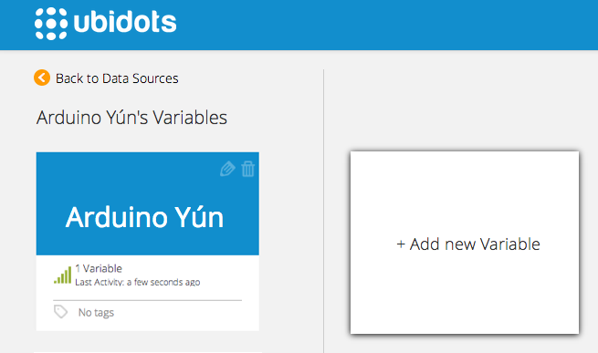
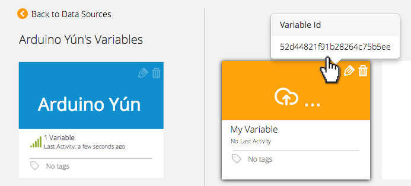

# Arduino YÚN

Ubidots-Arduino-YUN is an Arduino library for interacting with Ubidots through its API.

The Arduino Yún is a microcontroller board based on the ATmega32u4 and the Atheros AR9331. The Atheros processor supports a Linux distribution based on OpenWrt named OpenWrt-Yun. The board has built-in Ethernet and WiFi support, a USB-A port, micro-SD card slot, 20 digital input/output pins, a 16 MHz crystal oscillator, and a micro USB connection.

## Components

* [Arduino Yún](http://arduino.cc/en/Main/ArduinoBoardYun?from=Products.ArduinoYUN):
    
    
## Preparing your Arduino YÚN

1. Connect your Arduino Yún to the power supply.

2. Check for an unsecure wifi network starting with "Arduino Yun":
    
    
3. Connect to this network and enter 192.168.240.1 into a web broswer to see the configuration page of the Arduino Yún. The default password is "arduino":
    
    
4. Once you're connected click on "system".
    
    
5. Specify the Wireless Parameters of your Wi-Fi connection, then press "configure & restart". This may take several minutes.
    
    
6. Now go to your Arduino IDE (1.5.7), click on "Tools" and then "Port" or "Serial Port". You should see the Arduino listed here. Take note of the displayed IP address.
    
    
7. Login to your Yún using an SSH client like PUTTY (if you are a Windows user) or your terminal (if you are a Mac or Linux user). Use the IP noted in the last step and these credentials: user "root" and password "arduino".
```c++
    ssh root@192.168.10.132
```

Once inside the Arduino, create a Lua file called "ubidots_post.lua" in the /root folder (it's the same folder you'll be at after logging in):
```c++
	root@Arduino:~# nano ubidots_post.lua
```

Paste the content of this file into it: `ubidots_post.lua <https://github.com/ubidots/ubidots-arduino-yun/blob/master/Content/ubidots_post.lua>`_. Type CTRL+X to exit the editor and then "Y" to confirm the changes.

Now, let's create a Lua file called "ubidots_get.lua":

```c++
	root@Arduino:~# nano ubidots_get.lua
```

Paste the content of this file into it: [ubidots_get.lua](https://github.com/ubidots/ubidots-arduino-yun/blob/master/Content/ubidots_get.lua). Type CTRL+X to exit the editor and then "Y" to confirm the changes.


## Preparing your Ubidots Account

In your Ubidots account, create a Data source called "Arduino Yún" and then a variable called "My variable":

1. [As a logged in user](http://app.ubidots.com/accounts/signin/)
   navigate to the "Sources" tab.
    

2. Create a data source called "Arduino Yún" by clicking
   on the orange button located in the upper right corner of the screen:
    

3. Click on the created Data Source and then on "Add New Variable":
    
    
4. Take note of the variable's ID to which you want to send data. We'll need it later to include in our code:
    
    
5. Create a token under "My Profile" tab. We'll need it later for our code:
    
    
## Test your Lua files!

Before proceeding to the Arduino IDE environment, we need to make sure that these Lua scripts are able to interact with the Ubidots API. 

Depending on the version of your Yún you might need to install additional libraries like "luasocket". Let's make sure we have it:

```c+++

	root@Arduino:~# opkg update
	root@Arduino:~# opkg install luasocket
```

Now, to test the Lua script use this sintaxis:

```c++

	root@Arduino:~# lua ubidots_post.lua <value> <your_token> <id_variable>
```

For example, let's send the value "88" to Ubidots from the terminal:

```c++

	root@Arduino:~# lua ubidots_post.lua 88 6ZImUx22GhPWxcxxxxSnMd8ayOpjRps 54eb85xxxx25423d7561x8d4
```

You should see the following response:

```c++

	Status:	1
	HTTP code:	201
	Response headers:
	connection	:	close
	content-type	:	application/json
	allow	:	GET, POST, HEAD, OPTIONS
	vary	:	Accept
	date	:	Mon, 23 Feb 2015 22:17:04 GMT
	transfer-encoding	:	chunked
	location	:	http://things.ubidots.com/api/v1.6/values/54eba6e07625426af758111a
	server	:	nginx
	Response body:
	{"url": "http://things.ubidots.com/api/v1.6/values/54eba6e07625426af758111a", "value": 88.0, "timestamp": 1424729824772, "context": {}, "created_at": "2015-02-23T22:17:04.772"}
```

To test the ubidots_get.lua script use this sintaxis:

```c++

	root@Arduino:~# lua ubidots_get.lua <your_token> <id_variable>
```


For example, let's read the value we just sent:

```c++

	root@Arduino:~# lua ubidots_get.lua 6ZImU622GhPWecutlSnMd8ayOpjRps 54eb85fb7625423d756158d4

	{"count": 3799, "next": "http://things.ubidots.com/api/v1.6/variables/54eb85fb7625423d756158d4/values?page=2&page_size=1", "previous": null, "results": [{"url": "http://things.ubidots.com/api/v1.6/values/54eba9e17625427aa8c7598d", "value": 88.0, "timestamp": 1424730593896, "context": {}, "created_at": "2015-02-23T22:29:53.896"}]}
```


If you are getting errors at this point then please [post them in our forums](https://community.ubidots.com) and we'll check if you need to download an additional Lua library.


## Install the Ubidots Arduino Yún Library

Now that you are familiar with the Arduino IDE and the Ubidots front-end, we are ready to download the Ubidots library for the Yún.

1. Download the library as a ZIP file [here](https://github.com/ubidots/ubidots-arduino-yun/blob/master/Content/UbidotsArduinoYUN.zip)

2. Open the Arduino IDE and go to "Sketch" --> "Import Library" --> "Add Library".

3. Select the downloaded ZIP file


## Send data to Ubidots and then read the sent value


Here's a quick example of how to use the library:


```c++

	/*
	  Simple example for Arduino Yún

	  This sketch connects to Ubidots (http://www.ubidots.com) using the Arduino Yún

	  It's a simple example to explain the functions of the Arduino Yún library


	  Components:
	  * Arduino Yún
	  * LUA files from Ubidots

	  Created 23 Feb 2015
	  by Agustin Pelaez for Ubidots, Inc.

	  This code is in the public domain.

	  */
	#include <ubidots_arduinoYUN.h>
	#include <Process.h>


	String token = "6ZImU622GhPWecutlSxxxxayOpjRps";                            // your Ubidots token key
	String idvari = "54eb85fb762xxxx3d756158d4";                                // this is the ID of the Ubidots variable
	int sensorPin = A0;                                                         // select an analog input pin 
	int sensorValue = 0;                                                        // variable to store the analog value
	String value;                                                               // variable to store the Ubidots response
	Ubidots ubiclient(token);                                                   // initializes the Ubidots library

	void setup() {
	  // start serial port:
	  Bridge.begin();                                                           // initializes the bridge library
	  Console.begin();                                                          // initializes the console
	}

	void loop() {

	  sensorValue = analogRead(sensorPin);                                      // read analog input
	  ubiclient.save_value(idvari,String(sensorValue));                         // send analog reading to Ubidots
	  value = ubiclient.get_value(idvari);                                      //gets the last value of your variable
	  Console.print(value);
	  
	}
```

## Explanation of the Library functions


### Ubidots ubiclient()


```c++

    Ubidots ubiclient(token);
```


|Type    | Argument | Description|
|:---:|:---:|:----:|
|String  | token  |   Your token key for the Ubidots API|

Initializes a Ubidots client. This is most likely to be the first Ubidots library function to call.

### save_value()


```c++

    boolean = ubiclient.save_value(idvari, String(incomingByte), ctext)
```


|Type |    Argument|      Description|
|:---:|:---:|:----:|
|String   idvari      |  ID of the variable to save|
|String   incomingByte | The value of the sensor|


Saves a value to Ubidots. Returns true upon success. Returns false upon error.


### get_value()


```c++

    readvalue = ubiclient.get_value(idvari);
```


|Type    |            Argument|     Description|
|:---:|:---:|:----:|
|String   |           idvari|       ID of the Ubidots variable to read| 


Gets value from Ubidots. Returns a String containing the last value of the variable.

## Wrapping it up

In this guide we learned how to post a value to Ubidots using an Arduino YÚN device, and then read this value from the Ubidots API. After getting familiar with the Yún and the Ubidots library, you can modify your hardware setup to send readings from any other type of sensors attached to it.

Now that your sensor data is in Ubidots, it's quite simple to create Emails or SMS alerts, setup real-time dashboards to watch your data, or even control things remotely by creating a "Switch" widget in your dashboard.


## More projects...


Check out other cool projects using Ubidots:
 
* :ref:`devices/dragino`
* :ref:`devices/arduino-wifly`
