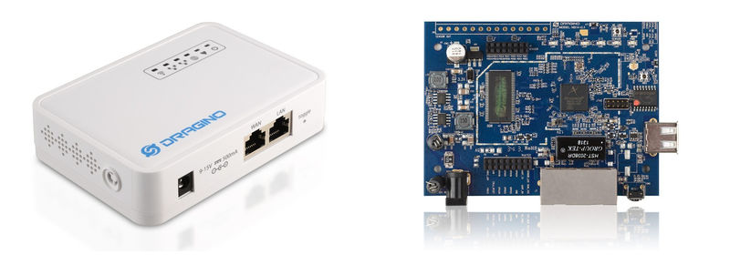
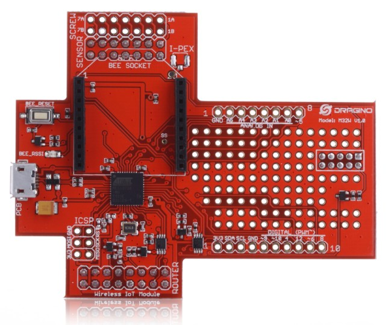
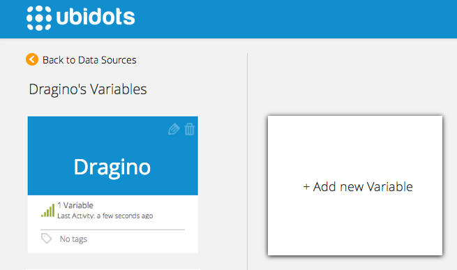
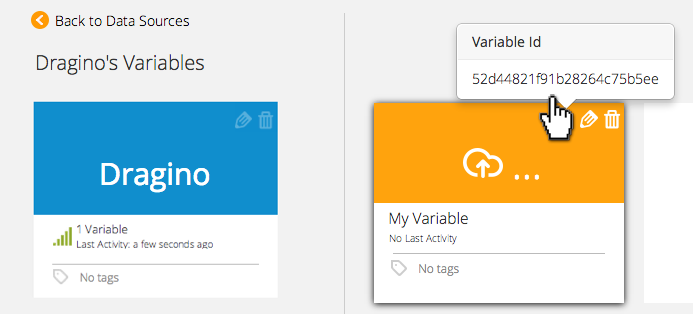
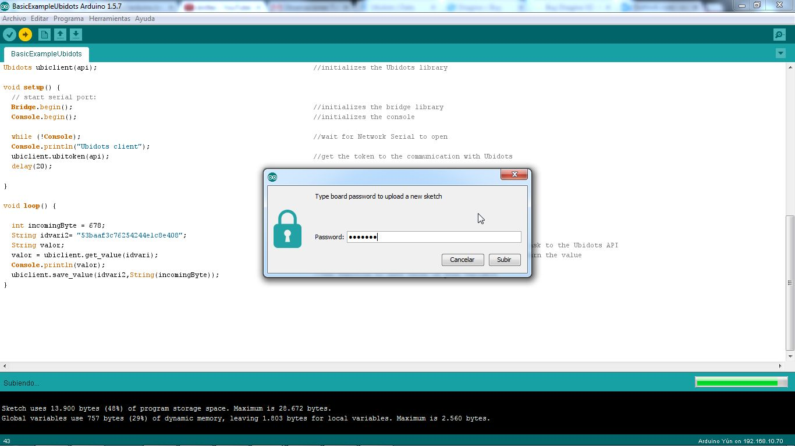

# Dragino IoT Gateway

Ubidots-Dragino is a Dragino library for interacting with Ubidots through its API. Dragino is an open source hardware provider, specialized in IoT solutions.

## Components

* [Dragino MS14 System Structure](http://www.dragino.com/products/mother-board/item/72-ms14-s.html):
    
    
* [M32W wireless Internet of Things module](http://www.dragino.com/products/module/item/84-m32w.html):
    
    
* 3 Lua files, these files are needed to get a token and post/get a value: 
     * [Post Lua file](https://github.com/ubidots/ubidots-dragino/blob/master/Content/ubidots_post.lua)
    * [Get Lua file](https://github.com/ubidots/ubidots-dragino/blob/master/Content/ubidots_get.lua)
    * [API token Lua file](https://github.com/ubidots/ubidots-dragino/blob/master/Content/ubidots.lua)


## Install the Library

1. Download the library as a ZIP file [here](https://github.com/ubidots/ubidots-dragino/blob/master/Content/dragino.zip)

2. Open the Arduino IDE and go to "Sketch" --> "Import Library" --> "Add Library".

3. Select the downloaded ZIP file


## Add the LUA files to your Dragino

1. Connect your dragino to the power supply.

2. Check for an unsecure wifi network starting with "Arduino Yun" or "Dragino - xxxxxxxxxxxx":
    
    
3. Connect to this network and enter 192.168.240.1 into a web broswer to see the configuration page of the Dragino MS14. The default password is "arduino":
    
    
4. Once you're connected click on "system".
    
    
5. Specify the Wireless Parameters of your Wi-Fi connection, then press "configure & restart". This may take several minutes.
    
    
6. Now go to your Arduino IDE (1.5.7), click on "Tools" and then "Port" or "Serial Port". You should see the Dragino listed here. Take note of the displayed IP address.
    
    
7. Open WinSCP or any other client used to transfer files through the SCP protocol. Connect to your Dragino using its IP. User: root and pass: arduino.
    
    
8. Now add the Ubidots lua files into the root directory of the Dragino:
    
    
## Preparing your Ubidots Account

In your Ubidots account, create a Data source called "Dragino" and then a variable called "My Variable":

1. [As a logged in user](http://app.ubidots.com/accounts/signin/) navigate to the "Sources" tab.
    
    
2. Create a data source called "Dragino" by clicking on the orange button located in the upper right corner of the screen:
    
    
3. Click on the created Data Source and then on "Add New Variable":
    
    
4. Take note of the variable's ID to which you want to send data. We'll need it later to include in our code:
    
    
5. Create a token under "My Profile" tab. We'll need it later for our code:
    
    
## Send a value and then read a value from Ubidots

Here's a quick example of how to use the library, using the serial terminal of the Arduino IDE:

```c++

	  /*
	  Simple example for Dragino

	  This sketch connects to Ubidots (http://www.ubidots.com) using a Dragino Device

	  It's a simple example to explain the functions of the Dragino library


	  Components:
	  * Dragino Hardware
	  * LUA files from Ubidots

	  Created 5 Aug 2014
	  by Mateo Vélez

	  This code is in the public domain.

	  */

		#include <ubidots_dragino.h>
		#include <Process.h>


		String api = "5ca9b10038e49e0492c6794f9043f0918ddcbd26";                    //your API key
		String idvari = "53baaf3c76254244e1c8e408";                                 //this is the ID of the Ubidots variable
		Ubidots ubiclient(api);                                                     //initializes the Ubidots library 

		void setup() {
		  // start serial port:
		  Bridge.begin();                                                           //initializes the bridge library
		  Console.begin();                                                          //initializes the console

		  while (!Console);                                                         //wait for Network Serial to open
		  Console.println("Ubidots client");                                        
		  ubiclient.ubitoken(api);                                                  //get the token for the communication with Ubidots
		  delay(20);
		  
		}

		void loop() {
		 
		  int incomingByte = 678;                                                   //a random value to post to Ubidots
		  String idvari2= "53baaf3c76254244e1c8e408";                               //the ID of the variable that you want to post
		  String value;                                                             //a variable to save the value after you ask for it to the Ubidots API
		  value = ubiclient.get_value(idvari);                                      //gets the last value of your variable
		  Console.print(value);
		  ubiclient.save_value(idvari2,String(incomingByte));                       //saves the random value to ubidots
		  
		}

```

Once you run the example, a window will appear. You should enter the password "arduino":
    
    
## Explanation of the Library functions

### Ubidots ubiclient()

```c++

    Ubidots ubiclient(api);
```


|Type  |   Argument|  Description|
|:---:|:---:|:---:|
|String   |api   |    Your API key for the Ubidots API|

Initializes a Ubidots client. This is most likely to be the first Ubidots library function to call.

### save_value()

```c++

    boolean = ubiclient.save_value(idvari, String(incomingByte), ctext)
```


|Type |    Argument  |    Description|
|:---:|:---:|:---:|
|String   |idvari      |  ID of the variable to save|
|String  | incomingByte | The value of the sensor|


Saves a value to Ubidots. Returns true upon success. Returns false upon error.


### get_value()

```c++

    readvalue = ubiclient.get_value(idvari);
```

|Type             |   Argument   |  Description|
|:---:|:---:|:---:|
|String            |  idvari    |   ID of the Ubidots variable to read |


Gets value from Ubidots. Returns a String containing the last value of the variable.

### ubitoken()

```c+++

    boolean = ubiclient.ubitoken(api);  
```


|Type        |        Argument   |  Description|
|:---:|:---:|:----:|
|String          |    api      |    Your API key for the Ubidots API|


## Wrapping it up

In this guide we learned how to post a random value to Ubidots using a Dragino device and read a value from the Ubidots API. After getting familiar with it, you can modify your hardware setup to send readings from any other type of devices/sensors attached to the Dragino.

Now that your sensor data is in Ubidots, it's quite simple to create Emails or SMS alerts, setup real-time dashboards to watch your data, or even control things remotely by creating a "Switch" widget in your dashboard.


## More projects...

Check out other cool projects using Ubidots:
 
* :ref:`devices/arduino-yun`
* :ref:`devices/arduino-wifly`
* :ref:`Measuring your Internet connection with an OpenWrt router <examples/lua_openwrt>`
