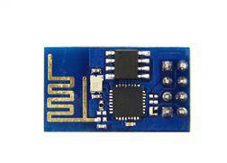

# ESP8266 as WiFi Extension 

Since the ESP8266 was announced, the maker world has been excited by its small size and cost. For just $3 dollars a chip, you'll get WiFi networking, processing and storage capabilities to power any Internet of Things project. 

Although the module [can act as a microcontroller itself](http://ubidots.com/docs/devices/ESP8266.html), this tutorial uses the ESP8266 as a WiFi extension for an Arduino board.


## Components

* An Arduino board with 3.3v pin logic.

* [A WiFi module based on the ESP8266 SoC](http://www.seeedstudio.com/depot/WiFi-Serial-Transceiver-Module-w-ESP8266-p-1994.html):
	
    
## Preparing your Ubidots Account

In your Ubidots account, create a Data source called "ESP8266" and then a variable called "My Variable":

1. [As a logged in user](http://app.ubidots.com/accounts/signin/) navigate to the "Sources" tab.
	
    
2. Create a data source called "ESP8266" by clicking on the orange button located in the upper right corner of the screen:
	
    
3. Click on the created Data Source and then on "Add New Variable":
	
    
4. Take note of the variable's ID to which you want to send data. We'll need it later to include in our code:
	
    
5. Create a token under "My Profile" tab. We'll need it later for our code:
	
    
## Wiring

|Arduino pins|ESP8266 pins| 
|:-----:|:-----:|
|3.3V|             VCC|      
   |  GND |             GND      |
    | TX       |         RX      |
   |  RX        |        TX      |
  |   3.3V     |        CHPD     |

**Note**:

* THIS DEVICE ONLY WORKS at 3.3V, if you put 5V on a pin (also TX/RX) you'll kill the device.
* You could optionally add a resistor between RX and GND to protect IO pins.


## Coding the Arduino

Open a new blank sketch and paste the following code into it. Please note you should specify your Variable ID and Ubidots token in it. 

By the way, in this code we use a GET command to post data, which made it easier to debug. However, more advanced users should use our [official HTTP POST endpoint](http://ubidots.com/docs/api/v1_6/data/post_variables_id_values.html) to benefit from all the Ubidots features like adding meta-data to your data points.

```c++

	// Created by noelportugal 2014
	// Modified by aguspg 2015
	
	#include <stdlib.h>
	#include <SoftwareSerial.h>
	#define SSID "-------"
	#define PASS "-------"
	#define IP "translate.ubidots.com"
	String GET = "GET /api/postvalue/?token=YOUR-TOKEN-HERE&variable=YOUR-VARIABLE-ID&value=";
	SoftwareSerial monitor(10, 11); // RX, TX
	 
	void setup()
	{
	  monitor.begin(9600);
	  Serial.begin(9600);
	  sendDebug("AT");
	  delay(5000);
	  if(Serial.find("OK")){
	    monitor.println("RECEIVED: OK");
	    connectWiFi();
	  }
	}
	 
	void loop(){
	  save_value(String(analogRead(A0)));
	  delay(1000);
	}
	 
	void save_value(String value){
	  String cmd = "AT+CIPSTART=\"TCP\",\"";
	  cmd += IP;
	  cmd += "\",80";
	  sendDebug(cmd);
	  delay(2000);
	  if(Serial.find("Error")){
	    monitor.print("RECEIVED: Error");
	    return;
	  }
	  cmd = GET;
	  cmd += value;
	  cmd += "\r\n";
	  Serial.print("AT+CIPSEND=");
	  Serial.println(cmd.length());
	  if(Serial.find(">")){
	    monitor.print(">");
	    monitor.print(cmd);
	    Serial.print(cmd);
	  }else{
	    sendDebug("AT+CIPCLOSE");
	  }
	  if(Serial.find("OK")){
	    monitor.println("RECEIVED: OK");
	  }else{
	    monitor.println("RECEIVED: Error");
	  }
	}
	void sendDebug(String cmd){
	  monitor.print("SEND: ");
	  monitor.println(cmd);
	  Serial.println(cmd);
	} 
	 
	boolean connectWiFi(){
	  Serial.println("AT+CWMODE=1");
	  delay(2000);
	  String cmd="AT+CWJAP=\"";
	  cmd+=SSID;
	  cmd+="\",\"";
	  cmd+=PASS;
	  cmd+="\"";
	  sendDebug(cmd);
	  delay(5000);
	  if(Serial.find("OK")){
	    monitor.println("RECEIVED: OK");
	    return true;
	  }else{
	    monitor.println("RECEIVED: Error");
	    return false;
	  }
	}
```

## Wrapping up

In this guide we learned how to post an analog value to Ubidots using an ESP8266. After getting familiar with it, you can modify your hardware setup to send readings from any other type of devices/sensors attached to it.

Now that your sensor data is in Ubidots, it's quite simple to create Email/SMS alerts or setup real-time dashboards to watch your data.

## More projects...


Check out other cool projects using Ubidots:
 
* :ref:`devices/fona`
* :ref:`devices/arduino-gprs`
