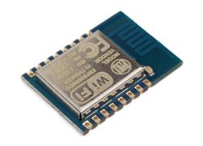
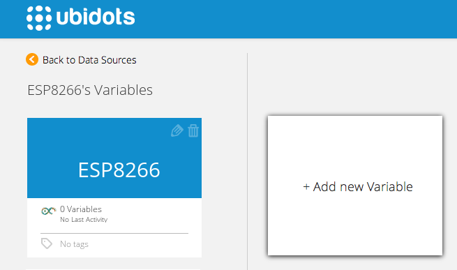
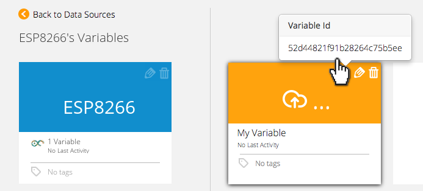

# ESP8266 as stand-alone Module 
 
When we got our first ESP8266 we were excited about its small size and low cost, and of course [wrote a tutorial about it](http://ubidots.com/docs/devices/ESP8266-arduino.html.

But the excitement around it was even bigger when we found that the Maker community had created a project to make it Arduino-compatible, allowing it to act as a stand-alone Microcontroller with WiFi capabilities. 

At the end of this tutorial you will have a cloud-enabled MCU + WiFi for just $3! That really sounds like IoT.

Thanks to "Ty Tower" for pointing us to this project and providing Ubidots-compatible firmware for it.

## Components

* [An ESP8266 module with analog inputs](https://www.adafruit.com/products/2471) (ESP-7 or ESP-12 to date):
	
    
    In theory, this tutorial should also work with (NodeMCU Boards)(http://nodemcu.com/index_en.html).

## Preparing your Ubidots Account

In your Ubidots account, create a Data source called "ESP8266" and then a variable called "My Variable":

1. [As a logged in user](http://app.ubidots.com/accounts/signin/) navigate to the "Sources" tab.
	
    
2. Create a data source called "ESP8266" by clicking on the orange button located in the upper right corner of the screen:
	
    
3. Click on the created Data Source and then on "Add New Variable":
	
    
4. Take note of the variable's ID to which you want to send data. We'll need it later to include in our code:
	
    
5. Create a token under "My Profile" tab. We'll need it later for our code:
	
    
## Setting up the Arduino IDE

This tutorial is based on [the official ESP8266 Community project](https://github.com/esp8266/Arduino), which adds support to the ESP8266 board from the Arduino environment. To install this IDE (taken from their README files):

* Install [Arduino 1.6.4 from the Arduino website](http://www.arduino.cc/en/Main/Software).
* Start the IDE and go to the Preferences window.
* Enter "http://arduino.esp8266.com/package_esp8266com_index.json" into the "Additional Board Manager URLs" field. You can add multiple URLs, separating them with commas.
* Open Boards Manager from Tools > Board menu and install esp8266 platform

Don't forget to select your ESP8266 board from Tools > Board menu after installation!


## Coding the ESP8266

Open a new blank sketch and paste the following code into it. Please note you should specify your Variable ID and Ubidots token in it.

```c++

	// Created by Ty Tower in June 11 2015

	#include <stdio.h>
	#include <ESP8266WiFi.h>
	#define errorPin 13
	const int sleepTimeS = 20;// Time to sleep (in seconds):
	long lastReadingTime = 0;
	WiFiClient client;
	char results[4];
	String idvariable = "----------Put your variableid in here---------";
	String token = "----------Put your token here-----------";

	//////////////////////////////////////////////////////////////////////////////////

	void setup(){

	  pinMode(errorPin, OUTPUT);
	  const char* ssid = "------HOME";
	  const char* password = "----------";

	  for (int i=0;i<4; i++){   // let know we are working
	    digitalWrite(errorPin ,HIGH);
	    delay(200);
	    digitalWrite(errorPin ,LOW);
	    delay(200);
	  }

	  // Create an instance of the server
	  // specify the port to listen on as an argument

	  WiFiServer server(80);
	  Serial.begin(115200);
	  delay(10);

	  // Connect to WiFi network
	  Serial.println();
	  Serial.println();
	  Serial.print("Connecting to ");
	  Serial.println(ssid);

	  // WiFi.scanNetworks will return the number of networks found
	  int n = WiFi.scanNetworks();
	  Serial.println("scan done");

	  if (n == 0){
	    Serial.println("no networks found");
	    Serial.println("Going into sleep");
        // ESP.deepSleep(sleepTimeS * 1000000);
	  }

	  WiFi.begin(ssid, password);

	  while (WiFi.status() != WL_CONNECTED) {
	    delay(500);
	    Serial.print(".");
	  }

	  Serial.println("");
	  Serial.println("WiFi connected");

	  // Start the server
	  server.begin();
	  Serial.println("WiFi Server started");
	  Serial.println(WiFi.localIP());


	}

	////////////////////////////////////////////////////////////////////////////////

	void loop(){
	  int value = (analogRead(A0));
	  ubiSave_value(String(value));

	  Serial.println("Ubidots data");
	  Serial.println(value);
	  Serial.println(" Going to Sleep for a while !" );

	  // deepSleep time is defined in microseconds. Multiply seconds by 1e6
	  //ESP.deepSleep(sleepTimeS * 1000000);//one or other
	  delay(20000);
	}

	void ubiSave_value(String value) {
	  // if you get a connection, report back via serial:
	  int num=0;
	  String var = "{\"value\": " + String(value)+"}";
	  num = var.length();
	  if (client.connect("things.ubidots.com", 80)) {
	    Serial.println("connected ubidots");
	    delay(100);
	    client.println("POST /api/v1.6/variables/"+idvariable+"/values HTTP/1.1");
	    Serial.println("POST /api/v1.6/variables/"+idvariable+"/values HTTP/1.1");
	    client.println("Content-Type: application/json");
	    Serial.println("Content-Type: application/json");
	    client.println("Content-Length: "+String(num));
	    Serial.println("Content-Length: "+String(num));
	    client.println("X-Auth-Token: "+token);
	    Serial.println("X-Auth-Token: "+token);
	    client.println("Host: things.ubidots.com\n");
	    Serial.println("Host: things.ubidots.com\n");
	    client.print(var);
	    Serial.print(var+"\n");

	  }
	  else {
	    // if you didn't get a connection to the server:
	    Serial.println("ubidots connection failed");
	  }

	  if (!client.connected()) {
	    Serial.println("NotConnected");
	    Serial.println("disconnecting ubidots.");
	    client.stop();
	    // do nothing forevermore:
	    for(;;);
	  }

	  if (client.available()) {
	    char c = client.read();
	    Serial.print(c);
	  }
	}
```

## Uploading your code

Please refer to the [library's Github page](https://github.com/esp8266/Arduino#upload-via-serial-port) to put the module into bootloader mode and the required hardware setup to code it.


## Wrapping up

In this guide we learned how to post an analog value to Ubidots using an ESP8266 with analog inputs. After getting familiar with it, you can modify your hardware setup to send readings from any other type of devices/sensors attached to it.

Now that your sensor data is in Ubidots, it's quite simple to create Email/SMS alerts or setup real-time dashboards to watch your data.

## More projects...

Check out other cool projects using Ubidots:
 
* :ref:`devices/ESP8266-arduino`
* :ref:`devices/arduino-gprs`
