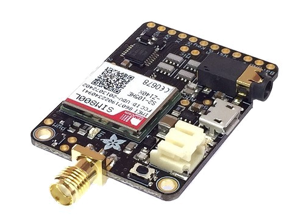
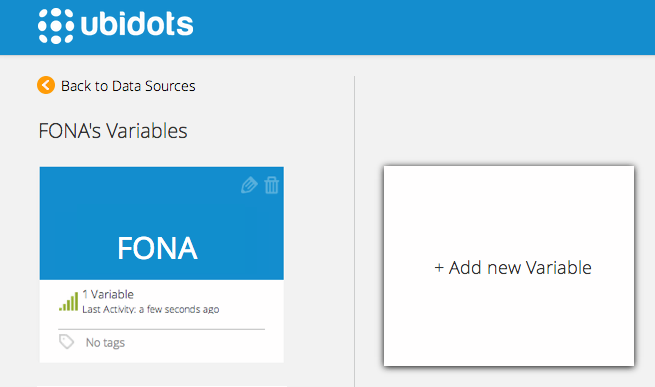
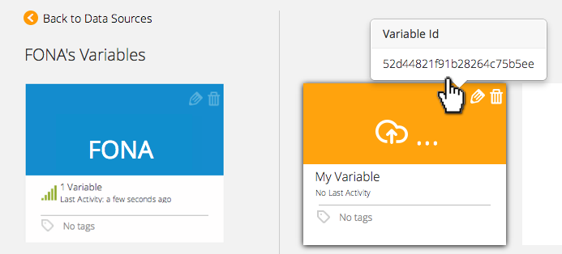

# Adafruit FONA MiniGSM

In this tutorial we'll explain how to send analog values to Ubidots using the FONA module.

## Introduction

Adafruit FONA MiniGSM is "an all-in-one cellular phone module that lets you add voice, text, SMS and data to your project in an adorable little package".

## Components

* [FONA](http://www.adafruit.com/product/1963):
	
    
* A micro-controller board to manage the FONA through an UART interface. We’ll use an Arduino in this case. You can also find a [basic ArduinoFONA tutorial in Adafruit's website](http://www.adafruit.com/product/1963). The pin connection for an Arduino would look like this:

	  * Vio       --> 5V (or 3V, with a 3V logic Arduino)
	  * GND       --> GND
	  * FONA_RX   --> Pin 2
	  * FONA_TX   --> Pin 3
	  * FONA_RST  --> Pin 4
	  * FONA_KEY  --> Pin 7
	  * FONA_PS   --> Pin 8
 
## Preparing your Ubidots Account

Create a Data source called "FONA" and then a variable called "My Variable":

1. [As a logged in user](http://app.ubidots.com/accounts/signin/) navigate to the "Sources" tab.
	
    
2. Create a data source called "My Variable" by clicking on the orange button located in the upper right corner of the screen:
	
    
3. Click on the created Data Source and then on "Add New Variable":
	
    
4. Repeat this process for every variable you wish to create. Take note of every variable's ID; we'll need it later to include in our code:
	
    
5. Create a token under "My Profile" tab. We'll need it later for our code:
	
    
## Coding

To be able to compile this code, you'll need the FONA library for Arduino. [You can find it in Adafruit's website](https://learn.adafruit.com/adafruit-fona-mini-gsm-gprs-cellular-phone-module/arduino-test#download-adafruit-fona).

**NOTE**: Because the FONA Library is a work in progress from Adafruit, we can't guarantee that this code will always work. We'll do our best to keep it up to date following Adafruit's updates.

This example updates 4 variables in Ubidots, but you can easily adapt it to fit your project's variables.

```c++

	/*
	  
	  Sample code to send data from an Arduino to four Ubidots variables using the Adafruit's FONA

	  Components:
	  * Arduino Uno
	  * Adafruit FONA

	  Created 23 Feb 2015
	  This code is based on the Adafruit FONAtest Example
	  and was modified by Alejandro Gomez for Ubidots.

	  This code is in the public domain.

	  */


	#include <SoftwareSerial.h>
	#include "Adafruit_FONA.h"
	#include <stdlib.h>

	// Pin connections:
	#define FONA_RX 2
	#define FONA_TX 3
	#define FONA_RST 4
	#define FONA_KEY 7
	#define FONA_PS 8

	// Ubidots token and variables
	char token[] = "kA8XWNQRHFrXVcccakaJVY3cc2qRU1lq";
	char id1[] = "54bd3afb762542282270ab18";
	char id2[] = "54d25f9f76254263d5f5a9de";
	char id3[] = "54c80c507625426507649569";
	char id4[] = "54cfcc877625424794444c1f";

	// this is a large buffer for replies
	char replybuffer[255];

	// or comment this out & use a hardware serial port like Serial1 (see below)
	SoftwareSerial fonaSS = SoftwareSerial(FONA_TX, FONA_RX);
	Adafruit_FONA fona = Adafruit_FONA(FONA_RST);

	uint8_t readline(char *buff, uint8_t maxbuff, uint16_t timeout = 0);
	int get_int_len(int);
	void sendDataUbidots(void);

	int value1, value2, value3, value4;
	char buffer [33];

	void setup() {  
	  //For FONA MODULE
	  Serial.begin(115200);
	  fonaSS.begin(4800);
	  pinMode(FONA_KEY, OUTPUT);
	  pinMode(FONA_PS, INPUT);
	  analogReference(INTERNAL);
	  delay(2000);
	  TurnOffFona();

	}

	void loop() {
	  flushSerial();
	  TurnOnFona();
	  checkFona();
	  gprsOnFona();
	  senseValues();
	  
	  while (fona.available()) {
	    Serial.write(fona.read());
	  }
	  
	  gprsOffFona();
	  TurnOffFona();
	  delay(600000);

	}

	void senseValues(){
	  value1 = analogRead(A6);
	  value2 = analogRead(A7);  
	  value3 = analogRead(A0);
	  value4 = analogRead(A1);
	  
	  ////////////////////////////////////////////
	  
	  sendDataUbidots(value1, id1);
	  sendDataUbidots(value2, id2);
	  sendDataUbidots(value3, id3);
	  sendDataUbidots(value4, id4);
	 
	  /////////////////////////////////////////////

	}

	void sendDataUbidots(int value, char* myid){
	  
	  uint16_t statuscode;
	  int16_t length;
	  
	  char url1[] = "things.ubidots.com/api/v1.6/variables/";
	  char* url2 = myid;
	  char url3[] = "/values?token=";
	  char* url4 = token;
	  int lurl = strlen(url1) + strlen(url2) + strlen(url3) + strlen(url4);
	  
	  char url[lurl];
	  sprintf(url,"%s%s%s%s",url1,url2,url3,url4);
	//  Serial.println(url);
	   
	  char data1[] = "{\"value\":";
	  char data2[get_int_len(value)+1];
	  char data3[] = "}";
	  itoa(value,data2,10);
	  int ldata = strlen(data1) + strlen(data2) + strlen(data3);
	   
	  char data[ldata];
	  sprintf(data,"%s%s%s",data1,data2,data3);
	  //Serial.println(data);
	  
	  Serial.print(F("http://"));
	  Serial.println(url);
	  Serial.println(data);
	  
	   Serial.println(F("****"));
	   if (!fona.HTTP_POST_start(url, F("application/json"), (uint8_t *) data, strlen(data), &statuscode, (uint16_t *)&length)) {
	     Serial.println("Failed!");
	   }
	   while (length > 0) {
	     while (fona.available()) {
	       char c = fona.read();
	       
	  #if defined(__AVR_ATmega328P__) || defined(__AVR_ATmega168__)
	       loop_until_bit_is_set(UCSR0A, UDRE0); /* Wait until data register empty. */
	       UDR0 = c;
	  #else
	       Serial.write(c);
	  #endif
	       
	       length--;
	       if (! length) break;
	     }
	   }
	   Serial.println(F("\n****"));
	   fona.HTTP_POST_end();
	    
	  // flush input
	  flushSerial();
	}

	void flushSerial() {
	    while (Serial.available()) 
	    Serial.read();
	}

	char readBlocking() {
	  while (!Serial.available());
	  return Serial.read();
	}

	uint16_t readnumber() {
	  uint16_t x = 0;
	  char c;
	  while (! isdigit(c = readBlocking())) {
	    //Serial.print(c);
	  }
	  Serial.print(c);
	  x = c - '0';
	  while (isdigit(c = readBlocking())) {
	    Serial.print(c);
	    x *= 10;
	    x += c - '0';
	  }
	  return x;
	}
	  
	uint8_t readline(char *buff, uint8_t maxbuff, uint16_t timeout) {
	  uint16_t buffidx = 0;
	  boolean timeoutvalid = true;
	  if (timeout == 0) timeoutvalid = false;
	  
	  while (true) {
	    if (buffidx > maxbuff) {
	      //Serial.println(F("SPACE"));
	      break;
	    }

	    while(Serial.available()) {
	      char c =  Serial.read();

	      //Serial.print(c, HEX); Serial.print("#"); Serial.println(c);

	      if (c == '\r') continue;
	      if (c == 0xA) {
	        if (buffidx == 0)   // the first 0x0A is ignored
	          continue;
	        
	        timeout = 0;         // the second 0x0A is the end of the line
	        timeoutvalid = true;
	        break;
	      }
	      buff[buffidx] = c;
	      buffidx++;
	    }
	    
	    if (timeoutvalid && timeout == 0) {
	      //Serial.println(F("TIMEOUT"));
	      break;
	    }
	    delay(1);
	  }
	  buff[buffidx] = 0;  // null term
	  return buffidx;
	}

	int get_int_len (int value){
	  int l=1;
	  while(value>9){ l++; value/=10; }
	  return l;
	}

	void checkFona(){
	  // See if the FONA is responding
	  if (! fona.begin(fonaSS)) {           // can also try fona.begin(Serial1) 
	    Serial.println(F("Couldn't find FONA"));
	    while (1);
	  }
	  Serial.println(F("FONA is OK"));

	  //configure a GPRS APN
	  fona.setGPRSNetworkSettings(F("web.vmc.net.co"), F(""), F(""));
	}

	void TurnOnFona(){  
	  Serial.println("Turning on Fona: ");
	  while(digitalRead(FONA_PS)==LOW)
	    {
	    digitalWrite(FONA_KEY, LOW);
	    }
	    digitalWrite(FONA_KEY, HIGH);
	    delay(4000);
	}

	void TurnOffFona(){
	  Serial.println("Turning off Fona ");
	  while(digitalRead(FONA_PS)==HIGH)
	  {
	    digitalWrite(FONA_KEY, LOW);
	    }
	    digitalWrite(FONA_KEY, HIGH); 
	    delay(4000);
	}

	void gprsOnFona(){
	  while(!fona.enableGPRS(true));
	  Serial.println(F("Turn on"));
	}

	void gprsOffFona(){
	  while (!fona.enableGPRS(false));
	  Serial.println(F("Turn off"));
	}
```


## Wrapping it up

In this guide we learned how to read analog inputs from the Arduino UNO and send these values through the FONA to Ubidots. After getting familiar with it, you can modify your hardware setup to send readings from any other type of sensors attached to it.

## More projects...

Check out other cool projects using Ubidots:
 
* :ref:`devices/arduino-gprs`
* :ref:`devices/arduino-wiznet`
* :ref:`devices/dragino`
