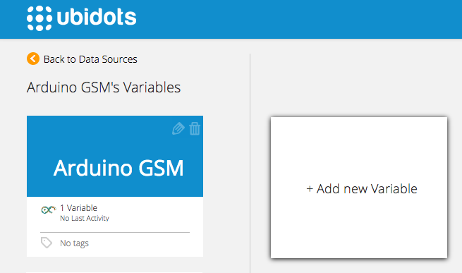
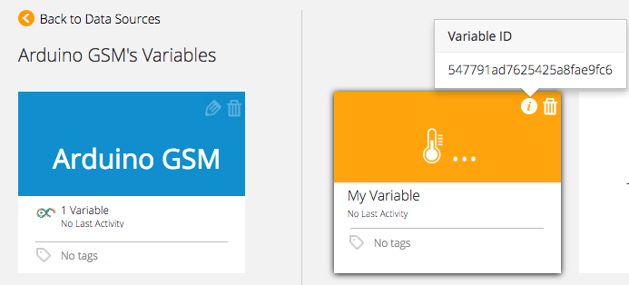

# Arduino GSM Shield by Telefonica

The Arduino GSM Shield connects your Arduino to the internet using the GPRS wireless network. Just plug this module onto your Arduino board, put a SIM card from an operator offering GPRS coverage and follow a few simple instructions to start measuring your world through the internet.


## Components

* [An Arduino UNO](http://arduino.cc/en/Main/arduinoBoardUno).

* [The Arduino GSM Shield](http://arduino.cc/en/Main/ArduinoGSMShield>) by Telefonica:
	
    
IMPORTANT NOTES:

* [Check out these notes from Arduino](http://arduino.cc/en/Guide/GSMShieldLeonardoMega to work with an Arduino Mega, Mega ADK, or Leonardo.
* Connect to a external power supply that can provide between 700mA and 1000mA. The modem can pull up to 2A of current at peak usage, which can occur during data transmission.


## Preparing your Ubidots Account

In your Ubidots account, create a Data source called "Arduino GSM" and then a variable called "My Variable":

1. [As a logged in user](http://app.ubidots.com/accounts/signin/) navigate to the "Sources" tab.
	
    
2. Create a data source called "Arduino GSM" by clicking on the orange button located in the upper right corner of the screen:
	
    
3. Click on the created Data Source and then on "Add New Variable":
	
    
4. Take note of the variable's ID to which you want to send data. We'll need it later to include in our code:
	
    
5. Create a token under "My Profile" tab. We'll need it later for our code:
	
    

## Send a value to Ubidots

The following sketch will use the GSM Shield to send an arbitrary value to Ubidots. You can replace this value with any analogue input value depending on your project:

```cpp

    	/*
		 Based on the example "Web client" from Arduino

		 Circuit:
		 * GSM shield attached to an Arduino
		 * SIM card with a data plan

		 created 8 Mar 2012
		 by Tom Igoe
		 - Modified 15 Nov 2014
		 by Mateo Velez for Ubidots,Inc.
		 
		 http://arduino.cc/en/Tutorial/GSMExamplesWebClient

		 */

		// libraries
		#include <GSM.h>

		// PIN Number
		#define PINNUMBER ""

		// APN data
		#define GPRS_APN       "GPRS_APN" // replace with your GPRS APN
		#define GPRS_LOGIN     "login"    // replace with your GPRS login
		#define GPRS_PASSWORD  "password" // replace with your GPRS password

		// initialize the library instance
		GSMClient client;
		GPRS gprs;
		GSM gsmAccess;
		uint16_t reset = 0;


		String idvariable = "53baaf3c76254244e1c8e408";   // replace with your Ubidots Variable ID
		String token = "CCN8FrVulRYGulPTkbaiR9Myx8qN2o";  // replace with your Ubidots token

		void setup()
		{
		  // initialize serial communications and wait for port to open:
		  Serial.begin(9600);
		  while (!Serial) {
		    ; // wait for serial port to connect. Needed for Leonardo only
		  }

		  Serial.println("Starting Arduino web client.");
		  // connection state
		  boolean notConnected = true;

		  // After starting the modem with GSM.begin()
		  // attach the shield to the GPRS network with the APN, login and password
		  while (notConnected)
		  {
		    if ((gsmAccess.begin(PINNUMBER) == GSM_READY) &
		        (gprs.attachGPRS(GPRS_APN, GPRS_LOGIN, GPRS_PASSWORD) == GPRS_READY))
		      notConnected = false;
		    else
		    {
		      Serial.println("Not connected");
		      delay(1000);
		    }
		  }

		  
		}

		void loop()
		{
		  int value = 250;
		  if(save_value(value))   
		  {
		  }
		  else
		  {
		    reset++;
		    if (reset == 10)
		    {
		      asm volatile ("  jmp 0");    // reset the Arduino board if the data transmission fail
		    }
		  }
		  
		  // if the server's disconnected, stop the client:
		  if (!client.available() && !client.connected())
		  {
		    Serial.println();
		    Serial.println("disconnecting.");
		    client.stop();

		    // do nothing forevermore:
		  
		  }
		}
		boolean save_value(int value)
		{
		  Serial.println("connecting...");
		  
		  int num=0;
		  String var = "{\"value\":"+ String(value) + "}";
		  num = var.length();
		  // if you get a connection, report back via serial:
		  if (client.connect("things.ubidots.com", 80))
		  {
		    Serial.println("connected");
		    // Make a HTTP request:
		    client.print("POST /api/v1.6/variables/"+idvariable+"/values HTTP/1.1\nContent-Type: application/json\nContent-Length: "+String(num)+"\nX-Auth-Token: "+token+"\nHost: things.ubidots.com\n\n");
		    client.println(var);
		    client.println();
		    
		  }
		  else
		  {
		    // if you didn't get a connection to the server:
		    Serial.println("connection failed");
		    return false;
		  } 
		    while (client.available())
		  {
		    
		    char c = client.read();
		    Serial.print(c);
		  }
		}
```

You should now see the value "250" in your Ubidots account!


## Wrapping up

In this guide we learned how to post a random value to Ubidots using an Arduino GSM Shield. After getting familiar with it, you can modify your hardware setup to send readings from any other type of devices/sensors attached to the Arduino Board.

Now that your sensor data is in Ubidots, it's quite simple to create Emails or SMS alerts, setup real-time dashboards to watch your data, or even control things remotely by creating a "Switch" widget in your dashboard.


## More projects...


Check out other cool projects using Ubidots:
 
* :ref:`devices/fona`
* :ref:`devices/arduino-gprs`
