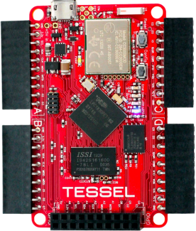
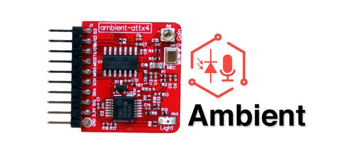
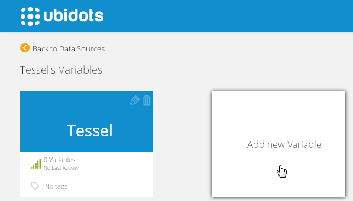
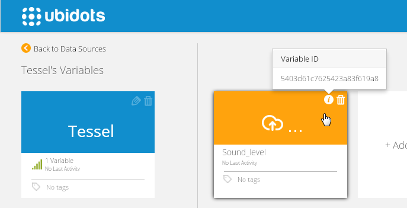
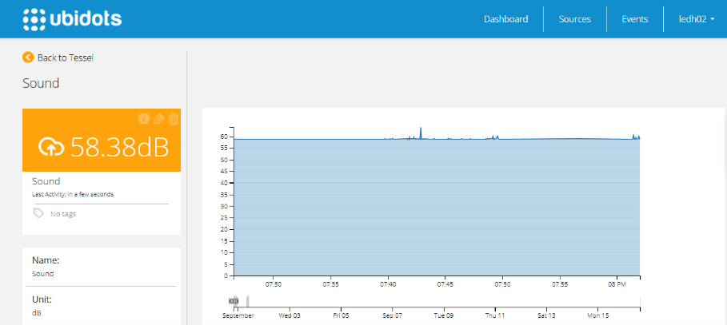

# Tessel

This tutorial teaches you how to read a noise variable from Tessel's Ambient Module and send its value to Ubidots.

## Introduction

Tessel is a Node-compatible microcontroller with WiFi built in. Tessel offers many modules with sensors attached to it, so you can log physical variables in the web. This tutorial provides the basic functions to push data from one variable to Ubidots, but it could be extended to support more modules and sensors.


## Components

* [A Tessel](https://www.trycelery.com/shop/TEC):

  

* [AnAmbient module](https://www.trycelery.com/shop/TEC):

  

## Setting up Tessel and Ubidots Javascript Library

The Tessel needs a few steps to be setup, you can find some instructions [here](http://start.tessel.io/install)

After installing tessel we need to setup our wifi network. Type the following command in your console (security can be 'wpa','wep', 'unsecured'):

```bash
       
       tessel wifi -n "ssid name here" -p "password" -s "security"
```

Tessel can only connect to 802.11b/g networks. Make sure your router has b/g mode enabled.

After connecting to your Wi-Fi network, follow the next three steps of Tessel's tutorial to install the ambient module library: http://start.tessel.io/modules/ambient


## Hardware Setup

1. Connect the ambient module to Tessel's Port A, making sure the hexagon faces down.
2. Make sure you Tessel is plugged to your computer through a micro-USB cable.


## Preparing your Ubidots Account

Create a Data source called "Tessel" and then a variable called "Sound level":

1. As a [logged in user](http://app.ubidots.com/accounts/signin/)`navigate to the "Sources" tab.

  
    
2. Create a data source called "Tessel" by clicking on the orange button located in the upper right corner of the screen:

  
    
3. Click on the created Data Source and then on "Add New Variable":

  
    
4. Take note of the variable's ID to which you want to send data. We'll need it later to include in our code:

  
    
5. Create a token under "My Profile" tab. We'll need it later for our code:

  
    
## Coding

In your computer, create a new file called "noiseLevel.js" and copy the following code. Don't forget to replace the variables "X-Auth-Token" with your TOKEN and "id_sound" with the ID of the Ubidots variable you just created in your Ubidots account:

```js

   var http = require('http');
   var tessel = require('tessel');
   var ambientlib = require('ambient-attx4');
   var ambient = ambientlib.use(tessel.port['A']);
   var req = null;
   var id_sound ='53fcde277625426ad675f96f';
   var sound = {
             value: 0.00000000
           };
   var wifi = require('wifi-cc3000');
   ubidots();
   
   function ubidots(){
       ambient.on('ready', function () {    
           setInterval( function () {
               ambient.getSoundLevel( function(err, sdata) {
                           
                           var valueString = JSON.stringify(sound);
                           var headers = {
                                 'Content-Type': 'application/json',
                                 'Content-Length': valueString.length,
                                 'X-Auth-Token': 'cfaI5R1bcr7wlwf58hAnNZNNvfSoUk',
                                 'Connection': 'keep-alive'
                           };
                           var options = {
                                 host: 'things.ubidots.com',
                                 port: 80,
                                 path: '/api/v1.6/variables/'+id_sound+'/values', //Variable Id
                                 method: 'POST',
                                 headers: headers
                           };
                     
                           req = http.request(options, function(res) {
                                   res.setEncoding('utf-8');
                                   var responseString = '';
                                   res.on('data', function(data) {
                                     responseString += data;
                                   });
                                   res.on('end', function() {
                                     console.log("Sending value to ubidots");
                                     var resultObject = JSON.parse(responseString);
                                     console.log(resultObject);
                                   });
                                   req.on('error', function(e) {
                                     console.log('problem with request: ' + e.message);
                                   });
                           });
                           var dbs= parseFloat(sdata.toFixed(8), 10);// it divide by 20^10-6 or or multiplied by 50000
                           dbs = 20*Math.log10(dbs*50000);
                           console.log("Sound Level:",sdata.toFixed(8)); 
                           sound.value = dbs; 
                           req.write(valueString);
                           req.end();
               });
           },8000);
       });
   };
   
   wifi.on('disconnect', function(err, data){
                     if (!wifi.isBusy()) {
                       connect();
                       }else {
                         console.log("is busy, trying again");
                         setTimeout(function(){connect();},1000);
                       } 
                   console.log("disconnect emitted", err, data);
             });
   
   function connect(){
         wifi.connect({
           security: 'wpa2'//or wpa,unsecured,wep
           , ssid: 'Atom House Medellin'
           , password: 'atommed2014'
           , timeout: 30 // in seconds
         });
       }
```
   
Finally run noiseLevel.js:

```bash    
       
       tessel run noiseLevel.js
```

Now you should begin seeing the Noise level data in your Ubidots Account!

  

## Wrapping it up

In this guide we learned how to read the ambient module of your Tessel and send a noise value to Ubidots. Now you should be able to send readings from any other module attached to Tessel.

Now that your sensor data is in Ubidots, it's quite simple to create Emails or SMS alerts, setup real-time dashboards to watch your data, and use this data in other applications using our API.


## More projects...


Check out other cool projects using Ubidots:

* [Logging temperature and humidity data with Spark Core and Ubidots](http://blog.ubidots.com/measure-temperature-and-humidity-with-your-spark-core)
* [Turn a fan on when the temperature is too high, using Electric Imp](http://blog.ubidots.com/electric-imp-temperature-monitor-control)
