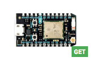
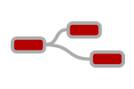
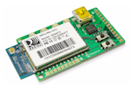

# Devices

This section contains firmware examples and tutorials to connect your device to Ubidots.

## Android

## Arduino Ethernet

## Arduino-based Modules

|Arduino Wi-Fi Shield|Arduino GPRS Shield|Arduino GSM Shield|Arduino Yún|Arduino WizFi Shield|
|:---:|:---:|:---:|:---:|:---:|
|   |   |    |    | |

| Dragino IoT Sensor Node| Arduino Ethernet Shield|
|:---:|:---:|
||    |

## Particle

|Photon (Send Data w/ HTTP library)| Photon (Get data w/ HTTP Library)|
|:---:|:---:|
|     ||                                      

## Embedded Linux

|Raspberry Pi|Node-RED (ThingBox Image for Rpi)| OpenWRT Routers|
|:---:|:---:|:---:|
||| |                               

## Mediatek Labs

| Linkit One (GPRS)|
|:---:|
||

## ESP8266

|ESP8266 + Arduino Board|ESP8266 Stand-alone|
|:---:|:---:|
|||                                            

## Electric Imp

|Imp001 Card|
|:---:|
||

## Android-based Devices

| Connect your Android App to Ubidots|
|:---:|
||

## Microchip-based Modules

|WCM Wi-Fi Module|RN131/RN171 Wi-Fi|ChipKIT Uno32 WiFi|ChipKIT WiFire|
|:---:|:---:|:---:|:---:|
|||||

[Ups!](../images/dev-icons/microchip-partner.jpg)]

*Ubidots is an authorized Microchip Design Partner*.

## Other Modules

|Tessel|FONA MiniGSM|CC3000 WiFi Breakout|GPRSbee Module|WiDo IoT Node|
|:---:|:---:|:---:|:---:|:---:|
||||||
 
<aside class="success">
If your device is not in this list, it doesn’t mean it can’t talk to our API. Most Internet-enabled devices will be able to stream data to
Ubidots, as long as they support the HTTP protocol. If you’d like to see a specific device listed, shoot us an Email to **devices@ubidots.com**.
</aside>
