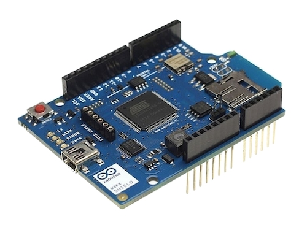
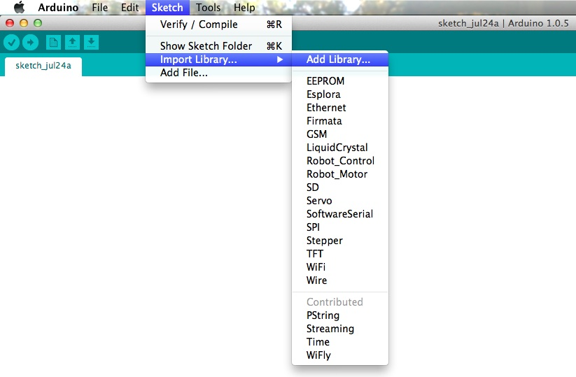
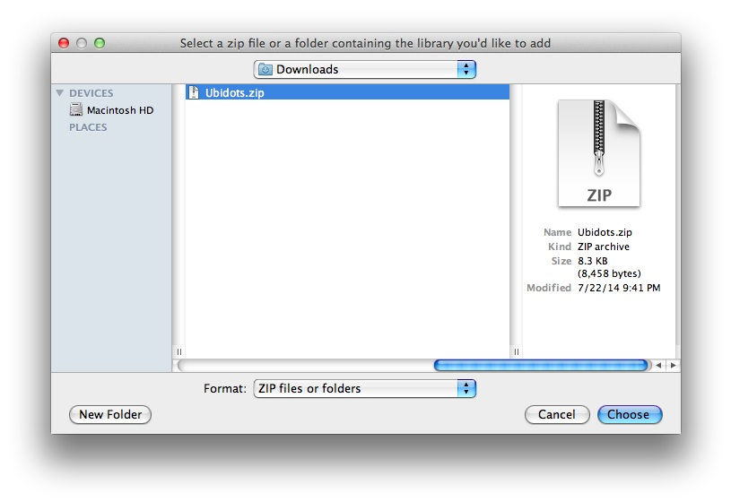
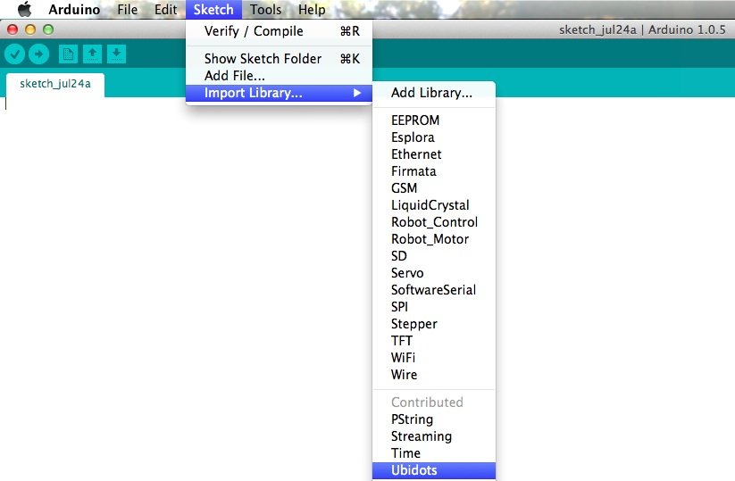
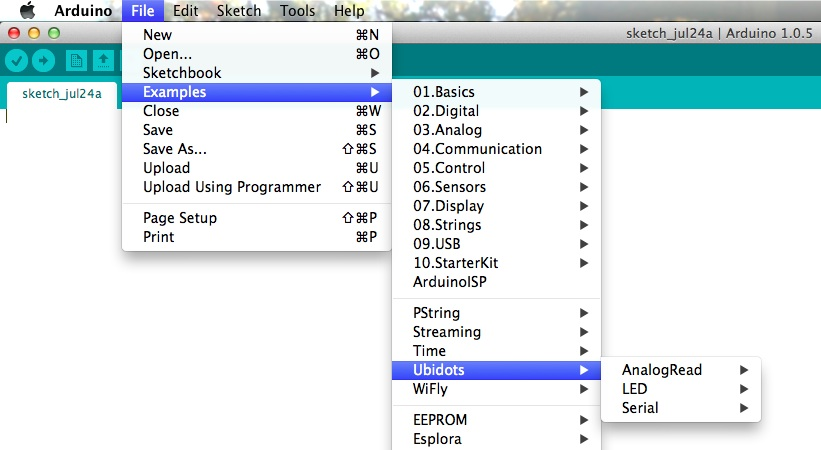
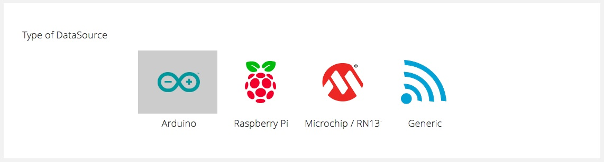
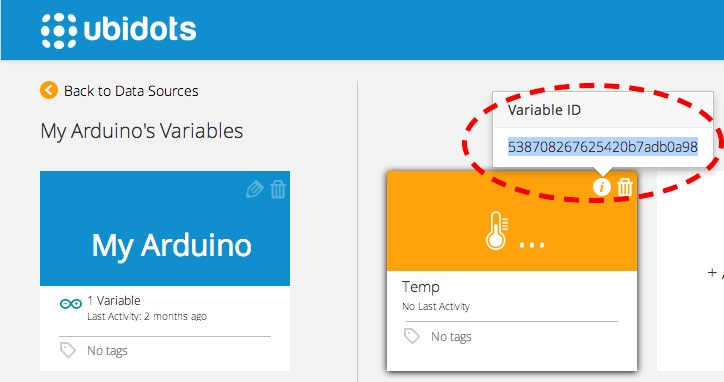
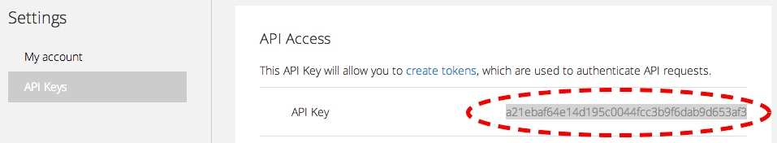

# Arduino - Official WiFi Shield


        
Learn how to setup your Arduino to send data to Ubidots using the official Arduino WiFi shield. At the end of this guide you should be able to:

* Read an analog input value from your Arduino and push it to Ubidots
 
* Read a value already stored in Ubidots, from your Arduino

* Control things attached to your Arduino, from the Ubidots dashboard

**BECAUSE OF A KNOWN ISSUE, THE WIFI SHIELD FIRMWARE NEEDS TO BE UPDATED IN ORDER TO BE ABLE TO SEND HTTP REQUESTS**. It doesn't matter if your Shield is brand new; it might still need a firmware update. [Follow this link to do so](https://www.arduino.cc/en/Hacking/WiFiShieldFirmwareUpgrading).

## Introduction

This guide explains how to install and use [Ubidots Arduino Library](https://github.com/ubidots/ubidots-arduino) to simplify the connection between the Arduino WiFi Shield and our API. 

## Step 1: Setting up the Arduino IDE

If you're already familiar with the Arduino IDE and have installed it, then you can jump to the next step. Otherwise, we suggest going through these guides according to your operating system:

+ [Windows](http://arduino.cc/en/Guide/Windows)
+ [Mac OS](http://arduino.cc/en/Guide/MacOSX)
+ [Linux](http://playground.arduino.cc/Learning/Linux)

You may want to play with the available examples in order to get familiar with the process of creating programs and uploading them to your Arduino board.

## Step 2: Add Ubidots Arduino library

Let's install Ubidots Library in your Arduino IDE. This library contains the basic functions to ease the communication with the Ubidots API, as well as the connection to your WiFi network:

1. Download our library from Github:
 <d1>
   <span class="hs-cta-wrapper" id="hs-cta-wrapper-2860239d-bbff-467d-82e3-44d6254561ff">
        <span class="hs-cta-node hs-cta-2860239d-bbff-467d-82e3-44d6254561ff" id="hs-cta-2860239d-bbff-467d-82e3-44d6254561ff">
            <!--[if lte IE 8]><div id="hs-cta-ie-element"></div><![endif]-->
            <a href="http://cta-redirect.hubspot.com/cta/redirect/329717/2860239d-bbff-467d-82e3-44d6254561ff" target=blank_></a>
        </span>
        <script charset="utf-8" src="https://js.hscta.net/cta/current.js"></script>
        <script type="text/javascript">
           hbspt.cta.load(329717, '2860239d-bbff-467d-82e3-44d6254561ff');
        </script>
    </span>
    </d1>
     
2. Open the Arduino IDE and then click on "Sketch", then "Import Library", then "Add Library":
    
     
3. Select the downloaded ZIP file:
    
    Now, you should be able to see the library inside your Arduino IDE:
    
    

## Step 3: Explore the Examples

We've included three examples to get you started as quickly as possible. You can find them in "File" --> "Examples" --> "Ubidots":
    
    
For every example you'll need to create a data source and a variable in your Ubidots account. Once you login to Ubidots, navigate to the "Sources" tab, click on "Add new Data Source" and select "Arduino" as the type:
    
    
Create a new variable inside the data source and take note of the variable id; you'll need it for your Arduino code:
    
    
You should also take note of your Ubidots API key, which can be found under "My Profile" --> "API Keys"
    
    
Now you're all set to start coding your Arduino. Here's a brief description of the examples found in the library:

    * "AnalogRead": This script reads an analog input from your Arduino (A0) and sends it to Ubidots
 
    * "LEDUbidots": Turn on/off an LED attached to your Arduino, from the Ubidots dashboard

    * "SerialUbidots": This example helps you understand how to read a value from Ubidots. It receives a value typed in the Serial console of the Arduino IDE and sends it to Ubidots. Then you can retrieve this value from Ubidots and display it in the serial console again.


## API Reference

These are the functions implemented in the Ubidots Arduino Library, which are used in the above examples:


1. Ubidots ubiclient():
```c++

    Ubidots ubiclient(api);
```

    |Type   |  Argument | Description|
    |:---:|:---:|:---:|
    |String|   api |      Your API key for the Ubidots API|

    Initialize a Ubidots client. This is most likely to be the first Ubidots library function to call.
2. save_value()
```c++

    boolean = ubiclient.save_value(idvari, String(incomingByte),ctext)
```

    |Type |    Argument  |    Description|
    |:---:|:---:|:---:|
    |String  | idvari   |     ID of the variable to save|
    |String   |incomingByte | The value of the sensor|
    |String  | ctext     |    Content text of the value (optional)|

    Save a value to Ubidots. Returns true upon success. Returns false upon error.

3. get_value()
```c++

    readvalue = ubiclient.get_value(idvari);
```

    |Type        |        Argument  |   Description|
    |:---:|:---:|:---:|
    |String             | idvari     |  ID of the variable that you want make request |

    Get value from Ubidots. Returns a String containing the last value of the variable.

4. WifiCon()
```c++

    response = ubiclient.WifiCon(ssid, pass, status, api);
```

    |Type       |     Argument    | Description|
    |:---:|:---:|:---:|
    |String    |      ssid     |    The SSID of your WiFi network|
    |String     |     pass    |     The pass of your WiFi network|
    |String      |    status |      is the value of the initialization status of WiFi|
    |String       |   api   |       Your API Key number|

    This Function connects to your WiFi network. After connection it creates a token using the API key, then it returns a boolean (true or false) depending on whether the token is obtained or not. 


## More projects...

Check out other cool projects using Ubidots:

* [Sending motion sensor data to the cloud with a Raspberry Pi](http://blog.ubidots.com/building-a-people-counter-with-raspberry-pi-and-ubidots)

* :ref:`Measuring your Internet connection with an OpenWrt router <examples/lua_openwrt>`