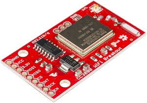
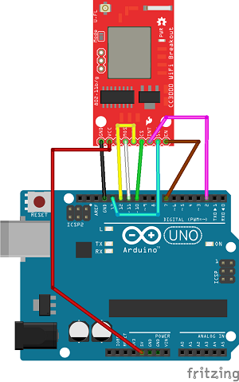
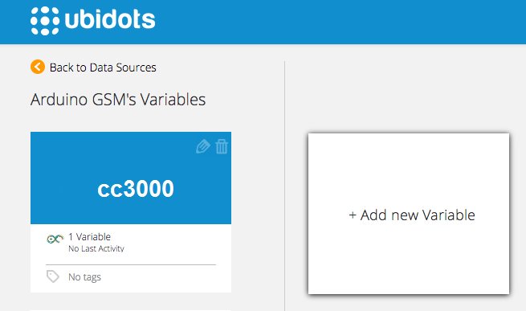

# TI CC3000 WiFi Breakout

The CC3000 WiFi breakout is a module to add WiFi connectivity to any electronics project involving a microcrontroller. In this example we'll use an Arduino to communicate with the WiFi module and send a value to the Ubidots API.

## Components

* [An Arduino UNO](http://arduino.cc/en/Main/arduinoBoardUno):
	

* [A Sparkfun CC3000 WiFi Breakout](https://www.sparkfun.com/products/12072):
	
 
## Install the SparkFun CC3000 Library

1. Download the library as a ZIP file [here](http://github.com/sparkfun/SFE_CC3000_Library/archive/master.zip)

2. Open the Arduino IDE and go to "Sketch" --> "Import Library" --> "Add Library".

3. Select the downloaded ZIP file


**IMPORTANT NOTES**: 

* This only work on Arduino IDE 1.0.
* You should not connect VCC and 3.3V simultaneously.


## Connections

Check your connections in the Arduino UNO. 

    
## Preparing your Ubidots Account

In your Ubidots account, create a Data source called "cc3000" and then a variable called "My Variable":

1. [As a logged in user](http://app.ubidots.com/accounts/signin/) navigate to the "Sources" tab.
	
    
2. Create a data source called "cc3000" by clicking	on the orange button located in the upper right corner of the screen:
	
    
3. Click on the created Data Source and then on "Add New Variable":
	
    
4. Take note of the variable's ID to which you want to send data. We'll need it later to include in our code:
	
    
5. Create a token under "My Profile" tab. We'll need it later for our code:
	
    
## Send a value to Ubidots

The following sketch will use the cc3000 to send an arbitrary value to Ubidots. You can replace this value with any analogue input value depending on your project:

```c++

       /****************************************************************
		WebClient.ino
		CC3000 WebClient Test
		Shawn Hymel @ SparkFun Electronics
		March 1, 2014

		https://github.com/sparkfun/SFE_CC3000_Library

		Manually connects to a WiFi network and performs an HTTP GET
		request on a web page. Prints the contents of the page to
		the serial console.

		The security mode is defined by one of the following:
		WLAN_SEC_UNSEC, WLAN_SEC_WEP, WLAN_SEC_WPA, WLAN_SEC_WPA2

		Hardware Connections:
		 
		 Uno Pin    CC3000 Board    Function
		 
		 +5V        VCC or +5V      5V
		 GND        GND             GND
		 2          INT             Interrupt
		 7          EN              WiFi Enable
		 10         CS              SPI Chip Select
		 11         MOSI            SPI MOSI
		 12         MISO            SPI MISO
		 13         SCK             SPI Clock

		Resources:
		Include SPI.h, SFE_CC3000.h, and SFE_CC3000_Client.h

		Development environment specifics:
		Written in Arduino 1.0.5
		Tested with Arduino UNO R3
		Distributed as-is; no warranty is given.

		 - Modified 15 Nov 2014
		 by Mateo Velez for Ubidots,Inc.
		****************************************************************/

		#include <SPI.h>
		#include <SFE_CC3000.h>
		#include <SFE_CC3000_Client.h>

		// Pins
		#define CC3000_INT      2                                // Needs to be an interrupt pin (D2/D3)
		#define CC3000_EN       7                                // Can be any digital pin
		#define CC3000_CS       10                               // Preferred is pin 10 on Uno

		// Connection info data lengths
		#define IP_ADDR_LEN     4                                // Length of IP address in bytes

		// Constants
		char ap_ssid[] = "Atom House Medellin";                  // SSID of network
		char ap_password[] = "atommed2014";                      // Password of network
		unsigned int ap_security = WLAN_SEC_WPA2;                // Security of network
		unsigned int timeout = 30000;                            // Milliseconds


		String token;
		String idvariable;
		int value = 0;

		// Global Variables
		SFE_CC3000 wifi = SFE_CC3000(CC3000_INT, CC3000_EN, CC3000_CS);
		SFE_CC3000_Client client = SFE_CC3000_Client(wifi);
		ConnectionInfo connection_info;
		void setup() {
		  
		  
		  // Initialize Serial port
		  Serial.begin(115200);
		  // Initialize CC3000 (configure SPI communications)
		  if ( wifi.init() ) {
		    Serial.println("CC3000 initialization complete");
		  } else {
		    Serial.println("Something went wrong during CC3000 init!");
		  }
		}

		void loop() {
		  wifi_connection;
		  value = 234;
		  save_value(String(value));    
		  delay(1000);    
		}

		boolean save_value(String value)
		{
		  String var = "";
		  String le = "";
		  var="{\"value\":"+ value + "}";
		  // Make a TCP connection to remote host
		  Serial.print("Performing HTTP GET of: ");
		  if ( !client.connect("things.ubidots.com", 80) ) {
		    Serial.println("Error: Could not make a TCP connection");
		  }
		  
		  // Make a HTTP GET request
		  client.print("POST /api/v1.6/variables/");
		  client.print(idvariable);
		  client.println("/values HTTP/1.1");
		  client.println("Content-Type: application/json");
		  client.print("Content-Length: ");
		  client.println(le);
		  client.print("X-Auth-Token: ");
		  client.println(token);
		  client.println("Host: things.ubidots.com");
		  client.println();
		  client.println(var);
		  client.println();
		  
		  if ( client.available() ) {
		    char c = client.read();
		    Serial.print(c);
		  }
		  
		  // If the server has disconnected, stop the client and wifi
		  if ( !client.connected() ) {
		    Serial.println();
		    
		    // Close socket
		    if ( !client.close() ) {
		      Serial.println("Error: Could not close socket");
		    }
		    
		    // Disconnect WiFi
		    if ( !wifi.disconnect() ) {
		      Serial.println("Error: Could not disconnect from network");
		    }
		  }
		}
		void wifi_connection()
		{
		  int i;
		  // Connect using DHCP
		  Serial.print("Connecting to SSID: ");
		  Serial.println(ap_ssid);
		  if(!wifi.connect(ap_ssid, ap_security, ap_password, timeout)) {
		    Serial.println("Error: Could not connect to AP");
		  }
		  
		  // Gather connection details and print IP address
		  if ( !wifi.getConnectionInfo(connection_info) ) {
		    Serial.println("Error: Could not obtain connection details");
		  } else {
		    Serial.print("IP Address: ");
		    for (i = 0; i < IP_ADDR_LEN; i++) {
		      Serial.print(connection_info.ip_address[i]);
		      if ( i < IP_ADDR_LEN - 1 ) {
		        Serial.print(".");
		      }
		    }
		    Serial.println();
		  }
		}
```

## Wrapping up

In this guide we learned how to post an arbitrary value to Ubidots using an the CC3000. After getting familiar with it, you can modify your hardware setup to send readings from any other type of devices/sensors attached to the Arduino Board.

Now that your sensor data is in Ubidots, it's quite simple to create Emails or SMS alerts, setup real-time dashboards to watch your data, or even control things remotely by creating a "Switch" widget in your dashboard.


## More projects...

Check out other cool projects using Ubidots:
 
* :ref:`devices/fona`
* :ref:`devices/arduino-gprs`
