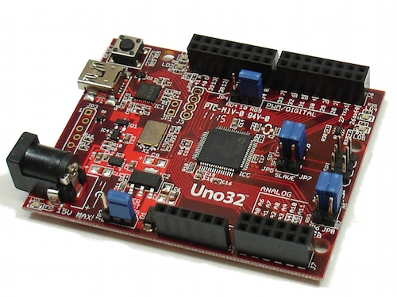
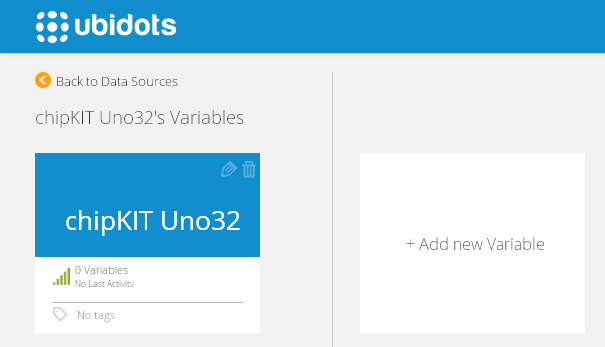
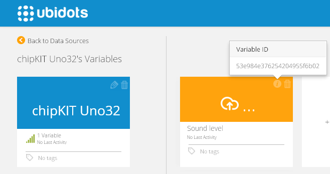

# ChipKIT Uno32 - Official WiFi Shield

After doing this tutorial you’ll be able to read the environmental noise level using chipKIT Uno32 and send its value to Ubidots.

## Introduction

ChipKIT Uno32 is an open source hardware prototyping platform based on Arduino, but featuring a Microchip PIC32 microcontroller. It is also compatible with many Arduino shields, code examples, reference materials and other resources. 

## Components

*	[A chipKIT Uno32](http://www.digilentinc.com/Products/Detail.cfm?Prod=CHIPKIT-UNO32):
  
    
* [A chipKIT WiFi Shield](http://www.digilentinc.com/Products/Detail.cfm?NavPath=2,892,1037&Prod=CHIPKIT-WIFI-SHIELD):
  

*	[Electret microphone board](http://www.seeedstudio.com/depot/Grove-Sound-Sensor-p-752.html):
  
    
* Some female to male wires.    
 
## Setting up the IDE and the WiFiShield Library

1. Download the [MPIDE](http://www.chipkit.net/started) from Chipkit's website. 
2. Download the [WiFi shield library](http://www.digilentinc.com/Agreement.cfm?DocID=DSD-0000318).
3. Take note of your sketchbook directory. Open "mpide.exe" and go to "File" --> "Preferences" and then copy your sketchbook location.
4. Close "mpide.exe".
5. Inside your sketchbook directory create a subdirectory called "libraries",this directory may already exist.
6. Unzip the Wi-Fi shield library into your libraries location.
7. Your sketchbook should look like this:
  
    
## Hardware Setup

For this section you'll only need to connect 3 wires:

1. Connect the "GND" pin of the Mic breakout board to the "GND" pin of your chipKIT Uno32.
2. Connect the "VCC" pin of the Mic breakout board to the "3V3" pin of your chipKIT Uno32.
3. Connect the "OUT" pin of the Mic breakout board to the "A6" pin of your chipKIT Uno32.


## Preparing your Ubidots Account

Create a Data source called "chipKIT Uno32" and then a variable called "Sound level":

1. [As a logged in user](http://app.ubidots.com/accounts/signin/) navigate to the "Sources" tab.
  

2. Create a data source called "chipKIT Uno32" by clicking on the orange button located in the upper right corner of the screen:
  

3. Click on the created Data Source and then on "Add New Variable":
  
    
4. Take note of the variable's ID to which you want to send data. We'll need it later to include in our core:
  
    
5. Create a token under "My Profile" tab. We'll need it later for our code:
  
    
## Coding

Create a new file called "noiseLevel" and copy the following code. Don't forget to replace TOKEN and ID with the ones in your Ubidots account:

```c++

      #include <Wprogram.h>
      #include <Wire.h>
      #include <WiFiShieldOrPmodWiFi_G.h>                     // This is for the MRF24WGxx on a pmodWiFi or WiFiShield
      #include <DNETcK.h>
      #include <DWIFIcK.h>

      char * szIPServer = "things.ubidots.com";    // server to connect to
      unsigned short portServer = 80;
      const char * szSsid = "Atom House Medellin";//SSID
      const char * szPassPhrase = "atommed2014";//passphrase
      #define USE_WPA2_PASSPHRASE //Choose the security your network use.
            //#define USE_WPA2_KEY
            //#define USE_WEP40
            //#define USE_WEP104
            //#define USE_WF_CONFIG_H
      #if defined(USE_WPA2_PASSPHRASE)
          #define WiFiConnectMacro() DWIFIcK::connect(szSsid, szPassPhrase, &status)
          
      #elif defined(USE_WPA2_KEY)

          DWIFIcK::WPA2KEY key = { 0x27, 0x2C, 0x89, 0xCC, 0xE9, 0x56, 0x31, 0x1E, 
                                  0x3B, 0xAD, 0x79, 0xF7, 0x1D, 0xC4, 0xB9, 0x05, 
                                  0x7A, 0x34, 0x4C, 0x3E, 0xB5, 0xFA, 0x38, 0xC2, 
                                  0x0F, 0x0A, 0xB0, 0x90, 0xDC, 0x62, 0xAD, 0x58 };
          #define WiFiConnectMacro() DWIFIcK::connect(szSsid, key, &status)

      #elif defined(USE_WEP40)

          const int iWEPKey = 0;
          DWIFIcK::WEP40KEY keySet = {    0xBE, 0xC9, 0x58, 0x06, 0x97,     // Key 0
                                          0x00, 0x00, 0x00, 0x00, 0x00,     // Key 1
                                          0x00, 0x00, 0x00, 0x00, 0x00,     // Key 2
                                          0x00, 0x00, 0x00, 0x00, 0x00 };   // Key 3
          #define WiFiConnectMacro() DWIFIcK::connect(szSsid, keySet, iWEPKey, &status)

      #elif defined(USE_WEP104)

          const int iWEPKey = 0;
          DWIFIcK::WEP104KEY keySet = {   0x3E, 0xCD, 0x30, 0xB2, 0x55, 0x2D, 0x3C, 0x50, 0x52, 0x71, 0xE8, 0x83, 0x91,   // Key 0
                                          0x00, 0x00, 0x00, 0x00, 0x00, 0x00, 0x00, 0x00, 0x00, 0x00, 0x00, 0x00, 0x00,   // Key 1
                                          0x00, 0x00, 0x00, 0x00, 0x00, 0x00, 0x00, 0x00, 0x00, 0x00, 0x00, 0x00, 0x00,   // Key 2
                                          0x00, 0x00, 0x00, 0x00, 0x00, 0x00, 0x00, 0x00, 0x00, 0x00, 0x00, 0x00, 0x00 }; // Key 3
          #define WiFiConnectMacro() DWIFIcK::connect(szSsid, keySet, iWEPKey, &status)

      #elif defined(USE_WF_CONFIG_H)

          #define WiFiConnectMacro() DWIFIcK::connect(0, &status)

      #else   // no security - OPEN

          #define WiFiConnectMacro() DWIFIcK::connect(szSsid, &status)

      #endif
       
      String token="1LReH7fFyYXWRdqIBKkf3jdpEji6Kb1wVfN571HwAMzFG1uB18J8B4UGD8Nw";
      String idPot="53eba4657625420fe5b4992e";
      const int sampleWindow=50;
      unsigned tStart = 0;
      double value;
      typedef enum //States of the state machine
      {
          NONE = 0,
          CONNECT,
          TCPCONNECT,
          WRITE,
          READ,
          CLOSE,
          DONE,
      } STATE;

      STATE state = CONNECT;
      TcpClient tcpClient;

      void setup() { 
          Serial.begin(9600);
          Serial.println("WiFiTCPEchoClient 1.0");
          Serial.println("Digilent, Copyright 2012");
          Serial.println("Wait a few seconds");
      }

      void loop() {
        unsigned long startMillis= millis();  // Start of sample window
        double peakToPeak = 0;   // peak-to-peak level
        double signalMax = 0;
        double signalMin = 1024;
          while (millis() - startMillis < sampleWindow)
        {
          value = analogRead(A0);
          if (value < 1024)  // toss out spurious readings
          {
            if (value > signalMax)
            {
              signalMax = value;  // save just the max levels
            }
            else if (value < signalMin)
            {
              signalMin = value;  // save just the min levels
            }
          }
        }
         value = ((signalMax - signalMin)* 3.3) / 1024; //to volts
         value=20*log10(value*50000);//to dbs
         if(save_value(String(int(value)),idPot))
          {
            Serial.println("potenciometer value in Ubidots:");
            Serial.println(value);
          } 
          delay(1000);
      }

      boolean save_value(String value,String idvariable)//Send value to Ubidots
      {
        int cbRead=0;
        String var = "{\"value\":"+ value + "}";
        int num = var.length();
        String le = String(num);  
        String message = "POST /api/v1.6/variables/"+idvariable+"/values HTTP/1.1\nContent-Type: application/json\nContent-Length: "+le+"\nX-Auth-Token: "+token+"\nHost: things.ubidots.com\n\n"+var+"\n\n";
        byte rgbWriteStream[message.length()]  ;
        message.getBytes(rgbWriteStream,message.length() + 1);
        int cbWriteStream = sizeof(rgbWriteStream);
        state_machine(rgbWriteStream,cbWriteStream);
        return true;
      }
           
      boolean state_machine(byte rgbWriteStream[], int cbWriteStream)//Handle the TCP connection
      {
          byte rgbRead[1024];

          int conID = DWIFIcK::INVALID_CONNECTION_ID;
          DNETcK::STATUS status;
        for(;;)
        {
          int cbRead = 0;
          switch(state)
          {
             case CONNECT:
                  if((conID = WiFiConnectMacro()) != DWIFIcK::INVALID_CONNECTION_ID)
                  {
                      Serial.print("Connection Created, ConID = ");
                      Serial.println(conID, DEC);
                      state = TCPCONNECT;
                  }
                  else
                  {
                      Serial.print("Unable to connection, status: ");
                      Serial.println(status, DEC);
                      state = CLOSE;
                  }
                  break;
             case TCPCONNECT:
                  DNETcK::begin();
                  tcpClient.connect(szIPServer, portServer); 
                  state = WRITE;
                   break;
             case WRITE:
                  if(tcpClient.isConnected())
                      {     
                        Serial.println("Got Connection");
                        tcpClient.writeStream(rgbWriteStream, cbWriteStream);
                        Serial.println("Bytes Read Back:");
                        state = CLOSE;
                        tStart = (unsigned) millis();
                      }
                  break;          
              case CLOSE:
                  tcpClient.close();
                  state = DONE;
                  break;
              case DONE:     
                  state = TCPCONNECT;
                  return cbRead;        
              default:
                  break;
          }   
          DNETcK::periodicTasks(); // keep the stack alive each pass through the loop()
        }
      }
```

## Wrapping it up

In this guide we learned how to read an analog input from your chipKIT Uno32 and send its value to Ubidots. After getting familiar with it, you can modify your hardware setup to send readings from any other type of sensors attached to it.

Now that your sensor data is in Ubidots, it's quite simple to create Emails or SMS alerts, setup real-time dashboards to watch your data, or even control things remotely by creating a "Switch" widget in your dashboard.


## More projects...

Check out other cool projects using Ubidots:
 
* [Microchip RN131 and RN171 Evaluation Kits](http://ubidots.com/docs/devices/rn131-171.html#devices-rn131-171)
* [Microchip WCM Development Kit 1](http://ubidots.com/docs/devices/microchipWCMKit.html#devices-microchipwcmkit)
* [ChipKIT WiFire](http://ubidots.com/docs/devices/chipKitWiFire.html#devices-chipkitwifire)
