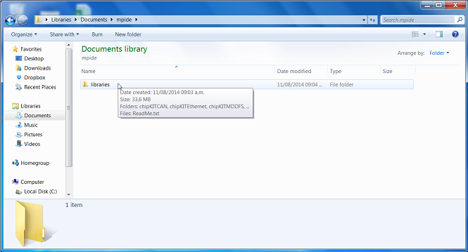
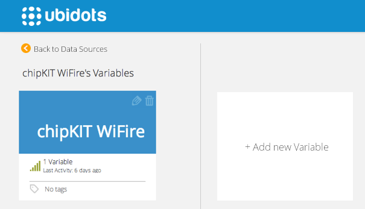
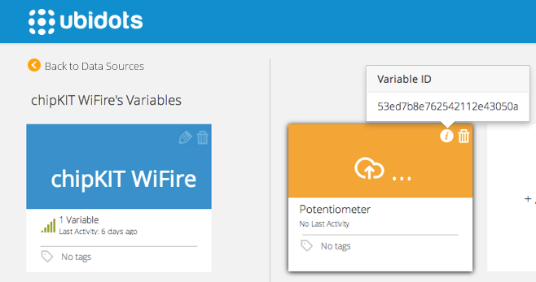

# ChipKIT WiFire 

In this tutorial we'll explain how to read a value from the potentiometer that's embeded in chipKIT WiFire's board, and then send this value to Ubidots.


## Introduction

The chipKIT family is based on the popular Arduino open-source hardware prototyping platform and adds the performance of the Microchip PIC microcontrollers. The chipKIT WiFIRE  features 43 available I/O Pins, 12 Analog Inputs, 4 User LEDs, potentiometer, buttons, uses MRF24 on-board wireless module, micro SD Card, dedicated SPI Signals and high efficiency 3.3V switching power supply for low-power operation. 

The WiFire is significantly faster than its WF32 counterpart, with 200MHz operation speed, 2MB of Flash, 512kB RAM, High Speed USB and a 50MHz SPI. The PIC32MZ core includes the MIPS MicroAptiv CPU, a highly efficient, compact, core that is optimized for cloud-connected based projects.

## Components

*	[A chipKIT WiFire](http://www.digilentinc.com/Products/Detail.cfm?NavPath=2,719,1265&Prod=CHIPKIT-WIFIRE):
  
    
## Setting up the IDE and the WiFi Library

1. Download the [test MPIDE](http://www.chipkit.net/started) from Chipkit's website. 
2. Download the Digilent's [WiFire library](http://cdn2.hubspot.net/hubfs/329717/DEIPcK.zip).
3. Take note of your sketchbook directory. To do so, open "mpide.exe" and go to "File" --> "Preferences" and copy your sketchbook location.
4. Close "mpide.exe".
5. Inside your sketchbook directory create a subdirectory called "libraries",this directory may already exist.
6. Unzip the WiFire library ("deIPcK.zip") in your libraries directory.
7. Your Sketchbook should look like this:
  
    
## Preparing your Ubidots Account

Create a Data source called "chipKIT WiFire" and then a variable called "Potentiometer":

1. [As a logged in user](http://app.ubidots.com/accounts/signin/) navigate to the "Sources" tab.
  
    
2. Create a data source called "chipKIT WiFire" by clicking on the orange button located in the upper right corner of the screen:
  
    
3. Click on the created Data Source and then on "Add New Variable":
  
    
4. Take note of the variable's ID to which you want to send data. We'll need it later to include in our core:
  
    
5. Create a token under "My Profile" tab. We'll need it later for our code:
  
    
## Coding

This code reads the potentiometer in the WiFire and post this value to Ubidots.

Note the function used to send the data to Ubidots:

```c++

   boolean save_value(String value);
```

|Type           |     Argument   |  Description|
|:----:|:----:|:----:|
|String       |       value      |  A numerical value in string format. This value will be sent to Ubidots |


Here's the code:

```c++

      #include <MRF24G.h>                     
      #include <DEIPcK.h>
      #include <DEWFcK.h>
      const char * szIPServer = "things.ubidots.com";                                     //server to connect to
      uint16_t portServer = 80;                                                           //server port, "80" in this case
      // Specify the SSID
      const char * szSsid = "Atom House Medellin";                                        //your SSID

      // select one for the security you want, or none for no security
      #define USE_WPA2_PASSPHRASE
      //#define USE_WPA2_KEY
      //#define USE_WEP40
      //#define USE_WEP104
      //#define USE_WF_CONFIG_H

      #if defined(USE_WPA2_PASSPHRASE)
        const char * szPassPhrase = "atommed2014";                                          //your SSID PASSWORD
        #define WiFiConnectMacro() deIPcK.wfConnect(szSsid, szPassPhrase)

      #elif defined(USE_WPA2_KEY)

        DEWFcK::WPA2KEY key = { 0x27, 0x2C, 0x89, 0xCC, 0xE9, 0x56, 0x31, 0x1E, 
                                0x3B, 0xAD, 0x79, 0xF7, 0x1D, 0xC4, 0xB9, 0x05, 
                                0x7A, 0x34, 0x4C, 0x3E, 0xB5, 0xFA, 0x38, 0xC2, 
                                0x0F, 0x0A, 0xB0, 0x90, 0xDC, 0x62, 0xAD, 0x58 };
        #define WiFiConnectMacro() deIPcK.wfConnect(szSsid, key, &status)

      #elif defined(USE_WEP40)

          const int iWEPKey = 0;
          DEWFcK::WEP40KEY keySet = {    0xBE, 0xC9, 0x58, 0x06, 0x97,     // Key 0
                                          0x00, 0x00, 0x00, 0x00, 0x00,     // Key 1
                                          0x00, 0x00, 0x00, 0x00, 0x00,     // Key 2
                                          0x00, 0x00, 0x00, 0x00, 0x00 };   // Key 3
          #define WiFiConnectMacro() deIPcK.wfConnect(szSsid, keySet, iWEPKey, &status)

      #elif defined(USE_WEP104)

          const int iWEPKey = 0;
          DEWFcK::WEP104KEY keySet = {   0x3E, 0xCD, 0x30, 0xB2, 0x55, 0x2D, 0x3C, 0x50, 0x52, 0x71, 0xE8, 0x83, 0x91,   // Key 0
                                          0x00, 0x00, 0x00, 0x00, 0x00, 0x00, 0x00, 0x00, 0x00, 0x00, 0x00, 0x00, 0x00,   // Key 1
                                          0x00, 0x00, 0x00, 0x00, 0x00, 0x00, 0x00, 0x00, 0x00, 0x00, 0x00, 0x00, 0x00,   // Key 2
                                          0x00, 0x00, 0x00, 0x00, 0x00, 0x00, 0x00, 0x00, 0x00, 0x00, 0x00, 0x00, 0x00 }; // Key 3
          #define WiFiConnectMacro() deIPcK.wfConnect(szSsid, keySet, iWEPKey, &status)

      #elif defined(USE_WF_CONFIG_H)

          #define WiFiConnectMacro() deIPcK.wfConnect(0, &status)

      #else   // no security - OPEN

          #define WiFiConnectMacro() deIPcK.wfConnect(szSsid, &status)

      #endif


      String idvariable = "53badbd77625425f8665d11b";                                     //your ID of the Ubidots variable
      String token = "CCN8FrVulRYGulPTkbaiR9Myx8qN2o";                                    //your Ubidots token

      TCPSocket tcpSocket;
      typedef enum
      {
          NONE = 0,
          CONNECT,
          TCPCONNECT,
          WRITE,
          READ,
          CLOSE,
          DONE,
      } STATE;

      STATE state = CONNECT;
      void setup()
      {
          Serial.begin(9600);
          Serial.println("WiFi Ubidots Client");
          Serial.println("");
      }
      void loop() {
          
          int value = analogRead(A12);                               
          
          if(boolean bi = save_value(String(value)))      
          {
            Serial.print("posted");
          }
                   
      }
      /*--------------------------------------------------------------------------------------------------------------
       --------------------------------------------save_value function------------------------------------------------
       ---------------------------------------------------------------------------------------------------------------
       
       This function will post the value to Ubidots, you just need to pass the value as a string.
       
       ---------------------------------------------------------------------------------------------------------------
      */

      boolean save_value(String value)
      {
        int cbRead = 0; 
        String var = "{\"value\":"+ value + "}";
        int num = var.length();
        String le = String(num);  
        String message = "POST /api/v1.6/variables/"+idvariable+"/values HTTP/1.1\nContent-Type: application/json\nContent-Length: "+le+"\nX-Auth-Token: "+token+"\nHost: things.ubidots.com\n\n"+var+"\n\n";
        byte rgbWriteStream[message.length()]  ;
        message.getBytes(rgbWriteStream, message.length() + 1);
        int cbWriteStream = sizeof(rgbWriteStream);
        state_machine(rgbWriteStream, cbWriteStream);
        return true;
      }
      /*---------------------------------------------------------------------------------------------------------------
        ---------------------------------------------State Machine-----------------------------------------------------
        ---------------------------------------------------------------------------------------------------------------
       
        You don't need to change this function, it sends values to Ubidots, and handles the TCP client.
        this function allows the program to reset the wifi connection if it is lost.
       
        ---------------------------------------------------------------------------------------------------------------
      */

      boolean state_machine(byte rgbWriteStream[], int cbWriteStream)
      {
        
        byte rgbRead[1024];
        unsigned tStart = 0;
        unsigned tWait = 3000;
        int flag=0;
        for(;;)
        {
        int cbRead = 0;
        IPSTATUS status;
        switch(state)
          {

              case CONNECT:
                  if(WiFiConnectMacro())
                  {
                      Serial.println("WiFi connected");
                      deIPcK.begin();
                      state = TCPCONNECT;
                  }
                  else if(IsIPStatusAnError(status))
                  {
                      Serial.print("Unable to connection, status: ");
                      Serial.println(status, DEC);
                      state = CLOSE;
                  }
                  break;

              case TCPCONNECT:
                  if(deIPcK.tcpConnect(szIPServer, portServer, tcpSocket))
                  {
                      Serial.println("Connected to server.");
                      state = WRITE;
                  }
              break;

              case WRITE:
                  if(tcpSocket.isEstablished())
                      {     
                      tcpSocket.writeStream(rgbWriteStream, cbWriteStream);
                      
                      //Serial.println("Bytes Read Back:");
                      state = READ;
                      tStart = (unsigned) millis();
                      }
                  break;

                  
                  case READ:

                      
                      if((cbRead = tcpSocket.available()) > 0)
                      {
                          cbRead = cbRead < sizeof(rgbRead) ? cbRead : sizeof(rgbRead);
                          cbRead = tcpSocket.readStream(rgbRead, cbRead);

                          for(int i=0; i < cbRead; i++)
                          {
                              //Serial.print(rgbRead[i], BYTE);                                         // this is for debugging
                          }
                          
                      }

                      else if( (((unsigned) millis()) - tStart) > tWait )
                      {
                          Serial.println("");
                          state = CLOSE;
                      }
                      break;


              case CLOSE:        
                  tcpSocket.close();
                  Serial.println("Closing TcpClient, send done!");
                  state = DONE;
                  break;

              case DONE:
                  state = CONNECT;
                  return cbRead;
              default:
                  break;
                  
          }

          // keep the stack alive everytime it passes through the loop()
          
          DEIPcK::periodicTasks();
        }
      }
```

## Wrapping it up

In this guide we learned how to read an analog input from the chipKIT WiFire and send this value to Ubidots. After getting familiar with it, you can modify your hardware setup to send readings from any other type of sensors attached to it.

Now that your sensor data is in Ubidots, it's quite simple to create Emails or SMS alerts, setup real-time dashboards to watch your data, or even control things remotely by creating a "Switch" widget in your dashboard.


## More projects...


Check out other cool projects using Ubidots:
  
* [Microchip RN131 and RN171 Evaluation Kits](http://ubidots.com/docs/devices/rn131-171.html#devices-rn131-171)
* [Microchip WCM Development Kit 1](http://ubidots.com/docs/devices/microchipWCMKit.html#devices-microchipwcmkit)
* [ChipKIT Uno32 Official WiFi Shield](http://ubidots.com/docs/devices/chipKITUno32.html#devices-chipkituno32)
