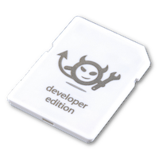
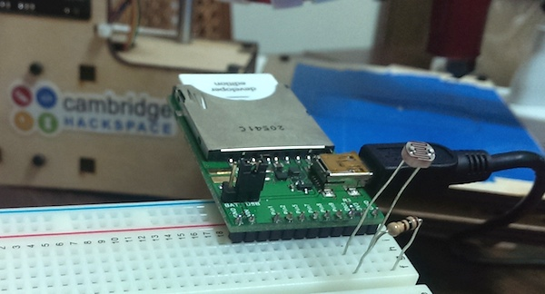
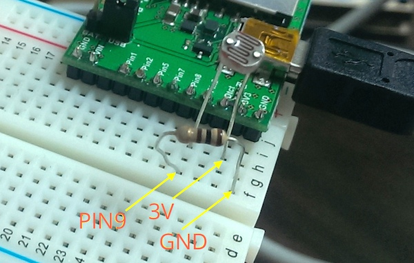
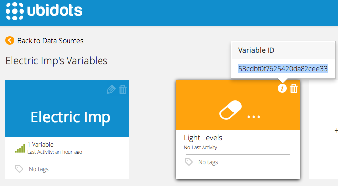
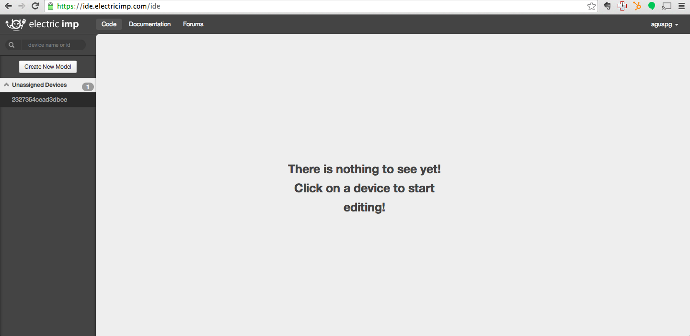
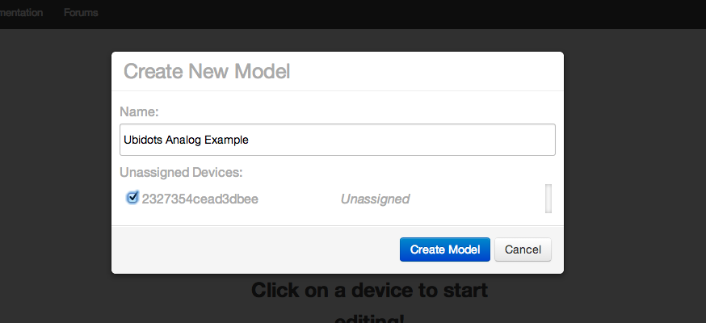
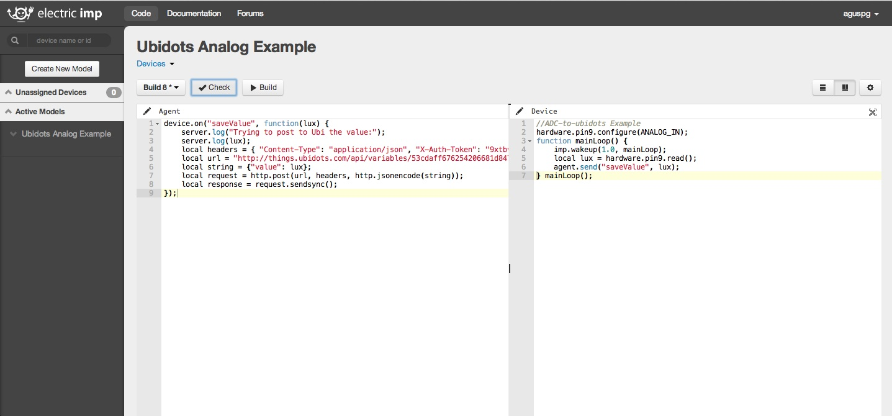
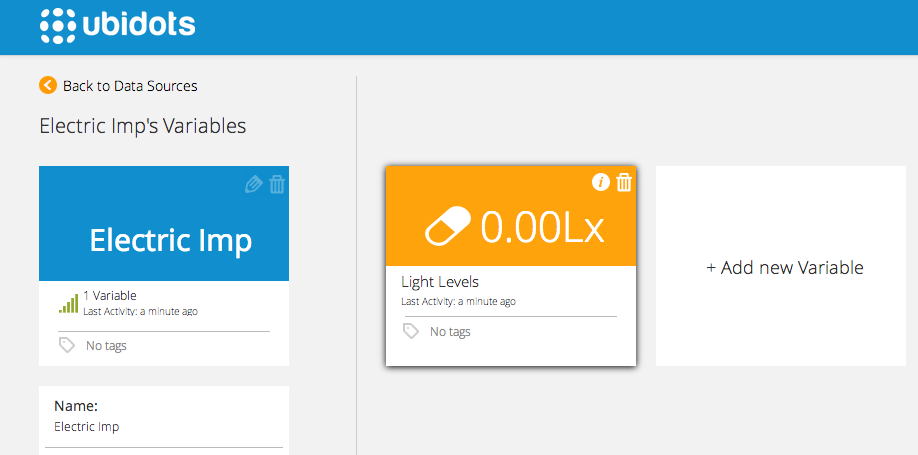

# Electric Imp

In this guide you'll learn how to read an analog input from your Electric Imp and send its value to Ubidots.

## Introduction

Electric Imp is a technology company that provides connectivity for the Internet of Things. They offer perhaps the simplest way to enable any physical object to be connected to the Internet thanks to their "Imp" module, a powerful piece of hardware containing WiFi and a processor. 

# Components

To complete this tutorial, you'll need:

* [An Imp card](https://www.sparkfun.com/products/11395):
    
    
* [An Electric Imp Breakout Board](https://www.sparkfun.com/products/11400)
    
    
* A photo-cell
    
    
* A 1k resistor
    
    
* A small breadboard

## Setting up the Electric Imp

The best way to become familiar with the Imp is to follow their Blinkup guide, which helps you link your device to your Electric Imp account:

* [Blinkup Tutorial](https://electricimp.com/docs/gettingstarted/1-blinkup/)

    The most important thing to know is that the Electric Imp IDE is divided in three main windows: agent code, device code, and the log.

* Agent code window: This code is run in the Imp cloud, not in your device. It allows you to do heavy processing, HTTP requests, store small amounts of data, etc.

* Device code window: As the name suggests, this code WILL be run in your device. Here's where you typically manage input/ouput pins that connect the Imp to the real world.

* Log window: Very useful to understand what's going on, both in the Agent and in the Device code.


## Hardware Setup

The physical setup can be done in 2 simple steps:

1. Connect one end of the photocell to "PIN9" of your Imp, and the other end to "3V3" 
2. Connect one end of the 1k resistor to "PIN9" of your Imp, and the other end to "GND"
    
    
    
## Preparing your Ubidots Account

In your Ubidots account, create a Data source called "Electric Imp" and then a variable called "Light Levels":

1. [As a logged in user](http://app.ubidots.com/accounts/signin/) navigate to the "Sources" tab.
    
    
2. Create a data source called "Electric Imp" by clicking on the orange button located in the upper right corner of the screen:
    
    
3. Click on the created Data Source and then on "Add New Variable":
    
    
4. Take note of the variable's ID to which you want to send data. We'll need it later for our Agent code:
    
    
5. Create a token under "My Profile" tab. We'll need it later for our Agent code:
    

## Coding your Imp

After going through the Blinkup tutorial and setting up your Ubidots account, you can now program the Imp to send data to Ubidots by following these steps:

1. In the Electric Imp IDE, you should see an empty workspace with one "Unassigned Device" in the left side. This means your Imp has been detected but is not yet assigned to any project:
    

2. Click on "Create New Model" and assign your device to this model:
    

3. Copy and paste these Agent and Device blocks of code:
    * Agent Code:
```javascript

    device.on("saveValue", function(lux) {
        server.log("Trying to post to Ubi the value:");
        server.log(lux);
        local headers = { "Content-Type": "application/json", "X-Auth-Token": "9xtbvHL8hFKxfkmlXUW3qNoUpOEZAtp0qkkwPqffbn6DiR3ElRJ4BZMs" }; // Replace the token with yours
        local url = "http://things.ubidots.com/api/v1.6/variables/53cdaff676254206681d847c/values"; // Replace the Variable ID with yours
        local string = {"value": lux};
        local request = http.post(url, headers, http.jsonencode(string));
        local response = request.sendsync(); 
    });
````
    Please note that you should replace your TOKEN and VARIABLE_ID with the ones from your Ubidots account.

* Device Code:
```c

    //ADC-to-ubidots Example 
    hardware.pin9.configure(ANALOG_IN);
    function mainLoop() {
    	imp.wakeup(1.0, mainLoop);
    	local lux = hardware.pin9.read();
    	agent.send("saveValue", lux);
	} mainLoop();
```
    Here's how it would look like after putting your code:
    
    
4. Finally, Build and Run the code; you should start seeing the Light Levels data in your Ubidots account!
    
    

## Wrapping it up

In this guide we learned how to read an analog input from your Imp and send its value to Ubidots. After getting familiar with it, you can modify your hardware setup to send readings from any other type of sensor attached to the Imp.

If your project requires you to read a value from the Ubidots cloud you can also do it using the same HTTP library in the Imp IDE, but instead of making a POST, you should make a GET request. Here's the method from Imp's documentation page: http://electricimp.com/docs/api/http/get/

Once your data is in Ubidots, it's quite simple to send Emails or SMS alerts, setup real-time dashboards to keep an eye on your data, or even control things remotely by creating a "Switch" widget in your dashboard.


## More projects...

Check out other cool projects using Ubidots:

* [Sending motion sensor data to the cloud with a Raspberry Pi](http://blog.ubidots.com/building-a-people-counter-with-raspberry-pi-and-ubidots)
* :ref:`Measuring your Internet connection with an OpenWrt router <examples/lua_openwrt>`