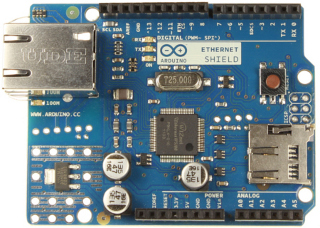
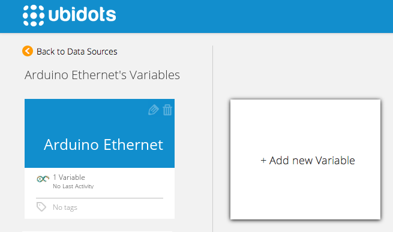
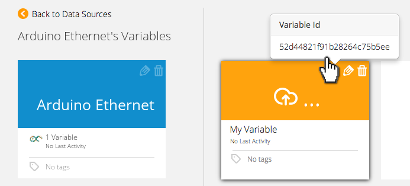

# Arduino Ethernet Shield

The Arduino Ethernet Shield allows an Arduino board to connect to the Internet. It is based on the [Wiznet W5100 ethernet chip](https://www.sparkfun.com/products/9026). The Wiznet W5100 provides a network (IP) stack capable of both TCP and UDP. It supports up to four simultaneous socket connections. 

## Components


* [An Arduino UNO ](http://arduino.cc/en/Main/arduinoBoardUno):
	

* [An Arduino Ethernet Shield W5100 ](http://arduino.cc/en/pmwiki.php?n=Main/ArduinoEthernetShield):
	
    
## Preparing your Ubidots Account

In your Ubidots account, create a Data source called "Arduino Ethernet" and then a variable called "My Variable":

1. As a [logged in user](http://app.ubidots.com/accounts/signin/) navigate to the "Sources" tab.
	
2. Create a data source called "Arduino Ethernet" by clicking on the orange button located in the upper right corner of the screen:
	

3. Click on the created Data Source and then on "Add New Variable":
	

4. Take note of the variable's ID to which you want to send data. We'll need it later to include in our code: 
	
5. Create a token under "My Profile" tab. We'll need it later for our code:
	

## Coding your Arduino


The following sketch is an example to use the Arduino Ethernet Shield to send a value from the analog input A0 to Ubidots:

```c++
   

     /*
	 Web client
	 
	 This sketch connects to a website using an Arduino Wiznet Ethernet shield. 
	 
	 Circuit:
	 * Ethernet shield attached to pins 10, 11, 12, 13
	 
	 created 18 Dec 2009
	 modified 9 Apr 2012
	 by David A. Mellis
	 modified 15 Jan 2015
	 by Mateo Velez for Ubidots, Inc.
	 
	 */

	#include <SPI.h>
	#include <Ethernet.h>

	// Enter a MAC address for your controller below.
	// Newer Ethernet shields have a MAC address printed on a sticker on the shield
	byte mac[] = {  0xDE, 0xAD, 0xBE, 0xEF, 0xFE, 0xED };  


	// Initialize the Ethernet client library
	// with the IP address and port of the server 
	// that you want to connect to (port 80 is default for HTTP):
	EthernetClient client;

	String idvariable = "YourIDVariable";
	String token = "Yourtoken";


	void setup() {
	 // Open serial communications and wait for port to open:
	  Serial.begin(9600);
	  while (!Serial) {
	    ; // wait for serial port to connect. Needed for Leonardo only
	  }

	  // start the Ethernet connection:
	  if (Ethernet.begin(mac) == 0) {
	    Serial.println("Failed to configure Ethernet using DHCP");
	    // no point in carrying on, so do nothing forevermore:
	    for(;;);
	  }
	  // give the Ethernet shield a second to initialize:
	  delay(1000);
	  Serial.println("connecting...");
	}

	void loop()
	{
	  int value = analogRead(A0);
	  save_value(String(value));  
	}

	void save_value(String value)
	{
	  // if you get a connection, report back via serial:
	  int num=0;
	  String var = "{\"value\":"+ String(value) + "}";
	  num = var.length();
	  delay(2000);
	  if(client.connect("things.ubidots.com", 80)) 
	  {
	    Serial.println("connected");
	 
	    // New lines according to ubidots support:
	  
	    client.println("POST /api/v1.6/variables/"+idvariable+"/values HTTP/1.1");
	    Serial.println("POST /api/v1.6/variables/"+idvariable+"/values HTTP/1.1");
	    client.println("Content-Type: application/json");
	    Serial.println("Content-Type: application/json");
	    client.println("Content-Length: "+String(num));
	    Serial.println("Content-Length: "+String(num));
	    client.println("X-Auth-Token: "+token);
	    Serial.println("X-Auth-Token: "+token);
	    client.println("Host: things.ubidots.com\n");
	    Serial.println("Host: things.ubidots.com\n");
	    client.print(var);
	    Serial.print(var+"\n");
	  }
	  else 
	  {
	    // if you didn't get a connection to the server:
	    Serial.println("connection failed");
	  }
	 
	  if (!client.connected()) 
	  {
	    Serial.println();
	    Serial.println("disconnecting.");
	    client.stop();
	  }
	 
	  if (client.available()) 
	  {
	    char c = client.read();
	    Serial.print(c);
	  }
	  client.flush();
	  client.stop();
	  
	}

```

## Wrapping up

In this guide we learned how to post a value to Ubidots using an Arduino Ethernet Shield. After getting familiar with it, you can modify your hardware setup and firmware to send readings from any other type of devices/sensors attached to the Arduino Board.

Now that your sensor data is in Ubidots, it's quite simple to create Emails or SMS alerts, setup real-time dashboards to watch your data, or even control things remotely by creating a "Switch" widget in your dashboard and reading it through GET requests from your board.


## More projects...

Check out other cool projects using Ubidots:
 

* [Adafruit FONA MiniGSM](http://ubidots.com/docs/devices/FONA.html#devices-fona)
* [Arduino-GPRS](http://ubidots.com/docs/devices/gprs.html#devices-arduino-gprs)

