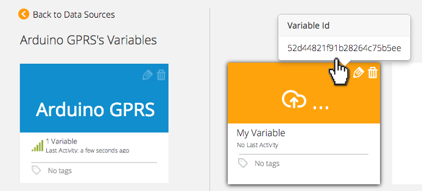
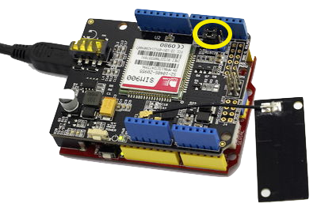

# Arduino-GPRS

Ubidots-Arduino-GPRS provides an example of sending data to Ubidots from the Arduino GPRS shield, which uses the SIM900 modem from SimCom.

The GPRS Shield is compatible with all boards which have the same form factor (and pinout) as a standard Arduino Board. The GPRS Shield is configured and controlled via its UART using simple AT commands. Based on the SIM900 module from SIMCOM, the GPRS Shield is like a cell phone. Besides the communications features, the GPRS Shield has 12 GPIOs, 2 PWMs and an ADC.

## What you'll need:

* [Arduino uno](http://arduino.cc/en/Main/ArduinoBoardUno)
  
  
* [A GPRS shield SIM900](http://www.seeedstudio.com/depot/GPRS-Shield-V20-p-1379.html)
  
  
## Preparing your Ubidots Account

In your Ubidots account, create a Data source called "Arduino GPRS" and then a variable called "My Variable":

1. [As a logged in user](http://app.ubidots.com/accounts/signin/) navigate to the "Sources" tab.
  
  
2. Create a data source called "Arduino GPRS" by clicking on the orange button located in the upper right corner of the screen:
  
   
3. Click on the created Data Source and then on "Add New Variable":
  
    
4. Take note of the variable's ID to which you want to send data. We'll need it later to include in our code:
  
    
5. Create a token under "My Profile" tab. We'll need it later for our code:
  
    
## Send data to Ubidots

Here's a quick example of how to post an analogue value to Ubidots. Please note that we use pins 7 and 8 for serial communication between the MCU and the GPRS module:


    
After making sure you've set the right jumpers, flash this code using the Arduino IDE. Please remember to set the right token and variable IDs according to your Ubidots account:

```c++

        /*
         Basic sketch for GPRS shield sim900
         
         This is a basic example to post a value on Ubidots with a simple
         function "save_value".
         
         You'll need:
         * An Arduino Uno
         * A GPRS shield
         
         created 20 Aug. 2014
         by Mateo Velez - Metavix - for Ubidots Inc.
         
         This example code is in the public domain.
 
        */
 
        //--------------------------------------------------------------
        //------------------------------Libraries-----------------------
        //--------------------------------------------------------------
        #include <SoftwareSerial.h>
        #include <String.h> 
        SoftwareSerial mySerial(7, 8);                                                      //your pins to serial communication
        int value; 
        //-------------------------------------------------------------
        //---------------------Ubidots Configuration-------------------
        //-------------------------------------------------------------
        String token = "YOUR-TOKEN";                                                        //your token to post values
        String idvariable = "YOUR-VARIABLE-ID";                                             //ID of your variable
        void setup()
        {
          
          mySerial.begin(19200);                                                            //the GPRS baud rate   
          Serial.begin(19200);                                                              //the serial communication baud rate   
          delay(10000);
        }
         
        void loop()
        {
            int value = analogRead(A0);                                                     //read pin A0 from your arduino
            save_value(String(value));                                                      //call the save_value function
            if (mySerial.available())
            Serial.write(mySerial.read());
        }
        //this function is to send the sensor data to Ubidots, you should see the new value in Ubidots after executing this function
        void save_value(String value)
        {
          int num;
          String le;
          String var;
          var = "{\"value\":"+ value + "}";
          num = var.length();
          le = String(num);  
          for(int i = 0;i<7;i++)
          {
            mySerial.println("AT+CGATT?");                                                   //this is made repeatedly because it is unstable
            delay(2000);
            ShowSerialData();
          } 
          mySerial.println("AT+CSTT=\"web.vmc.net.co\"");                                    //replace with your providers' APN
          delay(1000); 
          ShowSerialData(); 
          mySerial.println("AT+CIICR");                                                      //bring up wireless connection
          delay(3000); 
          ShowSerialData(); 
          mySerial.println("AT+CIFSR");                                                      //get local IP adress
          delay(2000); 
          ShowSerialData(); 
          mySerial.println("AT+CIPSPRT=0");
          delay(3000); 
          ShowSerialData(); 
          mySerial.println("AT+CIPSTART=\"tcp\",\"things.ubidots.com\",\"80\"");             //start up the connection
          delay(3000); 
          ShowSerialData(); 
          mySerial.println("AT+CIPSEND");                                                    //begin send data to remote server
          delay(3000);
          ShowSerialData();
          mySerial.print("POST /api/v1.6/variables/"+idvariable);
          delay(100);
          ShowSerialData();
          mySerial.println("/values HTTP/1.1");
          delay(100);
          ShowSerialData();
          mySerial.println("Content-Type: application/json");
          delay(100);
          ShowSerialData();
          mySerial.println("Content-Length: "+le);
          delay(100);
          ShowSerialData();
          mySerial.print("X-Auth-Token: ");
          delay(100);
          ShowSerialData();
          mySerial.println(token);
          delay(100);
          ShowSerialData();
          mySerial.println("Host: things.ubidots.com");
          delay(100);
          ShowSerialData();
          mySerial.println();
          delay(100);
          ShowSerialData();
          mySerial.println(var);
          delay(100);
          ShowSerialData();
          mySerial.println();
          delay(100);
          ShowSerialData();
          mySerial.println((char)26);
          delay(7000);
          mySerial.println(); 
          ShowSerialData(); 
          mySerial.println("AT+CIPCLOSE");                                                //close the communication
          delay(1000);
          ShowSerialData();
        }

        void ShowSerialData()
        {
          while(mySerial.available()!=0)  
          Serial.write(mySerial.read());   
        }
```

## Explanation of the functions 

### save_value()

```c+++

    boolean = ubiclient.save_value(value)
```

|Type|Argument|Description|
|:----:|:----:|:----:|
|String|value|The value you wish to send to Ubidots|

Saves a value to Ubidots. Returns true upon success. Returns false upon error.
 

## Wrapping it up

In this guide we learned how to read an analog input from the GPRS SIM 900 and send this value to Ubidots. After getting familiar with it, you can modify your hardware setup to send readings from any other type of sensors attached to it.


## More projects...


Check out other cool projects using Ubidots:
 
* :ref:`devices/fona`
* :ref:`devices/arduino-wiznet`
* :ref:`devices/dragino`
