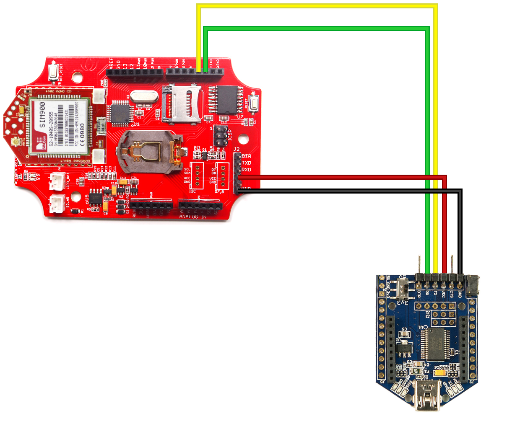
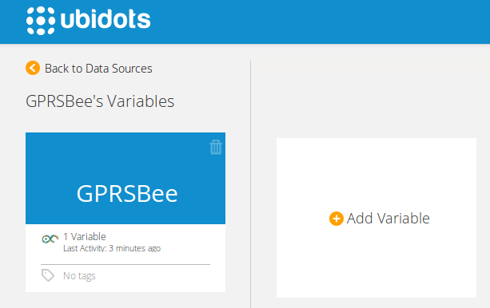
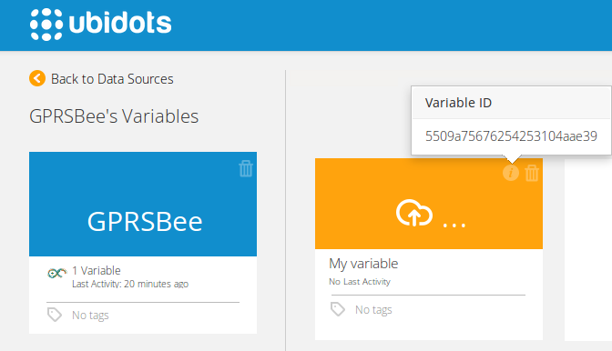
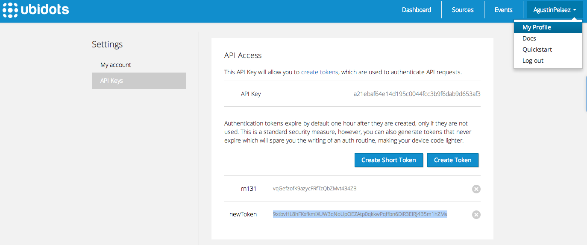

# GPRSBee

In this tutorial we'll explain how to send a value to Ubidots with the GPRSBee device.

## Introduction

The GPRSBee is a cellular module for your connected project. It has the XBee form factor, so any electronic project with an XBee socket should be compatible with the GPRSBee.

## Components

* [GPRSBee](http://www.seeedstudio.com/depot/GPRSbee-rev-4-SMA-p-1778.html):
	
    
* A micro-controller board to manage and monitoring the GPRSBee through an UART interface. We’ll use a Seeeduino Stalker kit v2.3 in this case. We did some configurations for connect the UART-Bee programmer for this board, and the connection pins are the following:

  	* Put GPRSBee in the Bee socket
  	* GND ----> GND
  	* VCC ----> VCC
  	* RX  ----> pin 2
  	* TX  ----> pin 3
	
    
**NOTE**: The wiring of pins 2 and 3 is used for serial communication and debugging purposes. To program the Seeeduino Stalker you'll need to unplug these pins and use the UartsBee as usual.

 
## Preparing your Ubidots Account

Create a Data source called "GPRSBee" and then a variable called "My Variable":

1. [As a logged in user](http://app.ubidots.com/accounts/signin/) navigate to the "Sources" tab.
	
    
2. Create a data source called "GPRSBee" by clicking on the orange button located in the upper right corner of the screen:
	

3. Click on the created Data Source and then on "Add New Variable":
	
    
4. Take note of the variable's ID to which you want to send data. We'll need it later to include in our code:
	
    
5. Create a token under "My Profile" tab. We'll need it later for our code:
	
    
## Coding

Here's the code for your Arduino IDE:

```c++

	/*
	  
	  GPRSBee Seeeduino
	  
	  Circuit:
	  
	  Pin GND:   GND of UARTSBee
	  Pin 2:     RX of UARTSBee
	  Pin 3:     TX of UARTSBee
	  Pin USB5v: VCC of UARTSBee
	  
	  GPRSBee into the Bee Socket of the Seeeduino
	  LiPo Battery connected to the GPRSBee
	  
	  NOTE: Make sure to turn on the GPRSBee using its power button
	  
	  Created 13 Feb 2015
	  by Alejandro Gomez for Ubidots
	  
	  This example code is in the public domain.

	*/  


	#include <SoftwareSerial.h>

	//SoftwareSerial for Serial Monitor output
	#define PIN_RX 2
	#define PIN_TX 3
	SoftwareSerial monitorSerial = SoftwareSerial(PIN_TX, PIN_RX);

	String inputString = "";
	char input[512];
	boolean stringComplete = false;

	//Ubidots Information
	char ubidotstoken[] = "kA8XWNQRHFrXVQakaJVY3Zg2qRU1lq";      //your token here
	char idvariable1[] = "54b729ef76254277eae7d20b";             //ID of your variable

	void setup(){
	  //Configure the baud rate for each Serial port
	  monitorSerial.begin(9600);
	  Serial.begin(4800);
	  delay(2000);
	}

	void loop(){
	  configGPRS();
	  send2Ubidots(888, idvariable1);
	  delay(4000);
	  checkResponse(10000);
	  delay(60000);
	}

	void configGPRS(){
	  //the AT Command needed to configure the GPRS to send data
	  while(!SendATCommand("AT", "OK"));
	  while(!SendATCommand("AT+CGATT=1", "OK"));
	  SendATCommand("AT+CSTT=\"web.vmc.net.co\"", "OK");
	  SendATCommand("AT+CIICR", "OK");
	  SendATCommand("AT+CIFSR");
	  while(!SendATCommand("AT+CIPSTART=\"tcp\",\"things.ubidots.com\",\"80\"", "CONNECT OK"));
	}

	void send2Ubidots(int value, char* id){
	  //Send one value to ubidots
	  SendATCommand("AT+CIPSEND");
	  
	  char url1[] = "POST /api/v1.6/variables/";
	  char* url2 = id;
	  char url3[] = "/values HTTP/1.1\n";
	  int lurl = strlen(url1) + strlen(url2) + strlen(url3);
	  char url[lurl];
	  sprintf(url,"%s%s%s",url1,url2,url3);
	  
	  Serial.print(url);
	  delay(100);
	  checkResponse(100);
	  
	  Serial.print("X-Auth-Token: ");
	  delay(100);
	  checkResponse(100);
	  
	  Serial.print(ubidotstoken);
	  delay(100);
	  checkResponse(100);
	  
	  Serial.print("\n");
	  delay(100);
	  checkResponse(100);
	  
	  Serial.print("Content-Type: application/json\n");
	  delay(100);
	  checkResponse(100);
	  
	  Serial.print("Host: things.ubidots.com\n");
	  delay(100);
	  checkResponse(100);
	  
	  Serial.print("Content-Length: ");
	  delay(100);
	  checkResponse(100);
	  
	  char data1[] = "{\"value\":";
	  char data2[get_int_len(value)+1];
	  char data3[] = "}";
	  itoa(value,data2,10);
	  int ldata = strlen(data1) + strlen(data2) + strlen(data3);
	  char data[ldata];
	  sprintf(data,"%s%s%s",data1,data2,data3);
	  
	  Serial.print(ldata);
	  delay(100);
	  checkResponse(100);
	  
	  Serial.print("\n");
	  delay(100);
	  checkResponse(100);
	  
	  Serial.print("\n");
	  delay(100);
	  checkResponse(100);
	  
	  Serial.print(data);
	  delay(100);
	  checkResponse(100);
	  
	  Serial.print("\n");
	  delay(100);
	  checkResponse(100);
	  
	  Serial.print((char)26);
	  delay(100);
	  checkResponse(100);
	  
	  Serial.print("\n");
	  delay(100);
	  checkResponse(100);
	  
	  checkResponse(10000);
	}

	//This method sends an ATCommand to the GPRSbee
	void SendATCommand(char* data){
	  flushSerial();
	  monitorSerial.print("ATCommand: ");
	  monitorSerial.println(data);
	  Serial.println(data);
	  delay(2000);
	  checkResponse();
	  delay(1000);
	}

	//This method sends an ATCommand and checks for a response
	boolean SendATCommand(char* data, char* response){
	  flushSerial();
	  monitorSerial.print("ATCommand: ");
	  monitorSerial.println(data);
	  Serial.println(data);
	  delay(100);
	  return checkResponse(response);
	}

	//Check if there's a response in the internal buffer
	void checkResponse(){
	  long contador = 1;
	  while(contador < 10000){
	    while(Serial.available() > 0){
	      char inChar = (char)Serial.read();
	      inputString += inChar;
	      if (inChar == '\n') {
	        stringComplete = true;
	      } 
	    }
	    if(stringComplete) {
	      monitorSerial.println(inputString);
	      inputString = "";
	      stringComplete = false;
	    }
	    contador++;
	  }
	}

	//Check if there's a specific response in the internal buffer
	boolean checkResponse(char* data){
	  long contador = 1;
	  int cont = 0;
	  while(contador < 100000){
	    while(Serial.available() > 0){
	      char inChar = (char)Serial.read();
	      if ((inChar == '\n')) {
	        stringComplete = true;
	        break;
	      }else{
	      input[cont] = inChar;
	      cont++;
	      }
	    }
	    if(stringComplete) {
	      //monitorSerial.print(input);
	      //monitorSerial.print(" Compared with ");
	      //monitorSerial.println(data);
	      //int a = strcmp(input, data);
	      if(strncmp(input, data, strlen(data)) == 0){
	        resetInput();
	        cont = 0;
	        stringComplete = false;
	        return true;
	      }
	      
	      resetInput();
	      cont = 0;
	      stringComplete = false;
	    }
	    contador++;
	  }
	  return false;
	}

	//Check if there's a response in the internal buffer with a specific timeout
	void checkResponse(long timeout){
	  long contador = 1;
	  while(contador < timeout){
	    while(Serial.available() > 0){
	      char inChar = (char)Serial.read();
	      inputString += inChar;
	      if (inChar == '\n') {
	        stringComplete = true;
	      } 
	    }
	    if(stringComplete) {
	      monitorSerial.println(inputString);
	      inputString = "";
	      stringComplete = false;
	    }
	    contador++;
	  }
	}

	//flush the serial input
	void flushSerial() {
	    while (Serial.available()) 
	    Serial.read();
	}

	//reset the temporal buffer to read data
	void resetInput(){
	  for(int i=0; i<255; i++){
	    input[i]=0;
	  }
	}

	//used to count the number of chars in a value
	long get_int_len (long value){
	  int l=1;
	  while(value>9){ l++; value/=10; }
	  return l;
	}
```

## Notes

While developing this project we noticed some important aspects about the GPRSbee:

* Avoid the use of string operators
* If you want to send serial commands to the GPRSbee, do not use the println() expression; better use "print" together with the "newline character". We recommend you to check [this link about string management and serial communication](http://www.magdasanchez.es/2011/12/arduino-0022-problems-coming-from-string-and-serial-libraries/).


## Wrapping it up

In this guide we learned how to read an analog input from the Seeduino Stalker Kit v2.3 and send this value through the GPRSBee to Ubidots. After getting familiar with it, you can modify your hardware setup to send readings from any other type of Arduino or sensors.

## More projects...

Check out other cool projects using Ubidots:
 
* :ref:`devices/arduino-gprs`
* :ref:`devices/arduino-wiznet`
* :ref:`devices/dragino`
