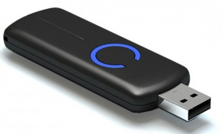
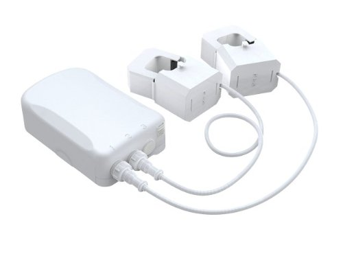
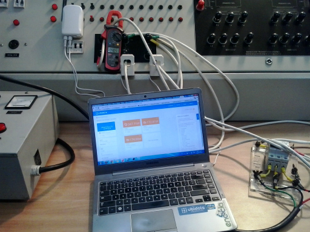
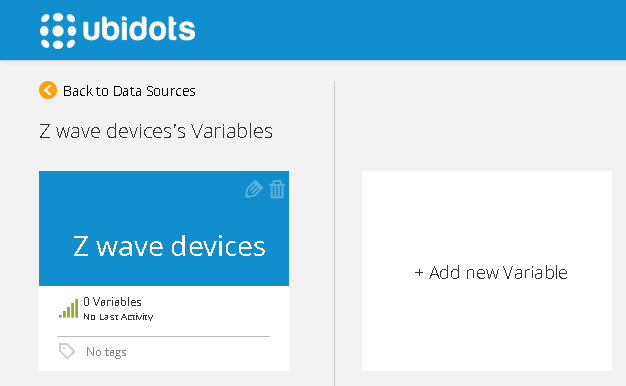
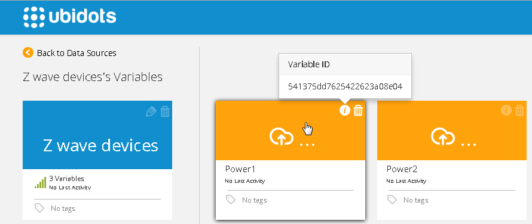
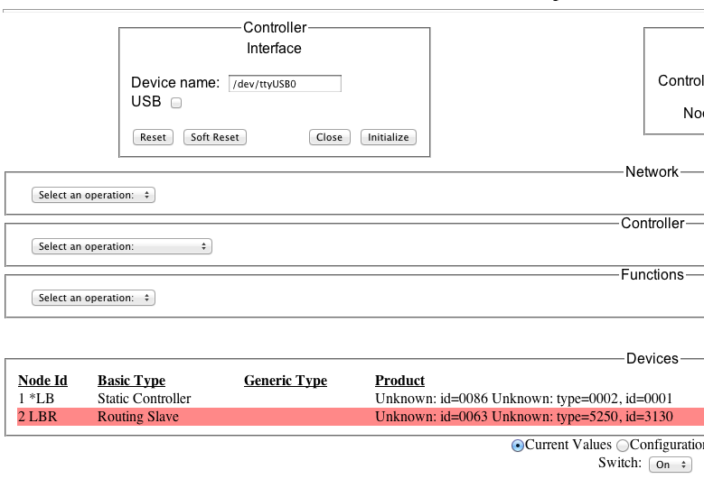
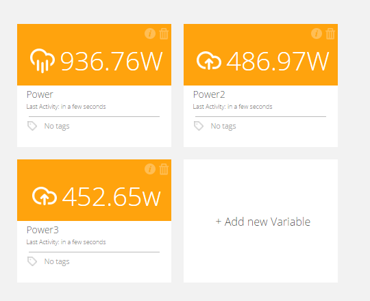

## Z-Wave Home Energy Meter (HEM) 

In this guide you'll learn how to send your data to Ubidots from your Raspberry Pi linked to a Z-wave HEM.

## Introduction

Z-Wave is a wireless protocol designed for domotics. One of these devices compatible with  Z-wave is the Home Energy Meter from Aeotec, with this we can measure the power wasted in our homes. 

## Components

To complete this tutorial, you'll need:

* [A Controller Z Wave](http://www.zwaveproducts.com/Zwave-Controllers/Zwave-Software-Controllers/Aeon-Labs-DSA02203-ZWUS-Z-Wave-USB-Z-Stick-Controller.html)
    
    
* [A Raspberry Pi Model B](http://www.adafruit.com/products/998)
    
    
* [A Aeon Labs Home Energy Meter](http://www.zwaveproducts.com/Zwave-Climate-Control/Zwave-Thermostats/Aeon-Labs-DSB09104-ZWUS-Z-Wave-Smart-Energy-Meter.html)>`_
   
   
## Hardware Setup

We need to pair the Home Energy Meter into a Z-Wave network, this setup can be done in 2 simple steps:

1. Press the button on the Aeon Labs Z-Stick. 

2. In your Home Energy Meter press the button located under the battery cover.
    After these steps plug the Z-Wave stick into your Rpi.
    Finally this is how looks the HEM connected to a 3-phase source.
    
    
## Preparing your Ubidots Account

In your Ubidots account, create a Data source called "Z wave devices" and then a set of variables called "Power1","Power2","Power3":

1. [As a logged in user](http://app.ubidots.com/accounts/signin/) navigate to the "Sources" tab.
    
    

2. Create a data source called "Z wave devices" by clicking on the orange button located in the upper right corner of the screen:
    

3. Click on the created Data Source and then on "Add New Variable":
    

4. Take note of the variable's ID to which you want to send data. We'll need it later:
    
    
5. Create a token under "My Profile" tab. We'll need it later for our Agent code:
    
    
## Setting up the Raspberry Pi

1. First of all we need to [download an IMG file for the raspberry pi](https://s3.amazonaws.com/ubi-static/img.imgc).

2. With the Z-Wave Stick attached to it, power up your RPi.

3. If everything is ok you will see the next instructions after login.

4. Put your own internet credentials.
```bash

      sudo nano /etc/network/interfaces
```
5. Add your Ubidots token and ids
```bash
      
      cd openzwave-control-panel
      
      sudo nano cp.js
```
6. Replace in cp.js  your Ubidots token and variables id.

7. Now move to Openzwave Control Panel:
```bash

      cd ~/openzwave-control-panel
```
8. Run the local server to push data to ubidots
```bash

      ./ozwcp -p 55555
```
9. Now you should be able to go to your favorite  browser and see the control
panel running on "http://Your Raspberry Pi IP:55555".

10. In your browser click on the button initialize and then you will see the Zwave network devices, finally click on Routing Slave.
    
    
11. Now we can see the recent values in Ubidots.
    
    
## Wrapping it up

In this guide we learned how to setup your Z-wave energy meter with  a Rpi,  but  with a few skills on javascript you can get another Z-wave devices connected to the cloud.

Once your data is in Ubidots, it's quite simple to send Emails or SMS alerts, setup real-time dashboards to keep an eye on your data, or even control things remotely by creating a "Switch" widget in your dashboard.


## More projects...

Check out other cool projects using Ubidots:

* [Logging temperature and humidity data with Spark Core and Ubidots](http://blog.ubidots.com/measure-temperature-and-humidity-with-your-spark-core)
* [Turn a fan on when the temperature is too high_Electric Imp Tutorial](http://blog.ubidots.com/electric-imp-temperature-monitor-control)