# Devices

This section contains firmware examples and tutorials to connect your device to Ubidots.

## Arduino Modules

|||||
|:---:|:---:|:---:|:---:|
|Wi-Fi Shield [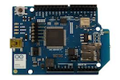](../devices/arduino-wifi.html)  |GPRS Shield [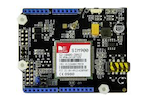](../devices/gprs.html)   |GSM Shield [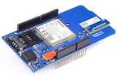](../devices/GSMTelefonica.html)    |Yún [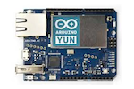](../devices/ArduinoYUN.html)|
|WizFi Shield |Dragino [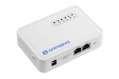](../devices/Dragino.html)|Ethernet Shield [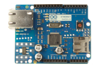](../devices/ethernet.html)|CC3000 Wi-Fi [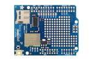](../devices/coming-soon.html)|

## Adafruit

|||||
|:---:|:---:|:---:|:---:|
|FONA [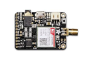](../devices/FONA.html)|CC3000 Wi-Fi |||

## Particle

|||||
|:---:|:---:|:---:|:---:|
|Photon [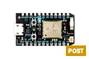](../devices/particle.html)||||                                      

## Intel

|||||
|:---:|:---:|:---:|:---:|
|Edison [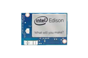](../devices/coming-soon.html)||||                                      

## Embedded Linux

|||||
|:---:|:---:|:---:|:---:|
|Raspberry Pi [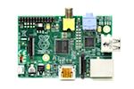](../devices/raspberrypi.html)|BeagleBone [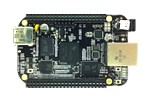](../devices/coming-soon.html)|OpenWRT [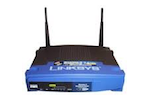](../devices/coming-soon.html)|ThingBox.io |

## Mediatek Labs

|||||
|:---:|:---:|:---:|:---:|
|Linkit One GPRS [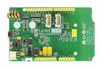](../devices/linkitone.html)|Linkit One Wi-Fi |Linkit Smart 7688 [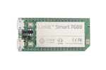](../devices/coming-soon.html)||

## ESP8266

|||||
|:---:|:---:|:---:|:---:|
|As Wi-Fi Module [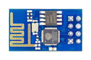](../devices/ESP8266-arduino.html)|Stand-alone [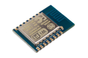](../devices/ESP8266.html)|||

## Electric Imp

|||||
|:---:|:---:|:---:|:---:|
|Imp 001 [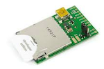](../devices/electricimp.html)||||

## Microchip

|||||
|:---:|:---:|:---:|:---:|
|WCM Wi-Fi [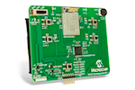](../devices/microchipWCMKit.html)|chipKIT Uno32[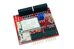](../devices/chipKITUno32.html)|chipKIT WiFire[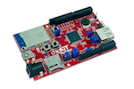](../devices/chipKitWiFire.html)||

## Other Modules

|||||
|:---:|:---:|:---:|:---:|:---:|
|Tessel [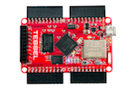](../devices/Tessel.html)|Sparkfun CC3000[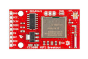](../devices/cc3000.html)|GPRS Bee[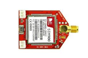](../devices/gprsbee.html)|DF Robot WiDo[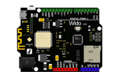](../devices/wido.html)|
 
<aside class="success">
If your device is not in this list, it doesn’t mean it can’t talk to our API. Most Internet-enabled devices will be able to stream data to
Ubidots, as long as they support the HTTP protocol. If you’d like to see a specific device listed, shoot us an Email to **devices@ubidots.com**.
</aside>
