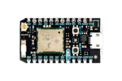
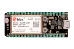

# Devices

This section contains firmware examples and tutorials to connect your device to Ubidots.

## Arduino Modules

|||||
|:---:|:---:|:---:|:---:|
|Wi-Fi Shield   |GPRS Shield    |GSM Shield     |Yún |
|WizFi Shield |Dragino |Ethernet Shield |CC3000 Wi-Fi |

## Particle

|||||
|:---:|:---:|:---:|:---:|
|Photon |Electron |||                                 

## Microchip

|||||
|:---:|:---:|:---:|:---:|
|WCM Wi-Fi <a href="../devices/microchipWCMKit.html">|chipKIT Uno32 <a href="../devices/chipKITUno32.html">|chipKIT WiFire <a href="../devices/chipKitWiFire.html">| |     

## Adafruit

|||||
|:---:|:---:|:---:|:---:|
|FONA |CC3000 Wi-Fi |||

## Intel

|||||
|:---:|:---:|:---:|:---:|
|Edison <a href="../devices/coming-soon.html">||||                                      

## Embedded Linux

|||||
|:---:|:---:|:---:|:---:|
|Raspberry Pi |BeagleBone |OpenWRT |ThingBox.io |

## Mediatek Labs

|||||
|:---:|:---:|:---:|:---:|
|Linkit One GPRS <a href="../devices/linkitone.html">|Linkit One Wi-Fi <a href="../devices/coming-soon.html">|Linkit Smart 7688 <a href="../devices/coming-soon.html">||

## ESP8266

|||||
|:---:|:---:|:---:|:---:|
|As Wi-Fi Module <a href="../devices/ESP8266-arduino.html">|Stand-alone <a href="../devices/ESP8266.html">|||

## Electric Imp

|||||
|:---:|:---:|:---:|:---:|
|Imp 001 <a href="../devices/electricimp.html">||||

## Other Modules

|||||
|:---:|:---:|:---:|:---:|:---:|
|Tessel |SparkfunCC3000 |GPRS Bee |DF Robot WiDo |
 
<aside class="success">
If your device is not in this list, it doesn’t mean it can’t talk to our API. Most Internet-enabled devices will be able to stream data to
Ubidots, as long as they support the HTTP protocol. If you’d like to see a specific device listed, shoot us an Email to **devices@ubidots.com**.
</aside>
