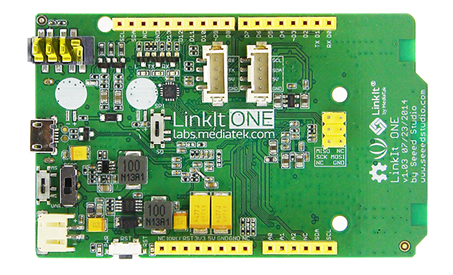
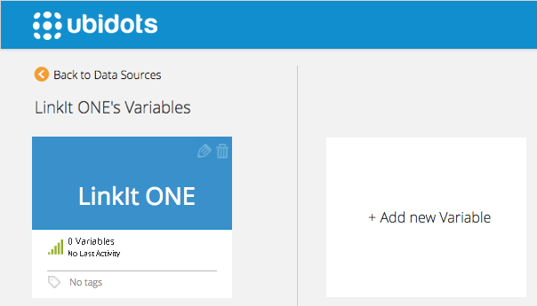
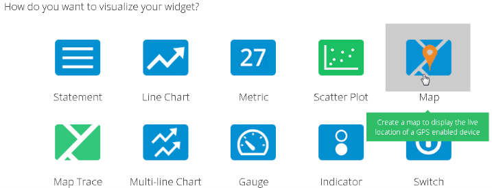
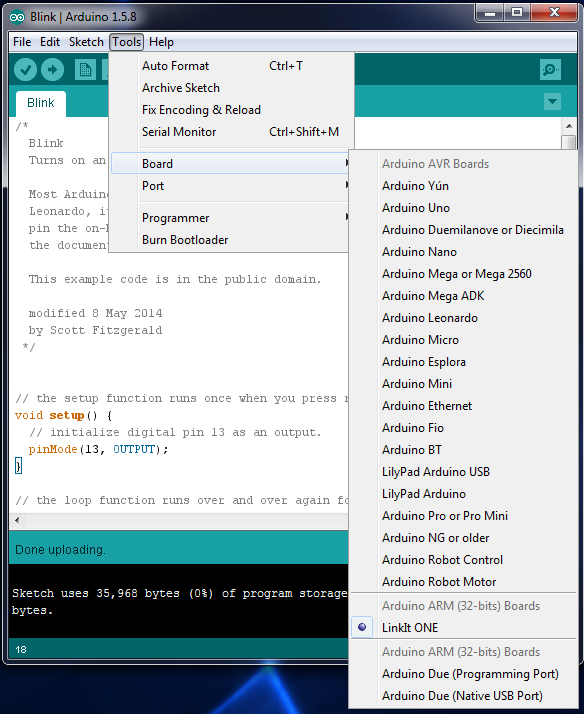
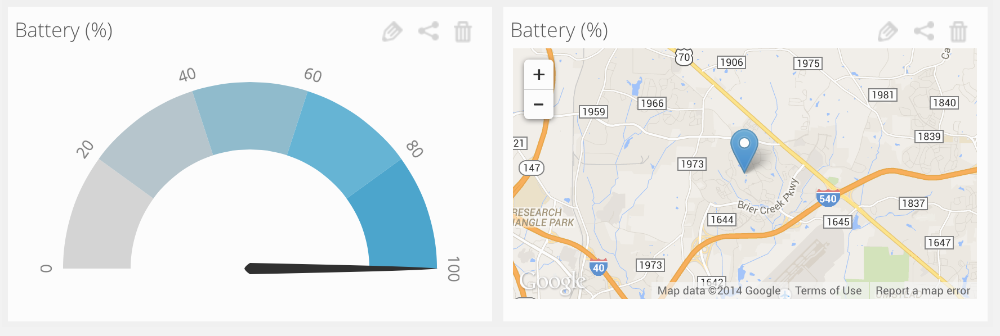

# LinkIt ONE Tutorial


In this guide we'll learn how to send the battery level and the GPS coordinates of a LinkIt ONE to Ubidots. This tutorial is based on the article [Air Quality Sensor Project by Charles McClelland](http://triembed.org/blog/?page_id=736). We thank him for his valuable contributions.

## Introduction

The LinkIt ONE development board is an open source board for prototyping IoT projects. We really liked the fact that it already includes built-in connectivity like GSM, GPRS, Wi-Fi, Bluetooth and GPS!

## Components

To complete this tutorial all you need is the LinkIt ONE board:

* [A LinkIt ONE](http://www.seeedstudio.com/depot/LinkIt-ONEBackorder-p-2017.html):
  
  
## Preparing your Ubidots Account

In your Ubidots account, create a Data source called "LinkIt ONE" and then a variable called "Battery Level":

1. [As a logged in user](http://app.ubidots.com/accounts/signin/) navigate to the "Sources" tab.
  
  
2. Create a data source called "LinkIt ONE" by clicking on the orange button located in the upper right corner of the screen:
  
  
3. Click on the created Data Source and then on "Add New Variable":
  
  
4. Take note of the variable's ID to which you want to send data. We'll need it later for our code:
  
    
5. Create a token under "My Profile" tab. We'll need it later for our code:
  
  
6. Now we need to create a new map widget. Go to the Dashboard tab again and click on add New Widget.
  
  
7. Choose Map and "LinkIt ONE" as Source and "Battery Level" as Variable.
  
    
## Coding 

After installing the LinkIt SDK (for Arduino) you need to follow these 2 steps. If you haven't installed it, then 
[check this page from the manufacturer](https://labs.mediatek.com/site/global/developer_tools/mediatek_linkit/sdk_intro/index.gsp).

1. In the Arduino IDE, select the LinkIt ONE as your Board:
  
    
2. Copy and paste the following code (Thanks again to Chip McClelland for this great sketch):
```cpp

     /* This is a simple program to connect the LinkIt ONE to my favorite Internet of Things (IOT) data streaming service - Ubitdots.
    Chip McClelland - Cellular Data Logger
    BSD license, Please keep my name in any redistribution
    Requirements: 
      - Account on Ubidots.  http://www.ubidots.com
      - Seedstudio LinkIt ONE - http://www.seeedstudio.com/wiki/LinkIt_ONE
    Please note this is just the start - uploading only a single data point.  More to come but as your project may
    diverge from mine, this may be all you need to get started.  Good luck.
    This code will be part of a larger project to build a connected Air Quality Sensor - 
      - Project documentation here: http://triembed.org/blog/?page_id=736
      - GitHub repo here: https://github.com/chipmc/AirQualitySensorProject
    Updated for v3 - added a GPS "Context" the the battery voltage so Ubidots will 
    display the location of your LinkIt ONE on a map widget.
    Enjoy! And comments welcome on the TriEmbed Blog above
    ***********************************************************************************/
    #include <LGPS.h>            // LinkIt GPS Library
    #include <LBattery.h>  // Want to be able to read the battery charge level
    #include <LGPRS.h>      //include the base GPRS library
    #include <LGPRSClient.h>  //include the ability to Post and Get information using HTTP

    // These are the variables you will want to change based on your IOT data streaming account / provider
    char action[] = "POST ";  // Edit to build your command - "GET ", "POST ", "HEAD ", "OPTIONS " - note trailing space
    char server[] = "things.ubidots.com";
    char path[] = "/api/v1.6/variables/xxxxxxxxxxxxxxxx/values";  // Edit Path to include you source key
    char token[] = "xxxxxxxxxxxxxxxxxxxx";  // Edit to insert you API Token
    int port = 80; // HTTP

    // Here are the program variables
    int num;                            // part of the length calculation
    String le;                         // length of the payload in characters
    String var;                        // This is the payload or JSON request
    unsigned long ReportingInterval = 20000;  // How often do you want to update the IOT site in milliseconds
    unsigned long LastReport = 0;      // When was the last time you reported
    const int ledPin = 13;                 // Light to blink when program terminates
    String Location = "";          // Will build the Location string here

    // Create instantiations of the GPRS and GPS functions
    LGPRSClient globalClient;  // See this support topic from Mediatek - http://labs.mediatek.com/forums/posts/list/75.page
    gpsSentenceInfoStruct info;  // instantiate

    void setup()
    {
      Serial.begin(19200);             // setup Serial port
      LGPS.powerOn();                  // Start the GPS first as it takes time to get a fix
      Serial.println("GPS Powered on, and waiting ..."); 
      Serial.println("Attach to GPRS network");   // Attach to GPRS network - need to add timeout
      while (!LGPRS.attachGPRS("internet2.voicestream.com","","")) { //attachGPRS(const char *apn, const char *username, const char *password);
        delay(500);
      } 
      LGPRSClient client;    //Client has to be initiated after GPRS is established with the correct APN settings - see above link
      globalClient = client;  // Again this is a temporary solution described in support forums
    }

    void loop(){
      if (globalClient.available()) {// if there are incoming bytes available from the server
        char c = globalClient.read();   // read them and print them:
        Serial.print(c);
      }
      if (millis() >= LastReport + ReportingInterval) {  // Section to report - will convert to a function on next rev
        String value = String(LBattery.level());
        LGPS.getData(&info);                     // Get a GPS fix
        if (ParseLocation((const char*)info.GPGGA)) {  // This is where we break out needed location information
          Serial.print("Location is: ");
          Serial.println(Location);                 // This is the format needed by Ubidots
        }
        if (Location.length()==0) {
          var="{\"value\":"+ value + "}"; //Build the JSON packet without GPS info
        }
        else {
          var="{\"value\":"+ value + ", \"context\":"+ Location + "}";  // with GPS info
        }
        num=var.length();               // How long is the payload
        le=String(num);                 //this is to calcule the length of var
        Serial.print("Connect to ");    // For the console - show you are connecting
        Serial.println(server);
        if (globalClient.connect(server, port)){  // if you get a connection, report back via serial:
          Serial.println("connected");  // Console monitoring
          Serial.print(action);                   // These commands build a JSON request for Ubidots but fairly standard
          Serial.print(path);                     // specs for this command here: http://ubidots.com/docs/api/index.html
          Serial.println(" HTTP/1.1");
          Serial.println(F("Content-Type: application/json"));
          Serial.print(F("Content-Length: "));
          Serial.println(le);
          Serial.print(F("X-Auth-Token: ")); 
          Serial.println(token);               
          Serial.print(F("Host: ")); 
          Serial.println(server);
          Serial.println();
          Serial.println(var);  // The payload defined above
          Serial.println();
          Serial.println((char)26); //This terminates the JSON SEND with a carriage return
          globalClient.print(action);                   // These commands build a JSON request for Ubidots but fairly standard
          globalClient.print(path);                     // specs for this command here: http://ubidots.com/docs/api/index.html
          globalClient.println(" HTTP/1.1");
          globalClient.println(F("Content-Type: application/json"));
          globalClient.print(F("Content-Length: "));
          globalClient.println(le);
          globalClient.print(F("X-Auth-Token: ")); 
          globalClient.println(token);               
          globalClient.print(F("Host: ")); 
          globalClient.println(server);
          globalClient.println();
          globalClient.println(var);  // The payload defined above
          globalClient.println();
          globalClient.println((char)26); //This terminates the JSON SEND with a carriage return
          LastReport = millis();
        }
      }
    }

    boolean ParseLocation(const char* GPGGAstr) 
    // Refer to http://www.gpsinformation.org/dale/nmea.htm#GGA
    // Sample data: $GPGGA,123519,4807.038,N,01131.000,E,1,08,0.9,545.4,M,46.9,M,,*47
    {
      char latarray[6];
      char longarray[6];
      int index = 0;
      Serial.println(GPGGAstr);
      Serial.print("Fix Quality: ");
      Serial.println(GPGGAstr[43]);
      if (GPGGAstr[43]=='0') {        //  This is the place in the sentence that shows Fix Quality 0 means no fix
        Serial.println("No GPS Fix");
        Location = "";           // No fix then no Location string
        return 0;
      }
      String GPSstring = String(GPGGAstr);
      for (int i=20; i<=26; i++) {         // We have to jump through some hoops here
        latarray[index] = GPGGAstr[i];     // we need to pick out the minutes from the char array
        index++;
      }
      float latdms = atof(latarray);        // and convert them to a float
      float lattitude = latdms/60;          // and convert that to decimal degrees
      String lattstring = String(lattitude);// Then put back into a string
      Location = "{\"lat\":";
      if(GPGGAstr[28] == 'S') Location = Location + "-";
      Location += GPSstring.substring(18,20) + "." + lattstring.substring(2,4);
      index = 0;
      for (int i=33; i<=38; i++) {         // And do the same thing for longitude
        longarray[index] = GPGGAstr[i];     // the good news is that the GPS data is fixed column
        index++;
      }
      float longdms = atof(longarray);        // and convert them to a float
      float longitude = longdms/60;          // and convert that to decimal degrees
      String longstring = String(longitude);// Then put back into a string
      Location += " ,\"lng\":";
      if(GPGGAstr[41] == 'W') Location = Location + "-";
      if(GPGGAstr[30] == '0') {
        Location = Location + GPSstring.substring(31,33) + "." + longstring.substring(2,4) + "}";
      }
      else {
        Location = Location + GPSstring.substring(30,33) + "." + longstring.substring(2,4) + "}";
      }
      return 1;
    }
```

## Wrapping it up


    
In this guide we learned how to read the battery level and GPS coordinates of your LinkIt ONE. Once your data is in Ubidots, it's quite simple to setup a custom dashboard like this, send Emails or SMS alerts, or extend your application using our API.


## More projects...

Check out other cool device tutorials using Ubidots:

* :ref:`Raspberry Pi<devices/raspberrypi>`
* :ref:`Electric Imp<devices/electricimp>`
* :ref:`Android<devices/android>`
* :ref:`Spark Core<devices/spark>`
* :ref:`Adafruit FONA MiniGSM<devices/fona>`
* :ref:`ESP8266 WiFi Module<devices/esp8266>`
