# Microchip WCM Development Kit 1

After doing this tutorial you’ll be able to read the potentiometer and the buttons on the WCM board, sending their values to Ubidots, as well as 
reading variables from Ubidots to control the board's LEDs from the cloud.

## Introduction

The Microchip Wi-Fi Client Module Development Kit is a demo board designed to connect to cloud based servers. It features a Microchip PIC32 and the Microchip WiFi Module MRF24WG0MA microcontroller.

## Components

* [A WiFi Client Module Development Kit](http://www.microchipdirect.com/ProductSearch.aspx?Keywords=dm182020):
    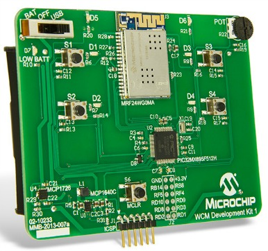

* [A PICkit 3](http://www.microchip.com/Developmenttools/ProductDetails.aspx?PartNO=PG164130):
    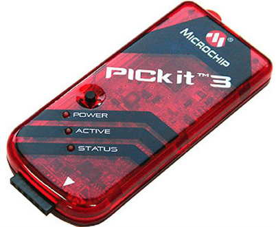
    
## Setting up the MPLAB IDE 

1. Download the [MPLABX](http://www.microchip.com/pagehandler/en-us/family/mplabx/) IDE from Microchip's website. 
2. Download the [MPLAB XC32 Compiler](http://www.microchip.com/pagehandler/en_us/devtools/mplabxc/). If you need instructions to install XC32 compiler check [this page](http://ww1.microchip.com/downloads/en/DeviceDoc/50002059F.pdf.
3. Check that you have installed all the tools. Your installation folder should look something like this:

    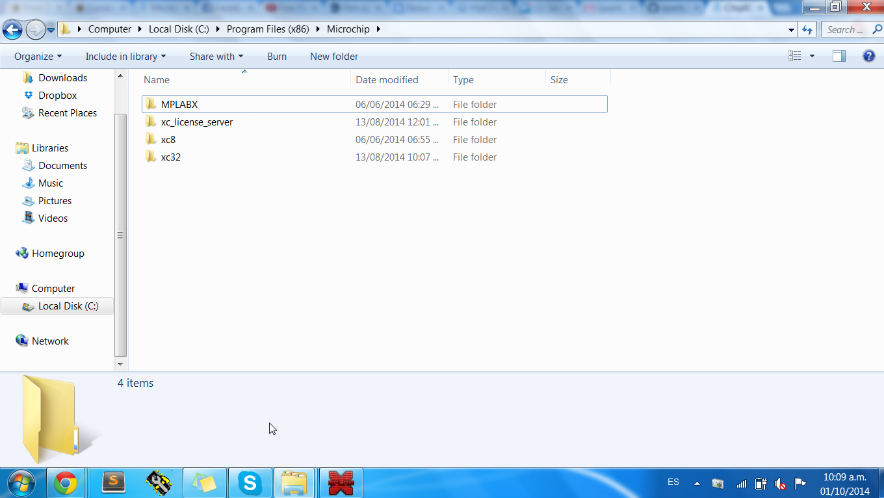
    
4. Download the [sample project for networking](http://info.ubidots.com/hs-fs/hub/329717/file-1479808735-zip/code/00.40.05_WCM_Dev_Kit_1_Beta4V6.zip) and unzip the file in a desired project directory (this code has been modified to transmit to Ubidots).
5. Start "MPLABX" and go to "File"-->"Open Project" and look for this file inside the folder you just downloaded: 

    * V00.40.05_WCM_Dev_Kit_1_Beta4V6/00.40.05_WCM_Dev_Kit_1_Beta4V6/tcpip/tcpip_wifi_wcm_dev_app/tcpip_pic32_mrf24wg_wcm_dev_app.X

## Preparing your Ubidots Account

Create a Data source called "Microchip WCM" then add Variables and widgets:

1. [As a logged in user](http://app.ubidots.com/accounts/signin/) navigate to the "Sources" tab.

    
    
2. Create a data source called "Microchip WCM" by clicking on the orange button located in the upper right corner of the screen:

    
    
3. Click on the created Data Source and then on "Add New Variable" (we need to do this step 4 times for each button, 4 times for each led and another one for the potentiometer):

    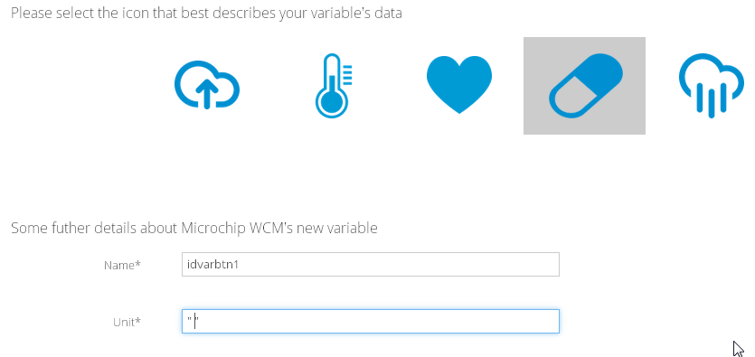
    
4. Take note of the ID for each variable. We'll need it later to include in our code:

    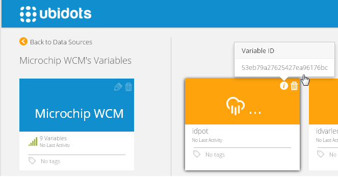
    
5. Create a token under "My Profile" tab. We'll need it later for our code:

    
    
6. Go to the Dashboard tab of Ubidots and add new "Widgets" by clicking on the orange "plus" button in the upper right.

    * First add 4 "Indicators" choose "idvarled1", "idvarled2", "idvarled3", "idvarled4" as variables.
    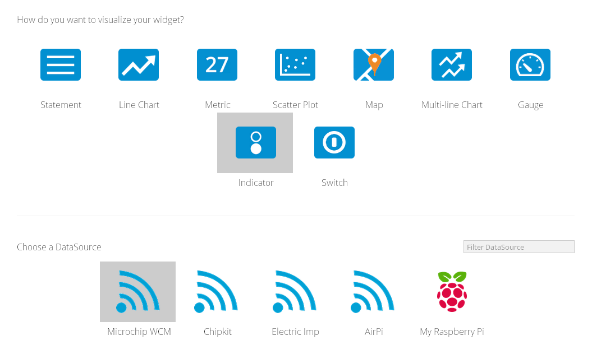
    
    * Add 4 "Switches" choose "idvarbtn1", "idvarbtn2", "idvarbtn3", "idvarbtn4" as variables.
    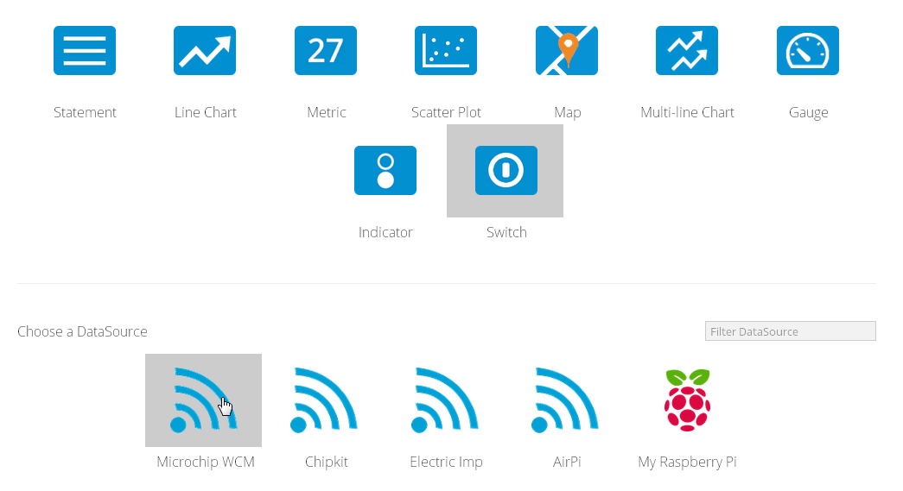
    
    * Add 1 "Gauge" choose "idpot" as variable.
    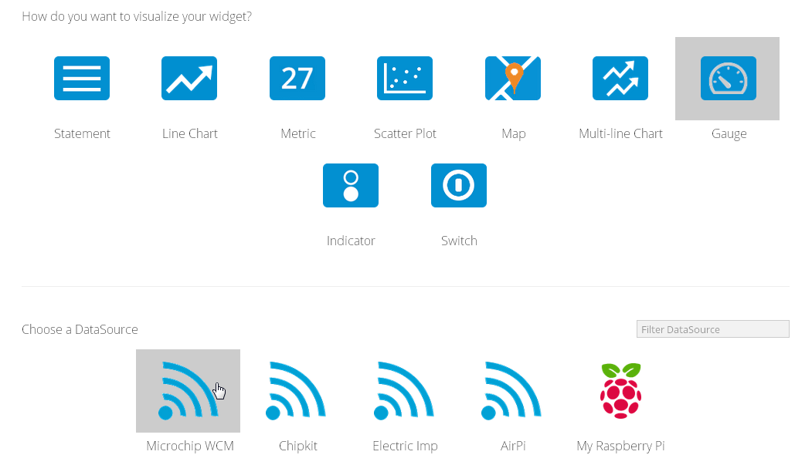

## Coding and Pushing data to Ubidots

* Back to the MPLAB IDE, look for a file named "main_demo.h". You should change the value of idvarled1, idvarled2, idvarled3, idvarled4, idpot, token, idvarbtn1, idvarbtn2, idvarbtn3, idvarbtn4  with your own token and respectives IDs.

    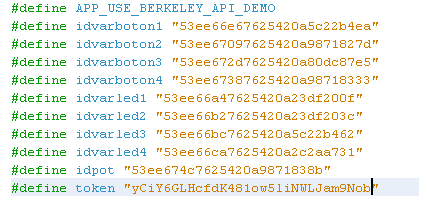
    
* Now we're ready to burn the code. Connect the PICKit 3 to the WCM board (turned ON) and the other end to the PC. Then click on "Run"--->"Run project". If everything is OK then the D5 LED should start blinking blue.
    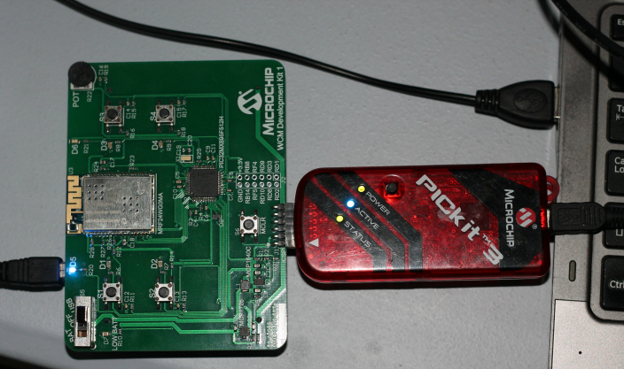
    
* After being programmed, the board will create a Wi-Fi network called "WCM_Soft_AP_2ed1", connect to this network. Then open a new tab from your web browser and type the following IP "192.168.1.25".

* Click on configure Network and then on the "Other Network..."" button. Check Adhoc or Infrastructure depending on your network type, then enter your network's SSID and finally choose its security type: WEP or WPA/WPA2 passphrase.

    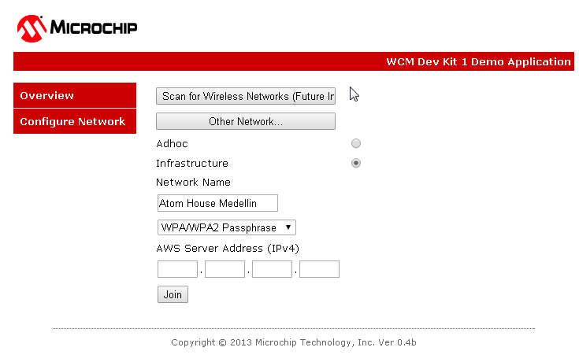
    
* Click on "Join" and type your Wi-Fi password. After some blinking party, the LEDs D5 and D6 should be blinking blue, that means you are connected to Ubidots.

* That's all! this is how your Ubidots dashboard should look now:

    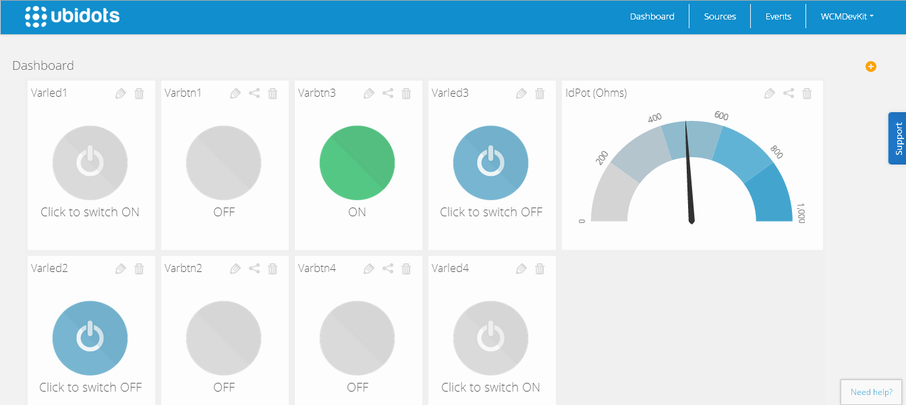
    
## Wrapping it up

In this guide we learned how to read the peripherals available in the Microchip Wi-Fi Module Development Kit 1, sending values to Ubidots and also reading data from the cloud. After getting familiar with it, you should be ready to develop your own projects using the MRF24WG0MA and Ubidots.

Once your sensor data is in Ubidots, it's quite simple to setup nice real-time graphs, compute new data using math formulas, create Emails or SMS alerts, etc.

## More projects...

Check out other cool tutorials using microchip and Ubidots:
 
* [Microchip RN131 and RN171 Evaluation Kits](http://ubidots.com/docs/devices/rn131-171.html#devices-rn131-171)
* [ChipKIT WiFire](http://ubidots.com/docs/devices/chipKitWiFire.html#devices-chipkitwifire)
* [ChipKIT Uno32 Official WiFi Shield](http://ubidots.com/docs/devices/chipKITUno32.html#devices-chipkituno32)
