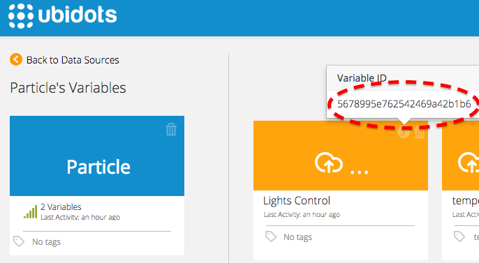
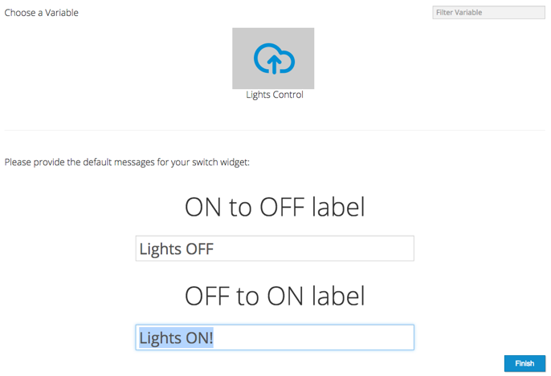
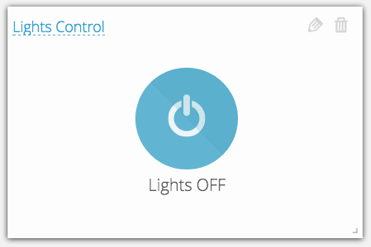
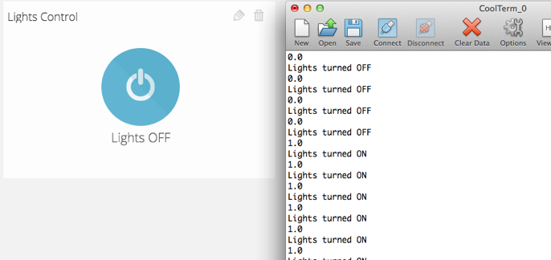
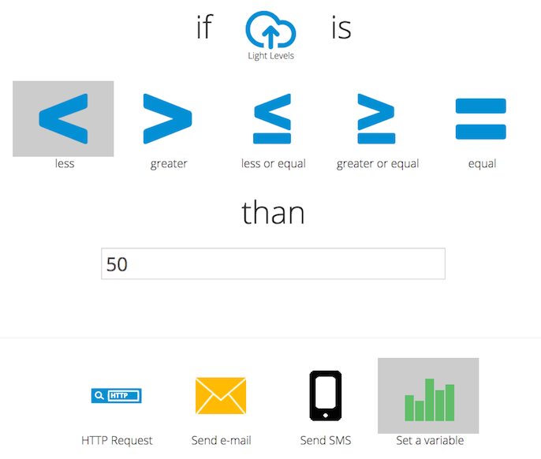
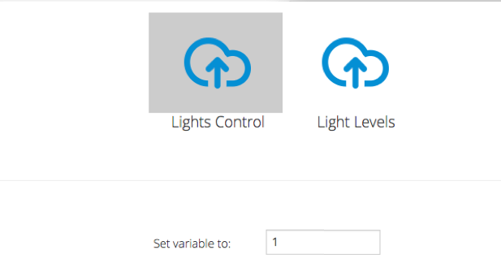

# Get data from Ubidots using Particle Photon


In this guide you'll learn how to read a value from the Ubidots Cloud using the Particle Photon and a standard HTTP Library.


    
## Introduction

The Particle Photon is the succesor of the original Spark Core. While it's small form factor and price are quite appealing, what we mostly like about it is its friendly developer experience, which includes a cloud IDE, ready to use and easy to install libraries, as well as an active community. 


## Setting up the Photon

There are two ways to setup your Photon:

1. [Using your smart phone](https://docs.particle.io/guide/getting-started/start/core/).
2. [Connecting it to your computer over USB](https://docs.particle.io/guide/getting-started/connect/core/).

	While method #1 is faster, we like method #2 because it will install a Particle driver in your computer, which is very useful for firmware upgrades, creating webhooks or changing the owner of your Photon.


## Preparing your Ubidots Account

In your Ubidots account:

1. Make sure you are [logged in](http://app.ubidots.com/accounts/signin/) and navigate to the "Sources" tab.

	
    
	**note**

		If you are looking to read an existing Ubidots variable (i.e. read the last value of my room temperature and display it in an LED matrix attached to the Photon) then use the ID of the existing variable and jump to step 6. If you are looking to read a Ubidots variable to control something in your Photon (i.e. turn a relay ON/OFF), please continue with the next step.


2. Create a new data source, then click on the created Data Source and add a new variable.

3. Take note of the variable's ID to which you want to send data. We'll need it later to include in our code:

	
    
4. Go to the "Dashboard" tab and click on the "+" orange-colored icon to add a new Widget, then select "Switch" type:

	
    
	Select the "Particle" data source and then the "Lights Control" variable. Specify the message to display in the widget, let's type "Lights ON" and "Lights OFF" to make our dashboard friendlier:

	
    
	You will get a widget that will write "1" or "0" to the "Lights Control" variable when it's toggled. We will later use our Photon to read this control variable and take an action when the variable is "1" or "0".

	
    
5. Finally, create or grab a token under [My Profile](https://app.ubidots.com/userdata/api/) tab. We'll need it later for our code:

	
    

## Coding your Photon

After claiming your Photon and setting up your Ubidots account, let's go to [Particle's Web IDE](https://build.particle.io/build) and flash some code:

1. Create a new app and click on the "Libraries" icon in the botton left corner. Look for an HTTP library called "HTTPCLIENT":

	
    
2. Click on the "HTTPCLIENT" library and then on "INCLUDE IN APP"

	
    
3. Select the APP we just created; the IDE will automatically add the HTTP library to your project. Once you're ready, copy and paste the following code into your APP:
```c++

	#include "HttpClient/HttpClient.h"
	#include "application.h"

	#define VARIABLE_ID "YOUR-VARIABLE-ID"
	#define TOKEN "YOUR-UBIDOTS-TOKEN"

	HttpClient http;
	int value_index = 0;
	String value_string, value;   // We'll use these strings to parse the response from Ubidots
	float f_value;
	unsigned int nextTime = 0;    // Next time to contact the server

	http_header_t headers[] = {
	    { "Content-Type", "application/json" },
	    { NULL, NULL } // NOTE: Always terminate headers will NULL
	};

	http_request_t request;
	http_response_t response;

	void setup() {
	    request.hostname = "things.ubidots.com";
	    request.port = 80;
	    request.path = "/api/v1.6/variables/"VARIABLE_ID"/values?page_size=1&token="TOKEN;  // Note "page_size=1" asks Ubidots only for the last value
	    Serial.begin(9600);
	}

	void loop() {
	    if (nextTime > millis()) {
	        return;
	    }

	    // Make Get request
	    http.get(request, response, headers);

	    if (response.status == 200){
	    
	        // Look for the index of the JSON string "value:"
	        value_index = response.body.indexOf("\"value\": ");
	    
	        // Chop the response from that index, until the end of the response string
	        value_string = response.body.substring(value_index);
	    
	        // Get the value that is between the nine (9) characters of "\"-v-a-l-u-e-\"-: " and the next comma
	        value = value_string.substring(9, value_string.indexOf(","));
	    
	        // See the value in the serial console, then cast it to a float (most sensor readings have decimals!)
	        Serial.println(value);
	        f_value = value.toFloat();
	        
	        if (f_value > 0){
	            // Add your custom function to turn on the lights here
	            Serial.println("Lights turned ON");
	        }
	        else{
	            // Add your custom function to turn off the lights here
	            Serial.println("Lights turned OFF");
	        }
	    
	    }
	    else {
	        Serial.println("The server rejected the request with the response:");
	        Serial.println(response.status);
	        Serial.println(response.body);
	    }

	    nextTime = millis() + 1000;
	}
```
	Please note that you should replace your "YOUR-UBIDOTS-TOKEN" and "YOUR-VARIABLE-ID" with the ones from your Ubidots account.
	The code is currently polling Ubidots every second. If your wish to increase this period, change the milliseconds of the last line from "+ 1000" to the desired amount of milliseconds between each request.

5. Finally, Verify and Flash your code; you should see the change in your serial console when pressing the ON/OFF button in your Ubidots dashboard!

	
    
## Adding Automation

You can also add some automation by creating two Ubidots events that read a specific variable and sets the control variable to either "1" or "0".

For example, let's say you have one Photon with a Photocell attached to it, measuring the light levels outside, and another Photon controlling a relay that turns ON/OFF the lights in your room. Let's tell Ubidots to automatically turn ON the lights when it's getting dark:

1. Go to the "Events" tab and click on "Add Event"
2. Select your Particle data source, then the "Light levels" variable and then set a threshold that means the room is dark:

	
    
	Select "Set a variable" as the action that must be taken when the condition is true.

3. Select the control variable "Lights control" and tell Ubidots to set it to "1" when the condition is true:

	
    
To automatically turn OFF the lights during the day, add another event that sets the control variable to "0".


## More Particle Tutorials

In this tutorial we learned how to use Ubidots to control a device remotely. You can extend this example to control other types of actuators attached to your Photon, or just to read information from the cloud and display it in a local screen connected to your Photon.

Check out other Photon tutorials:

* :ref:`Send values to Ubidots using Particle Photon and a standard HTTP library <devices/particle>`
