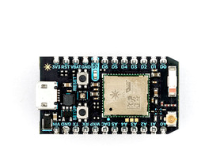
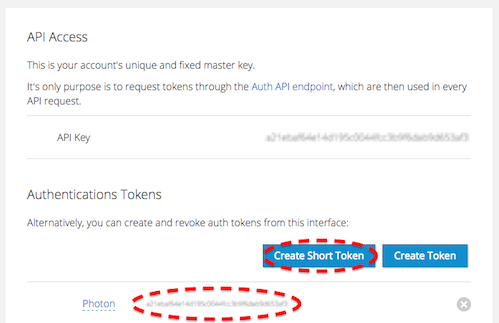

# Send data to Ubidots using Particle Photon


In this guide you'll learn how to read an analog input from your Particle Photon and send its value to Ubidots using a standard HTTP Library.


    
## Introduction

The Particle Photon is the succesor of the original Spark Core. While it's small form factor and price are quite appealing, what we mostly like about it is its friendly developer experience, which includes a cloud IDE, ready to use and easy to install libraries, as well as an active community. 


## Setting up the Photon

There are two ways to setup your Photon:

1. [Using your smart phone](https://docs.particle.io/guide/getting-started/start/core/).
2. [Connecting it to your computer over USB](https://docs.particle.io/guide/getting-started/connect/core/).

While method #1 is faster, we like method #2 because it will install a Particle driver in your computer, which is very useful for firmware upgrades, creating webhooks or changing the owner of your Photon.


## Preparing your Ubidots Account

Go to [Ubidots Cloud](http://app.ubidots.com):

1. Make sure you are [logged in](http://app.ubidots.com/accounts/signin/) and navigate to the "Sources" tab.

2. Create a new data source, then click on the created Data Source and add a new variable and name it after the type of sensor you are connecting to the analog pin A0 of the Photon. In this case we'll call it "Light Levels".

3. Take note of the variable's ID to which you want to send data. We'll need it later to include in our code:

    

4. Create a token under [My Profile](https://app.ubidots.com/userdata/api/) tab. We'll need it later for our code:

    
    
## Coding your Photon

After claiming your Photon and setting up your Ubidots account, let's go to [Particle's Web IDE](https://build.particle.io/build) and flash some code:

1. Create a new app. We just called it "send-value-ubidots":

    
    
2. Click on the "Libraries" icon in the botton left corner and look for an HTTP library called "HTTPCLIENT":

    
    
3. Click on the "HTTPCLIENT" library and then click on "INCLUDE IN APP"

    
    
4. Select the APP we just created; the IDE will automatically add the HTTP library to your project. Once you're ready, copy and paste the following code into your APP:
```c++

    // This code is based on the original Http Example by nmattisson, see https://github.com/nmattisson/HttpClient

	#include "HttpClient/HttpClient.h"
	#include "application.h"

	#define VARIABLE_ID "YOUR-VARIABLE-ID"
	#define TOKEN "YOUR-UBIDOTS-TOKEN"

	HttpClient http;
	int lightLevel = 0;
	unsigned int nextTime = 0;    // Next time to contact the server

	// Headers currently need to be set at init, useful for API keys etc.
	http_header_t headers[] = {
	    { "Content-Type", "application/json" },
	    { NULL, NULL } // NOTE: Always terminate headers will NULL
	};

	http_request_t request;
	http_response_t response;

	void setup() {
	    pinMode(A0, INPUT);
	    request.hostname = "things.ubidots.com";
	    request.port = 80;
	    request.path = "/api/v1.6/variables/"VARIABLE_ID"/values?token="TOKEN;
	    Serial.begin(9600);
	}

	void loop() {
	    if (nextTime > millis()) {
	        return;
	    }
	    // Read sensor value
	    lightLevel = analogRead(A0);

	    Serial.println("Sending data ...");
	    
	    request.body = "{\"value\":" + String(lightLevel) + "}";

	    // Post request
	    http.post(request, response, headers);
	    Serial.println(response.status);
	    Serial.println(response.body);

	    nextTime = millis() + 1000;
	}
```
    Please note that you should replace your "YOUR-UBIDOTS-TOKEN" and "YOUR-VARIABLE-ID" with the ones from your Ubidots account.
    The code is currently sending data every second. If your wish to increase this period, change the milliseconds of the last line from "+ 1000" to the desired amount of milliseconds between each request.

5. Finally, Verify and Flash your code; you should start seeing the analog values of pin A0 in your Ubidots account!

    
    
## Wrapping it up

In this guide we learned how to read an analog input from your Photon Core and send its value to Ubidots. After getting familiar with it, you can modify your hardware setup to send readings from any other type of sensors attached to it.

Once your data is in Ubidots, it's quite simple to send Emails or SMS alerts, setup real-time dashboards to keep an eye on your data, or even control things remotely by creating a "Switch" widget in your dashboard.


## More Particle Tutorials

Check out other Photon tutorials:

* :ref:`Get values from Ubidots using Particle Photon and a standard HTTP library <devices/particle-get>`
