# Microchip RN131/171 Evaluation Kits

This guide explains how to send all the analog inputs of your RN131/171 evaluation kit to Ubidots, without writing any code.

## Introduction

The RN131/171 is a 802.11 b/g Wi-Fi evaluation kit that can be used to quickly add Wi-Fi connectivity to embedded applications.
It has the flexibility to connect directly to a PC via a standard USB interface or to embedded processors through the TTL/UART interface.

## Components

To complete this guide you'll need either one of these units:

* [A RN131 Evaluation Kit](http://www.microchip.com/Developmenttools/ProductDetails.aspx?PartNO=RN-131-EK):

    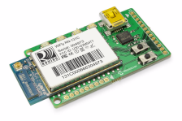
    
* [A RN171 Evaluation Kit](http://www.microchip.com/Developmenttools/ProductDetails.aspx?PartNO=RN-171-EK):

    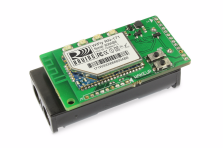
    
## Connect your device to Ubidots

Ubidots provides a custom API endpoint for this kits. If you're already familiar with Ubidots, you'll notice this is not the typical guide where you code your device to send specific values to the cloud. On the contrary, this guide programs your device to send all the analog pins in a single post, having Ubidots automatically create the needed variables to display their data.

1. [As a logged in Ubidots user](http://app.ubidots.com/accounts/signin/) navigate to the "Sources" tab.
    
    
2. Create a data source of the type "Microchip"-->"RN131/171 Evaluation Kits":
    
    
3. Provide the authentication details of the WiFi network your device will be connecting to:
    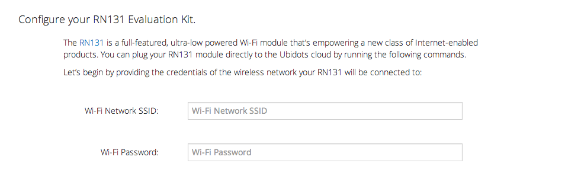
    
4. Plug the RN131/171 to your computer and follow the on-screen instructions on how to program it through the USB serial port.
You'll need to download a serial terminal like [RealTerm](http://realterm.sourceforge.net/) for Windows, [CoolTerm](http://freeware.the-meiers.org/) for Mac or [Picocom](https://code.google.com/p/picocom/) for Linux.
Ubidots will display the commands needed to program your device:
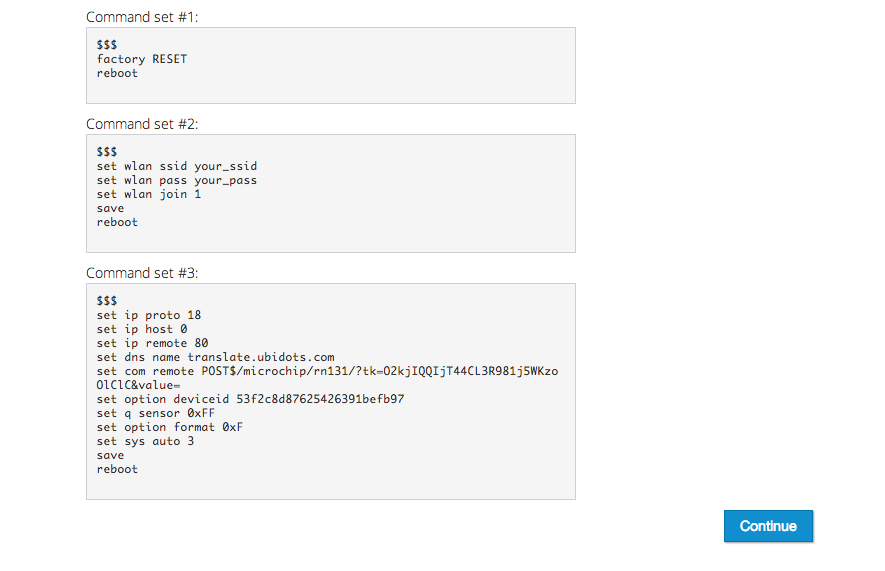
    
    Establish a connection at 9,600 bauds with the device:
    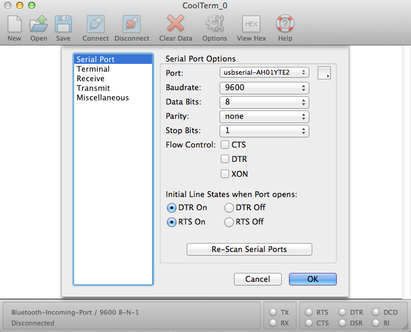
    
    You can copy and paste the commands ONE BY ONE, except for the "$$$" symbols, which must by typed manually:
    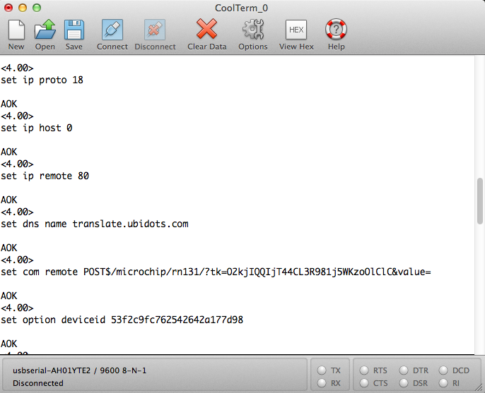
    
5. Once you've entered the commands and rebooted, your device should output "OK" status responses every 3-5 seconds, depending on your WiFi speed. This means it's sending data successfully.

    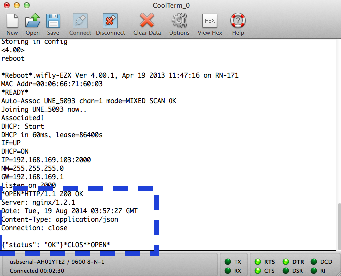
    
6. Go back to your Ubidots account and click on your datasource; you should see 9 variables, representing the analog pins in your device!

    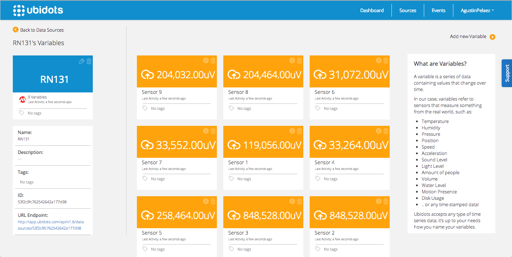
    
## Identify your pins

Ubidots just created 9 variables, corresponding to the 9 analog pins of the device. Let's say we'll only be using "Sensor 4", which has a motion sensor connected to it. This is where the motion sensor would be connected to:

* RN131-EK

    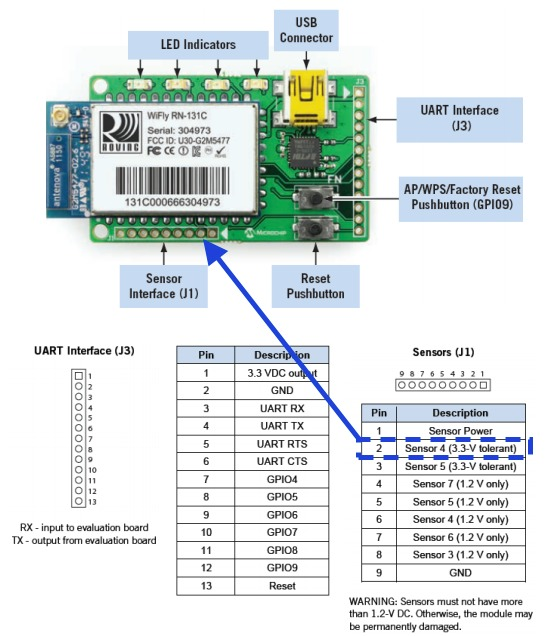
    
* RN171-EK

    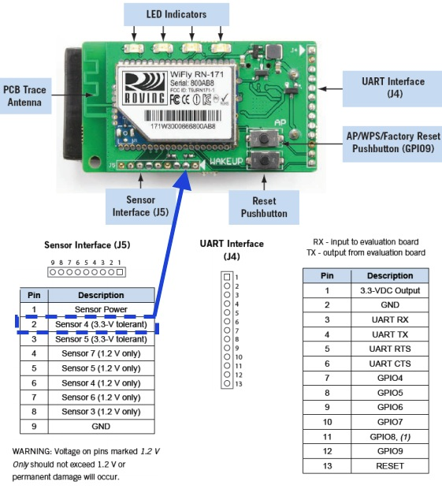

## Scale your data using a "Derived Variable"

You should be now wondering: What am I supposed to do with these "uV" units?  When we programmed the device, we told it to send ALL the pins at FULL resolution, which is why you're seeing 9 variables in micro volts.

We need to create a math formula to scale and transform the micro volts into our variable of interest:

1. Get the max and min range of your sensor. In this case, the motion sensor has two outputs:

    * When there's no motion  = ~31,040 uV
    * When there's motion     = ~848,528 uV
    
2. Because we want to graph an indicator widget, which outputs "ON" for any value above "0" and "OFF" for any value below "0", we'll just substract an arbitrary number of -300,000 to the "Sensor 4". This way we'll get:

    * When there's no motion  = {a negative number}
    * When there's motion     = {a positive number}

    To do so, we'll create a new variable, check the property "This is a derived variable" and then we enter our formula:

    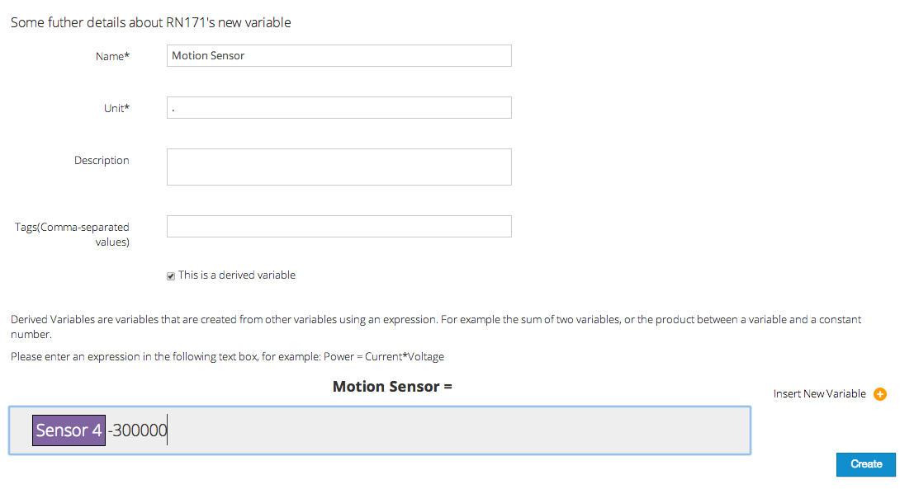
    
3. Finally, this is how your scaled data would look like:

    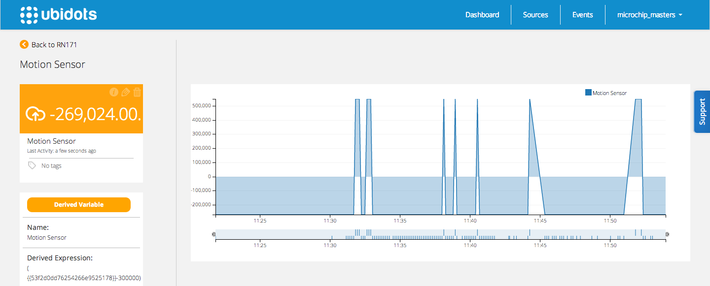
    
    You can now create an "Indicator" widget to display when there's movement or not:

    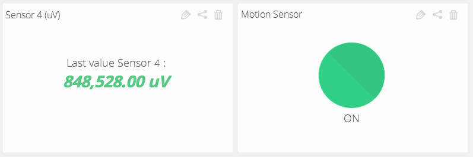
    
    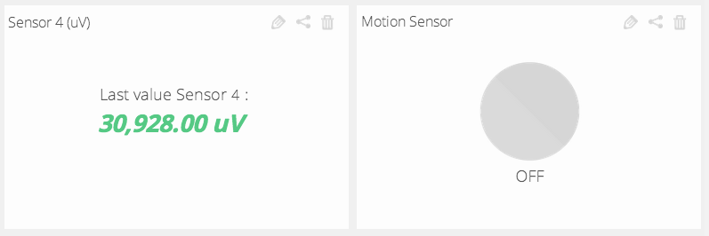
    
## Wrapping it up

In this guide we learned how to send all the analog inputs from the RN131/171 Evaluation Kit to Ubidots. After getting familiar with it, you can modify your hardware setup to send readings from any other type of sensors attached to the module.

Now that your sensor data is in Ubidots, it's quite simple to transform it using math formulas, create nice graphs, and trigger Emails or SMS alerts based on the received data.

## More projects...

Check out other cool projects using Ubidots:
 
* [Create a realtime map without writing any web code](http://blog.ubidots.com/create-a-real-time-map-without-writing-any-web-code)
* :ref:`Measuring your Internet connection with an OpenWrt router <examples/lua_openwrt>`