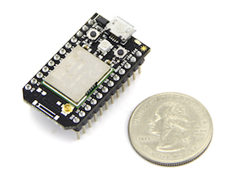
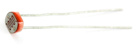
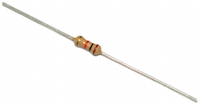
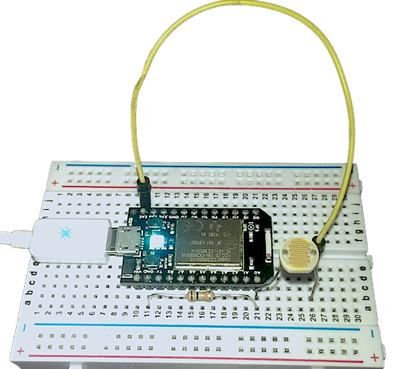
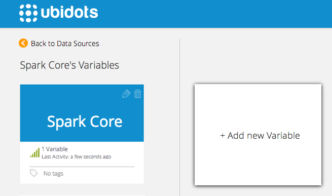
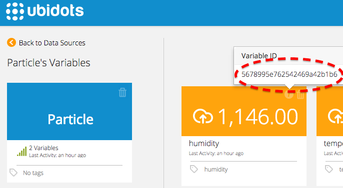
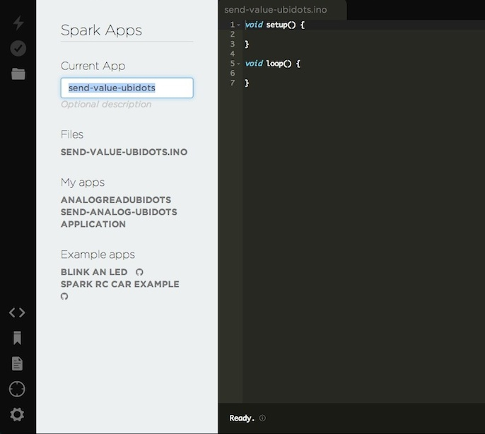
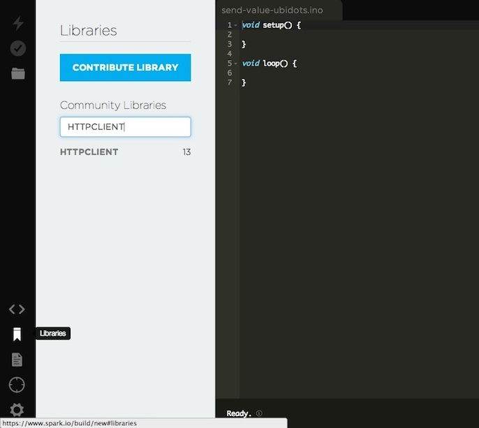
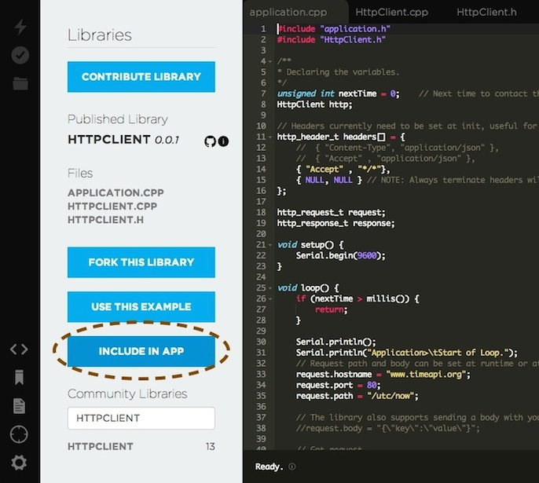
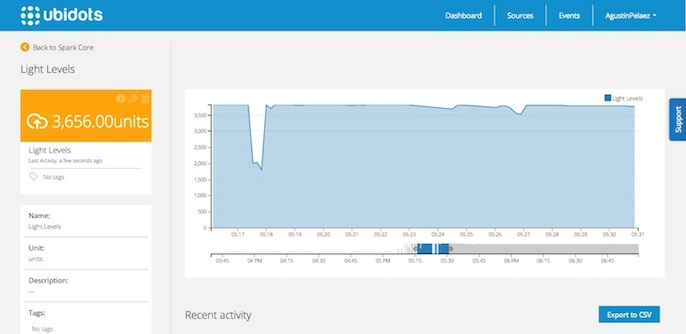

# Spark Core (Deprecated!)


.. note::

   This tutorial has been deprecated! Please check out the new :ref:`Particle Photon <devices/particle>` tutorial.


## Introduction

In this guide you'll learn how to read an analog input from your Particle Core and send its value to Ubidots.

The Spark Core is a tiny Wi-Fi development board that makes it easy to create internet-connected hardware. It contains a WiFi chip and a processor, with analog and digital I/O pins that allows it to interact with the real world. 

It's easy to setup and it uses the same programming language used by the Arduinos.

## Components


To complete this tutorial, you'll need:

* [A Spark Core](https://www.spark.io/dev-kits):

    
    
* A photo-cell
   
    
    
* A 10k resistor
   
    
    
* A small breadboard

## Setting up the Spark Core


The Spark Core can be setup from a mobile app; you can find their instructions here: https://www.spark.io/start

However, we got better results [setting the Spark over USB](http://docs.spark.io/connect/).


## Hardware Setup


Once you've done the process of connecting your Spark Core to your Wi-Fi network, and linking it to your Spark account (this is called "claim your core"), we can move on to the hardware setup. This can be done in 2 simple steps:

1. Connect one end of the photocell to "A0" of your Spark Core, and the other end to "3V3" 

2. Connect one end of the 10k resistor to "A0" of your Spark Core, and the other end to "GND"

    
    
## Preparing your Ubidots Account

In your Ubidots account, create a Data source called "Spark Core" and then a variable called "Light Levels":

1. [As a logged in user](http://app.ubidots.com/accounts/signin/) navigate to the "Sources" tab.

    
    
2. Create a data source called "Spark Core" by clicking on the orange button located in the upper right corner of the screen:

    
    
3. Click on the created Data Source and then on "Add New Variable":

    
    
4. Take note of the variable's ID to which you want to send data. We'll need it later to include in our core:

    

5. Create a token under "My Profile" tab. We'll need it later for our code:

    
    
## Coding your Spark Core


After claiming your Spark Core and setting up your Ubidots account, let's program your Spark to send data to Ubidots:

1. Create a new app in the Spark Build IDE. We just called it "send-value-ubidots":

    
    
2. Click on the "Libraries" icon in the botton left corner and look for an HTTP library called "HTTPCLIENT":

    
    
3. Click on the "HTTPCLIENT" library and then click on "INCLUDE IN APP"

    
    
4. Select the APP we just created, in this case "send-value-ubidots". The IDE will automatically add the HTTP library to your project. Once you're ready copy and paste the following code into your APP. 

Please note that some Spark versions are known to have problems with DNS resolution. If you are getting "HttpClient>.Connection failed" in the serial terminal, then this might be your case. Try doing the same process to add a library, but in this case select one called "DNS CLIENT" and then uncomment some lines in this code as exapling in the comments:

```c++

    #include "HttpClient/HttpClient.h"
    //#include "dnsclient/dnsclient.h"          // Add this library if your Spark is having problems with DNS
    
    #define VARIABLE_ID "553827da7625427d584e01cc"
    #define TOKEN "7lIgBfvGWdCh56j1bcunhfnYrMPLJh1"

    HttpClient http;
    float lightLevel = 0;
    char resultstr[64];

    // Headers currently need to be set at init, useful for API keys etc.
    http_header_t headers[] = {
        //{ "Host", "things.ubidots.com" },     // Declare the host here if your Spark has DNS problems
        { "Content-Type", "application/json" },
        { "X-Auth-Token" , TOKEN },
        { NULL, NULL } // NOTE: Always terminate headers will NULL
    };

    http_request_t request;
    http_response_t response;

    //Uncomment these lines if your Spark is having problems with DNS resolution:
    // ------------------------DNS-FIX--------------------------------------------
    //IPAddress dnsServerIP(8,8,8,8);
    //IPAddress remote_addr;
    //DNSClient dns;
    //char serverName[] = "things.ubidots.com";
    // ---------------------------------------------------------------------------

    void setup() {
        pinMode(A0, INPUT);
        request.port = 80;
    //    dns.begin(dnsServerIP);                      // Uncomment if having DNS problems
    //    dns.getHostByName(serverName, remote_addr);  // Uncomment if having DNS problems
    //    request.ip = remote_addr;                    // Uncomment if having DNS problems
        request.path = "/api/v1.6/variables/"VARIABLE_ID"/values";
        Serial.begin(9600);
    }

    void loop() {

        // Get variable
    
        lightLevel = analogRead(A0);
    
        // Send to Ubidots
    
        sprintf(resultstr, "{\"value\":%.4f}", lightLevel);
        request.body = resultstr;
        http.post(request, response, headers);
    
        Serial.println(response.status);
        Serial.println(response.body);
    
        delay(1000);
    }

```


Please note that you should replace your TOKEN and VARIABLE_ID with the ones from your Ubidots account.

5. Finally, Verify and Flash your device with this code; you should start seeing the Light Levels data in your Ubidots account!


    
## Wrapping it up

In this guide we learned how to read an analog input from your Spark Core and send its value to Ubidots. After getting familiar with it, you can modify your hardware setup to send readings from any other type of sensors attached to it.

If your project requires you to read a value from the Ubidots cloud you can also do it using the same HTTP library, but instead of making a POST, you would make a GET request. 

Once your data is in Ubidots, it's quite simple to send Emails or SMS alerts, setup real-time dashboards to keep an eye on your data, or even control things remotely by creating a "Switch" widget in your dashboard.


## More projects...


Check out other cool projects using Ubidots:

* [Sending motion sensor data to the cloud with a Raspberry Pi](http://blog.ubidots.com/building-a-people-counter-with-raspberry-pi-and-ubidots)
* :ref:`Measuring your Internet connection with an OpenWrt router <examples/lua_openwrt>`