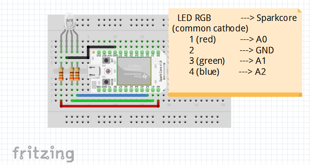
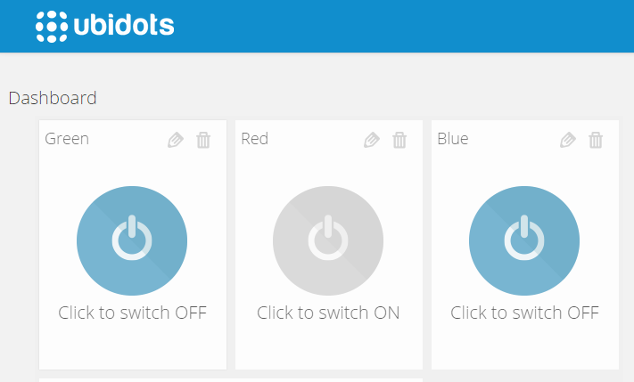

# Spark Core GET Tutorial (Deprecated!)


**note**

   This tutorial has been deprecated! Please check out the new :ref:`Particle Photon GET tutorial <devices/particle-get>`.


In this tutorial we'll make a GET request to Ubidots from the Spark. We'll be reading three variables, each representing a color in an RGB LED, being able to change the colors of the LED from the Ubidots dashboard.


## Components


To complete this tutorial you'll need:

* [A Spark Core](https://www.spark.io/dev-kits):

    
    
* Three resistors with a value between 220 and 1k.
   
    
    
* An RGB Led with common cathode
   
    
    
## Hardware Setup


* Follow the diagram below to connect all the elements.

    
    

## Preparing your Ubidots Account


After logging into your Ubidots account, create a Data source called "Spark Core" and then add 3 variables, one for each color:

1. [As a logged in user](http://app.ubidots.com/accounts/signin/)navigate to the "Sources" tab.

    
    
2. Create a data source called "Spark Core" by clicking on the orange button located in the upper right corner of the screen:

    
    
3. Click on the created Data Source and then on "Add New Variable".Do this step three times for red,green and blue colors:

    
    
4. Now navigate to the Dashboard and a new Widget this time choose'switch'. We will need 3 switches, one for each color.

    
    
5. Create a token under "My Profile" tab. We'll need it later for our code:

    
    
## Coding

1. Create a new app in the Spark Build IDE. We just called it "GET":

    
    
2. Click on the "Libraries" icon in the botton left corner and look for an HTTP library called "HTTPCLIENT":

    
    
3. Click on the "HTTPCLIENT" library and then click on "INCLUDE IN APP"

    
    
4. Select the APP, in this case "GET". The IDE will automatically add the HTTP library to your project. Once you're ready copy and paste the following code into your APP, This code makes 3 GET requests to know if the switches are ON or OFF (Don't forget to change the Variable's IDs and the token with the ones in your Ubidots account:

```cpp


    // This #include statement was automatically added by the Spark IDE.
    #include "HttpClient/HttpClient.h"
    #define RED_SWITCH "45817cb7625427d271e7fec"
    #define BLUE_SWITCH "55817ef7625427bafc83c6c"
    #define GREEN_SWITCH "55818047625427dbc2e698f"
    #define TOKEN "pSfasJt9W7v5W3fpUsRYNKiDMgJ770NK"
    HttpClient http;
    http_header_t headers[] = {
        { "Content-Type", "application/json" },
        { "X-Auth-Token" , TOKEN },
        { NULL, NULL } // NOTE: Always terminate headers with NULL
    };

    String search_on = String("\"value\": 1");//To check if a switch is pressed or not

    http_request_t request;
    http_response_t response;

    int red_on;
    int blue_on;
    int green_on;

    void setup() {
    pinMode(A0, OUTPUT);
    pinMode(A1, OUTPUT);
    pinMode(A2, OUTPUT);
    request.hostname = "things.ubidots.com";
    request.port = 80;
   // Serial.begin(9600); For debug
    }

    void loop() {
    //Better doing a function for this code, but I guess is easier to understand in this way
    response.body = "";
    response.status = 0;
    request.path = "/api/v1.6/variables/"RED_SWITCH"/values?page_size=1";// 
    http.get(request, response, headers);
    red_on = response.body.indexOf(search_on);//Search for value 1.0
   // Serial.print("INDEX: ");
    //Serial.println(red_on);
 
    if (red_on == -1) {//red_on default value is -1
        analogWrite(A0,0); //turn off
    }
    else if (-1 < red_on) {
        analogWrite(A0,400);//turn on
    }
    
    response.body = "";
    response.status = 0;
    request.path = "/api/v1.6/variables/"BLUE_SWITCH"/values?page_size=1";// Get request for the blue led switch
    http.get(request, response, headers);
    blue_on = response.body.indexOf(search_on);
    if (blue_on == -1) {
        analogWrite(A1,0);
    }
    else if (-1 < blue_on) {
        analogWrite(A1,400);
    }
    
    response.body = "";
    response.status = 0;
    request.path = "/api/v1.6/variables/"GREEN_SWITCH"/values?page_size=1";// Get request for the blue led switch
    http.get(request, response, headers);
    green_on = response.body.indexOf(search_on);
    if (green_on == -1) {
        analogWrite(A2,0);
    }
    else if (-1 < green_on) {
        analogWrite(A2,400);
    }

    }

```

## Wrapping it up

In this tutorial we learned how to control an analog Output of a Sparkcore. With just a few things like relays and transistors you could setup controls for lights and fans from your Ubidots Dashboard.


## More projects...


[Click here to see other cool projects using Spark and Ubidots](http://blog.ubidots.com/tag/spark)