# The Thingbox Project: Node-RED and Raspberry Pi

Node-RED is a tool designed by IBM that makes is simpler to wire Internet of Things resources, such as hardware devices, APIs and online services. The folks at [The Thing Box Project](http://thethingbox.io/) built a nice Raspberry Pi image, with Node-RED pre-installed and a set of API functions that make it compatible with services like Ubidots -right out the box-.


## Introduction

In this guide we'll learn how to make HTTP GET and POST requests from Node-RED / Thingbox project.

## Components

To complete this guide you will need:

* [A Raspberry Pi with a 4GB SD card](http://www.adafruit.com/category/105):

    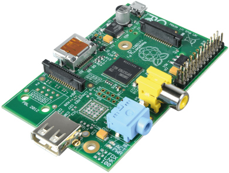
    
* [A Wi-Fi Adapter](http://www.adafruit.com/products/814)

       
    
* [A motion/PIR sensor](http://www.adafruit.com/products/189)
   
    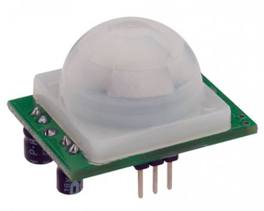
    
* Three resistors with a value between 220 and 1K Ohms.
   
    
    
* An RGB Led with common cathode
   
    
    
* An Ethernet Cable

    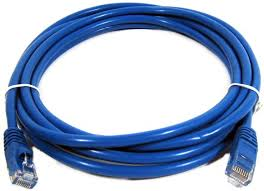
    
* A bread board and some jumper wires.

## Raspberry Pi Configuration

1. Download the Thing Box image [here](http://thethingbox.io/). You'll just have to provide your Email address and then you'll be able to download the file.

2. Install the image to the SD card. If you haven't done this before, [here's a guide explaining how to](http://www.raspberrypi.org/documentation/installation/installing-images/).

3. When done, insert the SD card into the RPi and plug an Ethernet cable to it. Plug the other end of the Ethernet cable to your router, then turn on the RPi.

5. After a couple of minutes, the RPi should be up and connected to your local network. Make sure your computer is in the same network and type this in your browser::

    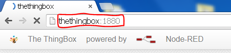
    
6. Now plug the WiFi USB Dongle to your RPi.

7. Click on the button next to the "Deploy" button and the in "Settings":

    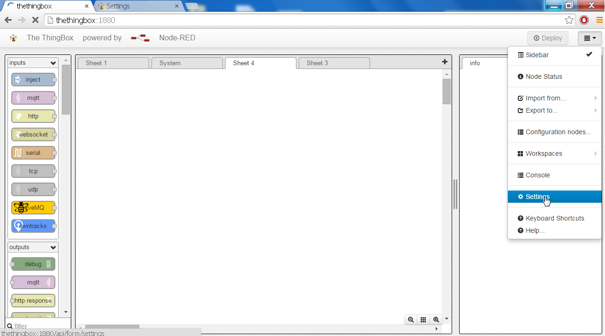
    
8. Inside the settings, configure your WiFi network details, then click "Ok". Reboot your RPi and it should now be connected through WiFi; no need for an Ethernet cable.

    
    
## Part 1: Sending data to Ubidots through an HTTP POST request

In this part we'll send the PIR sensor data to Ubidots, which is a low-cost and fast way to build a people counting project. 

Setup the following hardware connections in your RPi:

    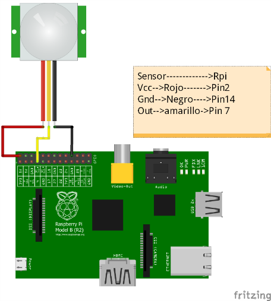
    
## Setup your Ubidots Account

1. Login to Ubidots and click on "Sources".

    
    
2. Click on the orange icon to add a new data source:

    
    
3. Click on the created data source and then on "Add New Variable":

    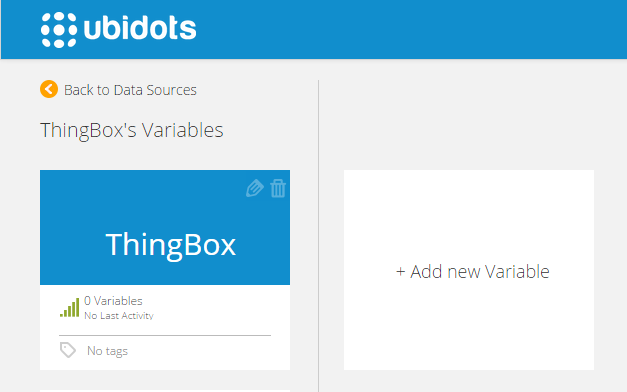
    
4. Copy the ID of the variable:

    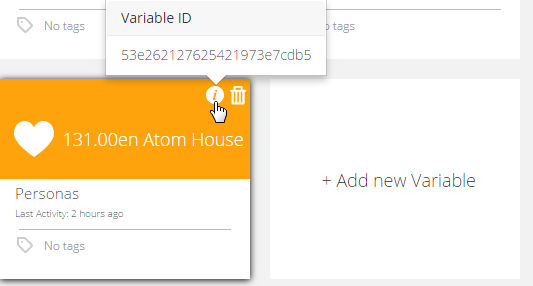
    
5. Create a token under "My Profile" tabe and take note of it, we'll need it later.

    
    
6. Go to the Dashboard and add a new Widget, select "line chart" and then select your data source and variable. Optionally, repeat this process to create a "Statement" widget that sums the total number of "movements" detected by the PIR sensor.

    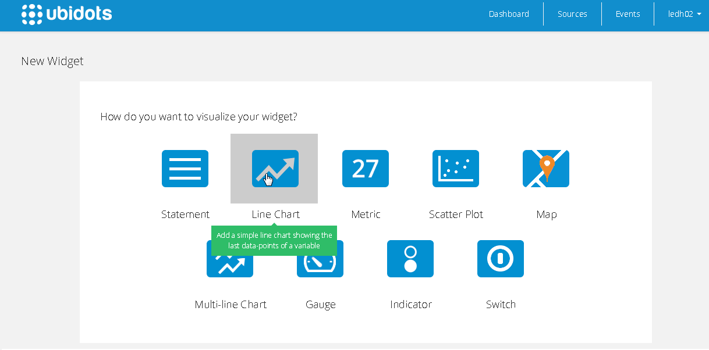
    
## Visual Coding with Node-RED
As you can see, the coding is done with a neat visual editor:

1. Read the sensor. This is a digital sensor that sends a "1" when detecting movement and "0" when ther isn't. To read the sensor inside Node-RED we need to scroll down in the block list and select one called "Rpi Input". Drag and drop it to include it in our program, give it a name and then configure which pin shoould be read. Thes pins are numbered according to the physical distribution of the RPi GPIO pins. In our case, it would be pin 7:

    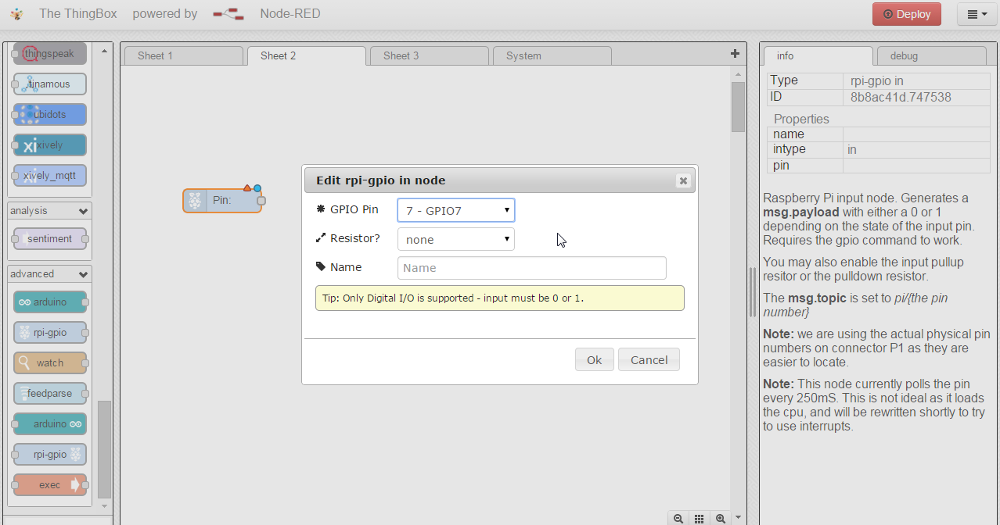
    
2. The second node will be of the type "function" and we'll call it "Rising Edge". This will help us detect when there's a "1" in the digital sensor. When clicked, a screen will appear where we can specify the function or task of this node.
    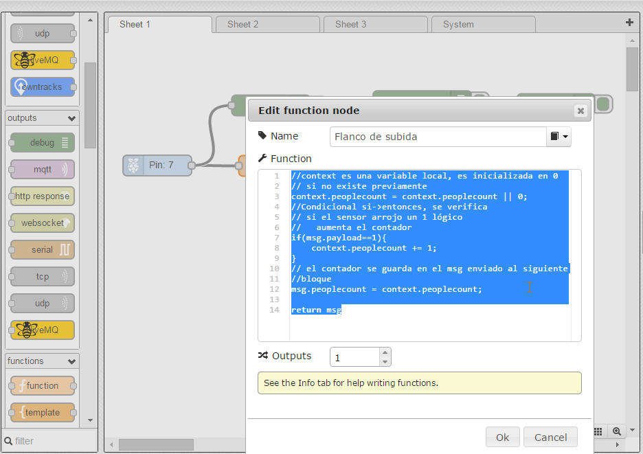
    Insert this code into the function:
```js
   
   //context is a local variable, where the people counting will be stored
   // it's equal to 0 at start.
   context.peoplecount = context.peoplecount || 0; 
   if(msg.payload==1){
    context.peoplecount += 1;
   }
   // The counter is stored in the "msg" variable that will be sent to the next node.
   msg.peoplecount = context.peoplecount;

   return msg;   

```
3. Let's add a new "function" node called "Data to JSON". This will take the variable "peoplecount" and convert it to JSON format.

    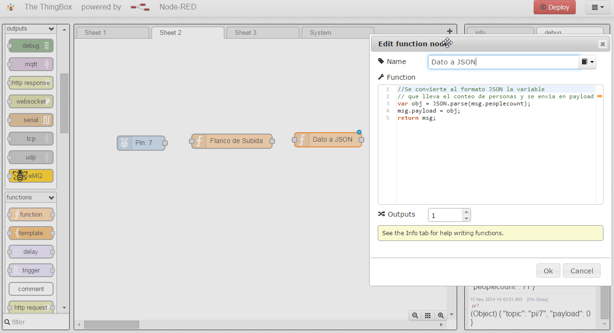
    Paste this code into it:
```js

    var obj = JSON.parse(msg.peoplecount);
    msg.payload = obj;
    return msg;

```
4. Add a "Ubidots" node, which is below in the list, under the "Storage" section. Click on it and then specify your token and variable ID. Connect the nodes and you should be all set. You may want to add "Debug" blocks between two nodes to see what's going on.

    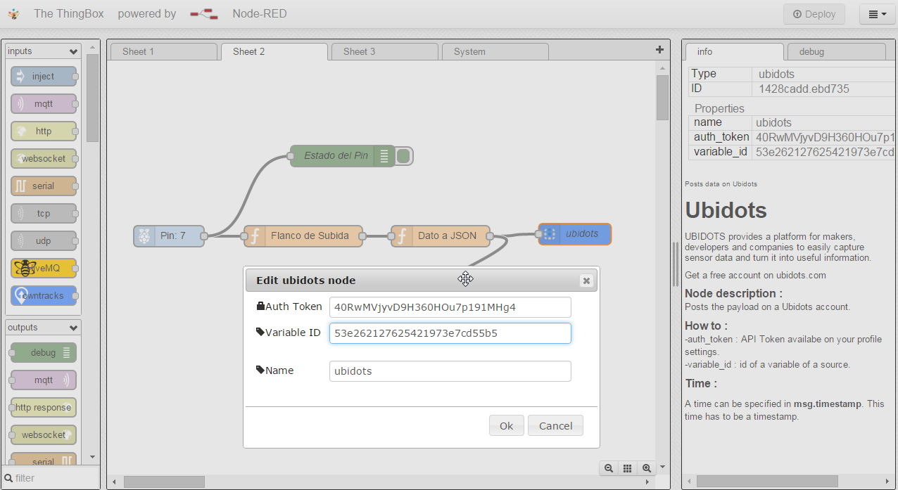
    
5. Finally, click on "Deploy" and you should be able to see your people counting data in Ubidots!

    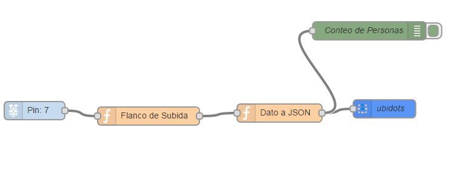
    
## Part 2: Reading Ubidots data using GET requests


In this part we will make GET requests in order to see the state of some switches in the Ubidots dashboard, and then set an LED color according to them.

## Wiring

* The physical wiring is explained in the following diagram:

    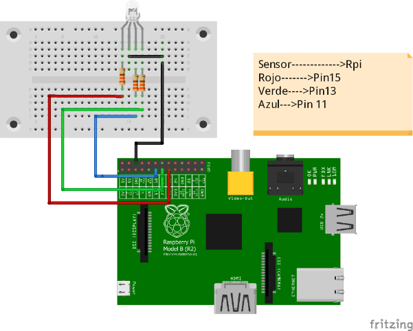

## Setting up your Ubidots Account

1. In this part we will need three variables, one for each color. 

    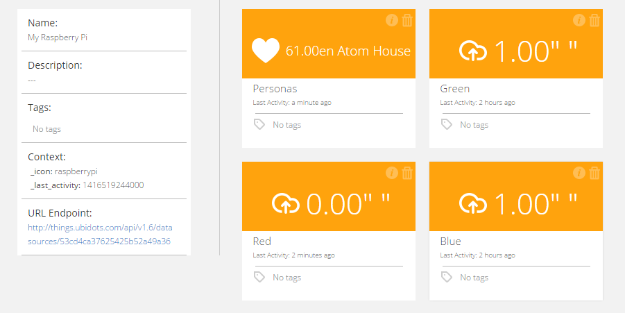
    
2. Now go to your Dashboard and add a new "Switcht" widget for evey new variable:

    
    
## Visual Coding with Node-RED 

1. Let's add an "Inject" node, which we'll configure to send a "blank" value ever second, as can be seen here:

    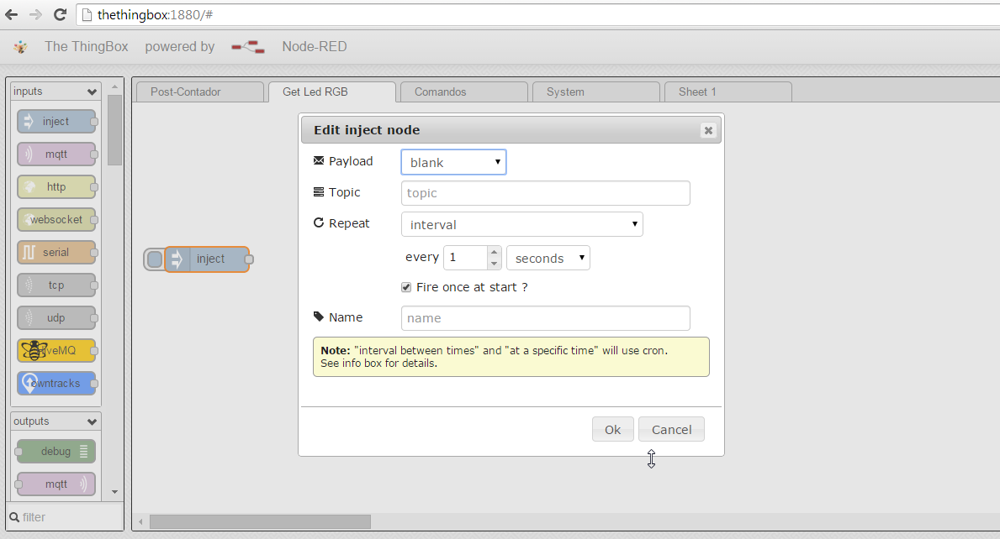
    
2. Drag-n-drop a new "function" node, where we'll specify the paremeters and headers for the GET request:
    Contenido de los encabezados
```js

    msg.headers = {
        'Content-Type' : 'application/json',
        'X-Auth-Token' : 'pSZJ7v5W3fpUsRYNKiDMgJ770NK' // Put your Ubidots token here
    }
    return msg;
``` 
    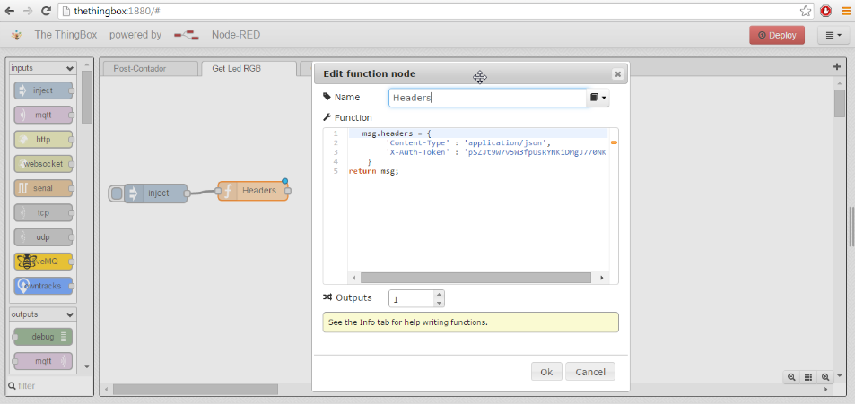
    
3. Select a new node called "HTTP Request". Select the GET option and then copy and paste this URL: (please note that the ID 546b6de5762542778d5d5bbe needs to be replaced with the ID of the variable you want to get).
```js

    http://things.ubidots.com/api/v1.6/variables/546b6de5762542778d5d5bbe/values?page_size=1
```
    Make this process 3 times; one for every variable.
    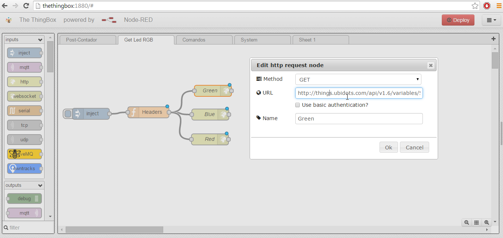
    
4. The Ubidots API will respond in a JSON format, which is why we need to add a new "function" node that parses the JSON object. This is needed for each variable.
    This is the code inside the parsing function:
```js

    var obj = JSON.parse(msg.payload);
    msg.payload = obj.results[0].value;

    return msg; 
```
    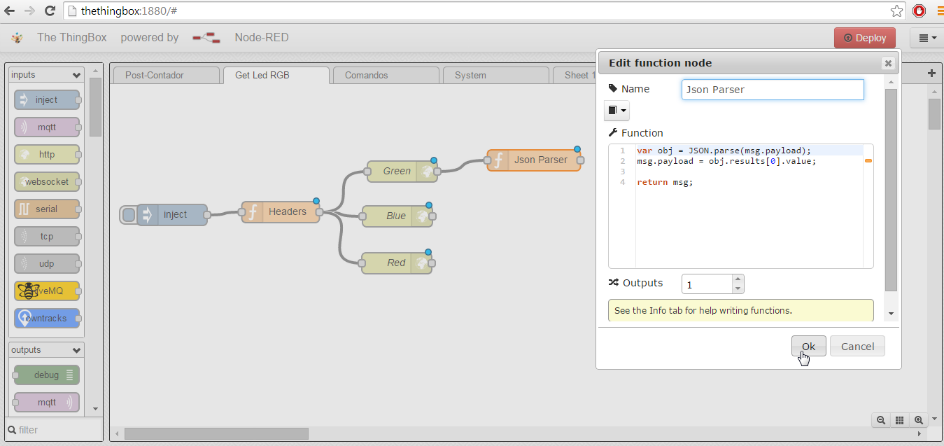
    
5. Finally, now that we can get the "0" or "1" values of the three widgets in the Ubidots dashboard, let's conect 3 "GPIO Output" nodes of the Rpi. The pins in our case are 11, 13, 15.
    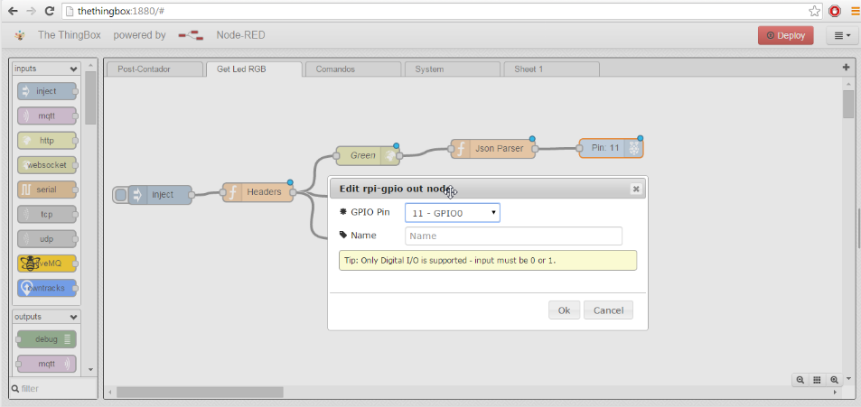
    
6. Now that we're done wiring the program, click on "Deploy":

    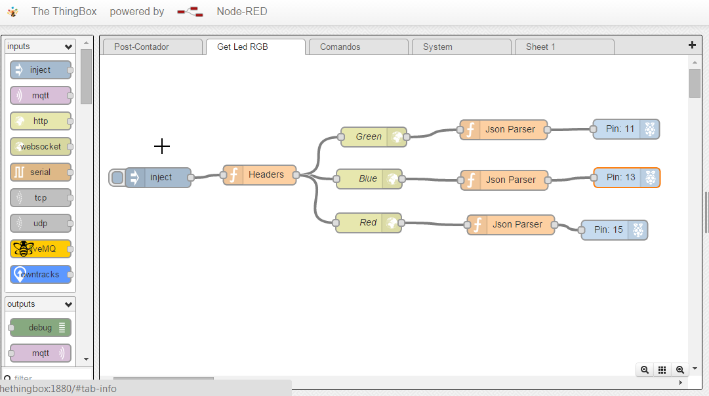
    
    You should now be able to change the color of your RGB LED from the Ubidots dashboard!

## Conclusion

This guide helped us learn how to use Node-RED to interact with the Ubidots API. Node-RED provides a very simple programming language and many interesting "blocks" or "nodes" that could enable a variety of Internet of Things projects.

Here some other IoT projects using Ubidots:

* [Sending motion sensor data to the cloud with a Raspberry Pi](http://blog.ubidots.com/building-a-people-counter-with-raspberry-pi-and-ubidots)
* :ref:`Measuring your Internet connection with an OpenWrt router <examples/lua_openwrt>`