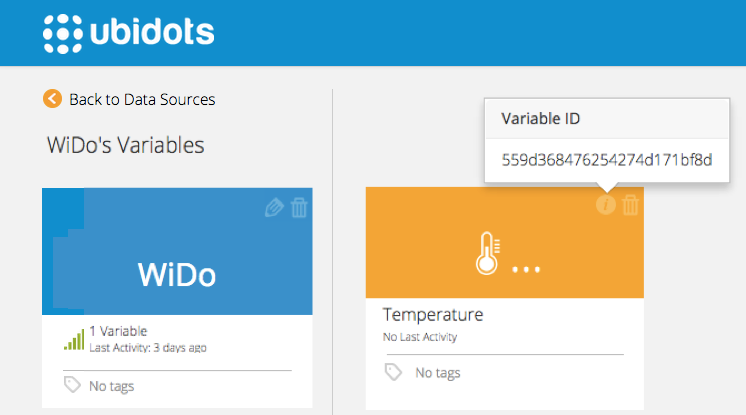
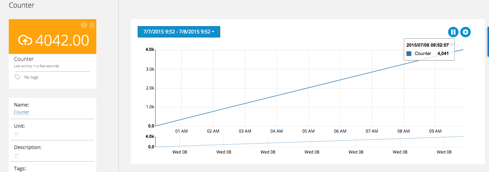
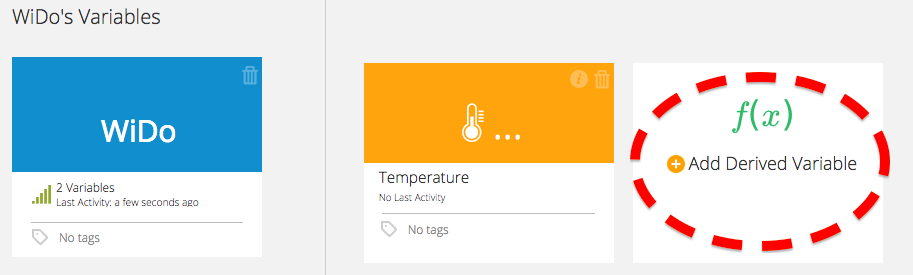
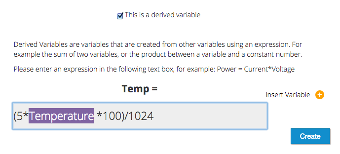
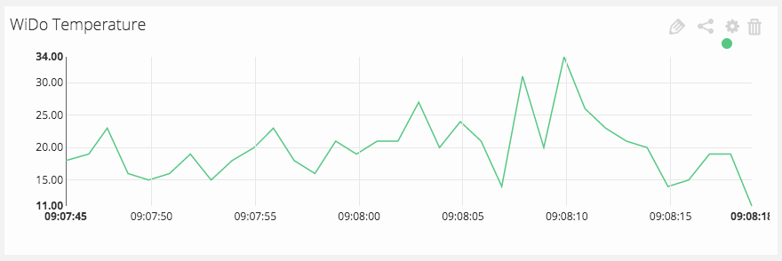

# WiDo IoT Node Tutorial


In this guide we'll learn how to send a temperature reading from the WiDo IoT Node to Ubidots. This board is designed and sold by [DF Robot](http://www.dfrobot.com/index.php?route=product/product&product_id=1159#.VZ0wj8ZVikp).

## Introduction


The WiDo board packs an Arduino Leonardo and a WiFi chip into a single board. For $29.90 USD you'll get the equivalent to an Arduino and a WiFi module, which would cost more notably more if bought separately.

## Components


All you need is the WiDo board, although it's better if you can plug an LM35 temperature sensor to A0 to get real world readings:

* [WiDo IoT Node](http://www.dfrobot.com/index.php?route=product/product&product_id=1159#.VZ0wj8ZVikp):

## Preparing your Ubidots Account

In your Ubidots account, create a Data source called "WiDo" and then a variable called "Temperature":

1. [As a logged in user](http://app.ubidots.com/accounts/signin/) navigate to the "Sources" tab.
	

2. Create a data source called "WiDo" by clicking on the orange button located in the upper right corner of the screen:
	
    
3. Click on the created Data Source and then on "Add New Variable":

4. Take note of the variable's ID to which you want to send data. We'll need it later for our code:
	
    
5. Create a token under "My Profile" tab. We'll need it later for our code:
    

6. Now let's create a line chart to see our data in the dashboard. Go to the Dashboard tab and click on add New Widget, then select "Line Chart" --> "WiDo" --> "Temperature":
    

We're all set to start coding.

## Coding 


The WiDo uses a fork of the CC3000 library, with some modifications to fit this board's pinout. [Download the library here](https://github.com/Lauren-ED209/Adafruit_CC3000_Library/archive/master.zip).

1. In the Arduino IDE, select the "Arduino Leonardo" as your Board.

2. Install the library by clicking on "Sketch" --> "Import Library". Then select the ZIP file you just downloaded. If you get a message saying you already have a library called "Adafruit_CC3000_Library-master" is because you already have an installation for the CC3000 Adafruit module. To solve this, open the ZIP file from WiDo, change the name of the folder to something like "Adafruit_CC3000_Library-Wido", then try installing the library again.

2. Copy and paste the following code into a blank sketch:


```c++

	/*************************************************** 
	 * This is an example for the DFRobot Wido - Wifi Integrated IoT lite sensor and control node
	 * Product Page & More info: http://www.dfrobot.com/index.php?route=product/product&product_id=1159
	 * Designed specifically to work with the DFRobot Wido products:
	 * 
	 * The library is forked from Adafruit
	 * 
	 * Contributed by James
	 * BSD license, all text above must be included in any redistribution
	 * Modified by Agustin Pelaez for Ubidots, Inc.
	 ****************************************************/

	/*
	This example code is used to connect the Ubidots cloud service (Official homepage: http://www.ubidots.com).
	 
	 The device required is just:
	 
	 1. LM35 low cost temperature sensor or any device you used to upload data
	 2. And Wido
	 
	 Note: Please don't forget to change the setting below before using!
	 1. WLAN_SSID & WlAN_PASS 
	 2. API_key
	 3. Device ID 
	 
	 */


	#include <Adafruit_CC3000.h>
	#include <ccspi.h>
	#include <SPI.h>
	#define Wido_IRQ   7
	#define Wido_VBAT  5
	#define Wido_CS    10
	#include "utility/debug.h"

	Adafruit_CC3000 Wido = Adafruit_CC3000(Wido_CS, Wido_IRQ, Wido_VBAT,SPI_CLOCK_DIVIDER); // you can change this clock speed

	// Security can be WLAN_SEC_UNSEC, WLAN_SEC_WEP, WLAN_SEC_WPA or WLAN_SEC_WPA2
	#define WLAN_SECURITY   WLAN_SEC_WPA2

	#define WLAN_SSID       "Abriles_LTE"         // cannot be longer than 32 characters!
	#define WLAN_PASS       "12345678"        // For connecting router or AP, don't forget to set the SSID and password here!!


	#define TCP_TIMEOUT      3000

	#define TOKEN  "yxxxoIxxVsr3dbQqAk0fxvKm8Z6xxx"  
	// Update you Ubidots token

	#define VARIABLE_ID   "559c9c947625421d93c2e61b"       // Replace with the id of the variable you wish to stream data to

	void setup(){

	  Serial.begin(115200);
	  Serial.println(F("Hello, CC3000!\n"));

	  /* Initialise the module */
	  Serial.println(F("\nInitialising the CC3000 ..."));
	  if (!Wido.begin())
	  {
	    Serial.println(F("Unable to initialise the CC3000! Check your wiring?"));
	    while(1);
	  }

	  /* Attempt to connect to an access point */
	  char *ssid = WLAN_SSID;             /* Max 32 chars */
	  Serial.print(F("\nAttempting to connect to ")); 
	  Serial.println(ssid);

	  /* NOTE: Secure connections are not available in 'Tiny' mode!
	   By default connectToAP will retry indefinitely, however you can pass an
	   optional maximum number of retries (greater than zero) as the fourth parameter.
	   */
	  if (!Wido.connectToAP(WLAN_SSID, WLAN_PASS, WLAN_SECURITY)) {
	    Serial.println(F("Failed!"));
	    while(1);
	  }

	  Serial.println(F("Connected!"));

	  /* Wait for DHCP to complete */
	  Serial.println(F("Request DHCP"));
	  while (!Wido.checkDHCP())
	  {
	    delay(100); // ToDo: Insert a DHCP timeout!
	  }  

	}

	uint32_t ip = 0;    // Store Ubidots ip address
	float temp = 0;     // Store temporary sensor data for post
	Adafruit_CC3000_Client WidoClient;

	void loop(){

	  static unsigned long RetryMillis = 0;
	  static unsigned long uploadtStamp = 0;
	  static unsigned long sensortStamp = 0;

	  if(!WidoClient.connected() && millis() - RetryMillis > TCP_TIMEOUT){
	    // Update the time stamp for reconnecting the ip 
	    RetryMillis = millis();

	    Serial.println(F("Trying to connect to Ubidots..."));

	    // Connect to Ubidots 
	    ip = Wido.IP2U32(50,23,124,68);               
	    WidoClient = Wido.connectTCP(ip, 80);         
	    Serial.println(F("Successfully connected to Ubidots."));

	  }

	  if(WidoClient.connected() && millis() - uploadtStamp > 1000){
	    // If the device is connected to the cloud server, upload the data every 1000ms.
	    uploadtStamp = millis();

	    // send http data stream to Ubidots

	    sendstream2Ubidots(VARIABLE_ID, String(analogRead(0)));  // send the temperature sensor reading from LM35 sensor to server

	    /********** Get the http page feedback and print the response ***********/
	    unsigned long rTimer = millis();
	    Serial.println(F("Reading Cloud Response...\r\n"));
	    while (millis() - rTimer < 2000) {
	      while (WidoClient.connected() && WidoClient.available()) {
	        char c = WidoClient.read();
	        Serial.print(c);
	      }
	    }
	    delay(1000);             // Wait for 1s to finish posting the data stream   

	    WidoClient.close();      // Close the service connection
	    RetryMillis = millis();  // Reset the timer stamp for applying the connection with the service
	  }
	}

	void sendstream2Ubidots(String variable, String value){

	  Serial.print("Free RAM: "); Serial.println(getFreeRam(), DEC);

	  // Variables for storing the length of http package body 
	  int length = 0;
	  char lengthstr[5];

	  String httpBodyPackage = "{\"value\":" + value + "}";
	  Serial.println(httpBodyPackage);                       // Debug the http body stream

	  //Make an HTTP request to the Ubidots server
	  Serial.print(F("Sending Http Request..."));
	  WidoClient.fastrprint(F("POST /api/v1.6/variables/"));
	  WidoClient.fastrprint(VARIABLE_ID);
	  WidoClient.fastrprintln(F("/values HTTP/1.1"));
	  WidoClient.fastrprintln(F("Host: things.ubidots.com"));
	  WidoClient.fastrprint(F("X-Auth-Token: "));
	  WidoClient.fastrprintln(TOKEN);
	  WidoClient.fastrprintln(F("Content-Type: application/json"));
	  WidoClient.fastrprint(F("Content-Length: "));
	  WidoClient.println(String(httpBodyPackage.length()));
	  WidoClient.fastrprintln(F(""));
	  WidoClient.println(httpBodyPackage);

	  Serial.println(F("Done....."));
	}

```

## UPDATE

If you're looking to send more than a variable at the time, use our [collections API endpoint](http://ubidots.com/docs/api/v1_6/collections/post_values.html) by replacing the function "sendstream2Ubidots(String var, Sting val)" with this function:

```c++

	void send3Ubidots(String var1, String val1, String var2, String val2, String var3, String val3){

	  // Variables for storing the length of http package body

	  String httpBodyPackage = "[{\"variable\":\"" + var1 + "\",\"value\":" + val1 + "}, {\"variable\":\"" + var2 + "\",\"value\":" + val2 + "}, {\"variable\":\"" + var3 + "\",\"value\":" + val3 + "}]";
	  Serial.println(httpBodyPackage);                       // Debug the http body stream

	  //Make an HTTP request to the Ubidots server
	  Serial.print(F("Sending Http Request..."));
	  WidoClient.fastrprintln(F("POST /api/v1.6/collections/values/ HTTP/1.1"));
	  WidoClient.fastrprintln(F("Host: things.ubidots.com"));
	  WidoClient.fastrprint(F("X-Auth-Token: "));
	  WidoClient.fastrprintln(TOKEN);
	  WidoClient.fastrprintln(F("Content-Type: application/json"));
	  WidoClient.fastrprint(F("Content-Length: "));
	  WidoClient.println(String(httpBodyPackage.length()));
	  WidoClient.fastrprintln(F(""));
	  WidoClient.println(httpBodyPackage);

	  Serial.println(F("Done....."));
	}

```

## Results

We tested the WiDo board by streaming an incremental counter during several hours. At the time of this writing, the board had been sending data for 10 hours, without a single reset:

    

As for the Temperature readings, keep in mind the ADC will return discrete values from 0 to 1023, which means you'll need to scale this number to a temperature reading. To do this, create a Ubidots "Derived Variable":

    
    
Then add the corresponding formula to [calibrate it to your needs](..http://playground.arduino.cc/Main/LM35HigherResolution):

    
    
Finally, this is how the temperature variable looked like in the dashboard:

    
    
## More projects...


Check out other cool device tutorials using Ubidots:

* :ref:`Raspberry Pi<devices/raspberrypi>`
* :ref:`Electric Imp<devices/electricimp>`
* :ref:`Android<devices/android>`
* :ref:`Spark Core<devices/spark>`
* :ref:`Adafruit FONA MiniGSM<devices/fona>`
* :ref:`ESP8266 WiFi Module<devices/esp8266>`
