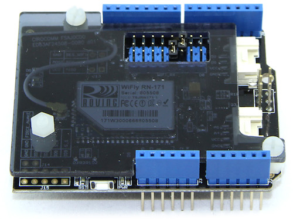
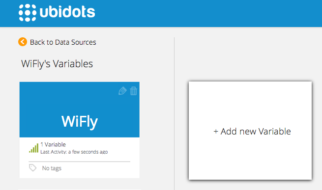

# Arduino WiFly Shield


Ubidots-Arduino-WiFly provides an example of sending data to Ubidots from the Wi-Fi RN171 shield from Seeed Studio.

This Wifi Shield utilizes an RN171 wifi module to provide your Arduino/Seeeduino with serial Ethernet's function. It only takes two pins to hook your device up to 802.11b/g wireless networks with this shield. It features an independent antenna which can cover a wider range and transmit stronger signals. With supports for common TCP, UDP and FTP communication protocols, this Wifi Shield can meet needs of most wireless network projects, like smart home networks, robot controls or personal weather stations, etc.

## What you'll need:


* [An Arduino uno](http://arduino.cc/en/Main/ArduinoBoardUno)


* [A WiFi shield based on Wifly RN171 from Seeedstudio](http://www.seeedstudio.com/depot/Wifi-Shield-p-1220.html)


* The WiFly library, which can downloaded [here](https://github.com/ubidots/ubidots-arduino-wifly/blob/master/Library/WiFi_Shield.zip?raw=true)

## Install the Library

1. Download the library as a ZIP file.

2. Open the Arduino IDE and go to "Sketch" --> "Import Library" --> "Add Library".

3. Select the downloaded ZIP file


## Preparing your Ubidots Account

In your Ubidots account, create a Data source called "WiFly" and then a variable called "My Variable":

1. [As a logged in user](http://app.ubidots.com/accounts/signin/) navigate to the "Sources" tab.
  

2. Create a data source called "WiFly" by clicking on the orange button located in the upper right corner of the screen:
  

3. Click on the created Data Source and then on "Add New Variable":
  

4. Take note of the variable's ID to which you want to send data. We'll need it later to include in our code:
  

5. Create a token under "My Profile" tab. We'll need it later for our code:
  

## A Quick example to post data to Ubidots

Here's a quick example of how to post an analogue value to Ubidots.


```cpp

       /*
       Basic sketch for WiFly shield RN171
 
       This is a basic example to post a value to Ubidots using the function "save_value".
       
       You'll need:
       * An Arduino Uno
       * A WiFi Shield from Seeed Studio (WiFly RN171) 

       Pins' connection
       Arduino       WiFly
        2    <---->    TX
        3    <---->    RX
       
       Created 20 Aug. 2014
       by Mateo Velez - Metavix - for Ubidots Inc.
       
       This example code is in the public domain.
       
       */
      //-------------------------------------------------------------
      //------------------------------Libraries----------------------
      //-------------------------------------------------------------
      
      #include <Arduino.h>
      #include <SoftwareSerial.h>
      #include <WiFly.h>
      
      //-------------------------------------------------------------
      //---------------------Network Configuration-------------------
      //-------------------------------------------------------------
      
      /* Change the AUTH according to your network settings
         If is open change to WIFLY_AUTH_OPEN
         If is WPA1 change to WIFLY_AUTH_WPA1
         If is WPA1_2 change to WIFLY_AUTH_WPA1
         If is WPA2 change to WIFLY_AUTH_WPA1
      */
      #define SSID      "Atom$House$Medellin"
      #define KEY       "atommed2014"
      #define AUTH      WIFLY_AUTH_WPA2_PSK

      SoftwareSerial uart(2, 3);
      WiFly wifly(uart);
      unsigned long start_millis = 0;

      void setup() {
        Serial.begin(9600);
        Serial.println("------- WIFLY HTTP --------");
        
        uart.begin(9600);
        if (!wifly.isAssociated(SSID)) {
        while (!wifly.join(SSID, KEY, AUTH)) 
        {    
            Serial.println("Failed to join " SSID);
            Serial.println("Wait 0.1 second and try again...");
            delay(100);
         }
          wifly.save();    
        }
      }


      void loop() {
        int reset = 0;
        
        int value = analogRead(A0);
        while ((save_value(value)) < 0) 
        {
          reset++;
          if(reset == 10)
          {
            asm volatile ("  jmp 0");  
          }
        }

      //   Uncomment for debug

      //  char r;
      //  while (wifly.receive((uint8_t *)&r, 1, 1000) == 1) 
      //  {    
      //    Serial.print(r);
      //  }
      }
      int save_value(int dato)
      {
        char post_data_buf[32];
        snprintf(post_data_buf, sizeof(post_data_buf), "{\"value\": %d}\r\n", dato);

        char host[20];
        uint16_t port;
        
        
        if (!wifly.connect("things.ubidots.com", 80)) {
          Serial.println("Failed to connect.\r\n");
          return -2;
        }
        
        // Send request
        char buf[200];
        //dont forget change your id and your token
        snprintf(buf, sizeof(buf), "POST /api/v1.6/variables/53beeca07625420bde83ce29/values HTTP/1.1\r\nContent-Type: application/json\r\nContent-Length: %d\r\nX-Auth-Token: CCN8FrVulRYGulPTkbaiR9Myx8qN2o\r\nHost: things.ubidots.com\r\n\r\n",strlen(post_data_buf));
        wifly.send(buf);
        
        // Send body
        if (post_data_buf != NULL) {
          wifly.send(post_data_buf);
        }
         wifly.send("\r\n");
        return 0;
      }
```

## Explanation of the function

### save_value()


```cpp

    boolean = ubiclient.save_value(value)
```

|Type  |Argument | Description|
|:- - :|:-       -:|:-          -:|
|int|value|The value you wish to send to Ubidots|

Saves a value to Ubidots. Returns true upon success. Returns false upon error.

## Wrapping it up

In this guide we learned how to read an analog input from the Arduino WiFly RN171 and send this value to Ubidots. After getting familiar with it, you can modify your hardware setup to send readings from any other type of sensors attached to it.

## More projects...


Check out other cool projects using Ubidots:
 
  * :ref:`devices/arduino-wifi`
  * :ref:`devices/arduino-wifly`
  * :ref:`Measuring your Internet connection with an OpenWrt router <examples/lua_openwrt>`