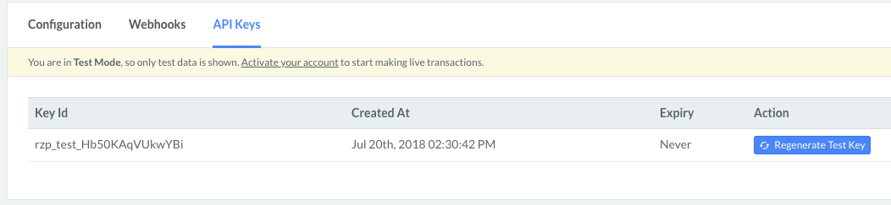
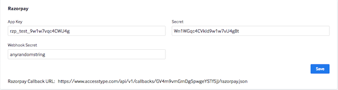
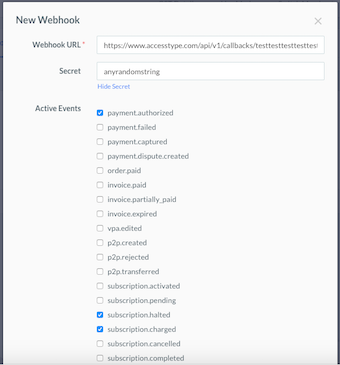

# FAQ

This section details out the steps needed for you to get started with Accesstype

## How to link your Razorpay account with Accesstype

### Pre-requisite: 
Your Razorpay merchant account must be created.

### Step 1: Setup API Keys and Secret:
* Go to Razorpay Dashboard [API keys](https://dashboard.razorpay.com/#/app/keys) section.
* Copy the Razorpay Key ID and Secret.

* Login to [Accesstype.com](https://www.accesstype.com) and Go to Settings --> [Payment gateways](https://www.accesstype.com/integrations/payment_gateways) 	
* Under the Razorpay section of Accesstype, add your Razorpay App Key and Secret.
* Press the save button.

### Step 2: Setup Webhooks:

* Login to [Accesstype.com](https://www.accesstype.com) and Go to Settings --> [Payment gateways](https://www.accesstype.com/integrations/payment_gateways) 	
* In the Razorpay section, enter a Webhook secret. Press the save buton.
* Copy the Razorpay callback URL so that you can use it to setup Webhooks in Razorpay.

* Go to your Razorpay [webhooks dashboard.](https://dashboard.razorpay.com/#/app/webhooks) 

* Setup a Razorpay webhook by pasting the Razorpay callback URL provided by Accesstype.
* Add the webhook secret that you had entered in Accesstype 
* Enable `payment.authorized` webhook for plans with One-time payments. Press the save button. 
* For recurring subscriptions, additionally enable `subscription.charged` and `subscription.halted` events in Razorpay.

Your Razorpay and Accesstype accounts will now be linked.
