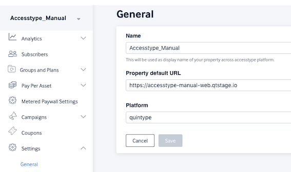
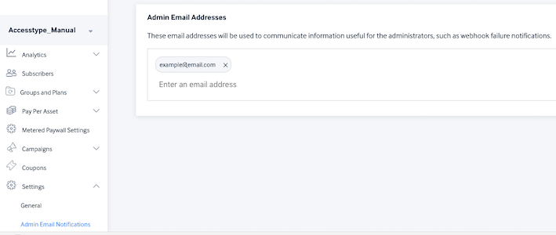
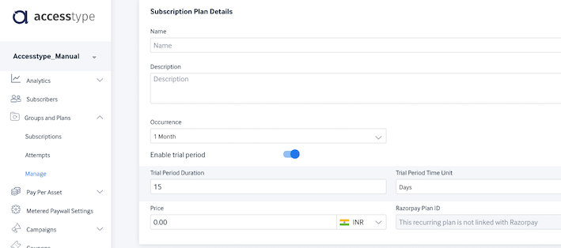
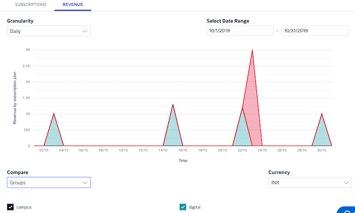
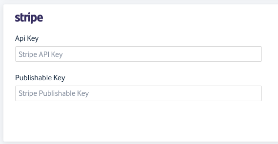
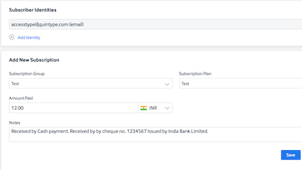
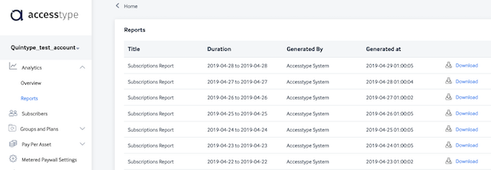
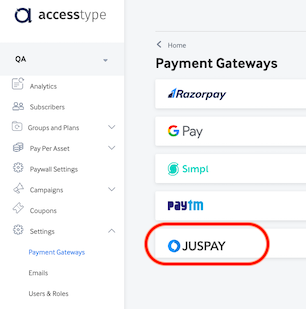
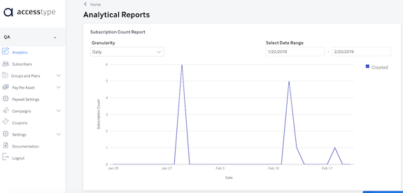

# Release Notes

This section contains important Accestype release notes. For any queries, please write to us at [support@quintype.com](mailto:support@quintype.com).

## 5 Nov 19 Release Note - Accesstype
1. **General Settings** - A new settings page with Account Detailsm API Key and Authentication Key. The API Authentication and API Key fields are displayed to Users with the "Owner" role.

2. **Admin email addresses** - A new feature to manage recepients of all admin related emails.

3. **Trial Period in Recurring Subscriptions** - A new feature where recurring subscription plans now have the ability to offer subscribers a trial period before actually being charged. This is functional with Razorpay payment gateway.

## 22 Oct 19 Release Note - Accesstype
1. **Accesstype.js new method** - Cancel Subscription is now allowed as a method in Accesstype.js.

## 25 Sep 19 Release Note - Accesstype
1. **Outgoing Webhooks** - Webhooks setup in Accesstype will automatically be de-activated if Accesstype receives failure responses from the URL (`4**` or `5**` HTTP/S response code) for a period of 24 hours. Accesstype users can then enable them by going to the Webhooks dashboard.

## 17 Sep 19 Release Note - Accesstype
1. **Subscription Revenue Analytics** - The Revenue Graph indicates the total revenue generated by each individual Group or Plan in the selected time period. Option to choose the Granularity of data, Date range, Currency and Group/Plan.

2. **Subscriber Search upgrade** - Subscriber search result now displays the attempts made by the subscriber as well.

## 10 Sep 19 Release Note - Accesstype
1. **Subscriber Search upgrade** - Subscriber search now looks for users who have attempted to make a payment even if the users do not have a subscription record.

## 28 Aug 19 Release Note - Accesstype
1. **Stripe Payment Gateway Integration** - Accestype now integrates with Stripe to collect payments. This includes update includes accepting one-time payments from subscribers in INR and USD currencies, listens to webhooks from Stripe and stores payment transaction information in Accesstype.

2. The Subscriber object is now included in the Subscription Object in all the webhook payloads as well as Subscription Preview and Create API responses.
3. **Skip Payment Gateway when no payment needed**Accesstype now has the ability to create subscriptions without payment gateway involvement for subscriptions that don't have a payment to be made.

## 19 Aug 19 Release Note - Accesstype
1. Attempts CSV report now contains the payment gateway that was used by the potential subscriber to perform the attempt to subscribe.
2. [Bug fix] - Add identity now trims leading and trailing spaces when Accesstype user adds an email.
3. [Bug fix] - Paywall meter cookie is now persistent on exiting the browser application.

## 8 Aug 19 Release Note - Accesstype
1. **Update Subscriber metadata** - Subscriber information can now be updated by using Accesstype JS.
2. Manual Subscriptions can now be created and Amount Paid can be captured by Accesstype Owners using the dashboard. 
Go to Accesstype.com > Subscribers > Add new user or find a user by entering email > Select the Group and Plan > Enter Amount paid and notes if any > Click on Save.

## 5 August 19 Release Note - Accesstype
1. **Outgoing Webhooks (update)** - **Subscriber Creation** webhook is an additional event that is now available for use. **Time-outs** are now applied to the webhook call that are made to third party systems. Time-outs are set at 10s to establish a connection and 5s to receive a response to the POST API calls.
2. **Skip payment gateway** Accesstype now allows subscriptipons to be created when no  amount is required to be paid. This may happen when the price of the plan is set to 0 or when the entire plan amount is discounted using a coupon code.

## 30 Jul 19 Release Note - Accesstype
1. Juspay payment now opens up in a new tab instead of a new pop-up window.

## 26 Jul 19 Release Note - Accesstype
1. **Outgoing Webhooks (update)** - **Subscription Activation** and **Subscription Entered Grace Period** are the events that are additionally available for use.

## 19 Jul 19 Release Note - Accesstype
1. **Outgoing Webhooks (update)** - **Subscription Creation**, **Subscription Cancellation** and **Subscription Renewal** are the events that are additionally available for use.

## 1 Jul 19 Release Note - Accesstype
1. **Outgoing Webhooks** - Accesstype now has the ability to make webhook calls to third party systems on specific events. Click here to know more about [Accesstype webhooks](#webhooks), [how to set up webhooks](#how-to-setup-accesstype-webhooks), a [description of the events](#description-of-events) and [how to verify the webhooks sent by Accesstype](#verify-webhooks-sent-by-accesstype).

As part of this release, the **Subscription Expiry** event is available for use.

## 27 Jun 19 Release Note - Accesstype
1. Cloudfalre purge optimisations.

## 25 Jun 19 Release Note - Accesstype
1. Subscription Preview and Subscription Create without a login, are now allowed in Accesstype.js and served from the Cloudflare edge worker.

## 21 Jun 19 Release Note - Accesstype
1. Accesstype is now integrated with Voucherify so Discount and Referral vouchers can be applied redeemed by subscribers in One-Time subscriptions and Pay Per Asset subscriptions.

## 18 Jun 19 Release Note - Accesstype
1. Get Subscriptions and Get Assets APIs are now available in Accesstype.js and served from the Cloudflare Edge worker.

## 13 Jun 19 Release Note - Accesstype
1. Use publisher domain specific cookie for Paywall meter.

## 29 May 19  Release Note - Accesstype
1. Razorpay proactive subscription creation bug fixes.

## 20 May 19 Release Note - Accesstype
1. Access grant API now served from the Cloudflare edge worker.

## 10 May 19 Release Note - Accesstype
1. Juspay payment optimisations.

## 24 Apr 19 Release Note - Accesstype
1. Paywall meter and Coudflare purge optimisations.

## 17 Apr 19 Release Note - Accesstype
1. **Consolidated Daily Subscription Report:** This daily subscription report contains Subscription details, payment information, tax invoice data and subscriber information for Plan based subscriptions, PPA purchases and Campaign subscriptions, all in one file.

This CSV report is generated daily for the previous day and is available at 

Accesstype > Analytics > Reports 

## 11 Apr 19 Release Note - Accesstype
1. Accesstype now uses serverless computing technology for increased efficiency in performance, scalability and resilience.

## 29 Mar 19 Release Note - Accesstype
1. **CSV reports now include Payment Transaction Date** for better reconciliation of Recurring subscriptions.
2. **Bug fix:** The Manage Subscription Plan and Group had hidden buttons.
3. **Bug fix:** Recheck Paytm transaction status when it is in pending state.

## 28 Mar 19 Release Note - Accesstype
1. **CSV reports now include the International Payment column** to help identify those payments that are made using international cards.

**Note:** This is applicable to Razorpay payment gateway only. 

## 18 Feb 19 Release Note - Accesstype
1. **Juspay integration** - Integration with payment aggregator [Juspay](https://juspay.in) for iframe type of integration. Juspay's algorithms choose the best payment gateways for best success rates and also take into account pre-defined priority logic to offer the most efficient payment option to customers. 
To create a Merchant account on Juspay write to [support@juspay.in](mailto:support@juspay.in).

2. **Analytics Dashboard** - Monthly and daily insights into the total number of subscriptions that are created.

## 4 Jan 19 Release Note - Accesstype
1. **Updated Subscription CSV Report** - The subscription CSV Report now contains additional fields for financial related purposes: Base Price, Discount amounts, amount after discount before tax and round-off.
2. **Subscriber Name** - The Subscriber name is now displayed in Accesstype UI as well as the CSV report by default, for all subscriptions, Pay Per Asset purchases and Campaign Patrons.

3. **Getsimpl workflow upgrades** - Optimizations and security enhancements on Simpl payment option workflow. 
4. **Bug fixes - Subscription CSV Report** - Duplicate entires for recurring subscriptions are elimiated and tax amounts are displayed under the appropriate columns.

## 12 Dec 18 Release Notes - Accesstype

### New Features:
1. **Invoicing and Taxes** - Set up tax names and rates for generating Invoices. The tax rates set up in this module are applied and tax amounts calculated such that the price of the plan/asset is inclusive of taxes.

2. **HTML Template for Invoices** - Upload the HTML invoice using Accesstype. The template can include a bunch of variables that are listed [here](#get-invoice-pdf-download). The Invoice Sequence Prefix of your choice can also be updated. Write to us at [support@quintype.com](mailto:support@quintype.com) to reset the invoice sequence number. 

3. **API for PDF invoice download** - The API end point to download PDF invoices for a given subscription is available [here](#get-invoice-pdf-download) for those on [Quintype](https://www.quintype.com) platform and [here](#get-invoice-details-for-a-subscription) for those not on the [Quintype](https://www.quintype.com) platform. **Note:** The method to invoke the download Invoice PDF API call can also be made using the AccesstypeJS which is described [here](https://github.com/quintype/subtype/blob/master/frontend/README.md) and [here](https://github.com/quintype/subtype/blob/master/frontend/API.md).

## 11 Oct 18 Release Notes - Accesstype

### New Features:
1. **[Paytm Payment Gateway - Auto Debit](https://business.paytm.com/developers-api/integration/auto-debit/overview)** - Accept one-click payments for individual stories using [Paytm](https://business.paytm.com) wallets. Customers can link their wallet and purchase individual stories by just a single click.

The Paytm Auto Debit option can be used via the Accesstype JS. Documentation available here:
[Accesstype.js link 1](https://github.com/quintype/subtype/blob/master/frontend/README.md)
[Accesstype.js link 2](https://github.com/quintype/subtype/blob/master/frontend/API.md)
**Coming soon:** Paytm-Auto Debit on standard plans.

2. URLs of reports generated in Accesstype, are now signed using private URLs and have an expiry for enhanced security.

## 24 Sep 18 Release Notes - Accesstype

### New Features:
1. **Accesstype Javascript** - Publishers on the [Quintype](https://www.quintype.com) platform can now easily integrate with Payment Gateways/Wallets as well as set up conversations with Accesstype servers, all in one place using methods in accesstype.js
	1. **Pay Per Asset(PPA)** APIs to get the price of a story, view available payment options for the user, purchase stories can be called using methods available in Accesstype.js
	2. Accept payments from [**Simpl**](https://getsimpl.com) payment gateway using accesstype.js for both traditional plans as well as for individual stories(PPA)
	3. Accept payments from [**Razorpay**](https://razorpay.com) payment gateway using accesstype.js for both traditional plans as well as for individual stories(PPA)
**Documentation links:**
[Accesstype.js link 1](https://github.com/quintype/subtype/blob/master/frontend/README.md)
[Accesstype.js link 2](https://github.com/quintype/subtype/blob/master/frontend/API.md)
**Note:** To integrate accesstype.js with your website, please get in touch with your account managers or contact us at [support@quintype.com](mailto:support@quintype.com)

2. **Pay Per Asset(PPA)** - Publishers on the [Quintype](https://www.quintype.com) platform can now sell each story(a.k.a asset) individually. Set up pricing for stories and view all purcchases of individual stories using the Accesstype application.

3. **New Payment Gateway - Simpl** - Publishers can activate and use the [Simpl](https://getsimpl.com) payment gateway options for frictionless payments. Also available in the Accesstype.js

4. **Menu restructure** - The Accesstype menu is now restructured for easy navigation and segregation of subscription/purchase information.

5. Encryption of Wallet token.

## 6 Aug 18 Release Notes - Accesstype

### Enhancements and bug fixes:
1. Wallets API - Link wallets of [Simpl](https://getsimpl.com) and [PayTm](https://paytm.com) with publishers. Documentation available [here](#post-subscriber-wallet-token)
2. Emails sent out to subscribers have a new look.
3. Enhancements to help reconcile subscription failures using Android Pay if any.
4. Minor bug fixes.

## 10 Jul 18 Release Notes - Accesstype

### Enhancements and bug fixes:
1. Updated the Subscriptions Report to include Plan names of the group, Subscription Created Date and Subscription Start Date.
2. Security and user concurrency upgrades.

## 28 Jun 18 Release Notes - Accesstype

### Enhancements and bug fixes:
1. Accesstype users will now have their activities within the application, logged in the database.
2. Users will now know the account that they are actively working on.

3. Optimisation in payment gateway integration: Subscription attempts, sucscription creations and multiple payments associated with a subscription are now traceable.
4. Users can now get instant help using the help chat.

5. Easy access link to Accesstype documentation.
6. [Bug fix] Razorpay payment transaction amounts rounded down in CSV reports
7. Other bug fixes.