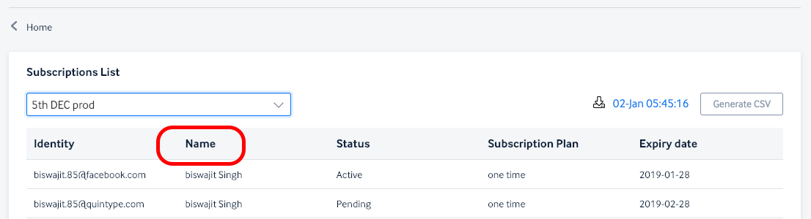
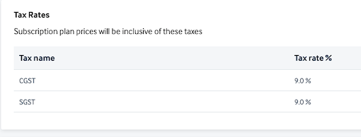
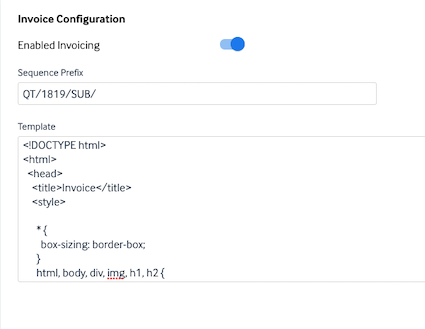
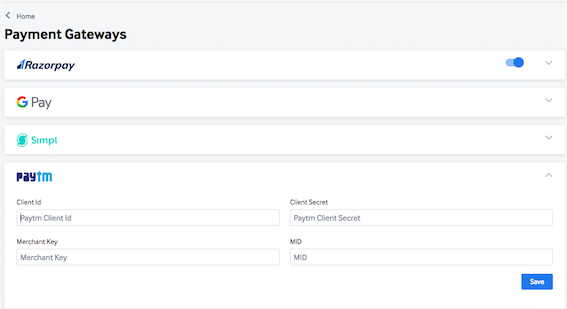
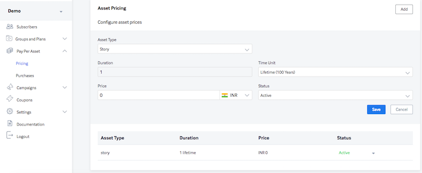
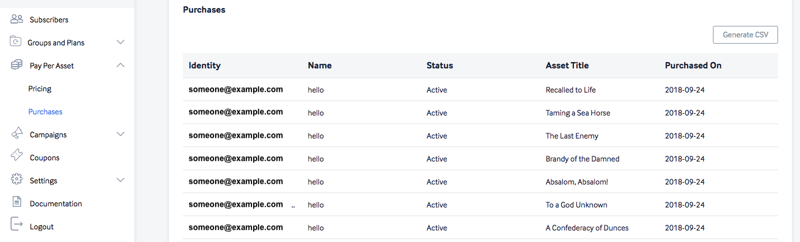
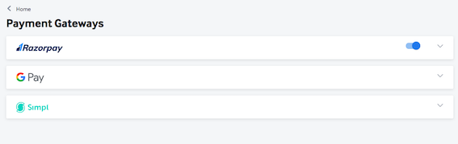
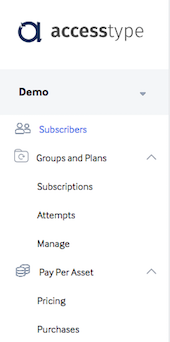
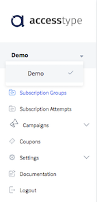
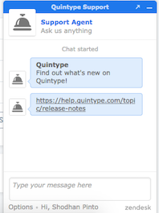

# Release Notes

This section contains important Accestype release notes. For any queries, please write to us at [support@quintype.com](mailto:support@quintype.com).

## 4 Jan 2019 Release Note - Accesstype
1. **Updated Subscription CSV Report** - The subscription CSV Report now contains additional fields for financial related purposes: Base Price, Discount amounts, amount after discount before tax and round-off.
2. **Subscriber Name** - The Subscriber name is now displayed in Accesstype UI as well as the CSV report by default, for all subscriptions, Pay Per Asset purchases and Campaign Patrons.

3. **Getsimpl workflow upgrades** - Optimizations and security enhancements on Simpl payment option workflow. 
4. **Bug fixes - Subscription CSV Report** - Duplicate entires for recurring subscriptions are elimiated and tax amounts are displayed under the appropriate columns.

## 12 Dec 2018 Release Notes - Accesstype

### New Features:
1. **Invoicing and Taxes** - Set up tax names and rates for generating Invoices. The tax rates set up in this module are applied and tax amounts calculated such that the price of the plan/asset is inclusive of taxes.

2. **HTML Template for Invoices** - Upload the HTML invoice using Accesstype. The template can include a bunch of variables that are listed [here](#get-invoice-pdf-download). The Invoice Sequence Prefix of your choice can also be updated. Write to us at [support@quintype.com](mailto:support@quintype.com) to reset the invoice sequence number. 

3. **API for PDF invoice download** - The API end point to download PDF invoices for a given subscription is available [here](#get-invoice-pdf-download) for those on [Quintype](https://www.quintype.com) platform and [here](#get-invoice-details-for-a-subscription) for those not on the [Quintype](https://www.quintype.com) platform. **Note:** The method to invoke the download Invoice PDF API call can also be made using the AccesstypeJS which is described [here](https://github.com/quintype/subtype/blob/master/frontend/README.md) and [here](https://github.com/quintype/subtype/blob/master/frontend/API.md).

## 11 Oct 2018 Release Notes - Accesstype

### New Features:
1. **[Paytm Payment Gateway - Auto Debit](https://business.paytm.com/developers-api/integration/auto-debit/overview)** - Accept one-click payments for individual stories using [Paytm](https://business.paytm.com) wallets. Customers can link their wallet and purchase individual stories by just a single click.

The Paytm Auto Debit option can be used via the Accesstype JS. Documentation available here:
[Accesstype.js link 1](https://github.com/quintype/subtype/blob/master/frontend/README.md)
[Accesstype.js link 2](https://github.com/quintype/subtype/blob/master/frontend/API.md)
**Coming soon:** Paytm-Auto Debit on standard plans.

2. URLs of reports generated in Accesstype, are now signed using private URLs and have an expiry for enhanced security.

## 24 Sep 2018 Release Notes - Accesstype

### New Features:
1. **Accesstype Javascript** - Publishers on the [Quintype](https://www.quintype.com) platform can now easily integrate with Payment Gateways/Wallets as well as set up conversations with Accesstype servers, all in one place using methods in accesstype.js
	1. **Pay Per Asset(PPA)** APIs to get the price of a story, view available payment options for the user, purchase stories can be called using methods available in Accesstype.js
	2. Accept payments from [**Simpl**](https://getsimpl.com) payment gateway using accesstype.js for both traditional plans as well as for individual stories(PPA)
	3. Accept payments from [**Razorpay**](https://razorpay.com) payment gateway using accesstype.js for both traditional plans as well as for individual stories(PPA)
**Documentation links:**
[Accesstype.js link 1](https://github.com/quintype/subtype/blob/master/frontend/README.md)
[Accesstype.js link 2](https://github.com/quintype/subtype/blob/master/frontend/API.md)
**Note:** To integrate accesstype.js with your website, please get in touch with your account managers or contact us at [support@quintype.com](mailto:support@quintype.com)

2. **Pay Per Asset(PPA)** - Publishers on the [Quintype](https://www.quintype.com) platform can now sell each story(a.k.a asset) individually. Set up pricing for stories and view all purcchases of individual stories using the Accesstype application.

3. **New Payment Gateway - Simpl** - Publishers can activate and use the [Simpl](https://getsimpl.com) payment gateway options for frictionless payments. Also available in the Accesstype.js

4. **Menu restructure** - The Accesstype menu is now restructured for easy navigation and segregation of subscription/purchase information.

5. Encryption of Wallet token.

## 6 Aug 2018 Release Notes - Accesstype

### Enhancements and bug fixes:
1. Wallets API - Link wallets of [Simpl](https://getsimpl.com) and [PayTm](https://paytm.com) with publishers. Documentation available [here](#post-subscriber-wallet-token)
2. Emails sent out to subscribers have a new look.
3. Enhancements to help reconcile subscription failures using Android Pay if any.
4. Minor bug fixes.

## 10 Jul 2018 Release Notes - Accesstype

### Enhancements and bug fixes:
1. Updated the Subscriptions Report to include Plan names of the group, Subscription Created Date and Subscription Start Date.
2. Security and user concurrency upgrades.

## 28 Jun 2018 Release Notes - Accesstype

### Enhancements and bug fixes:
1. Accesstype users will now have their activities within the application, logged in the database.
2. Users will now know the account that they are actively working on.

3. Optimisation in payment gateway integration: Subscription attempts, sucscription creations and multiple payments associated with a subscription are now traceable.
4. Users can now get instant help using the help chat.

5. Easy access link to Accesstype documentation.
6. [Bug fix] Razorpay payment transaction amounts rounded down in CSV reports
7. Other bug fixes.