# Tutorial - Android

## Getting Started

We strongly recommend using Android Studio v2.3.3 and above. We work on Android Studio v2.3.3 at time of our first public **SensumSDK** release.

 * Open Android Studio
 * Select **New Project** displayed in Figure X

 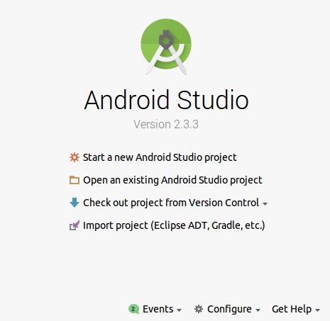
#### <p style="text-align: center;">Figure 1 - Start New Project</p>
<br>

 * Provide a name for your project, for example: '*SensumTutorialApplication*', then click **Next**.

 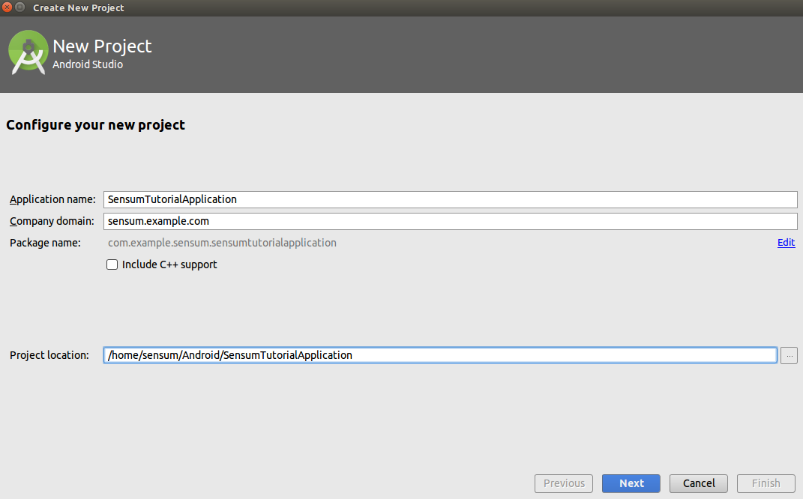
#### <p style="text-align: center;">Figure 2 - Create New Project</p>
<br>

 * Select the **Phone and Tablet**, and **Wear** options from the *Target Android Devices* dialogue window.
 * We recommend you use API 22: Android 5.1 (Lollipop) or greater for best performance.

 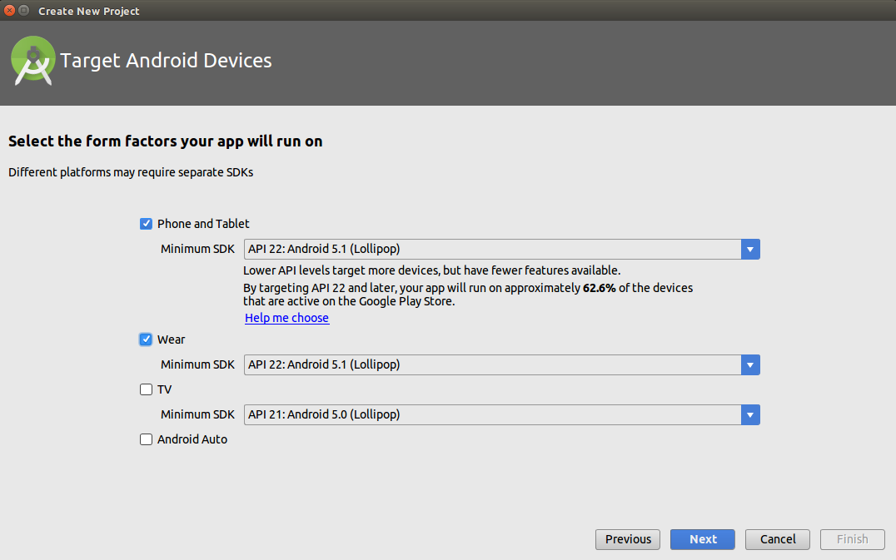
#### <p style="text-align: center;">Figure 3 - Select Platforms</p>
<br>

 * Click **Next** and select **Empty Activity** as shown in Figure 4.

 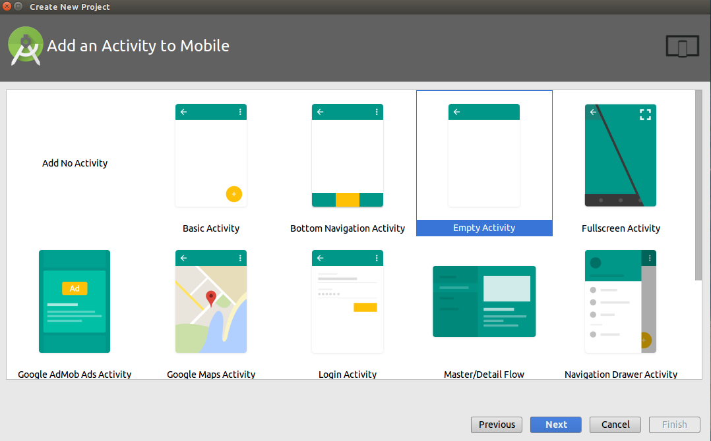
#### <p style="text-align: center;">Figure 4 - Add Activity</p>
<br>

 * Click **Next** in order to configure the Empty Activity, provide an appropriate title for the *Activity* (for example ‘MainActivity’, as shown in Figure 5).

 
#### <p style="text-align: center;">Figure 5 - Customize the Activity</p>
<br>

 * Click **Next**, then select **Blank Wear Activity** in the Add an *Activity to Wear* dialogue window(Figure 6).


 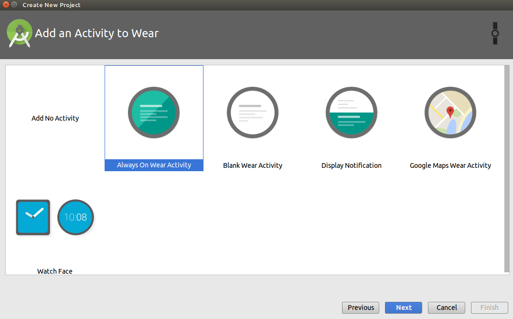
#### <p style="text-align: center;">Figure 6 - Add an Activity to Wear</p>
<br>

 * Click **Next**, you will be presented with the *Customize the Activity* dialogue window.  You may optionally alter the default titles of your: *Activity Name*, *Layout Name*, *Round Layout Name*, and *Rectangular Layout Name* (Figure 7).
 * Click **Finish**

  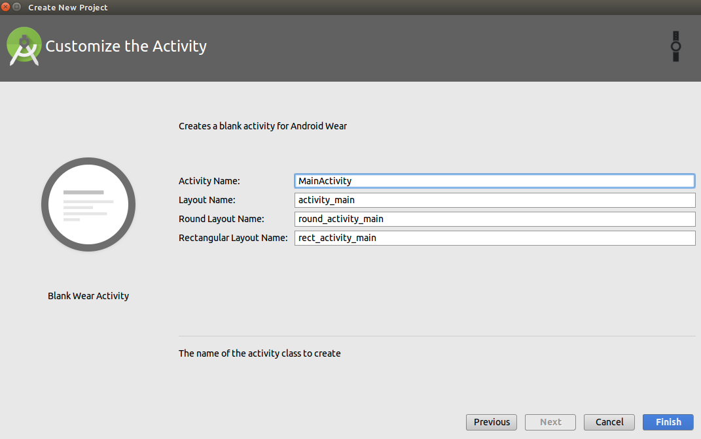
#### <p style="text-align: center;">Figure 7 - Customize the Wear Activity</p>
<br>

## Managing Project Dependencies

 * From the *File* menu, navigate to *File* > *New* > *New Module* (Figure 8).

  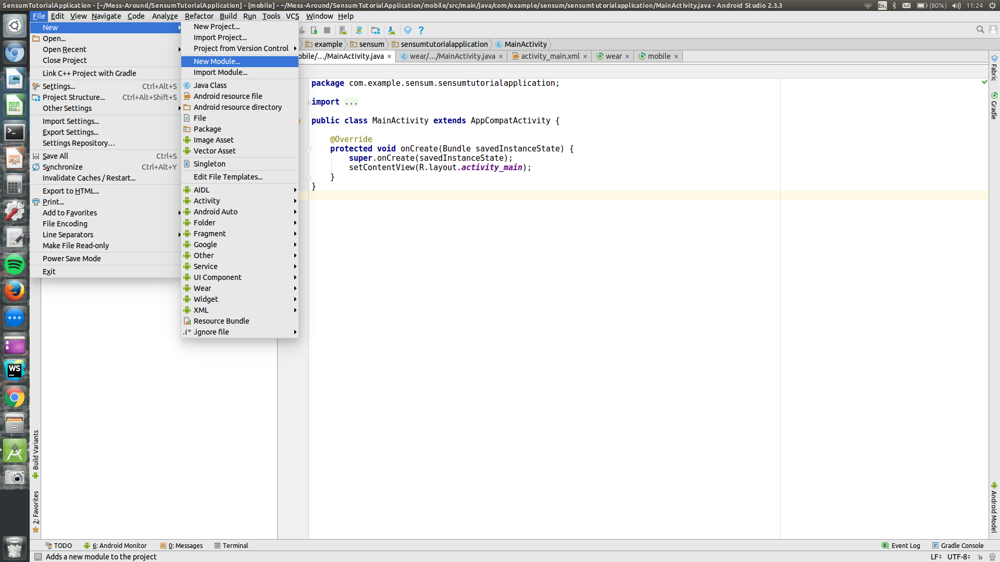
#### <p style="text-align: center;"> Figure 8 - New Module</p>
<br>

 * The *New Module* dialogue window will appear. Select the **Import .JAR/.AAR Package** option (Figure 9).
 * Click **Next**

  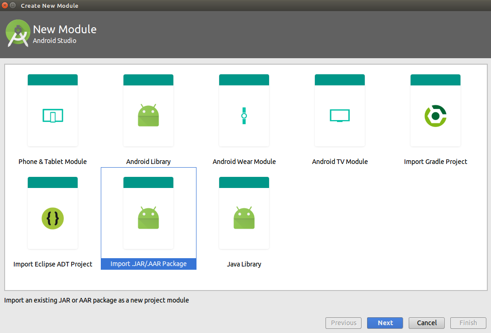
#### <p style="text-align: center;"> Figure 9 - Import .JAR/.AAR Package</p>
<br>

 * The Create New Module dialogue window will appear (shown in Figure 10).
 * In order to successfully create a new module, the developer must locate the necessary **sdk-release** file on their system.


  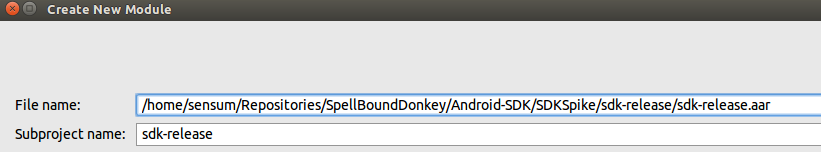
#### <p style="text-align: center;"> Figure 10 - Create New Module</p>
<br>

 * Once the **sdk-release** file has been located, click *Finish*.

 * In order to link the **sdk-release** file to the project as a dependency, the developer must navigate to *File* > *Project Structure*, from the *File* menu (Figure 11).

  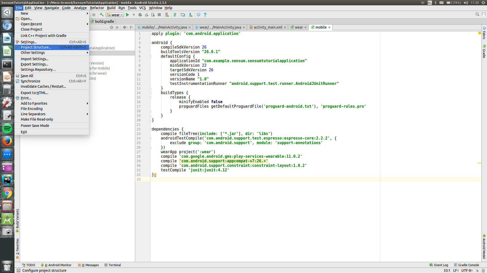
#### <p style="text-align: center;">Figure 11 - Project Structure</p>
<br>

 * You will be presented with the Project Structure dialogue window.
 * At the left-hand-side of the dialogue, select **mobile** from the *Modules* section.
 * Click the *Dependencies* tab, then click the ‘**+**’ button (top right-hand-side of dialogue), then select the third option: **3 Module Dependency** (Figure 12).

  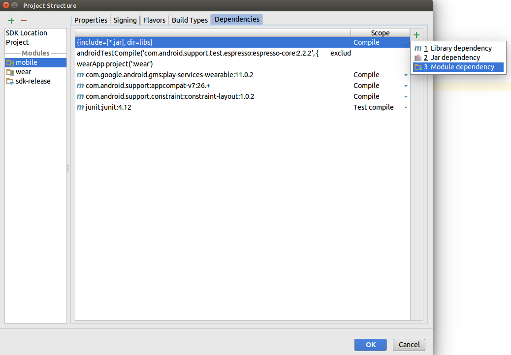
#### <p style="text-align: center;">Figure 12 - Module Dependency</p>
</br>

 * You will be presented with the *Choose Modules* dialogue window (Figure 13).

  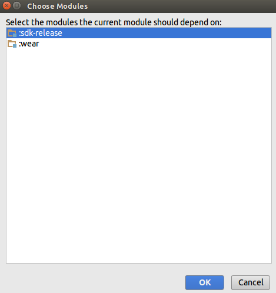
#### <p style="text-align: center;">Figure 13 - Choose Modules</p>
<br>

* Select the **sdk-release**, and click **OK**.
* You will return to the *Project Structure* dialogue window, once again, click **OK**.


## Including Permissions

 * A number of permissions are required to use the Sensum **sdk-release**, shown in Code Snippet 1.
 * Include these permissions within your manifest file (*AndroidManifest.xml*).

 > Code Snippet 1

```xml
<uses-permission android:name="android.permission.BLUETOOTH" />
<uses-permission android:name="android.permission.BLUETOOTH_ADMIN" />
<uses-permission android:name="android.permission.ACCESS_FINE_LOCATION"/>
<uses-permission android:name="android.permission.INTERNET"/>
 <uses-permission android:name="android.permission.ACCESS_NETWORK_STATE"/>
<uses-permission android:name="android.permission.WRITE_EXTERNAL_STORAGE"/>
```

## Creating a Service

 * The **SensumSDK** runs in the background of the application.
The developer is required to create a *ServiceConnection*, that is responsible for communication between the application front-end and the **SensumSDK**.
In order to create this *ServiceConnection*, follow the steps outlined within Code Snippet 2.
 * The developer will need to create an instance of the *Messenger* object. This object has the ability to send *Message* objects to the *Service*. Once the over-ridden `onServiceConnected` method is called, the `Messenger` object is initialised using the passed in `IBinder` object.

> Code Snippet 2

```java
private final ServiceConnection mConnection = new ServiceConnection() {
        @Override
        public void onServiceConnected(ComponentName componentName, IBinder iBinder) {
            mIsBound = true;
            mServiceMessenger = new Messenger(iBinder);
        }

       @Override
        public void onServiceDisconnected(ComponentName componentName) {
            Log.d(TAG, "onServiceDisconnected: ");
        }
    };
```

* Declare the Service within your manifest file (*AndroidManifest.xml*) as shown in Code Snippet 3.

> Code Snippet 3

```xml
<service android:name="co.sensum.sensumservice.SDK.SdkService"/>
```

## Using a Broadcast Receiver

 * A *BroadcastReceiver* ‘listens’ for (receives and handles) *Broadcast Intents*, sent by the *Service*.
 * The *BroadcastReceiver* is essential as it manages messages sent from the **sdk-release**, within the front-end application.
 * The *BroadcastReceiver* makes use of *Filters*, that determine which events the application should ‘listen’ for.
 * The over-ridden method *.onReceive* takes two arguments: *Context* and *Intent*. The *Intent* parameter has an associated action that specifies how the
 *BroadcastReceiver* should behave.
 * Table 1 outlines the filters included in the *Service* and the *Intent Extras* they return.

### Table 1

|Action|Description|IntentExtras|
|------|-----------|------------|
|**BLE_DEVICE_FILTER**|Filters for BLE devices|`ArrayList<BluetoothDevice>`|
|**VALUE_FILTER**|Filters for heart rate value|`String`|
|**GPS_FILTER**|Filters for GPS values|`Bundle`|
|**ACC_FILTER**|Filters for acceleration values|`Bundle`|
|**DEVICE_DISCONNECTED**|Filters for a device disconnected value|`null`|
|**API_RESPONSE**|Filters for responses from the API|`String`|
|**TOAST_MESSAGE**|Filters for messages from the Service|`String`|
|**CONNECTION_FILTER**|Filters for connection BLE messages|`String`|
|**BLUETOOTH_CONNECTION_FILTER**|Filters for bluetooth connection messages|`String`|
|**BLUETOOTH_DEVICE_FILTER**|Filters for bluetooth devices|`ArrayList<BluetoothDevice>`|
|**GSR_FILTER**|Filters for GSR values|`String`|
|**ACC_FAILED_REGISTERED**|Filters for acceleration failure from unsupported devices|`null`|
|**HELLO_FILTER**|Filters for hello message|`String`|

## Setting up the Broadcast Receiver

  * Code Snippet 4 contains all necessary code that will allow you to setup a *BroadcastReceiver*.

> Code Snippet 4

  ```java
    private BroadcastReceiver mMessageReceiver = new BroadcastReceiver() {
        @Override
        public void onReceive(Context context, Intent intent) {
            String action = intent.getAction();
            switch (action){
                case HELLO_FILTER:
                    Toast.makeText(MainActivity.this, intent.getStringExtra(EXTRA_DATA), Toast.LENGTH_LONG).show();
                    break;
                case GPS_FILTER:
                    Bundle gpsBundle = intent.getBundleExtra(EXTRA_DATA);
                    break;
                case ACC_FILTER:
                    Bundle accBundle = intent.getBundleExtra(EXTRA_DATA);
                    isAcc = true;
                    break;
                case VALUE_FILTER:
                    String hrValue = intent.getStringExtra(EXTRA_DATA);
                    break;
                case GSR_FILTER:
                    String gsrValue = intent.getStringExtra(EXTRA_DATA);
                    break;
                case API_RESPONSE:
                    String apiResponse = intent.getStringExtra(EXTRA_DATA);
                    break;
                case TOAST_MESSAGE:
                    String toastMessage = intent.getStringExtra(EXTRA_DATA);
                    break;
            }
        }
    };
  ```

 * The *BroadcastReceiver* must be registered in order to receive *Intents* from a *Service*.
 * The `registerReceiver` method, takes two arguments: *BroadcastReceiver* and *IntentFilter*.
 * We have included our own method that returns an *IntentFilter:* `getUpdateIntentFilter` (this method is displayed within Code Snippet 6).
 * This method should be called immediately on starting the application, therefore, it is placed within the `.onResume` method, as shown in Code Snippet 5.

> Code Snippet 5

```java
 @Override
    protected void onResume() {
        super.onResume();
        registerReceiver(mMessageReceiver, getUpdateIntentFilter());
    }
```

> Code Snippet 6

```java
  private IntentFilter getUpdateIntentFilter() {
        IntentFilter filter = new IntentFilter();
        filter.addAction(HELLO_FILTER);
        filter.addAction(GPS_FILTER);
        filter.addAction(ACC_FILTER);
        filter.addAction(VALUE_FILTER);
        filter.addAction(GSR_FILTER);
        filter.addAction(API_RESPONSE);
        filter.addAction(TOAST_MESSAGE);
        return filter;
    }
```

 * When the application is destroyed (on application close/force-close), the *BroadcastReceiver* must be unregistered. This is handled via the `.onDestroy` method.
Code Snippet 7 demonstrates how to achieve this.

> Code Snippet 7

```java
    @Override
    protected void onDestroy() {
        super.onDestroy();
        if (mIsBound){
            unbindService(mConnection);
            mIsBound = false;
            unregisterReceiver(mMessageReceiver);
        }
    }
```

## Communicating with the Service

 * The application’s communication with the *Service* requires that commands be sent via *Message* objects.
 * The *Message* object contains a property called `arg1` (which is an Integer value). This Integer value represents one of the possible options listed in the Constants column of Table 2 (corresponding to an integer value between 0 and 8). This property (`arg1`) will carry the command you want to request from the *Service*.

### Table 2

|Constants (of type 'Int')|Required Bundle Data|
|-------------------------|--------------------|
|**CONNECT**|`String DEVICE_NAME, String DEVICE_ADDRESS`|
|**BLE_SCAN**|`null`|
|**START_CAPTURE**|`boolean ACCELERATION_CAPTURE, boolean HR_CAPTURE, boolean GPS_CAPTURE, boolean INPUT_CAPTURE, int DATA_RATE_SAMPLE, int DATA_RATE_SEND`|
|**CANCEL_CAPTURE**|`boolean ACCELERATION_CAPTURE, boolean HR_CAPTURE, boolean GPS_CAPTURE, boolean INPUT_CAPTURE`|
|**LOGIN**|`String USER_NAME, String PASSWORD, String API_BASEURL, String AUTH_TOKEN`|
|**GOOGLE_LOGIN**|`String API_BASEURL_IAM, String API_KEY, String IDENTITY_POOL_ID, String GOOGLE_ID_TOKEN, String GOOGLE_AUTH_CODE`|
|**INPUT_TEXT**|`String TEXT_MESSAGE`|
|**BLUETOOTH_SCAN**|`null`|
|**CONNECT_BLUETOOTH_DEVICE**|`String DEVICE_NAME, String DEVICE_ADDRESS`|
|**HELLO**|`null`|
|**EXPORT_DATABASE**|`null`|
|**DELETE_ALL_DATA**|`null`|

 * This *Message* object also has the capacity to transmit data in the form of a *Bundle*.
 * A *Bundle* contains associated data that can be interpreted by the *Service*.
 * Table 2 indicates the relationship between selected Constants, and the requirements for a *Bundle* of a particular type.
  * e.g. If using the CONNECT constant, then the associated *Bundle* should contain two Strings, one for DEVICE_NAME, the other for DEVICE_ADDRESS.
 * Code Snippet 8 illustrates how to construct a *Message* object, and how to send it on to the *Service*.
 * The *Messenger* object, `mServiceMessenger`, is able to execute its associated `.send` method. This sends the constructed *Message* object to the *Service*.

> Code Snippet 8

 ```java
   public void sendToService(Bundle bundle, int argValue){
        Message message = Message.obtain();
        message.arg1 = argValue;
        message.setData(bundle);
        try {
            mServiceMessenger.send(message);
        } catch (RemoteException e) {
            e.printStackTrace();
        }
    }
 ```

## Testing the Service

 * To test the service the developer create a *Button* that will be able to send a *Message* to the *Service*.
 * Within the `onClickListener` make a call to the `sendToService` method. Enter **null** as the first parameter (*Bundle*) and **HELLO** as the second parameter (*int*).
 * This will send this the *Message* to the *Service*.
 * The *Service* will receive this *Message* and send a *Broadcast* on which the *BroadcastReceiver* will listen for.
 * The *BroadcastReceiver* will handle the *action* and in this case the *action* will fall under the HELLO_FILTER case.
 * It is up to the developer what they wish to do with the returned *String*.

> Code Snippet 9

```java
  private BroadcastReceiver mMessageReceiver = new BroadcastReceiver() {
        @Override
        public void onReceive(Context context, Intent intent) {
            String action = intent.getAction();
            switch (action){
                case HELLO_FILTER:
                    Toast.makeText(MainActivity.this, intent.getStringExtra(EXTRA_DATA), Toast.LENGTH_LONG).show();
                    break;
                case GPS_FILTER:
                    Bundle gpsBundle = intent.getBundleExtra(EXTRA_DATA);
                    break;
                case ACC_FILTER:
                    Bundle accBundle = intent.getBundleExtra(EXTRA_DATA);
                    isAcc = true;
                    break;
                case VALUE_FILTER:
                    String hrValue = intent.getStringExtra(EXTRA_DATA);
                    break;
                case GSR_FILTER:
                    String gsrValue = intent.getStringExtra(EXTRA_DATA);
                    break;
                case API_RESPONSE:
                    String apiResponse = intent.getStringExtra(EXTRA_DATA);
                    break;
                case TOAST_MESSAGE:
                    String toastMessage = intent.getStringExtra(EXTRA_DATA);
                    break;
            }
        }
    };
```
 * Set up a button in your front-end activity/fragment
 * Inside the `onClickListener` include the lines shown in Code Snippet 10.

> Code Snippet 10

```java
Button button = (Button) findViewById(R.id.hello_button);
button.setOnClickListener(new View.OnClickListener() {
   @Override
   public void onClick(View view) {
       sendToService(null, HELLO);
   }
});
```

 * Then in the *BroadcastReceiver*, listen for the constant **HELLO_FILTER** (ensure that you are filtering for this in the call to register the receiver).

## Setting up BLE

 * To scan for Bluetooth Low Energy (BLE) devices, the developer will have to create a Button object that will tell the *Service* to start scanning.
 * As in the <a href ="#testing-the-service">__Testing the Service__</a> section, the developer should execute the `sendToService` method within the *Button’s* `onClickListener` (following Table 2).
 * The first parameter that the `sendToService` method expects in this instance is `null`, as there is no extra data that the Service needs to execute this task.
 * The second parameter that it takes is **BLE_SCAN** (Code Snippet 11).

> Code Snippet 11

```java
Button button = (Button) findViewById(R.id.scanButton);
button.setOnClickListener(new View.OnClickListener() {
   @Override
   public void onClick(View view) {
       sendToService(null, BLE_SCAN);
   }
});
```

## Receiving BLE Devices

 * To receive devices from the *Service* the developer will have to set up the *BroadcastReceiver* to listen for the **BLE_DEVICE_FILTER** constant.
 * Table 1 displays the data that the *Intent* received by the *BroadcastReceiver* carries.
 * In this case, the data that is received is an *ArrayList* of *BluetoothDevice’s*.
 * It is then up to the developer as to how they wish to display these devices. We would recommend that the user sets up a *ListView* or *RecyclerView*.

## Connecting a BLE Device

 * To connect a BLE device the developer will need to send two *String* objects as part of the *Bundle* object that will be sent to the *Service* as part of the `sendToService` method (Code Snippet 12).
 * According to Table 2, the two Strings that are required are the BLE devices’ name and address.
 * These are both required in order to create a connection between the Android device and the BLE device.
 * The developer should include the **CONNECTION_FILTER** constant within the *BroadcastReceiver’s* `onReceive` overridden method. According to Table 1, the data received is of type *String*. This *String* is a connection message sent back from the *Service* to notify the user whether the connection was successful or not.

> Code Snippet 12

```java
Bundle bundle =  new Bundle();
bundle.putString(ServiceConstants.DEVICE_NAME, deviceName);
bundle.putString(ServiceConstants.DEVICE_ADDRESS, deviceAddress);
sendToService(bundle, CONNECT);
```

## Receiving Values

 * This version of the **SensumSDK** only returns heart rate values from the BLE device, therefore the developer should ensure that the BLE device that they are using can detect heart rate.
 * On connection the BLE device will send values to the *Service*. The *Service* will then broadcast these values to the application that the developer has built.
 * The developer should include the **VALUE_FILTER** constant within the *BroadcastReceiver’s* `onReceive` method.
 * According to Table 1, the value received will be of type *String*. This value will be the heart rate.

## Bluetooth

 * To scan for, receive, and read values from Bluetooth devices, please follow the steps previously outlined within the <a href = "#setting-up-the-ble">Setting up BLE</a> section of this tutorial.
 * The same steps should be taken, however bear in mind that the constants should change i.e. replace BLE_SCAN with **BLUETOOTH_SCAN**.
 * This version of the **SensumSDK** will only connect to a *Shimmer* device. This device returns GSR values.
 * The developer should include the GSR_FILTER constant within the *BroadcastReceiver’s* `onReceive` method.
 * According to Table 1 the value received will be of type *String*. This value will be the GSR value.

**SensumSDK** supports connecting to BLE devices for reading heart rate measurements. For a list of tested compatible devices please view the <a href = "http://help.sensum.co/knowledge_base/topics/what-type-of-sensors-can-i-use"> list of compatible devices</a> at our Knowledge Centre.

**Note:** This document is regularly updated with new devices. Please contact us for integration details. GSR data is only accessible from Shimmer devices at present.

## Receiving GPS and Acceleration Values


 * GPS and Acceleration values will automatically be sent from the *Service* to the application’s frontend once the user has started the application and is authenticated (See <a href = "#google-sign-in">Google Sign-In Section</a>).
 * The developer should include the **GPS_FILTER** and the **ACC_FILTER** constants within the *BroadcastReceiver’s* `onReceive` method.
 * Both of these filters receive a bundle that contains multiple value types.
 * Refer to Table 3 to discover the value types returned from the *Service*.

### Table 3

|Filter|Bundle|Constants|Example Method Call|
|------|------|---------|-------------------|
|**GPS Filter**|Float speed|SPEED_VALUE|gpsBundle.getFloat(SPEED_VALUE)|
||Double latitude|LATITUDE_VALUE|gpsBundle.getFloat(LATITUDE_VALUE)|
||Double longitude|LONGITUDE_VALUE|gpsBundle.getFloat(LONGITUDE_VALUE)|
||Double altitude|ALTITUDE_VALUE|gpsBundle.getFloat(ALTITUDE_VALUE)|
||Float bearing|BEARING_VALUE|gpsBundle.getFloat(BEARING_VALUE)|
||Float accuracy|ACCURACY_VALUE|gpsBundle.getFloat(ACCURACY_VALUE)|
|**ACC_FILTER**|Float x|X_VALUE|accBundle.getFloat(X_VALUE)|
||Float y|Y_VALUE|accBundle.getFloat(Y_VALUE)|
||Float z|Z_VALUE|accBundle.getFloat(Z_VALUE)|


## Capturing Data

 * Once the developer is able to receive data from the *Service* and is authorised (See <a href ="#google-sign-in">Google Sign-In Section</a>), they can start to send data to the **SensumAPI**.
 * To do this the developer should create a *Button* object that implements the `sendToService` method (See <a href = "testing-the-service">Hello example</a> & <a href ="#table-2">Table 2</a> for more info).
 * This will send a message to the Service to start sending captured data to the **SensumAPI**.


 * The API will send back the analysed data to the service.


 * Within your activity set up a button that will scan for BLE devices
 * Just like the example before and using the table above setup the `sendToService` method within the `onClickListener`
 * To scan for BLE it will take **null** as the first parameter and **BLE_SCAN** for the second
 * To retrieve your device list you will have to include the intent filter in your receiver as like before
 * The intent filter for ble devices is BLE_DEVICE_FILTER

> Code Snippet 13

```java
case BLE_DEVICE_FILTER:
    ArrayList<BluetoothDevice> bleDevices = intent.getParcelableArrayListExtra(EXTRA_DATA);
```

 * The bundle which is returned from the broadcast intent includes an *ArrayList* of *BluetoothDevices*.
 * It is up to you how you want to display this list i.e. *ListView* or *RecyclerView*.

## Connecting a BLE Device

 * To connect a BLE device you will need to send a bundle to the *Service* which includes two Strings: **DEVICE_NAME** and **DEVICE_ADDRESS**.
 * These will be used to create the connection to the BLE device
 * In your *BroadcastReceiver* you should include the **CONNECTION_FILTER** constant to listen for a response from the service in regards to your connection request.

> Code Snippet 14

```java
case CONNECTION_FILTER:
    String connectionMessage = intent.getStringExtra(EXTRA_DATA);
    if(connectionMessage.equals("connected")){
    onConnection(true);
```

## Google Sign-In

 * For *Google Sign-In* the following *Play Service* dependency needs to be added to Gradle:

> Code Snippet 14

```java
compile 'com.google.android.gms:play-services-auth:+'
```
 * As part of enabling *Google APIs* or *Firebase* services in your Android application the `google-services.json` is processed by the `google-services` plugin. The `google-services.json` is created using *Firebase* during enabling *Google Services* for your Android application and is generally placed in the app/ directory (at the root of the Android Studio app module).
 * For *Google Sign-In* to work with *AWS* authentication, `OAuth 2.0 client ID` (*Google Android Client ID*) is required by *AWS*. The *Google Android Client ID* is created using *Google Developer Console* by providing your Android application package name and the SHA-1 signing-certificate fingerprint from Android Studio. The generated *Google Android Client ID* needs to be given to us for adding it to *AWS* for authentication.

 * In the `onCreate()` method of your sign-in `Activity`, the `GoogleSignInOptions` object should be instantiated which is used to create the `GoogleApiClient` which is used for accessing the *Google Sign-In API*.
 * The *Google Web Client ID* which is created in the *Google Developer Console* is required during the creation of the *Google Sign-In* object (shown in Code Snippet 15 as the `gso` object).

> Code Snippet 15

```java
GoogleSignInOptions gso = new GoogleSignInOptions.Builder(GoogleSignInOptions.DEFAULT_SIGN_IN)
       .requestEmail()
       .requestProfile()
       .requestIdToken(googleWebClientId)
       .requestServerAuthCode(googleWebClientId)
       .requestId()
       .build();

googleApiClient = new GoogleApiClient.Builder(this)
       .enableAutoManage(this, this )
       .addApi(Auth.GOOGLE_SIGN_IN_API, gso)
       .build();
```


* The Google Sign-In needs to be triggered, this is achieved via an *Intent*. Code Snippet 16 provides an example of this.

> Code Snippet 16

```java
Intent signInIntent = Auth.GoogleSignInApi.getSignInIntent(googleApiClient);
this.startActivityForResult(signInIntent, RC_SIGN_IN);
```

 * In `onActivityResult`, the *Google Sign-In* results should be handled and upon successful sign-in the *Google Id Token* and *Google Web Client ID* needs to be passed to the **SensumSDK** as a Bundle which is used for maintaining the user session for using the **SensumSDK**. Also for authentication the **SensumAPI** base URL, key and *AWS Identity Pool ID* are also needed to pass as a bundle. The **SensumSDK** ServiceConstants are used to pass the authentication parameters to the **SensumSDK** through Bundle. Code Snippet 17 provides an example of this.

> Code Snippet 17

```java
protected void onActivityResult(int requestCode, int resultCode, Intent data) {
   super.onActivityResult(requestCode, resultCode, data);
   if (requestCode == RC_SIGN_IN) {
       GoogleSignInResult result = Auth.GoogleSignInApi.getSignInResultFromIntent(data);
       GoogleSignInAccount acct = result.getSignInAccount();
       String googleIdToken = acct.getIdToken();
       Bundle bundle = new Bundle();
       bundle.putString(API_BASEURL, apiBaseUrl);
       bundle.putString(API_KEY, apiKey);
       bundle.putString(IDENTITY_POOL_ID, identityPoolId);
       bundle.putString(GOOGLE_ID_TOKEN, googleIdToken);
       bundle.putString(GOOGLE_WEB_CLIENT_ID, googleWebClientId);
       sendToService(bundle, GOOGLE_LOGIN);
   }
}
```
