# Tutorial - iOS

## Getting Started

The **SensumKit** framework is only compatible with **Swift 3** and above. We strongly recommend using **Xcode version 8 and above**. We work on **Xcode 8.3.3** at time of our first public framework release.

<!-- (UPDATE WITH ACCURATE DATE) -->

### Create a project

 * Select **Create a new Xcode project** displayed in Figure 1.

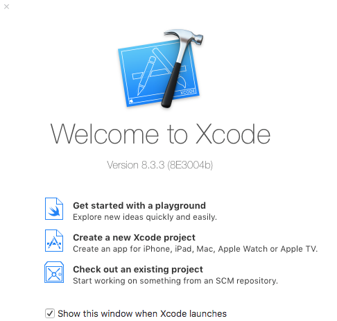
#### <p style="text-align: center;">Figure 1 - Project Creation in Xcode</p>
<br>

 * Select **Single View Application**.
 * Select **Swift** as the language and **iPhone** as the target device.

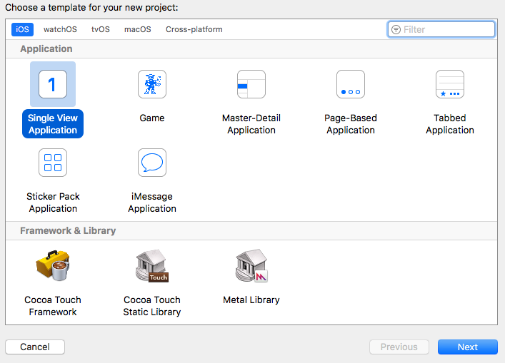
#### <p style="text-align: center;">Figure 2 - Project template selection in Xcode</p>
<br>

 * Name your application, for example: “SensumTutorialApplication” (as shown in Figure 3 below).
 * Enter your specific details for the: *Team*, *Organization Name*, and *Organization Identifier* fields.
 * Include *Unit Tests* and include *UI Tests* (*Core Data* can be omitted as *Realm* is the database framework employed, available from <a href = "https://realm.io/">https://realm.io/</a>).


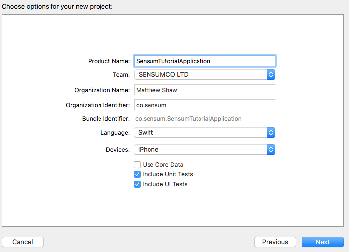
#### <p style="text-align: center;">Figure 3 - Project options in Xcode</p>
<br>

 * On completion of the above steps, select the **Next** button in order to save the project.
 * Once the project has been saved you should now be presented with the Xcode project file, indicated in Figures 4 and 5 (in this instance, "SensumTutorialApplication.xcodeproj", hereafter referred to as ‘the Xcode project file’).

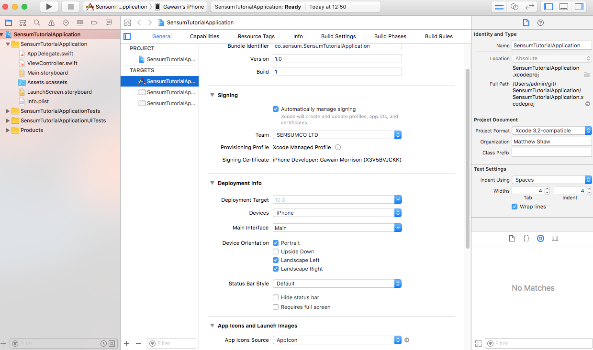
#### <p style="text-align: center;">Figure 4 - Overview of Xcode Environment</p>
<br>

, Xcode project file selected ")
#### <p style="text-align: center;">Figure 5 - Overview of Project Navigator (top left-hand-side of Figure 4), Xcode project file selected </p>
<br>


## Installing the SensumKit framework

 * Select the Xcode project file, navigate to the *General* tab, scroll down the page to the *Embedded Binaries* section (highlighted in Figure 6)

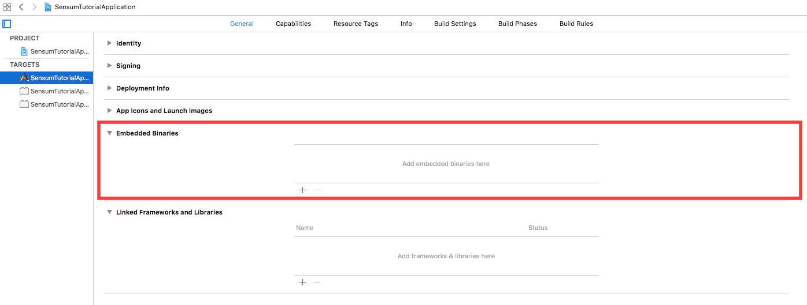
#### <p style="text-align: center;">Figure 6 - Accessing Embedded Binaries within General tab of the Xcode project file</p>
<br>

 * Locate the provided **SensumKit.framework** file.

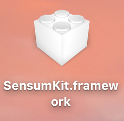
#### <p style="text-align: center;">Figure 7 - SensumKit.framework </p>
<br>


 * Drag the **SensumKit.framework** into the *Embedded Binaries* section of the Xcode project file, as shown in Figure 8.

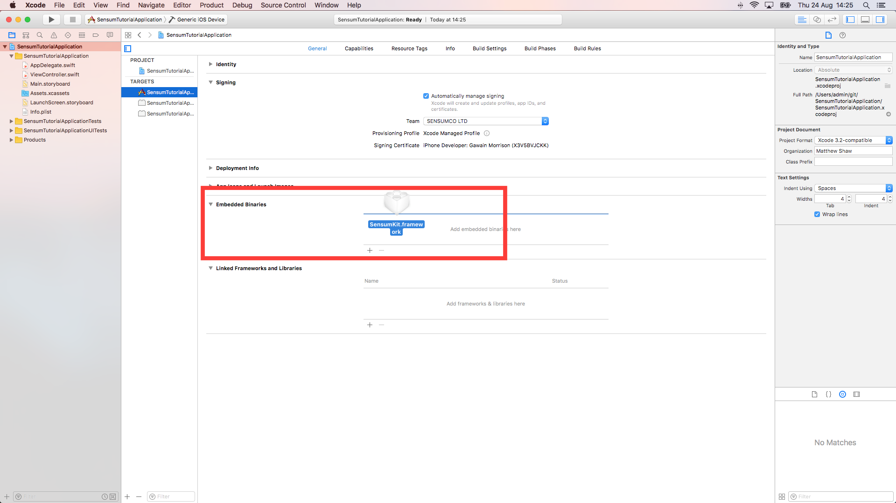
#### <p style="text-align: center;">Figure 8 - Import SensumKit.framework</p>
<br>

 * A dialogue box will present you with options relating to adding the framework (Figure 9).  
Ensure **Copy items if needed** is selected, then press **Finish**.

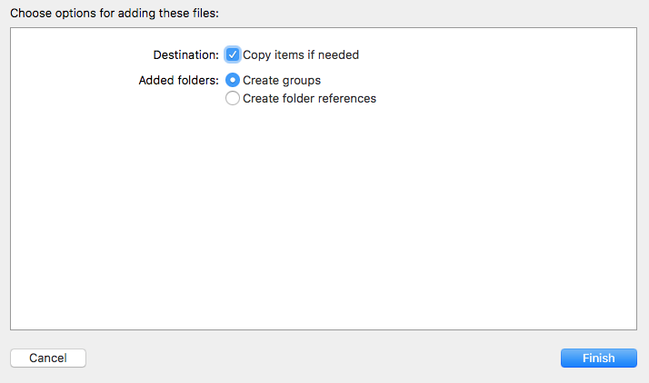
#### <p style="text-align: center;">Figure 9 - Embedded Binaries import dialogue box</p>
<br>

 * The successfully imported framework should then appear as displayed in Figure 10 below.


#### <p style="text-align: center;">Figure 10 - SensumKit.framework imported into Embedded Libraries</p>
<br>

 * Select the Xcode project file within the Project Navigator.
 * Navigate to *Linked Frameworks and Libraries*.
 * Ensure **SensumKit.framework** is listed as both an *Embedded Binary*, and as a *Linked Framework and Library* (as shown below in Figure 11). N.B. Adding an embedded binary should automatically create a linked framework.

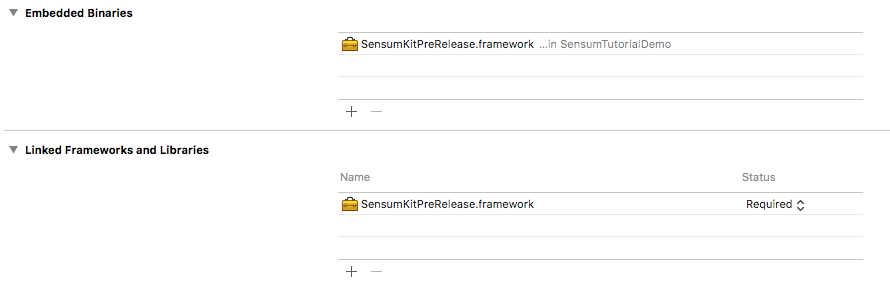
#### Figure 11 - SensumKit.framework as a Linked Framework and Library


## Carthage and Dependencies

 * Any attempt to run the project in its current state will result in error, as shown in Figure 12.

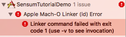
#### <p style="text-align: center;"> Figure 12 - Xcode error message due to missing dependencies</p>
<br>

 * This error is due to the fact that the project is missing essential framework dependencies.
 * In order to solve this issue, Carthage must be installed (a very useful dependency manager, available from: <a href = "https://github.com/Carthage/Carthage#installing-carthage">Carthage Install Guide</a>


 * We recommend using Homebrew as the install method (available from: <a href = "https://brew.sh">Homebrew Install Guide</a>).

### Process
 * Locate the Cartfile provided with the **SensumKit.framework**.
 * Drag it into the Xcode project as shown in Figures 13-14.

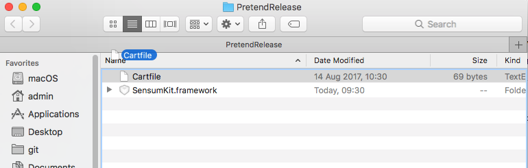
#### <p style="text-align: center;">Figure 13 - Dragging Cartfile from source</p>
<br>


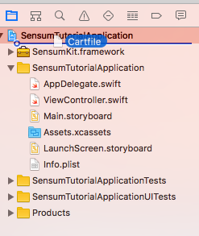
#### <p style="text-align: center;">Figure 14 - Dragging Cartfile to destination within Xcode</p>
<br>

 * A dialogue box will present you with options relating to adding the Cartfile (Figure 15).  
 * Ensure **Copy items if needed** is selected, then press **Finish**.

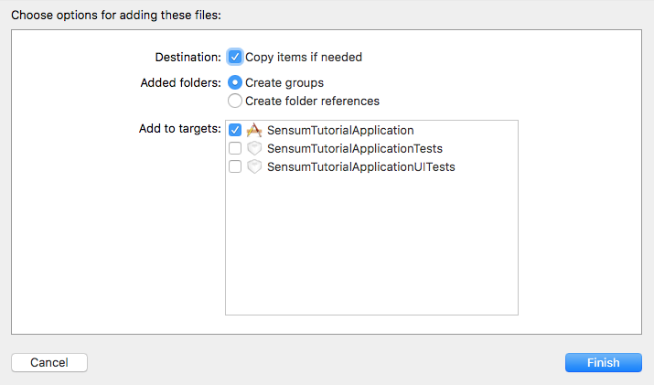
#### <p style="text-align: center;">Figure 15 - Cartfile import dialogue box</p>
<br>

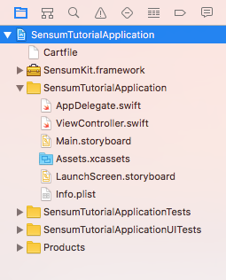
#### <p style="text-align: center;">Figure 16 - Overview of Project Navigator on successful import of Cartfile</p>
<br>

 * Alternatively, if you are already using Carthage, and working with a pre-existing project Cartfile, copy the contents of the Cartfile provided with the **SensumKit.framework** into your own Cartfile.

 * In order to make use of successfully imported/altered Cartfile, navigate to your project’s root directory via the Terminal application, ensuring that the installed Carthage software is up to date (as shown in Figures 17 and 18).

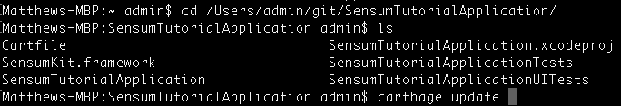
#### <p style="text-align: center;">Figure 17 - Updating Carthage via Terminal</p>
<br>

")
#### <p style="text-align: center;">Figure 18 - Updating Carthage via Terminal (detailed output displayed )</p>
<br>

 * The necessary commands can be found in Code Snippet 1.

> Code Snippet 1

```swift
#If you're not using brew don't run this
brew upgrade carthage
#cd to your project (yours may be named differently)
cd <Root Project Directory>
#Update brings in all new changes
carthage update
```

 * This process may take quite some time, please be patient.

## Link frameworks provided via Carthage

 * It is necessary to link the frameworks Carthage has downloaded to our project/application.
 * Select the Xcode project file, navigate to the *General* tab, scroll down the page to the *Linked Frameworks and Libraries* section (highlighted in Figure 19).

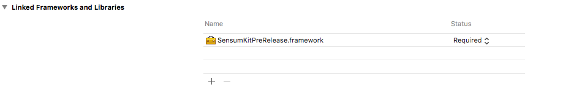
#### <p style="text-align: center;">Figure 19 - Linked Frameworks and Libraries section, within General tab of the Xcode project file</p>
<br>

 * Within this view, click the ‘**+**’ button .
 * Click on **Add other...** at the lower left-hand-side of the pop-up window (Figure 20).


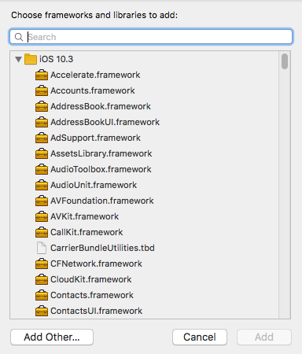
#### <p style="text-align: center;">Figure 20 - Selecting frameworks/libraries to add to the Xcode project</p>
<br>

 * A file system navigation window should appear, navigate to the root folder of the Xcode project.
 * Within this root project folder, a Carthage folder should be present.
 * Navigate to Carthage > Build > iOS (Figure 21).

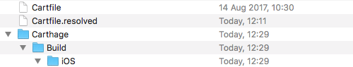
#### <p style="text-align: center;">Figure 21 - Navigating to Carthage iOS frameworks</p>  
<br>

 * It is convenient/more efficient to search by file type in this file navigation window.
 * Select the column labelled *Kind* within the iOS folder, all of the framework files should now be listed at the top of the list.
 * Use the **Command** button (**cmd ⌘**), to select the five frameworks listed within Code Snippet 2.

> Code Snippet 2

```swift
AWSCognitoIdentityProvider.framework’
AWSCore.framework
Realm.framework
RealmSwift.framework
CryptoSwift.framework
```

 * Add these five to your project’s frameworks by clicking on the **Open** button.
 * On successful completion of the above steps, your frameworks list should now appear as shown in Figure 22.


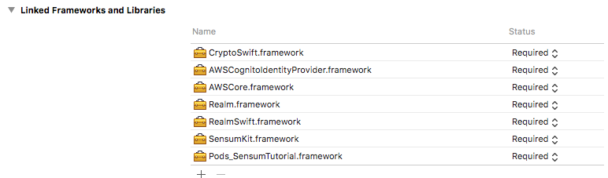
#### <p style="text-align: center;">Figure 22 - Overview of successfully linked frameworks within the *Linked Frameworks and Libraries*</p>
<br>


## Create a run script

 *  Navigate to the *Build Phases* section of the Xcode project file (Figure 23).


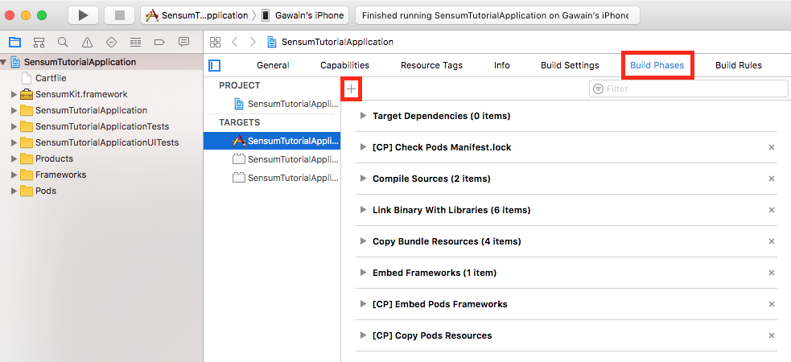
#### <p style="text-align: center;">Figure 23 - Build Phases section of the Xcode project file</p>
<br>

 * Click the ‘**+**’ button at the top of this view (above the *Target Dependencies* header).
 * Select **New Run Script Phase** (Figure 24).

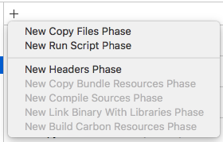
#### <p style="text-align: center;">Figure 24 - Adding a New Script Run Phase</p>
<br>

 * In the body of the script enter the following line from Code Snippet 3.

> Code Snippet 3

```swift
/usr/local/bin/carthage copy-frameworks
```

 * The run script should now appear as shown in Figure 25.

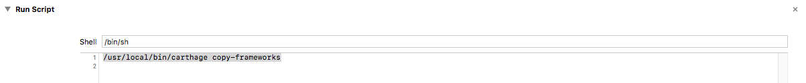
#### <p style="text-align: center;">Figure 25 - View of successfully added Run Script</p>
<br>

 * Click the ‘**+**’ icon again in order to add input files to this newly created *Run Script*.
 * Add the five lines show in Code Snippet 4.

> Code Snippet 4 - Adding input files to the *Run Script*

```swift
$(SRCROOT)/Carthage/Build/iOS/Realm.framework
$(SRCROOT)/Carthage/Build/iOS/RealmSwift.framework
$(SRCROOT)/Carthage/Build/iOS/AWSCore.framework
$(SRCROOT)/Carthage/Build/iOS/AWSCognitoIdentityProvider.framework
$(SRCROOT)/Carthage/Build/iOS/CryptoSwift.framework
```

 * On completion of the above steps, the *Input Files* section should appear as shown in Figure 26.

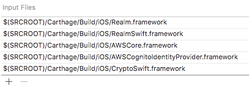
#### <p style="text-align: center;">Figure 26 - Overview of updated Input Files section</p>
<br>

 * The steps outlined above need to be repeated to create output files.
 * Click the ‘**+**’ icon again in order to add output files to this newly created *Run Script*.
 * Add the five lines of code shown in Code Snippet 5.

> Code Snippet 5 - Adding output files to the Run Script

```swift
$(BUILT_PRODUCTS_DIR)/$(FRAMEWORKS_FOLDER_PATH)/Realm.framework
$(BUILT_PRODUCTS_DIR)/$(FRAMEWORKS_FOLDER_PATH)/RealmSwift.framework
$(BUILT_PRODUCTS_DIR)/$(FRAMEWORKS_FOLDER_PATH)/AWSCore.framework
$(BUILT_PRODUCTS_DIR)/$(FRAMEWORKS_FOLDER_PATH)/AWSCognitoIdentityProvider.framework
$(BUILT_PRODUCTS_DIR)/$(FRAMEWORKS_FOLDER_PATH)/CryptoSwift.framework
```

 * On completion of the above steps, the *Output Files* section should appear as shown in Figure 27.

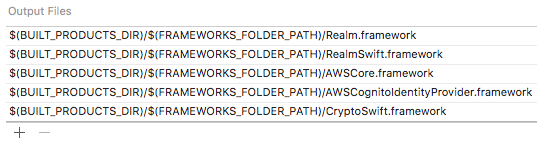
#### <p style="text-align: center;">Figure 27 - Overview of updated *Output Files* section</p>
<br>

 * At this stage, the project should be able to build successfully without errors.
 * In order to build the project, click the **Run** button within Xcode (Figure 28).

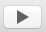
#### <p style="text-align: center;">Figure 28 - Xcode ‘Run’ button</p>
<br>

 * Following a successful build, the **SensumKit** can now be utilised within your own Xcode project.
 * In order to make use of the **SensumKit**, add the code shown in Code Snippet 6 to your *ViewController* class. No errors should appear.

> Code Snippet 6 - Importing the SensumKit into your own project

```swift
import SensumKit
```

 * Your project should now also contain a Frameworks group where you should drag-and-drop the **SensumKit.framework** folder into.

## Using CocoaPods (for Google Sign-In)

 * CocoaPods must be installed (available from: <a href = "https://cocoapods.org/app">https://cocoapods.org/app</a> ).
 * Ensure CocoaPods is both installed and up to date by running the code shown in Code Snippet 7 within the Terminal application.

> Code Snippet 7 - Installing CocoaPods

```shell
sudo gem install cocoapods
```

 * The user has the option of using the command-line-interface or the CocoaPods GUI to manage their pods. We have utilised the GUI application in-house.
 * On opening the CocoaPods GUI you will be presented with the view shown in Figure 29.

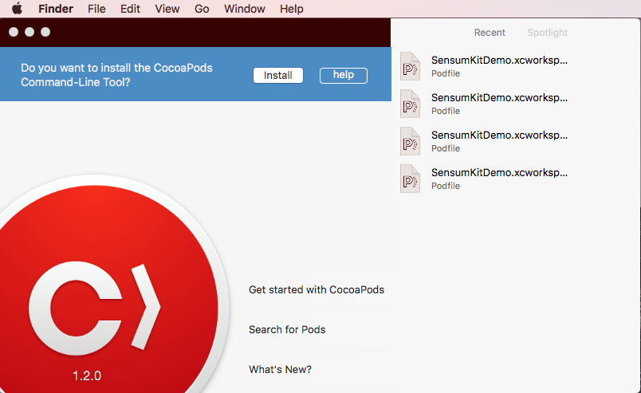
#### <p style="text-align: center;">Figure 29 - CocoaPods GUI</p>
<br>

 * To generate a new Podfile from your desired Xcode project, follow the steps shown in Figures 30-32.


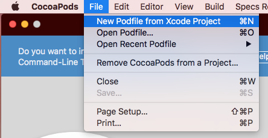
#### <p style="text-align: center;">Figure 30 - Creating a new Podfile from an Xcode Project</p>
<br>

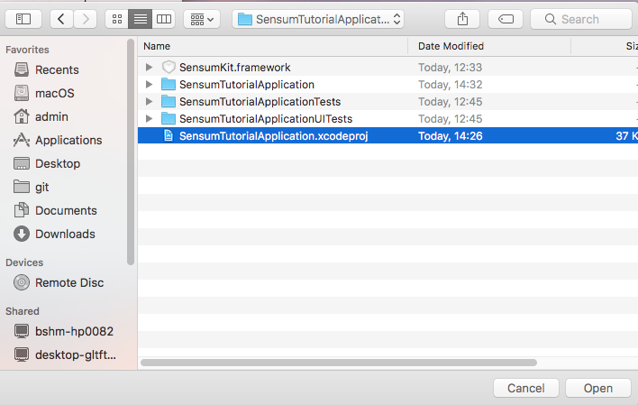
#### <p style="text-align: center;">Figure 31 - Selecting the Xcode Project file</p>
<br>

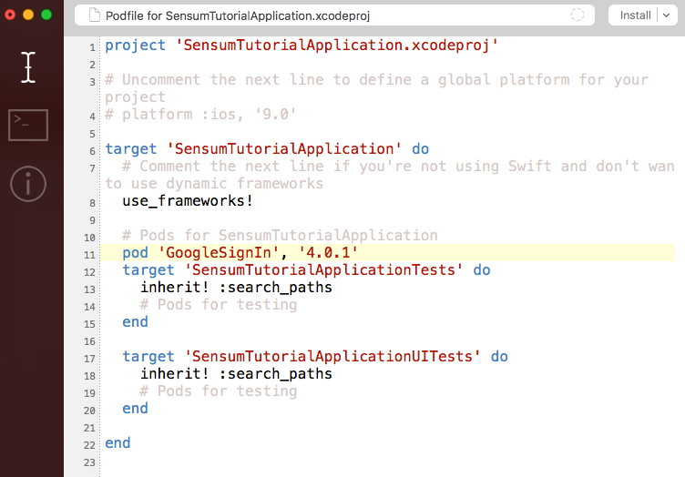
#### <p style="text-align: center;">Figure 32 - Overview of newly created Podfile for selected Xcode Project</p>
<br>

 * Below the comment `# Pods for SensumTutorialApplication` (Line 10 in Figure 32), add the text shown in Code Snippet 8.

> Code Snippet 8 - Adding a pod to the Podfile

```swift
pod 'GoogleSignIn', '4.0.1'
```

 * Once the above line has been added, select **Install(verbose)** as shown in Figure 33.

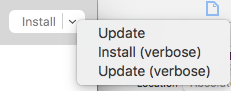
#### <p style="text-align: center;">Figure 33 - Installing specified pods</p>
<br>

 * CocoaPods will now download the necessary files to use any pods present within the Podfile.
 * As CocoaPods downloads and installs the required files, the view should appear as shown in Figure 34.

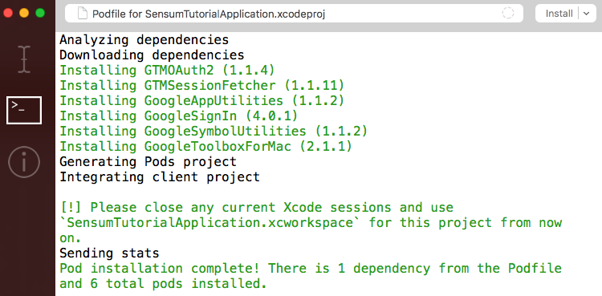
#### <p style="text-align: center;">Figure 34 - CocoaPods fetching necessary pods</p>
<br>

 * Once the above process has completed, close your Xcode project.
 * **IMPORTANT:** In order for the newly associated pods to function correctly, it is __imperative__ that the Xcode project be opened using the project’s **.xcworkspace** file (white icon in macOS Finder); __NOT__ via the *.xcodeproj* file (blue icon in macOS Finder)!
 * Figure 35 displays an overview of the root folder of your Xcode project, the *.xcworkspace* file is highlighted with a green icon.

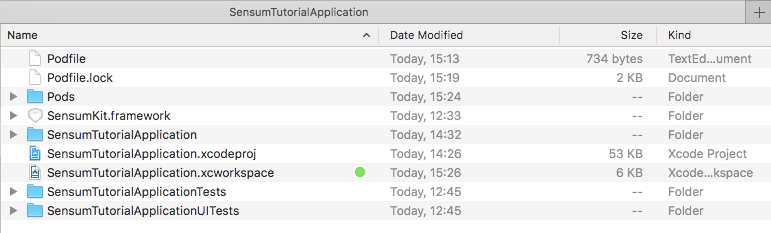
#### <p style="text-align: center;">Figure 35 - Overview of Xcode Project folder</p>
<br>

 * To run the app:
 * Navigate to *ViewController.swift* within the Xcode Project.
 * Add the line “import SensumKit” (shown in Line 10 of Figure 36).
 * Press the **Run** button (top left-hand-side of Figure 36).
 * A successful build will display an empty white screen on your iOS device, no errors should be shown.

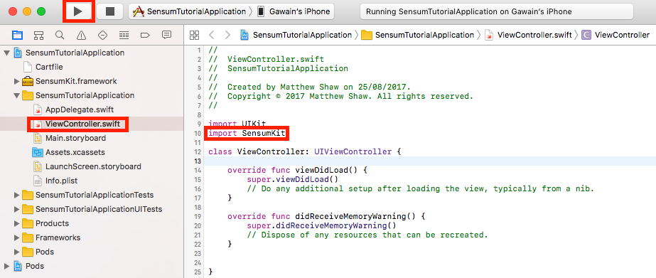
#### <p style="text-align: center;">Figure 36 - Utilising the SensumKit within an Xcode project</p>
<br>

## Starting the SensumSDK

* To start the **SensumSDK** you will need:
    * an *API Key*,
    * a *host URL*,
    * and a *stage URL*.

* We will provide you with the *API Key* as a string, all you have to do is pass this string into the *SensumSDKManager* .
* By default, the *host URL* and *stage URL* should be **api.sensum.co** and **v0** respectively, unless we have instructed you otherwise.
* In order to create a single instance of the *SensumSDKManager*, follow the example within Code Snippet 9 (the example makes use of a *ViewController* to do this, but this could be achieved within any file)
* This single instance of the *SensumSDKManager* can then be referenced from elsewhere within your application.


> Code Snippet 9

```swift
import UIKit
import SensumKit

class TabBarController: UITabBarController {
	var sensumSDK : SensumSDKManager?

	override func viewDidLoad() {
           super.viewDidLoad()
           // Do any additional setup after loading the view, typically from a nib.
           sensumSDK = SensumSDKManager(
               requestEngineInternalInSeconds: 30,
               apiKey: "PublicDemoKeyForDocumentation",
               host: "api.sensum.co",
               stage: "v0")
	    startEverythingUpdating()
       }

	func startEverythingUpdating() {
		sensumSDK?.accelerometer.startUpdating()
		sensumSDK?.location.startUpdating()
		sensumSDK?.bluetooth.startUpdating()
		sensumSDK?.tag.startUpdating()
	}
}
```

## Getting Accelerometer and GPS Data from the SensumSDK

* Once you have started the **SensumSDK** as shown in the previous example, you can query for both location (GPS) and accelerometer data locally.

* **SensumKit** uses listener protocols to provide classes with a means to query and listen for updates. To implement an accelerometer listener, first you must import *CoreMotion* at the top of your class:

> Code Snippet 10

```swift
import CoreMotion
```

* Now extend your *ViewController* (shown in Code Snippet 11) by implementing the **SensumSDK** Listener protocol for *AccelerometerListener*:

> Code Snippet 11

```swift
extension AccelerometerViewController: AccelerometerListener {
	func accelerationUpdated(newAcceleration: CMAcceleration, dateTime: Date) {
        DispatchQueue.main.async {
            print(newAcceleration)
        }
    }
}
```

* Finally register the listener in your class (preferably in your `viewDidLoad()` method), referencing the **SensumSDK** variable you first created (see Code Snippet 12).

> Code Snippet 12

```swift
sdkManager?.accelerometer.assignListener(self)
```

* Please note that if you intend to set *UIView* objects from the output of the listeners, it is necessary to dispatch them to the main queue as shown in Code Snippet 11. The output of Code Snippet 11 should result in the following:

`CMAcceleration(x: 0.00097714154981076717, y: -0.001684999093413353, z: -0.010779784061014652)`

* To get GPS updates you can follow the same approach. First import *CoreLocation* so you can handle the objects in your class.

> Code Snippet 13

```swift
import CoreLocation
```

* Now extend your *ViewController* as below by implementing the **SensumSDK** Listener protocol for *AccelerometerListener*:

> Code Snippet 14

```swift
extension GPSViewController: LocationListener {
    func locationUpdated(newLocation: CLLocation) {
        DispatchQueue.main.async {
			print(newLocation)
        }
    }
}
```

* Finally register the listener in your class, (preferably in your `viewDidLoad()` method), referencing the **SensumSDK** variable you first created (see Code Snippet 15).

> Code Snippet 15

```swift
sdkManager?.location.assignListener(self)
```

* Please note that if you intend to set *UIView* objects from the output of the listeners, it is necessary to dispatch them to the main queue as shown in Code Snippet 14. The output of Code Snippet 14 should result in the following:

`<+54.58727634,-5.90740191> +/- 50.00m (speed 0.00 mps / course -1.00) @ 01/09/2017, 10:51:08 British Summer Time`

## Scanning for BLE devices

* **SensumKit** supports connecting to BLE devices for reading heart rate measurements. For a list of tested compatible devices please view the <a href = "http://help.sensum.co/knowledge_base/topics/what-type-of-sensors-can-i-use"> list of compatible devices</a> at our Knowledge Centre.

**Note:** This document is regularly updated with new devices. Please contact us for integration details. GSR data is only accessible from Shimmer devices at present.

* To connect a BLE device through the **SensumSDK**, you may wish to introduce a tableView or list style UI element which users can select and connect to. In this example we have added a *UITableView* element to a *ViewController* and created a *Prototype Cell* with the *identifier* as BLE_CELL.
* Ensure your table datasource and delegate is set to your *ViewController* and implement the required functions. Ensure you have a tableView variable from your outlet in the class file.

* Next, import *CoreBluetooth* so you can manage the *CBPeripheral* type which is a parameter in the listener function (see Code Snippet 16). If you are working in a new class, don't forget to `import SensumKit`.

> Code Snippet 16

```swift
import CoreBluetooth
```

* Next, implement the *BluetoothListener* extension as shown in Code Snippet 17.

> Code Snippet 17

```swift
extension BluetoothTableViewController: BluetoothListener {

	public func deviceDiscovered() {
		DispatchQueue.main.async {
			self.tableView.reloadData()
		}
	}

	public func bpmUpdated(newBpm: Int, dateTime: Date) {}
	public func deviceConnectionSuccess() {}
	public func deviceConnectionFailure() {}
	public func deviceDisconnected(disconnectedPeripheral: CBPeripheral) {}
}
```

* Each time a device is discovered, call `reloadData()` on your tableView variable in the class (demonstrated in Code Snippet 17).
* Assign your **SensumSDK** listener as shown in Code Snippet 18.

> Code Snippet 18

```swift
sdkManager?.bluetooth.assignListener(self)
```

* You will not see updates fired from the **SensumSDK** until you call `sdkManager?.bluetooth.startScanForDevices()` which we have previously done in `viewDidAppear()` or `viewDidLoad()`, or alternatively, these can be set via a button press.
* For these updates to appear in the *UITableView•, you will need to customise two of its functions implemented as part of the *UITableView*,in addition to creating a custom class that inherits from the properties of *UITableViewCell*.
* Create a new Cocoa Touch Class, call it `BluetoothPeripheralTableViewCell` and ensure it inherits from *UITableViewCell*. Then use the contents of Code Snippet 19 to quickly launch a basic example that will simply display the name of the device.

> Code Snippet 19

```swift
import UIKit
import CoreBluetooth

class BluetoothPeripheralTableViewCell: UITableViewCell {

    var peripheral: CBPeripheral? {
        didSet {
            if let newValue = peripheral {
                self.textLabel?.text = newValue.name
            }
        }
    }

    override func awakeFromNib() {
        super.awakeFromNib()
        // Initialization code
    }

    override func setSelected(_ selected: Bool, animated: Bool) {
        super.setSelected(selected, animated: animated)
        // Configure the view for the selected state
    }
}
```

* Turning attention back to the *ViewController* where you implemented the **SensumSDK**. The `cellForRowAt` function from the tableView will define how the cells in the table are customised, demonstrated in Code Snippet 20.

> Code Snippet 20

```swift
func tableView(_ tableView: UITableView, cellForRowAt indexPath: IndexPath) -> UITableViewCell {
    // the identifier is what was set in your .storyboard in the attributes inspector
		let bleCell = self.tableView.dequeueReusableCell(withIdentifier: "bleCell", for: indexPath) as! BluetoothPeripheralTableViewCell
		if let dictValue = sdkManager?.bluetooth.getDeviceList()[indexPath.item]?["peripheral"] {
			let peripheralToAdd = dictValue as! CBPeripheral
			bleCell.peripheral = peripheralToAdd
		}
		return bleCell
	}
```

* Set your `numberOfRowsInSection` to match the example shown in Code Snippet 21.

> Code Snippet 21
```swift
func tableView(_ tableView: UITableView, numberOfRowsInSection section: Int) -> Int {
		return (sdkManager?.bluetooth.getDeviceList().count)!
	}
```

* You should now see a list of devices populating the tableView.

## Connecting to a BLE Device

* Following on from the previous section, to connect to a selected BLE device, pass the selected cell to ` sdkManager?.bluetooth.connectTo(peripheralDevice: blePeripheral!)`.
* This will initiate a connection and, depending on the device, should after a few seconds start generating heart rate values that are passed to *BluetoothListener* protocol functions you have implemented.
* We have currently included additional *NSLog* outputs internally to **SensumKit** to detail the connection process. Your console output within Xcode should appear as shown in Code Snippet 22.

> Code Snippet 22

```swift
Scanning for bluetooth devices
Connecting to device: MIO GLOBAL-LINK
Stopping device scan
Device connected.
Device Connected
Discovered service: Heart Rate
Discovered service: Battery
```

* You can update the `bpmUpdated()` function in your listener which will output the user's heart rate.


## Listening for Updates from the SensumAPI
* **SensumKit** handles the process of collecting both raw and contextual data from the device, before uploading to the **SensumAPI** without the user having to configure HTTP requests and responses.
* Before you can get updates from the **SensumAPI**, you must ensure that you  call recording on your contextual data.
* As an example, you must first call `sdkManager?.accelerometer.startRecording()` to initiate the collection of accelerometer data. After this, call `sdkManager?.accelerometer.startSendingToAPI()`.
* Depending on when you instantiated the **SensumSDK** and the time value you declared as the upload interval, data collected within the interval will be sent with the resulting response fired to all `APIListener` objects.
* This response is accessible from any class that implements `APIListener`.
* To gather all data and send all data, use the code contained within Code Snippet 23 after creating the Sensum SDK object.

> Code Snippet 23

```swift
 func startEverythingRecording() {
        sdkManager?.accelerometer.startRecording()
        sdkManager?.location.startRecording()
        sdkManager?.bluetooth.startRecording()
        sdkManager?.tag.startRecording()
        sdkManager?.accelerometer.startSendingToAPI()
        sdkManager?.location.startSendingToAPI()
        sdkManager?.bluetooth.startSendingToAPI()
        sdkManager?.tag.startSendingToAPI()
    }
```
* At the top of your class `import RealmSwift` to query the response data. We save parsed data from the **SensumAPI** to Realm so it can safely persist on the device.
* Next implement an extension at the end of your class of type `APIListener`, follow the example as shown in Code Snippet 24.
> Code Snippet 24

```swift
extension RecordingMasterViewController: APIListener {

    func realmResponseSaved() {
        // saved to Realm, lets query it and print the values
        if let realmResponse = try? Realm().objects(Response.self).last {
            print(realmResponse)
        }
    }

    func realmSentimentResponseSaved() {
        if let realmSentiment = try? Realm().objects(SentimentResponse.self).last {
            print(realmSentiment)
        }
    }

    func arousalReceived(arousalScore: Double) {
        print("arousalScore \(arousalScore)")
    }

    func apiRequestFailure(message: String, statusCode: Int?) {
        print("Failed to send to SensumAPI \(message) \(statusCode)")
    }

    func apiRequestSuccessful() {
        print("api request successful")
    }

}
```
* Don't forget to register the listener in the `viewDidLoad()` method using `sdkManager?.api.assignListener(self)`.  
* You are now ready to receive updates on any class that implements the listener extensions.
* We use Realm to safely and efficiently store/query data from the response the **SensumAPI** returns. <a href = "https://realm.io/docs/swift/latest/">We recommend you take some time to study the RealmDocs here</a>. The examples above will return the latest saved object from the **SensumAPI**.
* A Response object is the parent object saved from a request made to the **SensumAPI** with contextual sensor, accelerometer, and GPS data. The object is made up of the following components:
* Response:
    * `HeartRateResponse` - Processed Heart Rate data.
    * `AccelerometerResponse` - Processed Accelerometer data.
    * `LocationResponse` - Processed Location data.
* Each of the three sub-response objects are made up of *Stat* and *Event* objects. Feel free to examine the public Realm objects that we use to store data.
* `SentimentResponse` is a seperate object that represents processed emoji and text data. Code Snippet 25 illustrates how it should appear when printed from `sentimentResponseReceived()`:
> Code Snippet 25

```swift
Optional(SentimentResponse {
    textSentiment = Emotion {
        emotionality = 0;
        negativity = 0;
        positivity = 0;
    };
    emojiSentiment = Emotion {
        emotionality = 0.4236068641;
        negativity = 0.0936431989;
        positivity = 0.6575529733;
    };
})
```
* `ArousalResponse` is also a seperate object that represents processed heart rate data. Please see the <a href = "http://docs.sensum.co/#emotion-ai-api">**SensumAPI** documentation</a> for more information on processed data outputs.

## Third Party Authentication

* To authenticate your end users with access to the **SensumAPI** functions of **SensumKit**, you will need to use a third-party identity provider and implement the required Frameworks within your Xcode Project.

### Google:

* For Google, <a href = "https://developers.google.com/identity/sign-in/ios/start-integrating">follow these instructions to implement Google Sign-In within your Xcode Project</a>.
* Please note that you have already installed the required Google Frameworks using CocoaPods, so you will not be required to do so again.

 __**IMPORTANT**__ after creating your Configuration file, please ensure you contact us at:
 **bertha@sensum.co**, including your *CLIENT_ID* as selected below from the Configuration file generated by the Google Sign-In service (see Figure 37). The format of this ID is typically a combination of numbers and characters followed by *apps.googleusercontent.com*. Upon confirmation that the *CLIENT_ID* has been saved, you will be able to successfully authenticate users in your application.

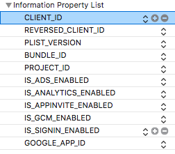
#### <p style="text-align: center;">Figure 37 - Configuration File plist generated from Google Sign In guide.</p>
<br>

* While the *Google Sign-In* example showcases the implementation in the *AppDelegate.swift* file, in our example application we have used a *LoginViewController* class to implement the delegate methods.
* Where you call the `signIn` delegate function in your class, successfully signing a user in will result in a <a href = "https://developers.google.com/identity/sign-in/ios/api/interface_g_i_d_google_user">GIDGoogleUser object</a>.
* Pass the `idToken` generated by this object to the parameter `authenticationToken` of the **SensumKit** `federatedSignIn` function.
* This function will respond (via a callback) with the result of the authentication against the **SensumAPI** as successful/unsuccessful. See Code Snippet 26 for an example.

> Code Snippet 26

```swift
func sign(_ signIn: GIDSignIn!, didSignInFor user: GIDGoogleUser!, withError error: Error!) {
    if error != nil {
        print(error ?? "google sign in error")
    } else {
        signInStatusLabel.text = "Signed in with Google"
        sensumSDK?.authentication.federatedSignIn(provider: "accounts.google.com",    
            authenticationToken: user.authentication.idToken)
    }
}
```
