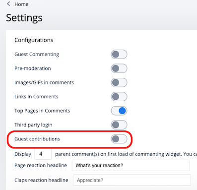
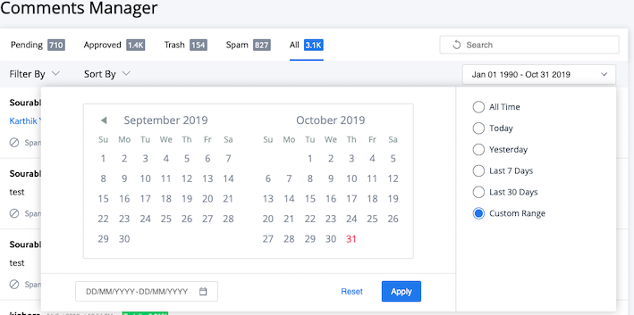
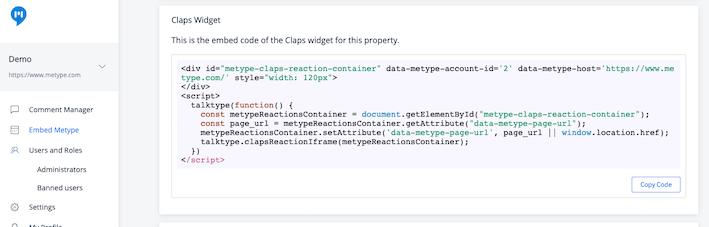
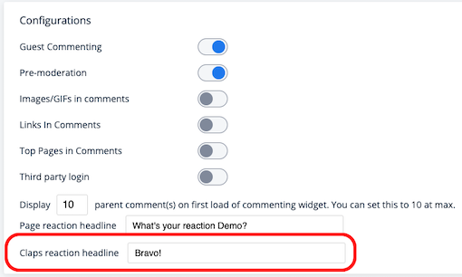
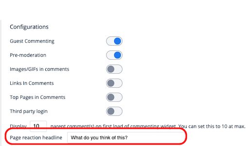
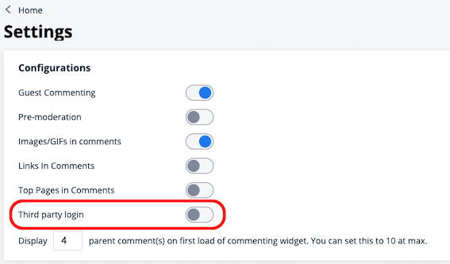

# Release Notes

## 29 Oct 2019 Release Note - Metype
1. **User Generated Content Upgrade** - Contributions are now allowed to be submitted by Guests as well as logged in users. The user's profile information available in Metype will be used to auto-populate the UGC form. For guest contributors, Google's re-captcha will be used for bot-protection.

2. Few tech stack upgrages.

## 21 Oct 2019 Release Note - Metype
1. **Bookmark URLs** - Metype now allows users to save URLs to read later. New set of APIs to store URLs bookmarked by users and retrieve them. Documentation available [here](/metype?shell--request#bookmarks).
2. **User Generated Content upgrade** -  New API to fetch all the contributions submitted by a Metype user. Documentation available [here](/metype?shell--request#get-all-contributions-for-a-user).
3. Tech stack upgrade.

## 14 Oct 2019 Release Note - Metype
1. Metype widgets now support URLs with non-latin-alphabet(vernacular) characters.
2. Tech stack upgrades and minor bug fixes.

## 1 Oct 2019 Release Note - Metype
1. API performance optimisations - purging and database.
2. Metype social share and Feed URLs are now post-fixed with anchor tags to bring the user directly to the commenting widget.
3. Metype Config API - All account level configurations are now available as an API. The documentation is available [here](/metype?shell--request#get-account-config).

## 9 Sep 2019 Release Note - Metype
1. **Guest Commenting Upgrade** is now allowed when the 3rd Party Login configuration is turned on.

## 4 Sep 2019 Release Note - Metype
1. Bug fixes on comment count API and Comment Manager Actions.

## 3 Sep 2019 Release Note - Metype
1. [Minor bug fixes] Unsubscribe to Metype emails, quick date in date range picker, social login logos update.

## 28 Aug 2019 Release Note - Metype
1. Date range picker in Comments Manager now has an enhanced UX.
2. Bug fix on adding admin users on Metype dashboard.

## 23 Aug 2019 Release Note - Metype
1. Commenting widget caching optimisations; a cached comment widget which allows users to comment, is loaded even before the comments made by other users load.
2. [Bug fix]Feed widget does not load more than 20 stories.

## 16 Aug 2019 Release Note - Metype
1. Premium Metype accounts are now given a badge in the Metype admin dashboard.
2. Minor bug fixes.

## 14 Aug 2019 Release Note - Metype
1. **Top Pages in Feed Update** - The display of Top Pages in the Feed widget is now controlled by the Top Pages configuration in the Metype > Settings dashboard.
2. **Third Party Login Update** - The base 64 URI encoded page URL is now sent as part of Third Party Login, so that users are brought back to the page from which they logged in.


## 9 Aug 2019 Release Note - Metype
1. **Comment Manager Upgrade** - The comment manager is now equipped with a date range filter along with the number of commments in each of the tabs is displayed upfront. 

2. Page reactions are now supported without labels.
3. Minor bug fixes.

## 6 Aug 2019 Release Note - Metype
1. [Bug Fixes] - Page Reactions UI fix on low resolution mobile phones, Profile pop-up on replies and @mention users and z-index fix on comment reactions.

## 1 Aug 2019 Release Note - Metype
1. Performance and Tech - Emoji library upgrade, API performance reindex optimisation.

## 29 Jul 2019 Release Note - Metype
1. User Profile in Comments Manager - The user's email is now displayed to admins, in the user profile snapshot in the Comments Manager.


## 17 Jul 2019 Release Note - Metype
1. Re-moderate edited comments - Comments approved by the admin, when edited by the commenter are now required to be re-aproved when pre-moderation is turned on.
2. [Bug fix] - Console log has CORS error.

## 20 Jun 2019 Release Note - Metype
1. Claps - Introducing the Claps widget. Available as an embed code, this widget lets your audience appreciate your content by applauding. 





2. [Bug fix] - Unable to save Settings in config page.


## 14 Jun 2019 Release Note - Metype
1. Caching optimisations in Page Reactions widget.

## 10 Jun 2019 Release Note - Metype

1. Third Party Login enhancements
2. Removed page_url parameter from Live Feed iframe.
3. [Bug fix] - Login using Twitter and LinkedIn fails in LiveFeed widget.

## 31 May 2019 Release Note - Metype

1. Metype is now available for $7.99 per month. 
2. Android and iOS applications can now leverage the Third Party Login feature for commenting.
3. [Bug fix] - Facebook login redirect issue in iOS/Mac-Safari.

## 20 May 2019 Release Note - Metype
1. **Configurable Page Reaction Headline** - Now customize your own message to be displayed above the Page Reactions widget.


## 22 Apr 2019 Release Note - Metype
1. **Third party login with Metype:** Publishers and bloggers can use their own user login system to allow their audience to login and comment.

The developer documentation to implement this is available [here.](#third-party-login)

 

## 22 Oct 2018 Release Notes - Metype

1. Toggle to control display of Top Stories on Commenting Widget.


## 18 Oct 2018 Release Notes - Metype

1. **Top Pages on Commenting and Feed widget:** This section is visible on the Commenting and Feed widgets.
Top pages are the ones that have the most engagement with audiences. The set of top pages is refreshed every 4 hours. Also, newly published pages always stand a greater chance of being picked up as a top page.


2. **Perspective API for toxicity:** Moderate hate speech and inappropriate comments using the toxicity score. Filter by Toxicity and moderate in bulk with ease.
Check out our blog for more [here.](https://www.quintype.com/blog/tech/control-the-toxicity-of-comments-with-metype)

3. **Performance Optimisations:** Metype widgets are now optimised to load much quicker on your pages.

## 22 Aug 2018 Release Notes - Metype
1. **Enhanced Single Sign-On(SSO)** - Metype's SSO has been enhanced so users can sign-in with any email address and password.
The feature includes all login related workflows such as Sign-up, Sign-in and Forgot Password along with verification of email with an OTP.
The SSO login page also displays displays the website's branding.

[Click here](#single-sign-on-sso) to know how to integrate SSO on your website.


2. [Bug fix] Ad-units not responsive.
3. [Bug fix] Twitter and LinkedIn Login redirect issues in SSO.


## 13 Aug 2018 Release Notes - Metype

1. [Bug fix] Commenting widget was partially loaded on pages part of a set of infinite scroll stories.


## 3 Aug 2018 Release Notes - Metype

1. Sign-in to Metype using your LinkedIn account. This is available on Metype home page, Comment widget sign-in, Feed widget sign-in and also available to publishers using Metype login to manage their user identities.


## 27 Jul 2018 Release Notes - Metype

1. The Live Feed is now enhanced to allow users to login and view their notificaions.

 


## 26 Jul 2018 Release Notes - Metype

```shell
<div id='metype-container' class='iframe-container' data-metype-account-id='2' data-metype-host='https://www.metype.com/' data-metype-primary-color='#0000ff' data-metype-bg-color='#ffffff' data-metype-font-color='#4a4a4a'> data-metype-comment-widget-id="comment-widget-2"</div>
<script type='text/javascript'>
  var metypeContainer = document.getElementById("metype-container"),
    page_url = metypeContainer.getAttribute("data-metype-page-url");
  metypeContainer.setAttribute('data-metype-page-url', page_url || window.location.href);
  metypeContainer.setAttribute('data-metype-window-height', window.innerHeight);
  metypeContainer.setAttribute('data-metype-screen-width', window.screen.width);
  talktype(function() {
    talktype.commentWidgetIframe(metypeContainer);
  });
</script>
```
1. Publishers can now embed many conversations on a single page.


**Note to developers:** The commenting widget allows an additional field `data-metype-comment-widget-id` in the `<div>` tag of the commenting widget, and can have any arbitrary value. E.g.,
`data-metype-comment-widget-id="comment-widget-2"`.


## 4 Jul 2018 Release Notes - Metype

1. Notifications for reactions to comments - commenters will now get notified when other users react on their comments.

2. Story Reactions - Publishers can now use Story Reactions to emote and engage with their audience without having to type in anything.

Write to us at metype@quintype.com to get your own set of story reactions configured for your account.
3. Bug fixes and loading speed optimisations on the widgets.
