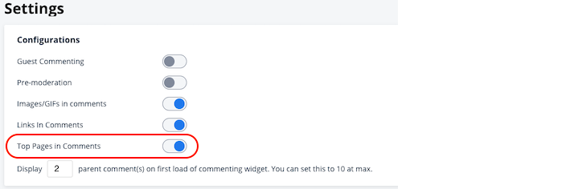
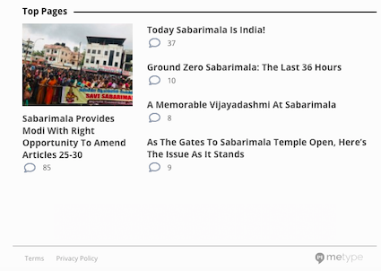
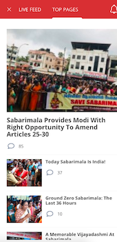
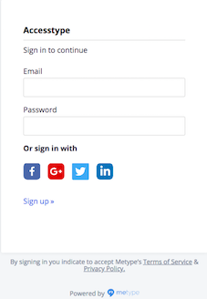
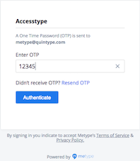
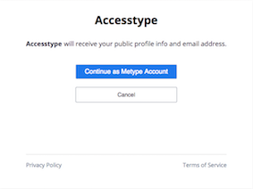

# Release Notes

## 22 Oct 2018 Release Notes - Metype

1. Toggle to control display of Top Stories on Commenting Widget.



## 18 Oct 2018 Release Notes - Metype

1. **Top Pages on Commenting and Feed widget:** This section is visible on the Commenting and Feed widgets.



2. **Perspective API for toxicity:** Moderate hate speech and inappropriate comments using the toxicity score. Filter by Toxicity and moderate in bulk with ease.
Check out our blog for more [here.](https://www.quintype.com/blog/tech/control-the-toxicity-of-comments-with-metype)

3. **Performance Optimizations:** Metype widgets are now optimized to load much quicker on your pages.

## 22 Aug 2018 Release Notes - Metype
1. **Enhanced Single Sign-On(SSO)** - Metype's SSO has been enhanced so users can sign-in with any email address and password. 
The feature includes all login related workflows such as Sign-up, Sign-in and Forgot Password along with verification of email with an OTP.
The SSO login page also displays displays the website's branding.

[Click here](#user-identity-management-single-sign-on-sso) to know how to integrate SSO on your website.






2. [Bug fix] Ad-units not responsive.
3. [Bug fix] Twitter and LinkedIn Login redirect issues in SSO.


## 13 Aug 2018 Release Notes - Metype

1. [Bug fix] Commenting widget was partially loaded on pages part of a set of infinite scroll stories. 


## 3 Aug 2018 Release Notes - Metype

1. Sign-in to Metype using your LinkedIn account. This is available on Metype home page, Comment widget sign-in, Feed widget sign-in and also available to publishers using Metype login to manage their user identities.


## 27 Jul 2018 Release Notes - Metype

1. The Live Feed is now enhanced to allow users to login and view their notificaions.

 


## 26 Jul 2018 Release Notes - Metype

```shell
<div id='metype-container' class='iframe-container' data-metype-account-id='2' data-metype-host='https://www.metype.com/' data-metype-primary-color='#0000ff' data-metype-bg-color='#ffffff' data-metype-font-color='#4a4a4a'> data-metype-comment-widget-id="comment-widget-2"</div>
<script type='text/javascript'>
  var metypeContainer = document.getElementById("metype-container"),
    page_url = metypeContainer.getAttribute("data-metype-page-url");
  metypeContainer.setAttribute('data-metype-page-url', page_url || window.location.href);
  metypeContainer.setAttribute('data-metype-window-height', window.innerHeight);
  metypeContainer.setAttribute('data-metype-screen-width', window.screen.width);
  talktype(function() {
    talktype.commentWidgetIframe(metypeContainer);
  });
</script>
```
1. Publishers can now embed many conversations on a single page. 


**Note to developers:** The commenting widget allows an additional field `data-metype-comment-widget-id` in the `<div>` tag of the commenting widget, and can have any arbitrary value. E.g.,
`data-metype-comment-widget-id="comment-widget-2"`.


## 4 Jul 2018 Release Notes - Metype

1. Notifications for reactions to comments - commenters will now get notified when other users react on their comments.

2. Story Reactions - Publishers can now use Story Reactions to emote and engage with their audience without having to type in anything. 

Write to us at metype@quintype.com to get your own set of story reactions configured for your account.
3. Bug fixes and loading speed optimisations on the widgets.


