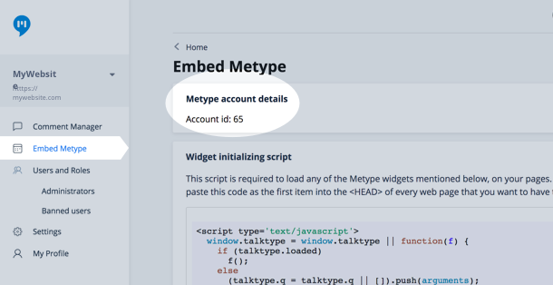
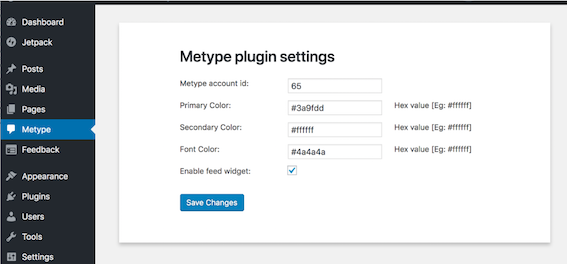

# Install Metype on Wordpress

## Metype Comments on Wordpress
Follow the steps below to start using the Metype Commenting widget on your Wordpress site.

1. Sign up for an account @ https://www.metype.com.
2. You will will be redirected to @ https://www.metype.com/admin.
3. Go to the `Embed Metype` section.
4. Make a note of your Metype `Account ID`.

5. Now visit your Wordpress admin page. E.g. yourwebsite.com/wp-admin.
6. Go to `Plugins` and click on `Add new`.
7. Search for `Metype`.
8. You’ll find `Metype` by `Quintype Technologies India Pvt Ltd`.
9. Click on `Install Now`.
10. Click on `Activate`.
11. On the Wordpress admin page, click on the `Metype` section.
12. Enter your Metype Account ID, and press `Save Changes`.

13. The Metype commenting widget will now begin to appear in all of your WordPress pages.

## Metype Feed on Wordpress
1. Follow the steps mentioned above.
2. In the Wordpress admin page, check the box with the configuration name `Enable Feed widget` and `Save Changes`. 
2. The Metype feed widget will now begin to appear in all of your Wordpress pages.