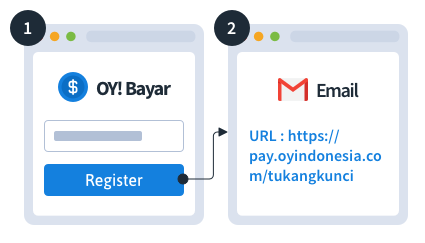
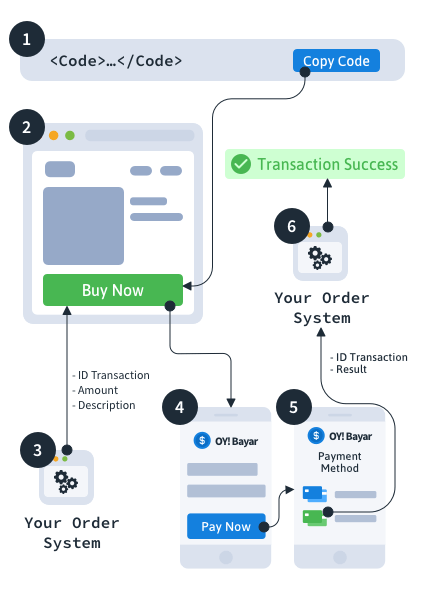

# Home

Welcome to OY! We are aiming to be the world class financial services and always put our customers first in everything we do. We have a variety of products ranging from sending payments, accepting payments, and other financial related products that are all ready to meet your needs. We are ready to help you achieve greater success. 

### How to Register 
You can immediately tcreate an account and enjoy some of our features in trial mode with limited functionalities until your account is upgraded to the full version. Our documentation will help you navigate through the entire registration process, including submitting requests for upgrading your account. For further inquiries, please contact us at [partner@oyindonesia.com](partner@oyindonesia.com) and our representative will get in touch. 

1. **Register on our Portal**: To create your account, please go to our business portal at [https://business.oyindonesia.com/](https://business.oyindonesia.com), click "Register Now", and complete the form with al the required information. 

*Screenshot placeholder* 

2. **Activate your account**: Once the registration is submitted, an activation link will be sent to your email. 

*Screenshot placeholder* 

Once you are able to login, you will be able to test some of our features in a trial mode or request to upgrade your account to enjoy the full version! 

### Upgrading your Account 

1. **Request to Upgrade your Account**: to upgrade the available services to full version, please select “Upgrade Your Account” on the menu at the left side of the dashboard and complete all the required information.

*Please note that the receiving bank account information cannot be changed via OY dashboard once your upgrade account request is approved for security reasons. Please contact us at [partner@oyindonesia.com](partner@oyindonesia.com) to change the receiving bank account information.*

*Screenshot Placeholder* 

2. **Upload the Required Supporting Documents**: Please upload the required supporting documents according to your business type. Documents are only accepted in PDF format and must be less than 10 MB in size each. 

3. **Submit your Request**: Click “Submit & Request to Upgrade”, and a new status of “Upgrade Account Requested” should appear on this page, indicating that your request has been submitted along with your supporting documents.

This process should take about 1 week. In the event that the status of your request is **Resubmit** or **Rejected**, please keep reading below. Otherwise, you are good to go! 

**Status: Resubmit** 
Upon reviewing the upgrade request, we might ask for additional documentations. Please follow the steps below: 

1. **Read our report**: A report will be sent to your email regarding the information and documents that will need to be revised or added. 

2. **Refill out the form**: When submitting another request to upgrade your account, please resubmit all your supporting documents. Documents are only accepted in PDF format and must be less than 10 MB in size.

3. **Submit your request**: Click “Submit & Request to Upgrade”, and a new status of “Upgrade Account Requested” should appear on this page, indicating that your request has been submitted along with your supporting documents.

For further inquiries, please contact us at [partner@oyindonesia.com](partner@oyindonesia.com) and our representative will get in touch. 

**Status: Rejected** 
For further inquiries regarding this review, please contact us at [partner@oyindonesia.com](partner@oyindonesia.com) and our representative will get in touch. 

### Required Supporting Documents 
Below is the list of documentation to be submitted for an upgrade request:
1. SIUP/Izin Usaha lainnya
2. NPWP Perusahaan
3. Akta Pendirian Perusahaan
4. Akta Perubahan Terakhir
5. Lembar Pengesahan Men-hakim
6. Kartu Identitas Direksi atau yang dikuasakan
7. Surat Kuasa Direksi apabila dikuasakan
8. NIB/TDP

### Completion Checklist 
This set up checklist is recommended to ensure you correctly set up your professional profile and fully maximize the capabilities of our platform: 
1. Create an account
2. Fill out the upgrade requirement
3. Ensure the receiving bank account information is accurate
4. Upload the required documentations
5. Optional - create additional sub-account users under User Management
You are good to go!


# Send Payments 

## API Disburse

API disbursement product provides the capability for you to disburse to 100+ banks in Indonesia via OY! at any time. The integration process to use the API disbursement product is straight forward and the details can be checked in here [https://api-docs.oyindonesia.com/#fund-disbursement](https://api-docs.oyindonesia.com/#fund-disbursement).  

### Key Features 
**Overdraft**
OY! has established partnerships with third party lenders to credit a specific amount of funds that can be used for your disbursement needs. With this feature, you don’t need to top up the OY! balance to execute disbursements. Please contact our business representative for further details about this feature.

**Overbooking** 
OY! can use the funds directly from your Mandiri and CIMB bank accounts for your disbursement needs. You will only need to top up the admin fee needed to execute the disbursements instead of the full amount of your disbursement. Please contact our business representative for further details about this feature.

**Check Transaction Status and Callback**
For all disbursements executed, you will receive notifications regarding your transaction whether it’s successful, failed or pending. We also provide an API for you to check the transaction status manually. IP proxy is also available upon request to enhance the security and integrity of the callback you will receive. 

**Check Balance**
You can check your available balance at anytime to ensure  that you have sufficient balance to execute a disbursement

### Registration and Set Up 
**Prerequisites** 
* Register an account on OY dashboard
* Upgrade your account 
* Upgrade request is approved
* Provide IP to be whitelisted and callback link to our business team
* Receive an API Key from us
* Integrate with our API [https://api-docs.oyindonesia.com/#fund-disbursement](https://api-docs.oyindonesia.com/#fund-disbursement)

### Testing (Testing environment coming soon)

### How to Use 
Before you execute a disbursement, you can verify the beneficiary account information from our inquiry endpoint [https://api-docs.oyindonesia.com/#bank-account-inquiry](https://api-docs.oyindonesia.com/#bank-account-inquiry). 

> Below is an example of the request body for inquiry:

```shell 
curl -X POST https://partner.oyindonesia.com/api/inquiry 
-H 'content-type: application/json, accept: application/json, x-oy-username:myuser, x-api-key:987654' 
-d '{"recipient_bank": "014", 
    "recipient_account": "1239812390"}'
```

> It will return an error message if the request is not valid based on the error response codes documentation [https://api-docs.oyindonesia.com/#fund-disbursement-response-codes](https://api-docs.oyindonesia.com/#fund-disbursement-response-codes). Otherwise, below is the sample of response parameters that will be returned:

```json
{
    "status":{
        "code":"000",
        "message":"Success"
    },
    "recipient_bank":"014",
    "recipient_account":"1239812390",
    "recipient_name":"John Doe",
    "timestamp":"16-10-2019 09:55:31"
}
```
Next, send a request body to executre a disbursement request to be sent to our disbursement endpoint [https://api-docs.oyindonesia.com/#disbursement](https://api-docs.oyindonesia.com/#disbursement). 

> Below is an example of the request body for the inquiry: 
```shell
curl -X POST https://partner.oyindonesia.com/api/remit 
-H 'content-type: application/json, accept: application/json, x-oy-username:myuser, x-api-key:7654321' 
-d '{"recipient_bank": "014", 
    "recipient_account": "1239812390", 
    "amount":125000, 
    "note":"Split lunch bill", 
    "partner_trx_id":"1234-asdf",
    "email" :"napoleon@email.com test@email.com"}'
```

> It will return an error message if the request is not valid based on the error response codes documentation [https://api-docs.oyindonesia.com/#fund-disbursement-response-codes](https://api-docs.oyindonesia.com/#fund-disbursement-response-codes). Otherwise, below is the sample of response parameters that will be returned:

```json 
{
    "status":{
        "code":"101",
        "message":"Request is Processed"
    },
    "amount":125000,
    "recipient_bank":"014",
    "recipient_account":"1239812390",
    "trx_id":"ABC-456",
    "partner_trx_id":"1234-asdf",
    "timestamp":"16-10-2019 10:23:42"
}
```

A callback with the following information will be sent to the callback endpoint that you can register with us. 

> Below is an example of the callback you will receive: tbd 

An enpoint to theck the transaction is also available and can be accessed at anytime [https://api-docs.oyindonesia.com/#get-disbursement-status](https://api-docs.oyindonesia.com/#get-disbursement-status). 

> Below is an example of the request body: 

```shell 
curl -X POST https://partner.oyindonesia.com/api/remit-status 
-H 'content-type: application/json, accept: application/json, x-oy-username:myuser, x-api-key:7654321' 
-d '{"partner_trx_id": "1234-asdf"}'
```

> It will return an error message if the request is not valid based on the error response codes documentation [https://api-docs.oyindonesia.com/#fund-disbursement-response-codes](https://api-docs.oyindonesia.com/#fund-disbursement-response-codes). Otherwise, below is the sample of response parameters that will be returned:

```json
{
    "status":{
        "code":"000",
        "message":"Success"
    },
    "amount":125000,
    "recipient_name":"John Doe",
    "recipient_bank":"008",
    "recipient_account":"1234567890",
    "trx_id":"ABC-456",
    "partner_trx_id":"1234-asdf",
    "timestamp":"16-10-2020 10:34:23",
    "created_date": "24-01-2020 06:48:08",
    "last_updated_date": "24-01-2020 06:48:39"
}
```

You can also check your balance anytime to ensure you have sufficient balance from our endpoint [https://api-docs.oyindonesia.com/#get-balance](https://api-docs.oyindonesia.com/#get-balance).

> Below is an example of a request body to check the balance:

```shell
curl -X GET 'https://partner.oyindonesia.com/api/balance' 
-H 'Content-Type: application/json' -H 'Accept: application/json' 
-H 'X-OY-Username: janedoe' -H 'X-Api-Key: 7654321'
```

> It will return an error message if the request is not valid based on the error response codes documentation [https://api-docs.oyindonesia.com/#fund-disbursement-response-codes](https://api-docs.oyindonesia.com/#fund-disbursement-response-codes). Otherwise, below is the sample of response parameters that will be returned:

```json 
{
    "status":{
        "code":"000",
        "message":"Success"
    },
    "balance":100000000.0000,
    "overdraftBalance":500000.0000,
    "overbookingBalance":200000.0000,
    "pendingBalance":2000000.0000,
    "availableBalance":98500000.0000,
    "timestamp":"10-12-2019 12:15:37"
}
```

Lastly, all transactions can be monitored from the OY! dashboard which includes all the transaction details.

*Screenshot Placeholder*

For further details on the parameters definition and proper usage, please refer to the API Documentation [https://api-docs.oyindonesia.com/#fund-disbursement](https://api-docs.oyindonesia.com/#fund-disbursement)


## Bulk Disburse 

Bulk disbursement product provides the capability to execute disbursements to multiple beneficiaries with a single xlsx or csv file upload (“Campaign”). Bulk disbursement is made through OY dashboard, where details regarding the disbursement campaign can be found. No technical integration is required to use this product. 

### Key Features 
**Overdraft**
OY! has established partnerships with third party lenders to credit a specific amount of funds that can be used for your disbursement needs. With this feature, you don’t need to top up the OY! balance to execute disbursements. Please contact our business representative for further details about this feature.

**Overbooking** 
OY! can use the funds directly from your Mandiri and CIMB bank accounts for your disbursement needs. You will only need to top up the admin fee needed to execute the disbursements instead of the full amount of your disbursement. Please contact our business representative for further details about this feature.

**Account Management** 
When you first created an account, your account will be assigned as a super admin role. As a super admin, you have the ability to create new sub-accounts and assign different roles to your team such as maker and approver that is applicable for bulk disbursement. The super admin and admin can also edit or delete created sub-accounts. 

*Note: it is not necessary to create new sub-accounts in order to use bulk disbursement. The Super Admin role allows you to directly create and approve bulk disbursements.*

For more detailed step-by-step instructions on setting up user management and the different role types, click here. 

**Overall Campaign Summary**
Keep track of all the details of the entire campaign such as the total amount of disbursement, total number of transactions, and the maker and approver related information of a campaign.

**Transaction Details**
Itemized details of each individual transaction, including their respective statuses: success, pending, or failed

### Registration and Set Up 
**Prerequisites**
* Register an account on OY dashboard
* Upgrade your account 
* Upgrade request is approved 

### Testing (Testing environment coming soon) 

### How to Use

In order to create disbursement campaigns, a sufficient available OY! balance is required in the account. If there is an insufficient available balance in the account, campaigns can still be created but not approved. 

Click here for more details and instructions about topping up to your OY! account. 

1. **Create Disbursement**: On the OY! dashboard, navigate to Send Payments > Bulk Disburse on your left menu bar. Click “Create Disbursement” on the far righthand side of that page to create a new bulk disbursement campaign.

*Screenshot Placeholder* 

2. **Create Campaign Details**: Fill in the campaign details and upload an xlsx or csv file. 

Please fill out a campaign name and campaign description in the provided spaces. These details are strictly used as your tracking information only and will not be shared to the transaction recipients. 

Please upload an xlsx or csv file with each individual transaction’s details of your bulk disbursement campaign. An example template for both file types are available for download on the OY! dashboard. The following list of items are required in your CSV file.

Column | Description | Example
------ | ----------- | -----------
Name | Recipient Name | Budy
Email | Recipient Email (can contain up to 5 emails with a total maximum of 255 characters, incoming transaction notifications will be sent to these emails) | Budi@email.com
Amount | Amount in IDR (only numbers) | 100000
Bank Code | Destination Bank (please refer to our bank codes below) | 014
Bank Account Number | Recipient Bank Account Number | 12341234
Phone Number | Recipient Phone Number | 62812341234
Notes (Optional) | Transaction Notes (Please refer to this page to learn more about "Notes") | 

*Screenshot Placeholder* 

3. **Re-verify all the Information and Submit**: Once your xlsx or csv file is uploaded, you can verify all of the information uploaded from the file from the table displayed. If there is any incorrect submission such as invalid entry due to special characters, a red box will appear to highlight the entry that should be corrected. Issues must be resolved before a campaign can be submitted.

*Screenshot Placeholder*

If there is no issue with the details uploaded from the xlsx or csv file, a blue bar with “100%” will show up above the list of transactions, indicating that all information is valid. Click “Submit” to complete creating the bulk disbursement campaign. 

*Screenshot Placeholder* 

*Note: there is no limit to the amount of bulk disbursement campaigns that can be created at a given period of time.* 

4. **Approve/Cancel Campaign**: Once the bulk disbursement campaign is created, a new status of `pending approval` will appear. Approve the campaign by clicking the “Approve” button. If you want to cancel a campaign, click the “...” button and select “Cancel”. Once a campaign is approved and executed by our system, you will receive an email with the campaign information summary (“Outgoing Transfer Alert”).

When a campaign is approved, the balances should immediately reflect changes. For more information about the different types of balances, click here. 

*Screenshot Placeholder* 

Multiple campaigns can be approved at a time as long as there is sufficient available balance to complete campaigns that have already been approved but are still in queue to be processed.

*Screenshot Placeholder* 

Once the bulk disbursement campaign is approved, details regarding the campaign can no longer be changed. This includes changes made to individual transactions and their respective recipient information. 

5. **Keep Track of Campaign Details**: To check the details of the bulk disbursement campaign, click on the campaign name to find the campaign summary and its recipient list. Keep track of the both the overall campaign status and the status of individual transactions through the page. 

*Screenshot Placeholder* 

6. **Status: Running, Cancel, and Finish**: Congratulations! You just made your first bulk disbursement with OY! Below are a list of statuses you will find on your dashboard. 

_Running_
As your individual disbursements are executed, the status of your bulk disbursement campaign will indicate a running status. 

_Cancelled_ 
If you choose to stop your disbursement campaign, the status of your bulk disbursement campaign will indicate a cancel status. 

_Finish_
Once all the listed transactions are executed and reflect their respective statuses, the status of your bulk disbursement campaign will transition to Finish. The recipients should have all received an email detailing an “Incoming Transfer Alert.” You can also download a report of the campaign details directly through the portal. 

*Screenshot Placeholder* 

You can also double check each of your transactions by navigating to the account statement page on our portal. 

*Screenshot Placeholder* 

### FAQ (Bulk Disburse)

**What if the recipient name on the CSV file is different from the bank account name? What is the phone number used for?**
As long as the bank account number is valid and not dormant, the transaction will still be executed. 

The name and phone number are visible only to the partner and is used for the partner’s own documentation. The name and phone number listed are not used by OY or sent to the recipient. 

**How many recipient emails can I send the transaction notification to?**
You can send up to 5 emails per transactions with a limit of 255 characters total. For each transaction, simply list out the email recipients. 

## Bank Codes 
We support transactions to 100+ banks in Indonesia. Please refer to the bank codes below when using our disbursement products. (Please note that we currently do not support disbursements to Virtual Accounts.)

*migrate table from: https://api-docs.oyindonesia.com/#disbursement-bank-codes* 

## FAQ (General for disbursement) 

**Bank Maintenance Schedule**
Banks often have regular maintenance schedules which differ from one bank to another. These regular maintenance schedules prevent the execution of transactions to the respective recipient bank during the set period of time. In the event that an unplanned maintenance or maintenance schedules run for an extended period of time, we will notify our users.

**Disbursement Amount Limits**
_e-wallet_
Since each e-wallet provide limits to the amount each user can hold at a time, disbursements made to e-wallet accounts have their respective limits. 

*E-wallet table placeholder* 

**How many banks are available?**
OY! supports transactions to 100+ banks in Indonesia. For more information about which banks are supported, please click here. 

**Is there a cut-off time?**
No, we are available 24/7 including holidays. 

**Is there a maximum transaction volume and transaction amount in a day?**
There are no daily limits of how many bulk campaigns can be created and executed. There is also no limit to the number of total transactions per disbursement campaign. 


___ 


# Introduction

Payment Checkout service enables business owners like you to receive payments from customers, either **from your Application** or independently **by sending your Payment URL to your customers**.

With quick and easy integration, your business can start accepting payments on Day 1 after registration.

Payment Checkout supports multiple payment methods, including *Direct Debit*, *Credit Cards*, and *Bank Virtual Accounts*.

# Quick Integration

> To open Payment Checkout, use following code from your platform:

```javascript
window.open("https://pay.oyindonesia.com/username", "_blank");
```

```java
Intent intent = new Intent(context, YourWebviewActivity.class);
intent.putExtra("url", "https://pay.oyindonesia.com/username")
startActivity(intent)
```

```swift
let controller = OyWebViewController()
controller.url = "https://pay.oyindonesia.com/username"
let navigationController = UINavigationController(rootViewController: controller)
present(navigationController, animated: true, completion: nil)
```

> Make sure to replace `username` with your account username, given on the email.

### Get Payment URL for your business


1. Register for a unique payment URL here: [https://business.oyindonesia.com/register](https://business.oyindonesia.com/register)
2. You will receive an email containing a unique payment URL for *trial version* of the checkout page. From here, you can immediately start the integration.

<aside class="warning">
Limitation of Payment Checkout (Trial Version)
</aside>

Payment URL for the *trial version* will have several limitations, including:

* Amount of payment is locked to Rp 15.000
* It contains BIG watermark mentioning unverified account (note: you are not supposed to use this for production)
* You don't get API Callback for payment result. However, you will notice that money will be sent to your bank account in real time

You can upgrade to OY! business partner to remove above limitations, by sending reply to the email that you receive. Our team will response your email quickly.

### How Does It Work?


1. **Put the logic of opening webview** on your app button, so that whenever buyer clicks on "Payment" button, it will open Payment Checkout
2. You implement your own **Product details page**
3. You implement your **Order System to create transactionId** for buyers to checkout their order
4. Your App/Web **opens Payment Checkout** page with additional parameters required
5. Buyer pays using any of *Direct Debit*, *Credit Cards*, or *Bank Virtual Accounts*.
6. You **receive money on your receiving account** and OY! will **send Payment status Callback** to your end point (note: Only available for non-trial account)

# Payment Checkout V1 (To be Deprecated)

## Request With Parameters

```javascript
// note: at most only two of the payment method are false
let params = 'open=true';
params += (txid !== null) ? '&txid='+txid : '';
params += (amount !== null) ? '&amount='+amount : '';
params += (description !== null) ? '&description='+encodeURIComponent(description) : '';
params += (show_contact !== null) ? '&show_contact='+show_contact : '';
params += (show_account !== null) ? '&show_account='+show_account : '';
params += (send_notif !== null) ? '&send_notif='+send_notif : '';
params += (enable_payment_cc !== null) ? '&enable_payment_cc'+enable_payment_cc : '';
params += (enable_payment_va !== null) ? '&enable_payment_va'+enable_payment_va : '';
params += (enable_payment_debit !== null) ? '&enable_payment_debit'+enable_payment_debit : '';

window.open("https://pay.oyindonesia.com/username?" + params, "_blank");
```

Once you complete the registration and activation for payment checkout, you can immediately access our payment checkout link at [https://pay.oyindonesia.com/yourusername](https://pay.oyindonesia.com/yourusername)

<aside class="success">
Remember — Make sure to replace `username` with your account username, given on the email.
</aside>

### Query Parameters

Note: Make sure at most only two of the payment method are false

Parameter | Default | Description
--------- | ------- | -----------
txid | not set | If set to specific ID, OY! will echo back the transactionID label via the Payment Result Callback (parameter name `txid`)
amount | not set | If set to certain amount, will lock the amount of payment that Buyer can pay. Otherwise, Buyer needs to input the amount
description | not set | If set, description text will be shown the main page of Payment Checkout. Otherwise, it will show blank description
show_contact | true | If set to true, Payment Checkout will show Contact Form asking details of the Buyer
show_account | true | If set to true, Payment Checkout will show your bank account number
send_notif | true | Whether OY! should send payment notification to the Buyer via SMS/Push Notif
enable_payment_cc | true | Whether OY! should enable payment using Credit Card
enable_payment_va | true | Whether OY! should enable payment using Bank Virtual Accounts
enable_payment_debit | true | Whether OY! should enable payment using Direct Debit

### Sample payment checkout URL with all parameters defined:

`https://pay.oyindonesia.com/yourusername?txid=partner000001&amount=15000&description=Mohon%20dikirim%20segera&show_contact=true&show_account=true&send_notif=true&enable_payment_cc=false&enable_payment_va=false&enable_payment_debit=true`


## Payment Result Callback

> The above command returns JSON structured similar like this:

```json
{
  "txid": "partner000001",
  "oy_txid": "1234567",
  "nominal": 15000,
  "name": "Joko Widodo",
  "phone_number": "+6281111111",
  "note": "Mohon dikirim segera",
  "result": "success",
  "sender_bank": "008",
  "payment_method": "Instant Pay"
}
```

Non-trial Account can register specific end point URL (web hook) to receive callback whenever payment occurs.

<aside class="warning">You need to register an end point URL to receive this callback. Note that Trial Account would not get access to this feature</aside>

### Callback Parameters

The data on the callback will be sent using JSON format via POST data to your web hook.


Parameter | Type | Description
--------- | ---- | -----------
txid | String | (Optional) TransactionID which partner set on the initial Payment Checkout URL
oy_txid | String | Internal TransactionID from OY! system
nominal | BigDecimal | Amount of payment by the Buyer
name | String | Name of Buyer
phone_number | String | Phone Number of Buyer
note | String | (Optional) This is note from the Buyer
result | String | Payment Status of Buyer. Can be either "success" or "failed" or "processing"
sender_bank | String | Bank code used by buyer to do payment
payment_method | String | Define what payment method to be used in transaction (`Instant Pay`/`Manual Pay`/`Manual Bank Transfer`)*
va_number | String | VA number to be used on payment if using Manual Pay

*Instant Pay = direct-debit or cc; Manual Pay = virtual account; Manual Bank Transfer = pay using manual transfer

## Response Codes

Possible status codes on the Payment Result Callback:

Payment Status | Type | Meaning
-------------- | ---- | -------
success | String | Payment by Buyer is successful and has been sent to your bank account
failed | String | Payment by Buyer is failed


# Payment Checkout V2 

## Request With Parameters

Once you complete the registration and activation for payment checkout, you can immediately access our payment checkout link at [https://pay.oyindonesia.com/v2?username=yourusername](https://pay.oyindonesia.com/v2?username=yourusername)

<aside class="success">
Make sure at most only two of the payment method are false and always use HTTPS instead of HTTP to ensure the payment checkout link functioning properly.
</aside>

```javascript
// note: at most only two of the payment method can be false
let params = 'username=' + username;
params += (partner_tx_id !== null) ? '&partner_tx_id=' + partner_tx_id : '';
params += (amount !== null) ? '&amount=' + amount : '';
params += (sender_name !== null) ? '&sender_name=' + sender_name : '';
params += (sender_phone !== null) ? '&sender_phone=' + sender_phone : '';
params += (sender_note !== null) ? '&sender_note=' + sender_note : '';
params += (description !== null) ? '&description=' + encodeURIComponent(description) : '';
params += (is_open !== null) ? '&is_open=' + is_open : '';
params += (step !== null) ? '&step=' + step : '';

window.open("https://pay.oyindonesia.com/v2?" + params, "_blank");
```

### Query Parameters


Parameter | Type | Default Value | Description | Limitation
--------- | ------- | ----------- | -------- | -------- |
username | String | - | The username used by partner for registration with OY! | -
partner_tx_id | String | Auto generated | A unique transaction ID provided by partner | A partner_tx_id that has been succesfully paid cannot be used anymore under the same username
amount | Integer | - | The amount of a transaction to be paid | The amount that can be processed is between IDR 15,000 and IDR 25,000,000
sender_name | String | - | Name of the payer for a transaction | Only accepts alphabets (A-Z) and space as input (cannot be empty)
sender_phone | Numeric | - | Phone number of the payer for a transaction | -
sender_note | String | - | Additional notes from the payer for a transaction | Only accepts alphabets (A-Z), numeric (0-9) and space as input
description | String | - | Description of the payment checkout link | Only accepts alphabets (A-Z), numeric (0-9) and space as input
is_open | String | TRUE | Enable open/closed amount transaction method | If is_open = TRUE and the amount parameter is defined, then a payer can pay any amount (greater than IDR 15,000) up to the defined amount. And in the case that is_open=false, then the amount and partner_tx_id parameters must be defined. Once a partner_tx_id has ever been defined with is_open=false, the amount and the is_open parameters cannot be updated unless the transaction is completed for that particular partner_tx_id.
step | String | - | Accessing specific page of the payment checkout URL. Possible values for this parameter: input-amount, input-personal-info, select-payment-method | If step = input-personal-info then the amount parameter must be defined. And if step = select-payment-method then the amount and sender_name parameters must be defined.
enable_payment_va | Boolean | - | Enable VA payment method for the payment checkout link | There should be at least one payment method enabled
enable_payment_debit | Boolean | - | Enable debit card payment method for the payment checkout link | There should be at least one payment method enabled
enable_payment_cc | Boolean | - | Enable credit card payment method for the payment checkout link | There should be at least one payment method enabled

### Sample payment checkout URL with all parameters defined:

`https://pay.oyindonesia.com/v2?username=yourusername&partner_tx_id=testSample&amount=50000&sender_name=testsender&description=payment%20checkout%20testing&is_open=false&step=select-payment-method&enable_payment_cc=false&enable_payment_debit=false`

The above URL will produce a payment checkout link with a closed amount of IDR 50,000 with VA payment method only available and payer will be redirected to the payment method page upon accessing the URL.

## Callback Results

In order to receive a callback result, please register specific end point URL (web hook) to receive callback whenever payment occurs.

> The above command returns JSON structured similar like this:

```json
{
  "partner_tx_id": "partner000001",
  "tx_ref_number": "1234567",
  "amount": 15000,
  "sender_name": "Joko Widodo",
  "sender_phone": "+6281111111",
  "sender_note": "Mohon dikirim segera",
  "status": "success",
  "settlement_type": "realtime",
  "sender_bank": "008",
  "payment_method": "DC",
  "va_number" : ""
}
```

<aside class="warning">You need to register an end point Callback URL to receive this callback.</aside>

## Callback Parameters

The data on the callback will be sent using JSON format via POST data to your web hook.
Check here for example: [example](/?json#payment-result-callback-v2)

Parameter | Type | Description
--------- | ---- | -----------
partner_tx_id | String | A unique transaction ID provided by partner
tx_ref_number | String | OY's internal unique transaction ID
amount | BigDecimal | The amount of a transaction that is paid
sender_name | String | Name of a payer for a transaction
sender_phone | String | Phone number of a payer for a transaction
sender_note | String | Additional notes from a payer for a transaction
status | String | The status of a transaction (e.g. success/failed/processing)
sender_bank | String | The bank code used by a payer to do payment
payment_method | String | The payment method used in a transaction such as CC (Credit Card), DC (Debit Card) or VA (Virtual Account)
va_number | String | VA number to be used on payment if using Virtual Account
settlement_type | String | Indicate if a transaction will be settled in realtime/non-realtime
created | DateTime | The timestamp which indicates the creation time of a payment checkout link
updated | DateTime | The timestamp which indicates the latest updated time of a payment checkout link due to status update

## Callback Response Codes

Payment Status | Type | Payment Method | Description
---- | ---- | ---- | ----
waiting_payment | String | Bank Transfer | Payer triggers a payment status check for an unpaid VA
expired_va | String | Bank Transfer | An unpaid VA has expired and payer can retry a payment
charge_in_progress | String | Card | OTP for card payment method has been succesfully entered and processed
charge_sucess | String | Bank Transfer/Card | A payment has been successfully received by OY
charge_failed | String | Card | OTP for card payment method has been succesfully entered but payment is rejected
disburse_in_progress | String | Bank Transfer/Card | For "Realtime" settlement option, disbursement is currently in progress to partner's registered bank account
complete | String | Bank Transfer/Card | For "Realtime" settlement option, disbursement has been succesfully executed and received by partner

## API Callback

An endpoint to retrieve and/or re-send the latest callback status of a transaction. Please contact us to submit a request of an API Key and IP whitelisting.

### HTTPS Request

GET `https://partner.oyindonesia.com/api/payment-checkout/status`


> To retrieve a callback result for a particular transaction, use following code from your platform:

```shell
curl -X GET 'https://partner.oyindonesia.com/api/payment-checkout/status?partner_tx_id=OY123456&send_callback=false' -H 'x-oy-username:yourusername' -H ' x-api-key:yourapikey'
```

> The above command returns JSON structured similar like this:

```json
{
  "partner_tx_id": "partner000001",
  "tx_ref_number": "1234567",
  "amount": 15000,
  "sender_name": "Joko Widodo",
  "sender_phone": "+6281111111",
  "sender_note": "Mohon dikirim segera",
  "status": "success",
  "settlement_type": "realtime",
  "sender_bank": "008",
  "payment_method": "DC",
  "va_number" : ""
}
```

### Request Headers

Parameters | Type | Description
---- | ---- | ----
x-api-key | String | API Key for establishing connection to this particular endpoint
x-oy-username | String | The registered partner username which access is enabled for payment checkout product

### Request Parameters

Parameters | Type | Description
---- | ---- | ----
partner_tx_id | String | A unique transaction ID which callback status to be checked
send_callback | Boolean | A flag to indiciate if the latest callback of a transaction need to be re-sent or not

### Response Parameters
Parameter | Type | Description
---- | ---- | ----
partner_tx_id | String | A unique transaction ID provided by partner
tx_ref_number | String | OY's internal unique transaction ID
amount | BigDecimal | The amount of a transaction that is paid
sender_name | String | Name of a payer for a transaction
sender_phone | String | Phone number of a payer for a transaction
sender_note | String | Additional notes from a payer for a transaction
status | String | The status of a transaction
sender_bank | String | The bank code used by a payer to do payment
payment_method | String | The payment method used in a transaction such as CC (Credit Card), DC (Debit Card) or VA (Virtual Account)
va_number | String | VA number to be used on payment if using Virtual Account
settlement_type | String | Indicate if a transaction will be settled in realtime/non-realtime
created | String | The timestamp which indicates the creation time of a payment checkout link
updated | String | The timestamp which indicates the latest updated time of a payment checkout link due to status update

## API Create URL

An endpoint to create payment checkout URL which return parameters by encapsulation.

> Sample Curl

```shell
curl -X POST \
  https://partner.oyindonesia.com/api/payment-checkout/create \
  -H 'cache-control: no-cache' -H 'content-type: application/json' \
  -H 'x-api-key: apikeymu' -H 'x-oy-username: yourusername' \
  -d '{"username":"testaccount","partner_tx_id":"ABC123456527","sender_name":"Roberto F",
        "sender_note":"bill payment","sender_phone": "082114845847","checkout_url":"string",
        "amount":75000,"is_open":false,"step":"select-payment-method","enable_payment_cc":false,
        "enable_payment_va":true,"enable_payment_debit":false,"description":"payment for March 2020"
    }'
```

### HTTPS Request

POST `https://partner.oyindonesia.com/api/payment-checkout/create`

> Json Response

```json
{
        "username":"testaccount",
        "partner_tx_id":"ABC123456527",
        "sender_name":"Roberto F",
        "sender_note":"bill payment",
        "sender_phone": "082114845847",
        "checkout_url":"string",
        "amount":75000,
        "is_open":false,
        "step":"select-payment-method" ,
        "enable_payment_cc":false,
        "enable_payment_va":true,
        "enable_payment_debit":false,
        "description":"payment for March 2020"
}
```

### Request Headers

Parameters | Type | Description
---- | ---- | ----
x-api-key | String | API Key for establishing connection to this particular endpoint
x-oy-username | String | The registered partner username which access is enabled for payment checkout product

### Request Parameters

*Note: all parameters defined via API are mandatory to be declared in the request*

Parameters | Type | Description | Limitation
---- | ---- | ------ | -------
username | String | The username used by partner for registration with OY! | -
partner_tx_id | String | A unique transaction ID provided by partner. | A partner_tx_id that has been succesfully paid cannot be used anymore under the same username and only accepts alphanumerics.
amount | Integer | The amount of a transaction to be paid. | The amount that can be processed is between IDR 15,000 and IDR 25,000,000.
sender_name | String | Name of the payer for a transaction. | Only accepts alphabets (A-Z) and space as input and cannot be empty.
sender_phone | Numeric | Phone number of the payer for a transaction. | Do not use special character (e.g. "+") and cannot be empty.
sender_note | String | Additional notes from the payer for a transaction. | Only accepts alphabets (A-Z), numeric (0-9) and space as input.
description | String | Description of the payment checkout link. | Only accepts alphabets (A-Z), numeric (0-9) and space as input.
is_open	| Boolean | Enable open/closed amount transaction method. | If is_open = TRUE and the amount parameter is defined, then a payer can pay any amount (greater than IDR 15,000) up to the defined amount. And in the case that is_open=false, then the amount and partner_tx_id parameters must be defined. Once a partner_tx_id has ever been defined with is_open=false, the amount and the is_open parameters cannot be updated unless the transaction is completed for that particular partner_tx_id.
step | String | Accessing specific page of the payment checkout URL. Possible values for this parameter are either (input-amount, input-personal-info, select-payment-method). | If step = input-personal-info then the amount parameter must be defined. And if step = select-payment-method then the amount and sender_name parameters must be defined.
enable_payment_va | Boolean | Enable VA payment method for the payment checkout link. | There should be at least one payment method enabled.
enable_payment_debit | Boolean | Enable debit card payment method for the payment checkout link. | There should be at least one payment method enabled.
enable_payment_cc | Boolean | Enable credit card payment method for the payment checkout link. | There should be at least one payment method enabled.

### Response Parameters
Parameter | Type | Description
---- | ---- | ----
success | Boolean | The username used by partner for registration with OY!
url | String | A unique transaction ID provided by partner
