# Home

Welcome to OY! We aim to be among the world class financial services and always put our customers first in everything that we do. Armed with money-in (accepting payments) and money-out (fund disbursement) products and services, we are ready to help your business achieve higher growth through swift and secure payment infrastructure solutions.

## How OY! Can Help

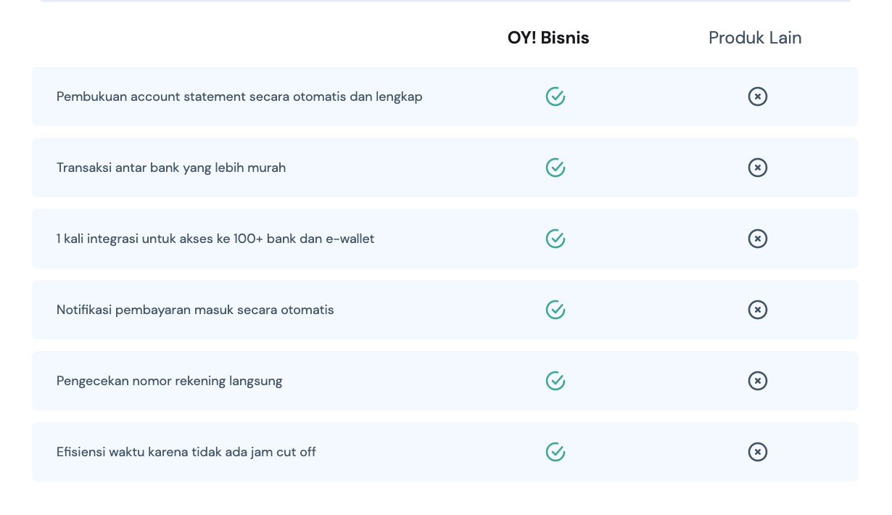

## Our Product Suites

**Money-Out (Disbursement)**

* API Disburse
* Bulk Disbursement

**Money-In (Accepting Payments)**

* Virtual Account (VA) Aggregator
* Payment Checkout Page/Invoice


## Registration Process

Registration process begins with creating an account. Creating an account is 100% free and enables you to try our product suites in staging/test environment, where you can execute money-in and money-out dummy transactions (without real money movement).

After successfully creating an account, if you are interested to go live (execute real money-in and/or money-out transactions) or integrate with OY!, you are required to upgrade your account by submitting supporting legal documentations.

## Creating Account

Follow the steps below to create an account:

**1. Register on the OY! dashboard**: To create your account, please register [here](https://business.oyindonesia.com/register?), and complete the form with all the required information. 

*Please note that your username cannot be changed once the registration form is submitted.*

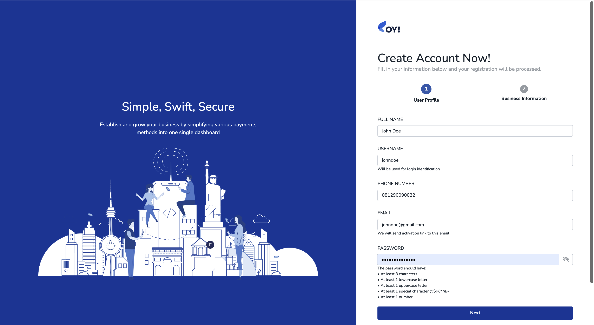


**2. Activate your account**: Once the registration is submitted, an activation link will be sent to the email registered. 


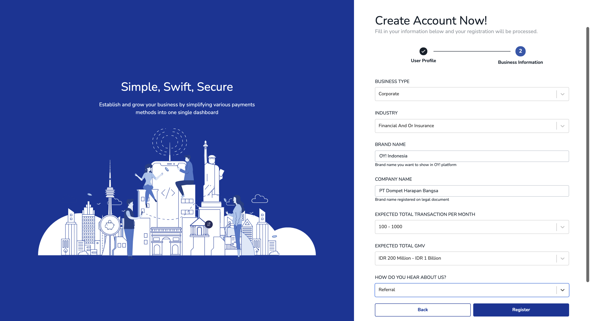

Once you are successfully logged in, you will be able to try our product suites in staging/test environment, where you can execute money-in and money-out dummy transactions (without real money movement).

If you are ready to proceed to go live or integrate with OY!, refer to the below sections for more information on the steps to upgrade your account.

## Upgrading your Account 

Follow the steps below to upgrade your account:

**1. Request to Upgrade your Account**: to access the full version of our products and services, please select “Upgrade Your Account” on the menu at the left side of the OY! dashboard  (Production environment) and complete all the required information.

*Please note that the receiving bank account information cannot be changed via the OY! dashboard once your upgrade account request is approved for security reasons. Please contact us at [partner@oyindonesia.com](partner@oyindonesia.com) to change the receiving bank account information.*

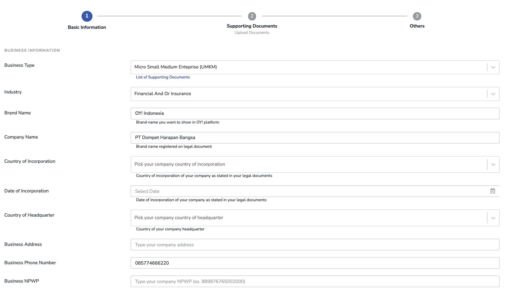

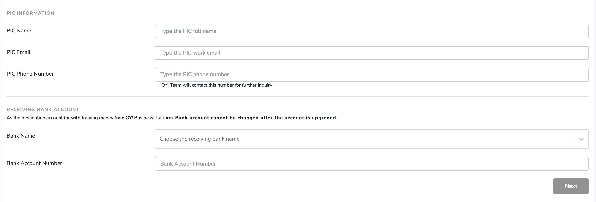

**2. Upload the Required Supporting Documents**: Please upload the required supporting documents according to your business type. Documents are only accepted in PDF format and must be less than 10 MB in size each. 

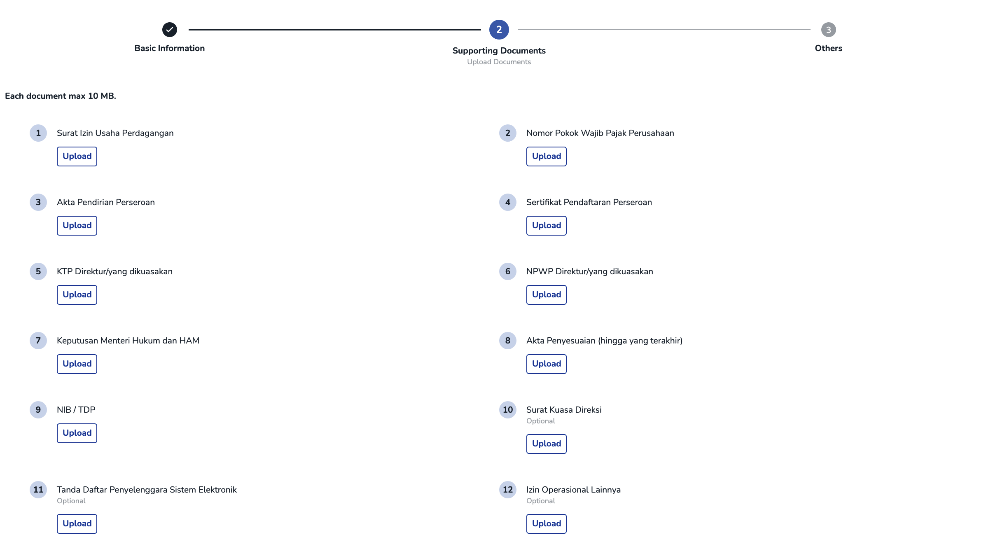

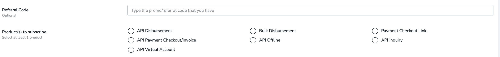

After you upload the required supporting documents, you need to choose which products that you want to use.

**3. Submit your Request**: Click “Submit & Request to Upgrade”, and a new status of “Upgrade Account Requested” should appear on this page, indicating that your request has been submitted along with your supporting documents.

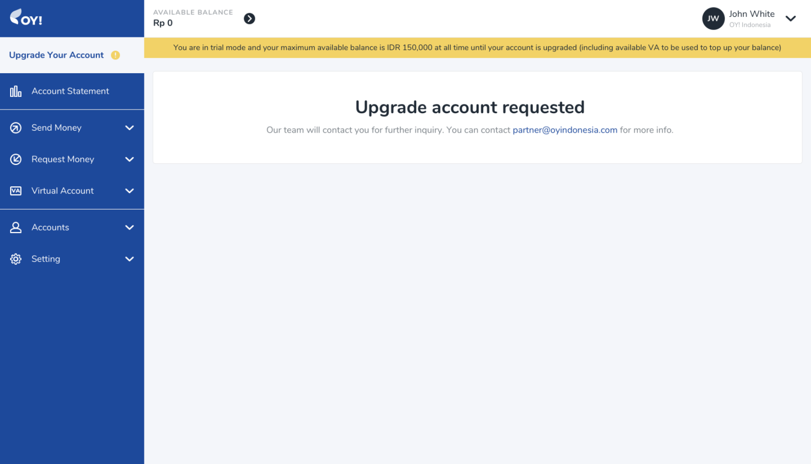

This process should take about 1 week. In the event that the status of your request is **Resubmit** or **Rejected**, please keep reading below. Otherwise, you are good to go! 

**Status: Resubmit** 

Upon reviewing the upgrade request, we might ask for additional documentations. Please follow the steps below: 

**1. Read our report**: A report will be sent to your email regarding the information and documents that will need to be revised or added. 

**2. Refill out the form**: When submitting another request to upgrade your account, please resubmit all your supporting documents. Documents are only accepted in PDF format and must be less than 10 MB in size.

**3. Submit your request**: Click “Submit & Request to Upgrade”, and a new status of “Upgrade Account Requested” should appear on this page, indicating that your request has been submitted along with your supporting documents.

For further inquiries, please contact us at [partner@oyindonesia.com](partner@oyindonesia.com) and our representative will get in touch. 

**Status: Rejected** 

For further inquiries regarding this review, please contact us at [partner@oyindonesia.com](partner@oyindonesia.com) and our representative will get in touch. 

## Required Supporting Documents 
Below is the list of documentation to be submitted for an upgrade request:

1. SIUP/Izin Usaha lainnya

2. NPWP Perusahaan

3. Akta Pendirian Perusahaan

4. Akta Perubahan Terakhir

5. Lembar Pengesahan Men-hakim

6. Kartu Identitas Direksi atau yang dikuasakan

7. Surat Kuasa Direksi apabila dikuasakan

8. NIB/TDP

## Completion/Go-Live Checklist 
Once you're ready to execute real money-in and money-out transactions or integrate with OY!, follow the below check-list to ensure you're all set up:

1. Create an account

2. Upgrade your account by submitting the required documentations

3. Have your upgrade request approved

4. Set up your receiving bank account information (note: ensure that the receiving bank account information is accurate as it cannot be changed via OY! dashboard for security reasons)

5. (Required if you want to use our API) Submit your IPs and callback URLs (both for staging and production environment) to your business representative or to partner@oyindonesia.com

6. (Required if you want to use our API) Request your staging and production API Key to our business representative (note: you are not required to upgrade your account to request staging API Key. Upgrade is only required if you want to request Production API Key).

7. (Optional) Perform testing. We recommend that you thoroughly test before going live. We’ve provided a Staging Mode in our dashboard, where you can test transactions to understand how our products work, without using real money. If you are a developer, you can also test your integrations.

8. (Optional) If your company wants to have multiple users: Create additional sub-account users under User Management

# Sending Payments

## API Disbursement

API disbursement product provides the capability for you to disburse to 100+ banks in Indonesia via OY! at any time. The integration process to use the API disbursement product is straight forward and the details can be checked [here](https://api-docs.oyindonesia.com/#fund-disbursement).  

## API Disbursement - Key Features
**Overdraft**

OY! has established partnerships with third party lenders to credit a specific amount of funds that can be used for your disbursement needs. With this feature, you don’t need to top up the OY! balance to execute disbursements. Please contact our [business representative](partner@oyindonesia.com) for further details about this feature.

**Overbooking** 

OY! can use the funds directly from your Mandiri, CIMB, or BNI bank accounts for your disbursement needs. You will only need to top up the admin fee needed to execute the disbursements instead of the full amount of your disbursement. Please contact our [business representative](partner@oyindonesia.com) for further details about this feature.

**Check Transaction Status and Callback**

For all disbursements executed, you will receive notifications regarding your transaction whether it is successful, failed or pending. We also provide an API for you to check the transaction status manually. IP proxy is also available upon request to enhance the security and integrity of the callback you will receive. 

**Check Balance**

You can check your available balance at anytime to ensure that you have sufficient balance to execute a disbursement.

## API Disbursement - Registration and Set Up
**Prerequisites** 

* Register an account on the [OY! dashboard](https://business.oyindonesia.com/register?)

* Activate your account through the activation link sent via email

* Upgrade your account 

* Upgrade request is approved

* Provide IP to be whitelisted and callback link to our business team

* Receive an API Key from us

* Integrate with our [API](https://api-docs.oyindonesia.com/#fund-disbursement)

## API Disbursement - Testing (Coming Soon)

## API Disbursement - How to Use 

In order to create disbursements, a sufficient available OY! balance is required in the account. More details and instructions about topping up to your OY! account coming soon.

Before you execute a disbursement, you can verify the beneficiary account information from our [inquiry endpoint](https://api-docs.oyindonesia.com/#bank-account-inquiry). 

> Below is an example of the request body for inquiry:

```shell 
curl -X POST https://partner.oyindonesia.com/api/inquiry 
-H 'content-type: application/json, accept: application/json, x-oy-username:myuser, x-api-key:987654' 
-d '{
    "recipient_bank": "022", 
    "recipient_account": "7823023345"
    }'
```

> It will return an [error message](https://api-docs.oyindonesia.com/#fund-disbursement-response-codes) if the request is not valid. Otherwise, below is the sample response parameters that will be returned:

```json
{
    "status":{
        "code":"000",
        "message":"Success"
    },
    "recipient_bank":"022",
    "recipient_account":"7823023345",
    "recipient_name":"Budi Soemitra Nasution",
    "timestamp":"16-10-2019 09:55:31"
}
```

> 

Next, send a request body to execute a disbursement request to be sent to our [disbursement endpoint](https://api-docs.oyindonesia.com/#disbursement). 

> Below is an example of the request body for the remit: 

```shell
curl -X POST https://partner.oyindonesia.com/api/remit 
-H 'content-type: application/json, accept: application/json, x-oy-username:myuser, x-api-key:7654321' 
-d '{
    "recipient_bank": "022", 
    "recipient_account": "7823023345", 
    "amount":100000, "note":"Pembayaran Nov IV", 
    "partner_trx_id":"Tx15048563JKFJ", 
    "email" :"budi.s@gmail.com"
    }'
```

> Below is the sample response parameters that will be returned:

```json 
{
    "status":{
        "code":"101",
        "message":"Request is Processed"
    },
    "amount":100000,
    "recipient_bank":"022",
    "recipient_account":"7823023345",
    "trx_id":"89718ca8-4db6-40a0-a138-a9e30d82c67d",
    "partner_trx_id":"Tx15048563JKFJ",
    "timestamp":"16-10-2019 10:23:42"
}
```

> 

An enpoint to [check the transaction](https://api-docs.oyindonesia.com/#get-disbursement-status) is also available and can be accessed at anytime. 

> Below is an example of the request body: 

```shell
curl -X POST https://partner.oyindonesia.com/api/remit-status 
-H 'content-type: application/json, accept: application/json, x-oy-username:myuser, x-api-key:7654321' 
-d '{
    "partner_trx_id": "1234-asde", 
    "send_callback": "true"
    }'
```

> The above command returns a JSON structured similar like this:

```json
{
  "status":{
    "code":"000",
    "message":"Success"
  },
  "amount":125000,
  "recipient_name":"John Doe",
  "recipient_bank":"008",
  "recipient_account":"1234567890",
  "trx_id":"ABC-456",
  "partner_trx_id":"1234-asde",
  "timestamp":"16-10-2020 10:34:23",
  "created_date": "24-01-2020 06:48:08",
  "last_updated_date": "24-01-2020 06:48:39"
}
```

>

A callback with the following information will be sent to the callback endpoint that you can register with us. 

> Below is an example of the request body: 

```shell 
curl -X POST https://partner.oyindonesia.com/api/remit-status 
-H 'content-type: application/json, accept: application/json, x-oy-username:myuser, x-api-key:7654321' 
-d '{
    "partner_trx_id": "Tx15048563JKFJ"
    }'
```

> Below is the sample response parameters that will be returned:

```json
{
    "status":{
        "code":"000",
        "message":"Success"
    },
    "amount":100000,
    "recipient_name":"Budi Soemitra Nasution",
    "recipient_bank":"022",
    "recipient_account":"7823023345",
    "trx_id":"89718ca8-4db6-40a0-a138-a9e30d82c67d",
    "partner_trx_id":"Tx15048563JKFJ",
    "timestamp":"16-10-2019 10:40:23",
    "created_date": "16-10-2019 10:23:42",
    "last_updated_date": "16-10-2019 10:34:23"
}
```

>

You can also [check your balance](https://api-docs.oyindonesia.com/#get-balance) anytime to ensure you have sufficient balance from our endpoint.

> Below is an example of a request body to check the balance:

```shell
curl -X GET 'https://partner.oyindonesia.com/api/balance' 
-H 'Content-Type: application/json' 
-H 'Accept: application/json' 
-H 'X-OY-Username: janedoe' 
-H 'X-Api-Key: 7654321'
```

> Below is the sample response parameters that will be returned:

```json 
{
    "status":{
        "code":"000",
        "message":"Success"
    },
    "balance":100000000.0000,
    "overdraftBalance":500000.0000,
    "overbookingBalance":200000.0000,
    "pendingBalance":2000000.0000,
    "availableBalance":98500000.0000,
    "timestamp":"10-12-2019 12:15:37"
}
```

>

Lastly, all transactions can be monitored from the OY! dashboard which includes all the transaction details.

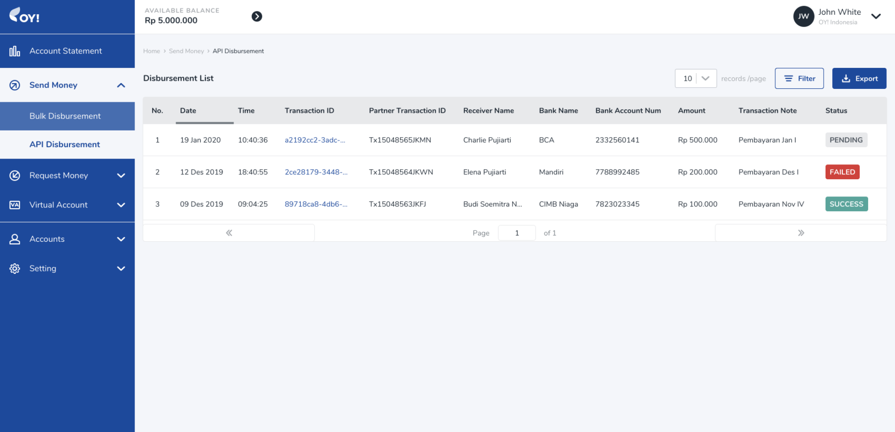

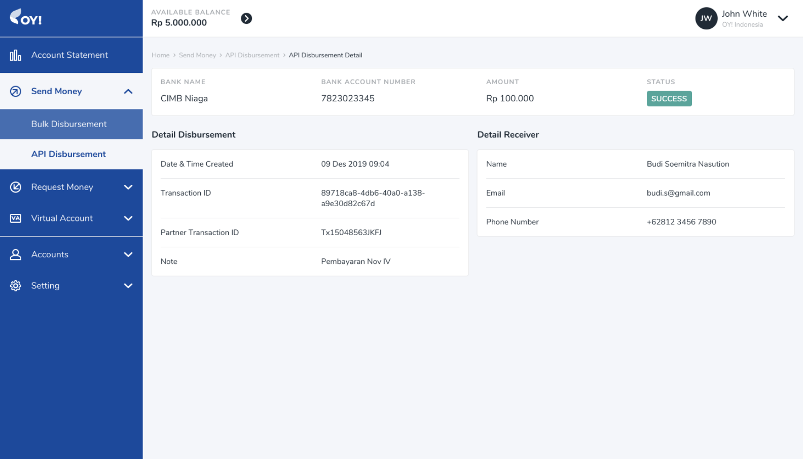


For further details on the parameters definition and proper usage, please refer to our [API Documentation](https://api-docs.oyindonesia.com/#fund-disbursement).


## Bulk Disbursement

Our Bulk disbursement product provides the capability to execute disbursements to multiple beneficiaries with a single xlsx or csv file upload (“Campaign”). Bulk disbursement is made through the OY! dashboard, where details regarding the disbursement campaign can be found. No technical integration is required to use this product. 

## Bulk Disbursement - Key Features 
**Overdraft**

OY! has established partnerships with third party lenders to credit a specific amount of funds that can be used for your disbursement needs. With this feature, you don’t need to top up the OY! balance to execute disbursements. Please contact our [business representative](partner@oyindonesia.com) for further details about this feature.

**Overbooking** 

OY! can use the funds directly from your Mandiri, CIMB, or BNI bank accounts for your disbursement needs. You will only need to top up the admin fee needed to execute the disbursements instead of the full amount of your disbursement. Please contact our [business representative](partner@oyindonesia.com) for further details about this feature.

**Account Management** 

When you first create an account, your account will be assigned as a Super Admin role. As a Super Admin, you have the ability to create new sub-accounts and assign different roles to your team such as Admin, Maker and Approver that are applicable for bulk disbursement. The Super Admin and Admin can also edit or delete created sub-accounts. 

*Note: it is not necessary to create new sub-accounts in order to use bulk disbursement. The Super Admin and Admin roles allows you to directly create and approve bulk disbursements.*

Detailed step-by-step instructions on setting up user management and the different role types coming soon. 

**Overall Campaign Summary**

Keep track of all the details of the entire campaign such as the total amount of disbursement, total number of transactions, and the maker and approver related information of a campaign.

**Transaction Details**

Itemized details of each individual transaction, including their respective statuses: success, pending, or failed.

## Bulk Disbursement - Registration and Set Up 
**Prerequisites**

* Register an account on the [OY! dashboard](https://business.oyindonesia.com/register?)

* Activate your account through the activation link sent via email

* Upgrade your account 

* Upgrade request is approved 

## Bulk Disbursement - Testing (Testing environment coming soon) 

## Bulk Disbursement - How to Use

In order to create disbursement campaigns, a sufficient available OY! balance is required in the account. If there is an insufficient available balance in the account, campaigns can still be created but not approved. 

More details and instructions about topping up to your OY! account coming soon. 

**1. Create Disbursement**: On the OY! dashboard, navigate to Send Payments > Bulk Disburse on your left menu bar. Click “Create Disbursement” on the far righthand side of that page to create a new bulk disbursement campaign.

**2. Create Campaign Details**: Fill in the campaign details and upload an xlsx or csv file. 

Please fill out a campaign name and campaign description in the provided spaces. These details are strictly used as your tracking information only and will not be shared to the transaction recipients. 

Please upload an xlsx or csv file with each individual transaction’s details of your bulk disbursement campaign. An example template for both file types are available for download on the OY! dashboard. The following list of items are required in your CSV file.

Column | Description | Example
------ | ----------- | -----------
Name | Recipient Name | Budy
Email | Recipient Email (can contain up to 5 emails with a total maximum of 255 characters, incoming transaction notifications will be sent to these emails) | Budi@email.com
Amount | Amount in IDR (only numbers) | 100000
Bank Code | [Destination Bank](https://docs.oyindonesia.com/#disbursement-bank-codes) | 014
Bank Account Number | Recipient Bank Account Number | 12341234
Phone Number | Recipient Phone Number | 62812341234
Notes (Optional) | Transaction Notes | 

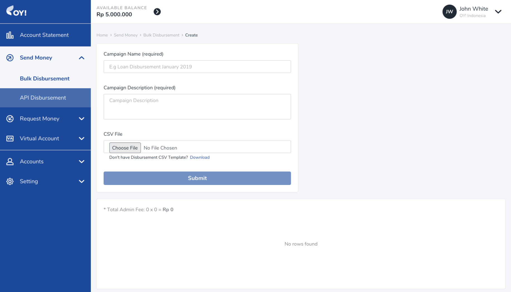

**3. Re-verify all the Information and Submit**: Once your xlsx or csv file is uploaded, you can verify all of the information uploaded from the file from the table displayed. If there is any incorrect submission such as invalid entry due to special characters, a red box will appear to highlight the entry that should be corrected. Issues must be resolved before a campaign can be submitted.

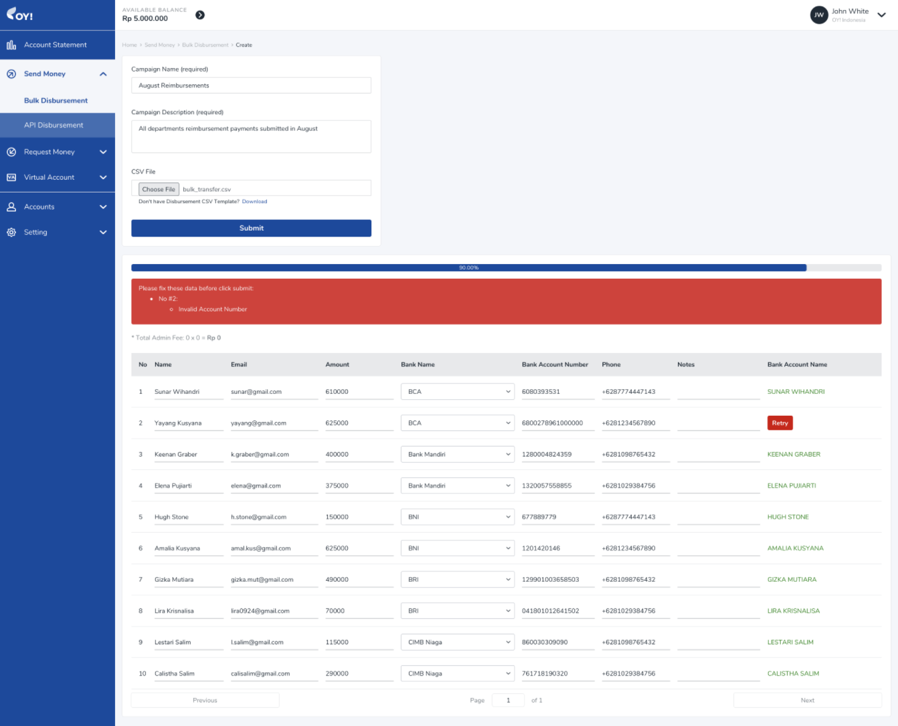

If there is no issue with the details uploaded from the xlsx or csv file, a blue bar with “100%” will show up above the list of transactions, indicating that all information is valid. Click “Submit” to complete creating the bulk disbursement campaign. 

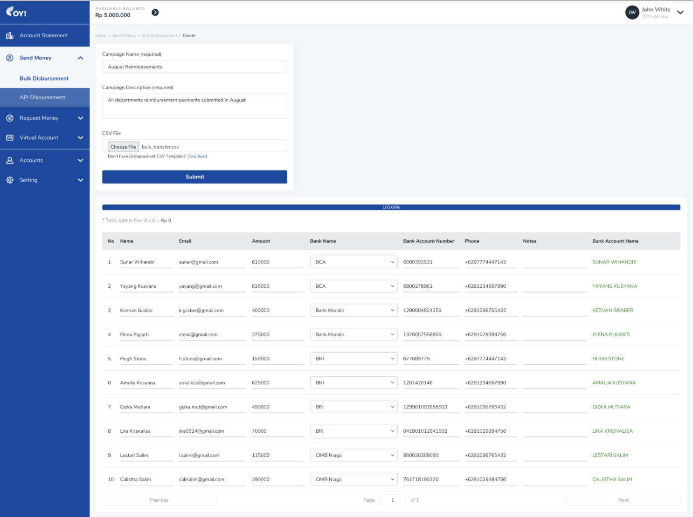

*Note: there is no limit to the amount of bulk disbursement campaigns that can be created at a given period of time.* 

**4. Approve/Cancel Campaign**: Once the bulk disbursement campaign is created, a new status of `waiting approval` will appear. Approve the campaign by clicking the “Approve” button. If you want to cancel a campaign, click the “...” button and select “Cancel”. 


Once the bulk disbursement campaign is approved, details regarding the campaign can no longer be changed. This includes changes made to individual transactions and their respective recipient information. 

The balances will also immediately reflect changes. For more information about the different types of balances, click here. You will also receive an email with the campaign information summary (“Outgoing Transfer Alert”) when transactions are executed.

*Note: Multiple campaigns can be approved at a time as long as there is sufficient available balance to complete campaigns that have already been approved but are still in queue to be processed.*

**5. Keep Track of Campaign Details**: To check the details of the bulk disbursement campaign, click on the campaign name to find the campaign summary and its recipient list. Keep track of the both the overall campaign status and the status of individual transactions through the page. 


**6. Status: In-Progress, Finish, and Cancel**: Congratulations! You just made your first bulk disbursement with OY! Below are a list of statuses you will find on the OY! dashboard. 

_In-Progress_

As your individual disbursements are executed, the status of your bulk disbursement campaign will indicate an in-progress status. 


_Finish_

Once all the listed transactions are executed and reflect their respective statuses, the status of your bulk disbursement campaign will transition to Finish. The recipients should have all received an email detailing an “Incoming Transfer Alert.” You can also download a report of the campaign details directly through the OY! dashboard. 


_Cancel_ 

If you choose not to approve your disbursement campaign, the status of your bulk disbursement campaign will indicate a cancelled status. 


You can also double check each of your transactions by navigating to the account statement page on the OY! dashboard. 


# Accepting Payments

## API VA Aggregator 

Businesses are struggling to manage hundreds or even thousands of physical bank accounts that are used for different purposes. It causes significant overhead cost in terms of the amount of account maintenance and man hours needed for reporting and reconciliation purposes, combining different information from different accounts. 

Virtual Account (VA) is essentially a dummy account that is linked to a physical account and has all the physical account characteristics that enables a much easier reporting and reconciliation process by centralizing the money flow into the physical account. By issuing VAs, you can assign each VA for specific person and/or purposes.


From the example above, it shows how payments made through the VAs are merely pass-throughs for the physical accounts to receive money. Without VAs, the above example might require up to 8 physical accounts from 2 different banks rather than 2 physical accounts from 2 different banks.

**OY! API VA Aggregator**

Our API VA Aggregator product provides you with the capabilities to create unique Virtual Account (VA) numbers as a bank transfer payment method for your customers while the fund movements take place through OY!'s physical account. It provides you with the capabilities to receive payments from your customers via bank transfer without having each respective bank account across multiple banks.  

Our virtual accounts are adjustable according to your needs. We offer options of static or dynamic accounts, single or mutli use accounts, opened or closed amounts, and determinable expiration dates. You can also track all created virtual accounts, incoming payments, and their respective details either through our API callback or the OY! dashboard. 

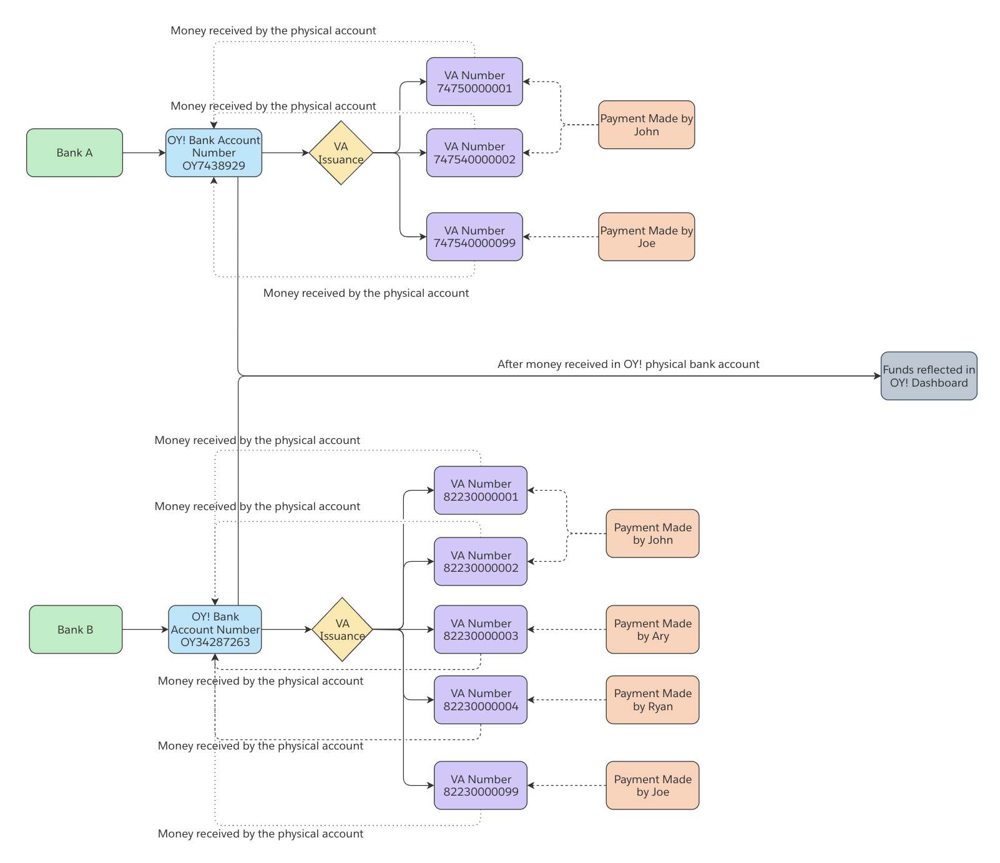

**VA Payment Flow**

Your users will be able to pay into a Virtual Account through ATM, Mobile Banking, and Internet Banking.

## API VA Aggregator - Key Features

1. **Support multiple banks** - Currently, we support virtual accounts (VA) at 6 banks: BCA, BNI, Mandiri, BRI, Permata, and CIMB Niaga
2. **Real-time settlement for majority of the banks** - Payment into a VA will settle in your OY! dashboard on a real-time basis for the majority of the banks (note: for BCA, the settlement will take place H+2 after payment is made into the VA)
3. **Transaction tracking and monitoring capability** - You can track all created VA, incoming payments, and their respective details through our API callback or the OY! dashboard. You will receive a callback all incoming transactions.
4. **Customizable VA types** - Refer to the table below for more informations on various types of VA:

| Type/Feature      | Description |
| ----------- | ----------- |
| Static Virtual Account     | VA that has a lifetime validity. It will always be active until it is manually deactivated   |
| Dynamic Virtual Account  | VA that has a specific validity period. It will always be active until it is expired or manually deactivated       |
| Closed Amount Virtual Account   | VA that only accepts payment of a specific amount/declared amount     |
| Opened Amount Virtual Account  |  VA that accepts payment of any amount        |
| Single Use Virtual Account    | VA that expires after a single payment. A single use configuration can only be set up for a dynamic VA      |
| Multiple Use Virtual Account | VA that only expires when expiration date is reached or when it is manually deactivated        |

5. **Capability to update VA** 

Attribute that can be updated:

* amount
* is_single_use
* email
* trx_counter
* expired_time
* trx_expired_time
* username_display

Example:
* A static VA with a closed amount can be updated with a new closed amount hence it can work as a bill to be paid for a particular customer
* A static VA can be updated to a single use so it will be the last payment received from a particular customer
* A dynamic VA with a closed amount is updated to an opened amount so that it can accept payments for any amount

All of the VA information, even after they are updated, is available on the OY! dashboard or via API. Once a VA is updated, the new set of configuration will apply for that VA and the previous configure is overridden and no longer applicable 

## API VA Aggregator - Use Cases

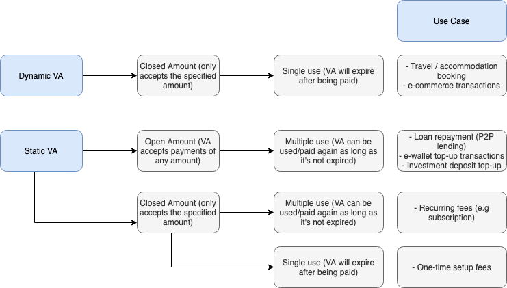

## API VA Aggregator - Registration and Set Up

Follow the below check-list to ensure you're all set up to use our VA Aggregator API service:

1. Create an account
2. Upgrade your account by submitting the required documentations
3. Have your upgrade request approved
4. Set up your receiving bank account information (note: ensure that the receiving bank account information is accurate as it cannot be changed via OY! dashboard for security reasons)
5. Submit your IPs and callback URLs to your business representative or to partner@oyindonesia.com
6. Receive an API Key from us (note: it is required for API authorization purpose)
7. Integrate with our Virtual Account Aggregator API

## API VA Aggregator - Testing 

Once you successfully create an OY! account, you can immediately simulate VA payments via API.

Follow the below steps to test the VA flow:

1. Create an account

2. Send a request to activate API VA Aggregator product and obtain staging API Key to your business representative

3. Create a VA number by sending a ‘POST’ request to https://api-stg.oyindonesia.com/api/generate-static-va using your staging API key. Enter the required and optional fields, as referenced in the API reference docs (https://api-docs.oyindonesia.com/#create-va)

4. After VA number is generated, partner can simulate VA payment through your dashboard (in Staging environment) by going to Settings, and choose "VA Callback"

5.  Fill in the bank name associated with the generated VA number, the generated VA number, amount, and payment date & time

6. If payment is successful, we will send a callback to the registered staging callback URL destination

7. The payment made to the VA can be monitored through OY! dashboard. Go to "Virtual Account" menu, and choose "Incoming Payment"

## API VA Aggregator - How to Use

Send us instructions to generate a new VA number.

> Below is an example of a request body to execute your request:

```shell 
curl --location --request POST https://partner.oyindonesia.com/api/generate-static-va
--header 'content-type: application/json' \
--header 'accept: application/json' \
--header 'x-oy-username: username' \
--header 'x-api-key: apikey' \
-d '{
    "partner_user_id":"51200021",
    "bank_code": "014",
    "amount": 150000,
    "is_open" : false,
    "is_single_use" : false,
    "is_lifetime": false,
    "expiration_time": 5,
    "username_display" : "va name",
    "email": "email@mail.com"
    }'
```

> It will return an [error message](https://api-docs.oyindonesia.com/#va-aggregator-response-codes) if the request is not valid. Otherwise, below is the sample response parameters that will be returned:

```json
{
    "id": "12345b1-23be-45670-a123-5ca678f12b3e",
    "status": {
        "code": "000",
        "message": "Success"
    },
    "amount": 15000,
    "va_number": "700707760000000003",
    "bank_code": "014",
    "is_open": false,
    "is_single_use": false,
    "expiration_time": 1582783668175,
    "va_status": "WAITING_PAYMENT",
    "username_display": "va name",
    "trx_expiration_time" : 1582783668175,
    "partner_trx_id" : "TRX0001"
}
```

>

Once a VA is created, its details can be seen and monitored through the OY! dashboard. 

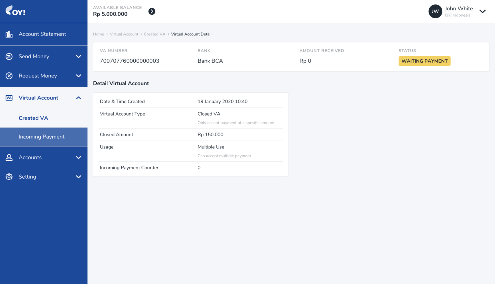

An endpoint to [check your VA information](https://api-docs.oyindonesia.com/#get-va-info) is also available and can be accessed at anytime.

> Below is an example of the request body:

```shell
curl --location --request GET https://partner.oyindonesia.com/api/static-virtual-account/12345b1-23be-45670-a123-5ca678f12b3e
--header 'content-type: application/json' \
--header 'accept: application/json' \
--header 'x-oy-username: username' \
--header 'x-api-key: apikey'
```

> Below is the sample response parameters that will be returned:

```json 
{
    "id": "12345b1-23be-45670-a123-5ca678f12b3e",
    "status": {
        "code": "000",
        "message": "Success"
    },
    "amount": 150000.0000,
    "va_number": "700707760000000003",
    "bank_code": "014",
    "is_open": false,
    "is_single_use": false,
    "expiration_time": 1582783668175,
    "va_status": "WAITING_PAYMENT",
    "username_display": "va name",
    "amount_detected": 0,
    "partner_user_id": "123456",
    "trx_expiration_time": 1582783668175,
    "partner_trx_id": "TRX0001"
}
```

>

If you wish to change the details of your VA, you can do so by [updating your VA](https://api-docs.oyindonesia.com/#update-va) at any time.

> Below is an example of the request body:

```shell
curl --location --request PUT https://partner.oyindonesia.com/api/static-virtual-account/12345b1-23be-45670-a123-5ca678f12b3e
--header 'content-type: application/json' \
--header 'accept: application/json' \
--header 'x-oy-username: username' \
--header 'x-api-key: apikey' \
-d '{"is_open" : true,"amount": 50000,"is_single_use" : false,"expiration_time": 30,"username_display" : "va name","bank_code": "014","trx_expiration_time":5,"partner_trx_id":"TRX0001"}'
```

> Below is the sample of response parameters that will be returned:

```json 
{
    "id": "12345b1-23be-45670-a123-5ca678f12b3e",
    "status": {
        "code": "000",
        "message": "Success"
    },
    "amount": 50000,
    "va_number": "700707760000000003",
    "bank_code": "014",
    "is_open": true,
    "is_single_use": false,
    "expiration_time": 1582802205412,
    "va_status": "WAITING_PAYMENT",
    "username_display": "va name",
    "partner_user_id": "123456",
    "trx_expiration_time": 1582802205412,
    "partner_trx_id": "TRX0001"
}
```

>

All details regarding your [created VA](https://api-docs.oyindonesia.com/#get-list-of-created-va) and its payments can be retrieved via our API endpoint or can be monitored directly from the OY! dashboard.

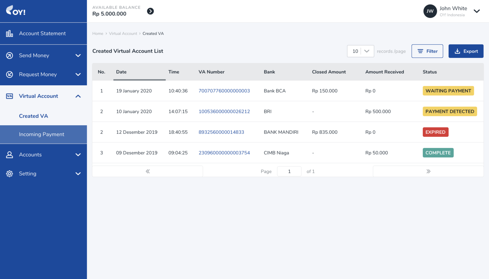

Similarly, all the details regarding [incoming transactions](https://api-docs.oyindonesia.com/#get-list-of-transaction-for-va) for specific va numbers can be retrived via our API endpoint or can be monitored directly from the OY! dashboard.

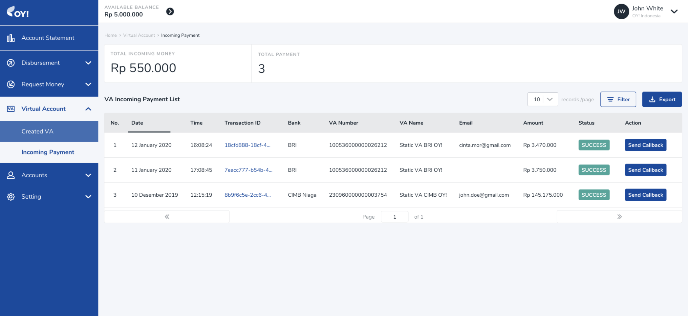

For further details regarding OY!'s extensive API VA Aggregator capabilities and endpoints, please refer to the [OY! API Documentation](https://api-docs.oyindonesia.com/#va-aggregator).


## Payment Checkouts/Invoice 

**Overview**

OY! Payment Checkout/Invoice is a pre-built payment page that allows your business to easily and securely accept payments online. Currently, our payment checkout/invoice page supports Credit Card, Debit Card, Bank Transfer, and QRIS (e-wallet) payment methods. You can create payment checkout/invoice pages through various methods: OY! Dashboard, pre-generated URL, and API.

Creating a payment checkout/invoice page is free! You will only be charged when you successfully receive a payment made through that checkout/invoice page.

**Payment Flow**

1. You create payment checkout/invoice page for your customers
2. Your customers make a payment through the payment checkout/invoice page
3. OY! detects the payments and notifies you about the payments through sending a callback and/or updating the payment status on your dashboard
4. The payments received will settle in your OY! dashboard

**Payment Checkout Preview**

Step 1 - Input Amount

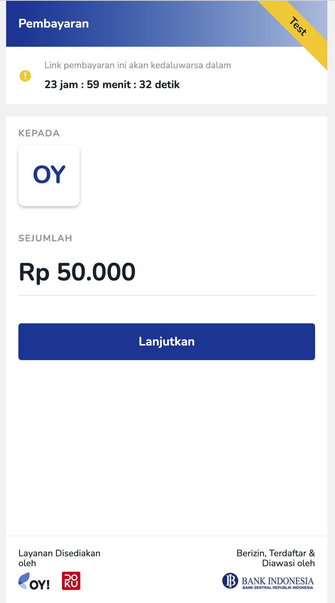

Step 2 - Input Personal Info of the Customer

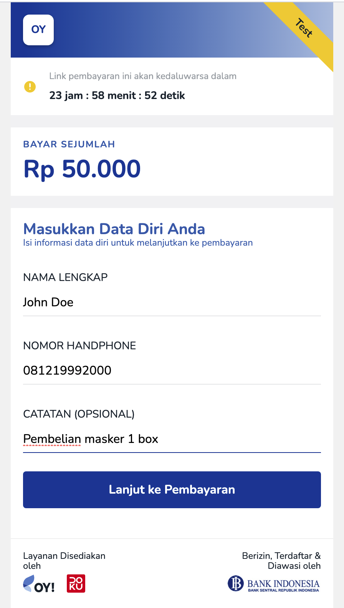

Step 3 - Select Payment Method

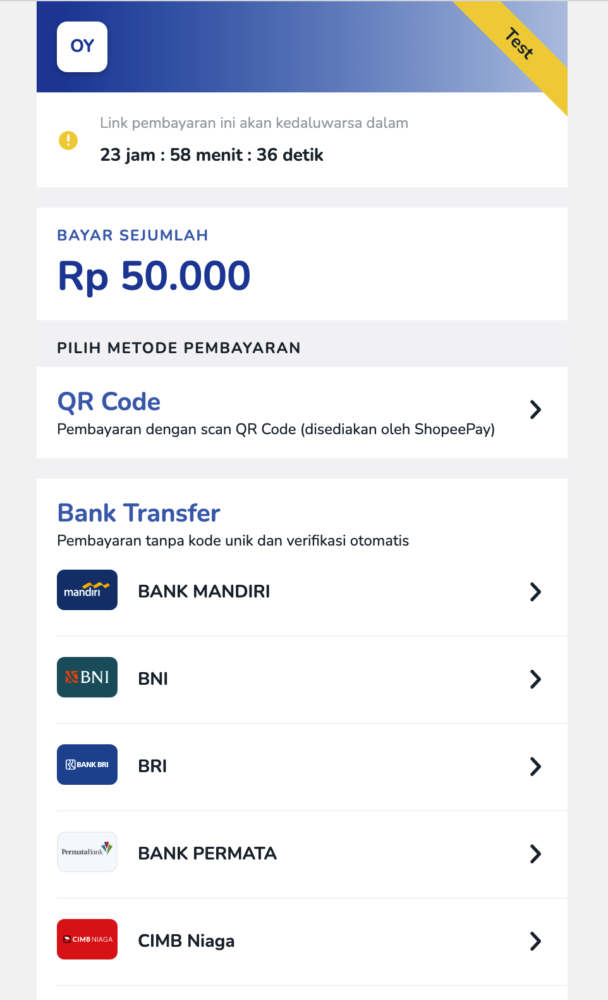


## Payment Checkout/Invoice - Key Features 

### Various options of creating payment  checkout/invoice page

**1. Creating payment checkout/invoice page through pre-generated URL**

 - **No integration needed**
Access and declare all parameters needed from the URL with easy and simple declaration. 

 - **Reusable link** 
One link can be used many times without repeating declaration. 

 - **Amount and payment method customization** 
You can choose whether your users will pay a fixed amount (closed amount) or any amount (open amount). 

	You can also choose which payment methods that you will enable for your customers. The payment methods to choose from are Bank Transfers, Credit Card, Debit Card, and QR code. 

	Please refer to our [FAQ page](https://docs.oyindonesia.com/#faqs) below for more information regarding closed and open amounts.

 - **Payment checkout page customization** 
You can customize which payment checkout pages are accessible for your users. We offer options to hide pages 1 (Input Amount), 2 (Customer Information), and 3 (Select Payment Method) of our payment checkout.

**2. Creating payment checkout/invoice page through API**

 - **Seamless integration with your customer's purchase journey**
 You can easily call our API - we will take care of the payment checkout/invoice link creation and feed it back to you so that you can embed the link in your customer journey. 
 
 - **Added level of customization**
 
Below are the things that you can customize:
1. Amount (specify the amount and choose between open amount vs closed amount)

2. Admin fee (choose whether the admin fee will be borne by your customers or borne by you)

3. Payment method (choose the payment methods displayed to your customers among Bank Transfers, Credit Card, Debit Card, and QR code options. Additionally, you can choose which banks are enabled for Bank Transfer method.)
 
4. Payment checkout page (choose which payment checkout pages are accessible for your users. We offer options to hide pages 1 (Input Amount), 2 (Customer Information), and 3 (Select Payment Method) of our payment checkout.

5. Payment link expiration date

 - **Static VA for Invoice Payment**
You can enable a static VA option when using the API specifically assigned to your customer.

 - **Upload or Create a PDF for your Invoice Billing**
You can upload an invoice attachment or create an attachment using the OY! PDF templates via our API so you do not need to send a separate email to your customer.

- **Payment Link Delivery by Email**
If you want to share the payment link to your customer's email, you can define the email parameter in our API. No need for you to send a separate email!


**3. Creating payment checkout/invoice page through dashboard**

If you want to use our payment checkout/invoice page without undergoing technical integration process/without API and with higher level of customization, you can choose to create it through your dashboard.

This capability enables you to enjoy most of the features and benefits of creating payment checkout/invoice page through API - without any integration needed!

### Capability to monitor payment checkout/invoice details on dashboard

Whether you send your user a pre-generated link, dashboard-generated link, or an API-generated encapsulated link, each of your distributed payment checkout links can be monitored through the OY! Dashboard. We will also send a callback for all incoming payments.

You will be able to see the details of the payment checkout including, but not limited to, the payment status, creation and expiration dates and times, amount, description, payment details, and payer details. For further convenience, you can also find and filter through your payment link list by creation date, partner transaction ID, or status. 

We also provide an API for you to check the transaction status manually. 

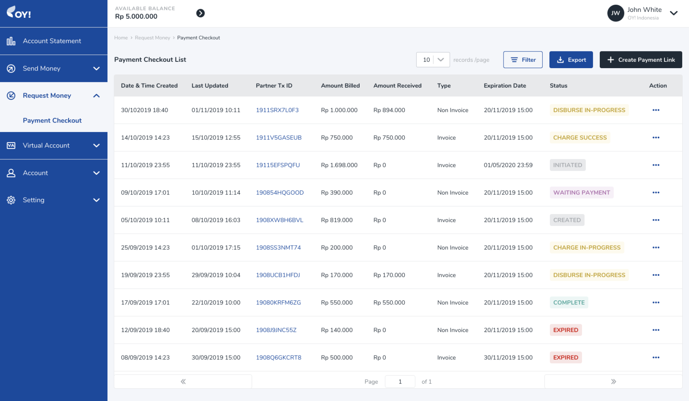

## Payment Checkout/Invoice - Registration and Set Up

**For dashboard and URL-generated links** 

Follow the below check-list to ensure you're all set up to use the above service:

1. Create an account
2. Upgrade your account by submitting the required documentations
3. Have your upgrade request approved
4. Set up your receiving bank account information (note: ensure that the receiving bank account information is accurate as it cannot be changed via OY! dashboard for security reasons)
5. Once your account is approved, you can access the URL via [https://pay.oyindonesia.com/v2?username=yourusername](https://pay.oyindonesia.com/v2?username=yourusername). 
Step by step instructions can be found [here](https://docs.oyindonesia.com/#how-to-use-payment-checkout-via-link)

	You can also start creating the payment checkout/invoice page link through the dashboard. Step by step instructions can be found here.

**For API-generated links** 

1. Create an account

2. Upgrade your account by submitting the required documentations

3. Have your upgrade request approved

4. Set up your receiving bank account information (note: ensure that the receiving bank account information is accurate as it cannot be changed via OY! dashboard for security reasons)

5. Submit your IPs and callback URLs to your business representative or to partner@oyindonesia.com

6. Receive an API Key from us (note: it is required for API authorization purpose)

8. Integrate with our [Payment Checkout API](https://api-docs.oyindonesia.com/#api-create-payment-checkout)

## Payment Checkout/Invoice - Testing 

**Creating dashboard-generated test links** 

1. Log on your OY! dashboard
2. Choose "Staging" environment
3. Click "Request Money" menu, and choose "Payment Checkout"
4. Click "Create Payment Checkout Link"
5. Fill in the necessary details

| Parameter     | Description |
| ----------- | ----------- |
| Amount Type    |You can choose between Open Amount and Closed Amount.  Open Amount = can accept payments of any amount, OR up to the specified amount (if amount is filled in). Closed Amount = only accept payments of the specified amount|
| Partner Transaction ID    |A unique transaction ID that you can assign for a transaction|
| Payment Method   |The payment method that you can choose to enable/disable for your customers. The payment methods available are Bank Transfer, Credit Card, Debit Card, and QRIS (e-wallet)|
| Admin Fee Method  |You can choose between "Included in total amount" or "Excluded from total amount". "Included in total amount" means the admin fee will be deducted from the payment amount made by the customer. "Excluded from total amount" means the admin fee will be added to the customer's total payment (Total Amount = Specified Amount + Admin Fee)|
| Expiration Fee |You can choose between "Default" and "Custom". "Default" means the payment link will expire 24 hours after it is created. "Custom" means you can specify the expired date. The payment link will expire when this specified expired date is reached |
| Payment Type |You can choose between "Non Invoice" and "Invoice". By choosing "Invoice", you will be able to upload the invoice PDF or list down the items to be invoiced (item name, description, quantity, purchase date, price per item, and total price). You can also choose whether to assign a static virtual account to the corresponding user.  |
| Description   |The description of the payment link. Usually this is used to describe the purpose of the payment checkout page|
|Customer Detail |Details that can be specified: Customer Name, Phone Number, Email, and Notes. We will send the payment checkout page link to the specified email address (if email address is filled in)|

**Creating API-generated test links** 

1. Create an account
2. Send a request to activate API Payment Checkout product and obtain staging API Key to your business representative
3. Create a payment checkout by sending a ‘POST’ request to https://api-stg.oyindonesia.com/api/payment-checkout/create-v2. Enter the required and optional fields, as referenced in the [API reference docs](https://api-docs.oyindonesia.com/#api-create-payment-checkout)

**Accessing and monitoring the created test payment checkout links**

Whether you create the link through URL, dashboard, or API, you can see the details of your link on the OY! Dashboard. The details that can be checked are the created date of the link, amount billed, amount received, expiration date, and status.

## How to Use Payment Checkout/Invoice via Link/URL

*Note:* Our payment link includes parameters that are easily adjustable according to your needs. You can send the link to multiple customers using the same link (please refer to the steps below) and we will take care the rest.

1. Access the base URL of your payment checkout page: Access our pre-generated test link unique to your account by simply replacing your username with your username approved with OY! at [https://pay.oyindonesia.com/v2?username=yourusername](https://pay.oyindonesia.com/v2?username=yourusername). 

2. Customize the URL parameter(s) as needed: There are various parameters that you can customize within the URL, simply refer to the below table to do the customization;

| Parameter     | Definition | Customization Step | Sample Link | 
| ----------- | ----------- |----------- |----------- |
| Amount    |The payment amount that will be displayed in the payment checkout page  | Add "amount=[the specified amount]", separated by &. Example: amount=100000 | `https://pay.oyindonesia.com/v2?username=yourusername&amount=100000`
| Step | The section of the payment checkout page you want to redirect your users to.     |Add "step=[the specified step]", separated by &. The specified step can be filled in with one of the following: "input_amount", "input_personal_info", or "select_payment_method". | `https://pay.oyindonesia.com/v2?username=yourusername&step=input_personal_info`
| Partner transaction ID   |  The identifier corresponding to the payment checkout transaction. Example: partner_tx_id=OY2021ABCD123.  | Add “partner_tx_id=[the specified partner transaction ID]”, separated by &. | `https://pay.oyindonesia.com/v2?username=yourusername&partner_tx_id=OY2020ABCD123`
|Sender Name  | The name of your user that will be displayed in the payment checkout page. Example: sender_name=John Doe        | Add "sender_name=[the specified sender name]", separated by &. | `https://pay.oyindonesia.com/v2?username=yourusername&sender_name=John`
| Is  Open   | Identifier of whether the amount is open or closed for this payment check out page. If set to TRUE, your user will be able to edit the amount. If set to FALSE: 1) your user will not be able to edit the amount, 2) it is mandatory for you to define the partner_tx_id and amount parameter in the link. When is_open is set to FALSE, deleting `is_open=false` from the link or changing it back to `is_open=true` will not revert the amount back to an unlocked value. Once `is_open=false` is declared, the amount is permanently frozen for this particular `partner_tx_id`.  |Add "is_open=[TRUE or FALSE]", separated by &.|`https://pay.oyindonesia.com/v2?username=yourusername&is_open=false&amount=100000&partner_tx_id=OY2020ABCD123`
|Payment Method | The payment method to be enabled for the users. Payment methods available are bank transfer through VA (Virtual Account), Credit Card,  Debit Card, and QR (e-wallet). You can choose specific payment methods to be enabled/disabled via parameter declaration by specifying `enable_payment_va`, `enable_payment_cc` or `enable_payment_debit` as `true` or `false`|Add "is_open=[TRUE or FALSE]", separated by &. If not specified, it will be enabled by default| `https://pay.oyindonesia.com/v2?username=yourusername&enable_payment_va=FALSE`

It is optional to specify each of the parameter listed above.

Whether you create the link through URL, dashboard, or API, you can see the details of your link on the OY! Dashboard. The details that can be checked are the created date of the link, amount billed, amount received, expiration date, and status.

## How to Use Payment Checkout/Invoice via Dashboard

1. Log on your OY! dashboard
2. Choose "Production" environment
3. Click "Request Money" menu, and choose "Payment Checkout"
4. Click "Create Payment Checkout Link"
5. Fill in the necessary details

| Parameter     | Description |
| ----------- | ----------- |
| Amount Type    |You can choose between Open Amount and Closed Amount.  Open Amount = can accept payments of any amount, OR up to the specified amount (if amount is filled in). Closed Amount = only accept payments of the specified amount|
| Partner Transaction ID    |A unique transaction ID that you can assign for a transaction|
| Payment Method   |The payment method that you can choose to enable/disable for your customers. The payment methods available are Bank Transfer, Credit Card, Debit Card, and QRIS (e-wallet)|
| Admin Fee Method  |You can choose between "Included in total amount" or "Excluded from total amount". "Included in total amount" means the admin fee will be deducted from the payment amount made by the customer. "Excluded from total amount" means the admin fee will be added to the customer's total payment (Total Amount = Specified Amount + Admin Fee)|
| Expiration Fee |You can choose between "Default" and "Custom". "Default" means the payment link will expire 24 hours after it is created. "Custom" means you can specify the expired date. The payment link will expire when this specified expired date is reached |
| Payment Type |You can choose between "Non Invoice" and "Invoice". By choosing "Invoice", you will be able to upload the invoice PDF or list down the items to be invoiced (item name, description, quantity, purchase date, price per item, and total price). You can also choose whether to assign a static virtual account to the corresponding user.  |
| Description   |The description of the payment link. Usually this is used to describe the purpose of the payment checkout page|
|Customer Detail |Details that can be specified: Customer Name, Phone Number, Email, and Notes. We will send the payment checkout page link to the specified email address (if email address is filled in)|

Whether you create the link through URL, dashboard, or API, you can see the details of your link on the OY! Dashboard. The details that can be checked are the created date of the link, amount billed, amount received, expiration date, and status.

## How to Use Payment Checkout via API 

We provide 3 different payment checkout endpoints depending on your requirements and needs. We provide payment checkout, invoicing, and recurring invoice.  

Send us instructions to generate a [payment checkout link](https://api-docs.oyindonesia.com/#api-create-payment-checkout). 

> Below is an example of a request body to execute your request:

```shell
curl -X POST \
  https://partner.oyindonesia.com/api/payment-checkout/create-v2 \-H 'cache-control: no-cache' -H 'content-type: application/json' \-H 'X-Api-Key: apikeymu' -H 'X-Oy-Username: yourusername' \-d '{
        "partner_tx_id":"partnerTxId",
        "description":"description",
        "notes":"notes",
        "sender_name":"Sender name",
        "amount":50000,
        "email":"",
        "phone_number":"",
        "is_open":false,
        "step":"input-amount",
        "include_admin_fee":false,
        "list_disabled_payment_methods":"",
        "list_enabled_banks":"",
        "expiration":"2020-08-08 08:09:12"
    }'
```

> Below is the sample response parameters that will be returned:

```json
{
    "success": true,
    "url": "https://pay.oyindonesia.com/id",
    "message": "success",
    "email_status": "PROCESSED",
    "payment_link_id": "id"
}
```

>

Send us instructions to generate a [payment checkout invoice link](https://api-docs.oyindonesia.com/#api-create-invoicing). 

> Below is an example of a request body to execute your request:

```shell
url -X POST \
  https://partner.oyindonesia.com/api/payment-checkout/create-invoice\-H 'cache-control: no-cache' -H 'content-type: application/json' \-H 'X-Api-key: apikeymu' -H 'X-Oy-Username: yourusername' \-d '{
        "partner_tx_id":"partner tx id",
        "description":"desc invoice",
        "notes":"notes satu",
        "sender_name":"Sender Name API",
        "amount":"30000",
        "email":"",
        "phone_number":"",
        "is_open":"true",
        "step":"input-amount",
        "include_admin_fee":false,
        "list_disabled_payment_methods":"",
        "list_enabled_banks":"013",
        "expiration":"2020-07-28 19:15:13",
        "partner_user_id":"partner user id", 
          "full_name" : "Raymond",
          "is_va_lifetime": false,
        "attachment": "JVBERi0xLjQKJeLjz9MKMyAwIG9iago8PC9GaWx0ZXIvRmxhdGVEZWNvZGUvTGVuZ3RoIDQ5Nj4+c3RyZWFtCnicrZVdb9MwFIbv/SsOd51EwrHjz0tKhxQk2IciJMS4CG46lbVNyYcE/HqcbNloh5xO8U3OUXJ8Hr/2aweBQkQBQRjhnnZLfpJ5RhIJQhjIluQ8I1eEwYfubVeHMFRnW/LmPQWKkK3I7Cz70dU+lfTN/hnE3ChJY9SPA0U3EPvP1S2ZXXx5Bemnzxfpu/OuGcLtfxp+/ebisp+QH8VkrNjhHJ9QaV23xRKyciKIGuCGjYPmv6cq0idKWuRNEYDlV7VoixAgwcdEXeZVsysqyH5BughA88t6uy3bXQNO3XRbCEq9pKr8sw5gPuXT8zGv7/JNCOeh9mAYMoxQRcyEMJ5KRlEmokkI63lVrSgqi8JEWlsV8ZURkRFMR1pILkVuZcJYCEd69V7vY3eZxYj4GvEkGsaMK5SAMTcauYsKje6aObskUsGWaKr7bPOYHUd7/8XIocZlx9H2DfuSh+Qw2AG4GZLDYMlqmLfHEQIS/XyBaOf++5uoqG213jfrcjfVfAYdi/tY0288noxBrpqpvwoh1AjjslrbqUo6j/kpWdnkG7iZpYvrm7MQmyOe045vBhkhDbFFI6gTz6Jvj9zqCd+frz/5MRMvOvyeBUxGRM3bvIHvRZXvmryGu7Jq901ZhTDJqEweC+xlvkTqX6+ILeYKZW5kc3RyZWFtCmVuZG9iagoxIDAgb2JqCjw8L1RhYnMvUy9Hcm91cDw8L1MvVHJhbnNwYXJlbmN5L1R5cGUvR3JvdXAvQ1MvRGV2aWNlUkdCPj4vQ29udGVudHMgMyAwIFIvVHlwZS9QYWdlL1Jlc291cmNlczw8L0NvbG9yU3BhY2U8PC9DUy9EZXZpY2VSR0I+Pi9Qcm9jU2V0IFsvUERGIC9UZXh0IC9JbWFnZUIgL0ltYWdlQyAvSW1hZ2VJXS9Gb250PDwvRjEgMiAwIFI+Pj4+L1BhcmVudCA0IDAgUi9Sb3RhdGUgOTAvTWVkaWFCb3hbMCAwIDU5NSA4NDJdPj4KZW5kb2JqCjUgMCBvYmoKWzEgMCBSL1hZWiAwIDYwNSAwXQplbmRvYmoKMiAwIG9iago8PC9TdWJ0eXBlL1R5cGUxL1R5cGUvRm9udC9CYXNlRm9udC9IZWx2ZXRpY2EvRW5jb2RpbmcvV2luQW5zaUVuY29kaW5nPj4KZW5kb2JqCjQgMCBvYmoKPDwvS2lkc1sxIDAgUl0vVHlwZS9QYWdlcy9Db3VudCAxL0lUWFQoMi4xLjcpPj4KZW5kb2JqCjYgMCBvYmoKPDwvTmFtZXNbKEpSX1BBR0VfQU5DSE9SXzBfMSkgNSAwIFJdPj4KZW5kb2JqCjcgMCBvYmoKPDwvRGVzdHMgNiAwIFI+PgplbmRvYmoKOCAwIG9iago8PC9OYW1lcyA3IDAgUi9UeXBlL0NhdGFsb2cvUGFnZXMgNCAwIFIvVmlld2VyUHJlZmVyZW5jZXM8PC9QcmludFNjYWxpbmcvQXBwRGVmYXVsdD4+Pj4KZW5kb2JqCjkgMCBvYmoKPDwvTW9kRGF0ZShEOjIwMjAwNzI5MTE1MzE1WikvQ3JlYXRvcihKYXNwZXJSZXBvcnRzIExpYnJhcnkgdmVyc2lvbiBudWxsKS9DcmVhdGlvbkRhdGUoRDoyMDIwMDcyOTExNTMxNVopL1Byb2R1Y2VyKGlUZXh0IDIuMS43IGJ5IDFUM1hUKT4+CmVuZG9iagp4cmVmCjAgMTAKMDAwMDAwMDAwMCA2NTUzNSBmIAowMDAwMDAwNTc4IDAwMDAwIG4gCjAwMDAwMDA4NjQgMDAwMDAgbiAKMDAwMDAwMDAxNSAwMDAwMCBuIAowMDAwMDAwOTUyIDAwMDAwIG4gCjAwMDAwMDA4MjkgMDAwMDAgbiAKMDAwMDAwMTAxNSAwMDAwMCBuIAowMDAwMDAxMDY5IDAwMDAwIG4gCjAwMDAwMDExMDEgMDAwMDAgbiAKMDAwMDAwMTIwNCAwMDAwMCBuIAp0cmFpbGVyCjw8L0luZm8gOSAwIFIvSUQgWzwzZWMyMWUyNjkwNjcxYzViYTliNjUxODNhY2IxOTM3ND48NzZhNzM1MWE1YmY4ZmMxNDNmY2NlZmUwYjRjMzA4MWI+XS9Sb290IDggMCBSL1NpemUgMTA+PgpzdGFydHhyZWYKMTM1OAolJUVPRgo=",
          "invoice_items": [
          {
            "item":"item name", 
            "description":"description", 
            "quantity": 10, 
            "date_of_purchase":"2020-09-20", 
            "price_per_item": 33000  
          }
        ],
          "attachment": "string base 64 pdf"
    }'
```

> Below is the sample of response parameters that will be returned:

```json
{
    "success": true,
    "url": "https://pay.oyindonesia.com/invoice/id",
    "message": "success",
    "email_status": "PROCESSED",
    "payment_link_id": "id"
}
```

>

Send us instructions to generate a [recurring payment checkout invoice link](https://api-docs.oyindonesia.com/#api-create-recurring-invoice-coming-soon). 

> Below is an example of a request body to execute your request: coming soon

An endpoint to retrieve and/or re-send the latest [callback status](https://api-docs.oyindonesia.com/#api-payment-status) of a transaction is also available and can be accessed at anytime.

> Below is an example of a request body to execute your request: 

```shell
curl -X GET 'https://partner.oyindonesia.com/api/payment-checkout/status?partner_tx_id=OY123456&send_callback=false' -H 'x-oy-username:yourusername' -H ' x-api-key:yourapikey'
```

> Below is the sample response parameters that will be returned:

```json
{
    "partner_tx_id": "partner000001",
    "tx_ref_number": "1234567",
    "amount": 15000,
    "sender_name": "Joko Widodo",
    "sender_phone": "+6281111111",
    "sender_note": "Mohon dikirim segera",
    "status": "success",
    "settlement_type": "realtime",
    "sender_bank": "008",
    "payment_method": "DC",
    "va_number" : ""
}
```

>

An endpoint to check your [payment or invoice data](https://api-docs.oyindonesia.com/#api-get) is also available and can be accessed at anytime.

> Below is an example of a request body to execute your request: 

```shell
curl -X GET \
  https://partner.oyindonesia.com/api/payment-checkout/{payment_link_id_or_partner_tx_id}\
  -H 'cache-control: no-cache' -H 'content-type: application/json' \
  -H 'X-Api-key: apikeymu' -H 'X-Oy-Username: yourusername'
```

> Below is the sample response parameters that will be returned:


```json 
{
    "data": {
        "partnerTxId": "abc10",
        "paymentLinkId": "703e05c0-48e3-47bd-9c22-670941d4d5fe",
        "amount": 15000,
        "username": "justkhals",
        "senderName": "John Doe",
        "senderPhoneNumber": null,
        "senderNotes": null,
        "status": "CREATED",
        "txRefNumber": null,
        "description": "testdesc",
        "isOpen": true,
        "step": "input-amount",
        "notes": "testnote",
        "phoneNumber": "085248395555",
        "email": "maskalgrr@gmail.com",
        "includeAdminFee": false,
        "listDisabledPaymentMethods": "",
        "listEnabledBanks": "008",
        "expirationTime": "2020-08-12 00:00:00",
        "invoiceData": {
            "fullName": "John Dooe",
            "isVaLifetime": false,
            "isScheduled": false,
            "recurringStartDate": null,
            "recurringEndDate": null,
            "recurringFrequency": null,
            "invoiceItems": "[{\"item\": \"AK 47\", \"quantity\": 2000, \"description\": \"Untuk Kemanan Negara\", \"price_per_item\": 2250000, \"date_of_purchase\": 1590969600000}]"
        }
    },
   "message": "return payment checkout data",
   "status": true
}
```

>

Lastly, we provide an endpoint to [delete your payment or invoice link](https://api-docs.oyindonesia.com/#api-delete) based on `payment_link_id` or `partner_tx_id`. The payment or invoice link must still be active and a payment method must not have been selected.

> Below is an example of a request body to execute your request: 

```shell
curl -X DELETE \
  https://partner.oyindonesia.com/api/payment-checkout/{payment_link_id_or_partner_tx_id}\
  -H 'cache-control: no-cache' -H 'content-type: application/json' \
  -H 'X-Api-key: apikeymu' -H 'X-Oy-Username: yourusername' 
```

> Below is the sample of response parameters that will be returned:

```json
{
    "status" : true,
    "message" : "success delete payment checkout data"
}
```

>

Just like the Payment Checkout via Link, you can access all your payment checkout links and its details from the OY! dashboard. This report will include all payment checkout links generated both via Link and API.


## How to Use Payment Checkout via Dashboard (coming soon)

# FAQs

## API and Bulk Disbursement

**What are bank maintenance schedules? Will partners be informed?**

Banks often have regular maintenance schedules which differ from one bank to another. These regular maintenance schedules prevent the execution of transactions to the respective recipient bank during the set period of time. To ensure your convenience, we will queue any transaction requests submitted during the maintenance hours and automatically disburse them once the maintenance is over.

**What are the amount limits for disbursements?**

_e-wallet:_ Since each e-wallet provide limits to the amount each user can hold at a time, disbursements made to e-wallet accounts have their respective limits. 

Wallet | Account Type | Maximum Amount
------ | ------------ | --------------
OVO | OVO Club | Rp 2.000.000
OVO | OVO Premier | Rp 10.000.000
DANA | DANA Verified | Rp 1.000.000
DANA | DANA Premium | Rp 10.000.000
GoPay | Unverified | Rp 2.000.000
GoPay | Verified | Rp 10.000.000

**What are the minimum transaction for disbursements?**

_e-wallet:_ Since each e-wallet provide limits to the amount each user can hold at a time, disbursements made to e-wallet accounts have their respective limits. 

Wallet | Maximum Amount
------ | -------------
OVO | Rp 20.000
DANA | Rp 20.000
GoPay | Rp 10.000
Linkaja | Rp 10.000

**Is there a cut-off time?**

No, we are available 24/7 including holidays. 

**Is there a maximum transaction volume and transaction amount in a day?**

There are no daily limits of how many bulk campaigns can be created and executed. There is also no limit to the number of total transactions per disbursement campaign. 

**How many recipient emails can I send the transaction notification to?**

You can send up to 5 emails per transactions with a limit of 255 characters total. For each transaction, simply list out the email recipients. 

**What are the supported banks for the disbursement products?**

We support transactions to 100+ banks in Indonesia. Please refer to the bank codes [here](https://api-docs.oyindonesia.com/#disbursement-bank-codes) when using our disbursement products. (Please note that we currently do not support disbursements to Virtual Accounts.)

**Can I specify the "notes" to be reflected in the beneficiary bank account statement?** 

Yes. However, we only support notes for these 7 banks: BCA, BNI, BRI, CIMB, DBS, Mandiri, and Permata. However, please note that should there arise unexpected difficulties with the connection to these aforementioned banks, our failover system will not be able to support these notes to be reflected in the beneficiary bank account statement. 

**Will the funds accepted from the API VA Aggregator and Payment Checkout and Invoice products be readily available for disbursement uses?** 

Yes. The funds accepted from the API VA Aggregator and Payment Checkout and Invoice products will be automatically reflected in your OY! balance in real-time, allowing you to use these funds directly for disbursement purposes. 

**[Bulk Disbursement Specific] What if the recipient name on the xlsx or CSV file is different from the bank account name? What is the phone number used for?**

As long as the bank account number is valid and not dormant, the transaction will still be executed. 

The name and phone number are visible only to the partner and is used for the partner’s own documentation. The name and phone number listed are not used by OY or sent to the recipient. 

**[API Disbursement Specific] Are the disbursements performed in real-time?**

Yes. Disbursements executed through our API Disbursement are all performed in real-time. 

## API VA Aggregator 

**What are the supported banks?** 

We currently have 6 available banks for our API VA Aggregator. Please refer to the bank codes [here](https://api-docs.oyindonesia.com/#va-aggregator-bank-code).

**Is the amount received in realtime?** 

Yes, all the amount received are in realtime and will be immediately available in your OY! balance.

## Payment Checkout/Invoice

**What are the possible payment methods for users?** 
We support payments via bank transfers, credit card, debit card, and QR code from the following: 

* Bank Transfer via Virtual Account: BCA, BNI, BRI, CIMB Niaga, Mandiri, Permata Bank.

* Credit Card: VISA, Mastercard 

* Debit Card: Bank BTN, BNI, BRI, CIMB Niaga, digibank by DBS, Jenius (Bank BTPN), Mandiri, Permata.

* QR Code: Qris

**What are closed and open amounts? What happens when the amount paid by the user is different from the declared amount in the created Payment Checkouts?** 

A closed amount is a configuration so that the payment checkout or invoice can only be paid if the actual declared amount is paid. The user will not be able to pay any amount other than the declared amount.

An opened amount is a configuration so that the payment checkout or invoice can be paid up to the declared amount (or any, if amount is not declared). If the user pays an amount that is different from the declared amount, the payment checkout will remain active. The payment checkout will only reflect a completed status when the full amount is paid in total. 
