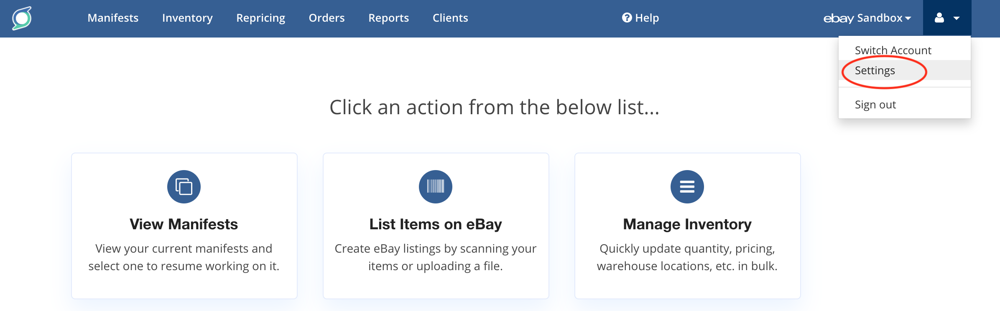
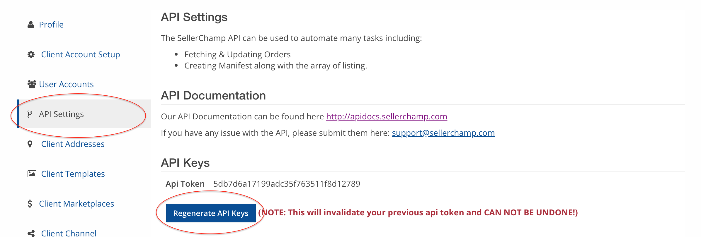

# Introduction

Welcome to the SellerChamp API! You can use our API to access SellerChamp API endpoints, to pull back orders, products, inventory, marketplace prices and more.

You can view code examples in the dark area to the right.

# Authentication

An API Token must be passed in inside the headers with every request.  You can generate your API Token by logging into SellerChamp.com and navigating to Settings -> API Settings.  Click the 'Generate API Key' button to generate your API Token.


<br/>


<br/>
Pass it as the header-key 'Token'.

# Marketplace Accounts

## GET marketplace_accounts

Returns all of your connected marketplace accounts (Amazon, eBay, Shopify, etc.)

Url format:

/api/marketplace_accounts


```shell
curl --request GET \
  --url 'https://sellerchamp.com/api/marketplace_accounts \
  -H 'token: YOUR-TOKEN' \

Make sure to replace `YOUR-TOKEN` with your API key token.
```

> The above command returns JSON structured like this:

```json
{
    "marketplace_accounts": [
        {
            "id": "5d516f51584085a850000013",
            "name": "MaryKom",
            "icon_black": "http://localhost:3000/assets/icons/src/amazon.svg",
            "icon_white": "http://localhost:3000/assets/icons/src/amazon-white.svg",
            "marketplace": "amazon",
            "active": true,
            "manifest_folders": [
                {
                    "id": "5d516f52584085a850000029",
                    "name": "All",
                    "internal_name": "all",
                    "position": 0
                },
                {
                    "id": "5d516f52584085a85000002a",
                    "name": "Active",
                    "internal_name": "active",
                    "position": 1
                },
                {
                    "id": "5d516f52584085a85000002b",
                    "name": "Drafts",
                    "internal_name": "drafts",
                    "position": 2
                },
                {
                    "id": "5d516f52584085a85000002c",
                    "name": "Channel Imports",
                    "internal_name": "channel_imports",
                    "position": 3
                },
                {
                    "id": "5d516f52584085a85000002d",
                    "name": "Archived",
                    "internal_name": "archived",
                    "position": 4
                },
                {
                    "id": "5e4cb620584085359200003e",
                    "name": "Purchase Orders",
                    "internal_name": "purchase_orders",
                    "position": 5
                }
            ]
        }
    ]
}
```

# Manifests

## CREATE manifest with parameters

It will create the manifest according to your parameters along with the array of listing.

Url format:

/api/manifests

```shell
curl --request POST \
  --url https://sellerchamp.com/api/manifests \
  --header 'Content-Type: application/json' \
  --header 'cache-control: no-cache,no-cache,no-cache' \
  --header 'token: YOUR-TOKEN' \
  --data '{ "manifest" : { "name": "{name}", "marketplace_account_id" : "{marketplace_account_id}", "supplier_id" : "{supplier_id}", "ship_from_address_id" : "{ship_from_address_id}", "template_id" : "{template_id}", "product_listings_attributes" : [{"asin" : "{asin}", "quantity" : "{quantity}", "item_condition" : "{item_condition}", "upc" : "{upc}", "sku" : "{sku}", "title" : "{title}", "retail_price" : "{retail_price}", "item_location" : "{item_location}", "item_category" : "{item_category}", "item_category_id" : "{item_category_id}", "item_remarks" : "{item_remarks}", "brand" : "{brand}", "description" : "{description}", "features" : "{features}", "details_html" : "{details_html}", "item_specifics" : "{item_specifics}", "mpn" : "{mpn}", "listing_format" : "{listing_format}", "color" : "{color}", "manufacturer" : "{manufacturer}", "model" : "{model}", "part_number" : "{part_number}", "listing_duration" : "{listing_duration}", "store_category_external_id" : "{store_category_external_id}","store_category_2_external_id" : "{store_category_2_external_id}", "weight_in_pounds" : "{weight_in_pounds}", "package_dimensions_length" : "{package_dimensions_length}", "package_dimensions_width" : "{package_dimensions_width}", "package_dimensions_height" : "{package_dimensions_height}", "item_dimensions_length" : "{item_dimensions_length}", "item_dimensions_width" : "{item_dimensions_width}", "item_dimensions_height" : "{item_dimensions_height}", "handling_time" : "{handling_time}", "shipping_charge_type" : "{shipping_charge_type}", "global_shipping" : "{global_shipping}", "free_shipping" : "{free_shipping}", "shipping_service_code" : "{shipping_service_code}", "shipping_service_cost" : "{shipping_service_cost}", "extra_shipping_service_cost" : "{extra_shipping_service_cost}", "domestic_rate_table" : "{domestic_rate_table}", "international_shipping_service_code" : "{international_shipping_service_code}", "international_shipping_service_cost" : "{international_shipping_service_cost}", "extra_international_shipping_service_cost" : "{extra_international_shipping_service_cost}", "international_ship_to_locations" : "{international_ship_to_locations}", "international_rate_table" : "{international_rate_table}", "return_in_days_value" : "{return_in_days_value}", "refund_policy_value" : "{refund_policy_value}", "return_shipping_paid_by_value" : "{return_shipping_paid_by_value}", "qunatity_in_case" : "{qunatity_in_case}", "cost_price" : "{cost_price}", "expiration_date" : "{expiration_date}", "fnsku" : "{fnsku}", "image_urls" : [], "external_ids" : []}] } }'
```
### URL Parameters

Manifest Parameters

Name | Data Type  | Description
-------------- | -------------- | --------------
name | String (required) | Name of the Manifest. Example: 04-17-2019.
supplier_id | String (optional) | Supplier ID. Example: '59e0f41007b6205968000016'.
ship_from_address_id | String (required) | ID of ship from address Example: '59e0d31f07b6204cc8000000'.
marketplace_account_id | String (required) | ID of Marketplace Account. Example: '5c1902f207b620090a000026'.
template_id | String (optional) | Template ID. Example: '5c1902f207b620090a00003e'
seller_fulfilled | Boolean (optional) | If manifest should add items as merchant fulfilled or FBA. Applicable only for Amazon.
auto_submit | Boolean (optional) | Submit manifest to marketplace after all listings have been created.

ProductListing Parameters should be in array for multiple listing creations.

Name | Data Type | Description
-------------- | -------------- | --------------
asin | String(Required) | Listing ASIN. Example: B07G22S48Q.
quantity | Integer(Optional) | Quantity of the listing. Example: 2.
item_condition | Integer(Optional) | It is an enum consist of the following values: [new, like_new, very_good, good, acceptable, refurbished, salvage] anyone. Example: like_new
upc | String(Optional) | Example: 883929635085
sku | String(Optional) | SKU of the listing. Example: AB883929635085.
title | String(Required) | Title of the listing. Example: DCU Justice League: Throne of Atlantis Commemorative Edition (BD) [Blu-ray].
retail_price | Float(Optional) | Retail Price of the listing. Example: 9.99
color | String(Optional) | Example: Navy
manufacturer | String(Optional) | Example: Charmed
model | String(Optional) | Example: P3Q-00001
part_number | String(Optional) | Example: LE
listing_duration | String(Optional) | It is an enum consist of the following values: [days_1, days_3, days_5, days_7, days_10, days_30, gtc] anyone. Example: gtc
item_location | String(Optional) | Location of item in your warehouse.
item_category | String(Optional) | Hierarchy of the item category(parent>child). If ebay marketplace. Example: DVDs &amp; Blu-ray Discs.
item_category_id | String(Optional) | Id of the item category. Example: 63861
item_remarks | String(Optional) | Example: Item will come in original packaging and includes all accessories.  Item has been tested and is in full working condition.  Comes with a 30-day warranty..
brand | String(Optional) | Example: Warner Manufacturing
description | String(Optional) | Description of the listing
features | Array(Optional) | Features of the product
details_html | String(Optional) | It is the HTML which contains item details with html tags. Example: ```<ul><li>Item Weight: 0.0 pounds</li><li>Shipping Weight: 0.0 pounds</li><li>Domestic Shipping: Item can be shipped within U.S.</li></ul>```
item_specifics | Array of JSON objects(Optional) | Example: [{"name"=>"Brand", "value"=>"Update International", "source"=>"ItemSpecific"}, {"name"=>"UPC", "value"=>"793842123296", "source"=>"ItemSpecific"}]
mpn | String | Example: 90000032507
listing_format | String(Optional) | It is an enum consist of the following values: [fixed_price, auction] anyone. Example: fixed_price
store_category_external_id | String(Optional) | Example: 64789836013
store_category_2_external_id | String(Optional) | Example: 64789836013
weight_in_pounds | Float(Optional) | Example: 0.0
package_dimensions_length | Float(Optional) | Example: 0.0
package_dimensions_width | Float(Optional) | Example: 0.0
package_dimensions_height | Float(Optional) | Example: 0.0
item_dimensions_length | Float(Optional) | Example: 0.0
item_dimensions_width | Float(Optional) | Example: 0.0
item_dimensions_height | Float(Optional) | Example: 0.0
handling_time | Integer(Optional) | Example: 1
shipping_charge_type | String(Optional) | It is an enum consist of the following values: [flat, calculated, calculated_domestic_flat_international, flat_domestic_calculated_international, freight, freight_flat not_specified] anyone. Example: freight
global_shipping | Boolean(Optional) | Example: True
free_shipping | Boolean(Optional) | Example: True
shipping_service_code | String(Optional) | It is an enum consist of the following values: [Other, ShippingMethodStandard, ShippingMethodExpress, ShippingMethodOvernight, Pickup, FlatRateFreight, USPSFirstClass, USPSMedia, USPSPriority, USPSPriorityFlatRateEnvelope, USPSPriorityMailSmallFlatRateBox, USPSPriorityFlatRateBox, USPSPriorityMailLargeFlatRateBox, USPSPriorityMailPaddedFlatRateEnvelope, USPSPriorityMailLegalFlatRateEnvelope, USPSExpressMail, USPSExpressFlatRateEnvelope, USPSExpressMailLegalFlatRateEnvelope, UPSNextDayAir, UPSNextDay, UPS2ndDay, UPS3rdDay, UPSGround, FedExHomeDelivery, FedEx2Day, FedExExpressSaver, FedExStandardOvernight, FedExPriorityOvernight] anyone. Example: USPSFirstClass
shipping_service_cost | Float(Optional) | Example: 0.46
extra_shipping_service_cost | String(Optional) | Example: 0.3
domestic_rate_table | Boolean(Optional) | Example: False
international_shipping_service_code | String(Optional) | It is an enum consist of the following values: [US_IntlEconomyShippingFromGC, ExpeditedDeliveryToRussia, US_IntlExpeditedShippingFromGC, OtherInternational, ExpeditedInternational, US_RUTrackedFromChina, StandardInternational, US_IntlStandardShippingFromGC, USPSFirstClassMailInternational, USPSExpressMailInternational, USPSExpressMailInternationalFlatRateEnvelope, USPSExpressMailInternationalLegalFlatRateEnvelope, USPSPriorityMailInternational, USPSPriorityMailInternationalFlatRateEnvelope, USPSPriorityMailInternationalLargeFlatRateBox, USPSPriorityMailInternationalLegalFlatRateEnvelope, USPSPriorityMailInternationalFlatRateBox, USPSPriorityMailInternationalPaddedFlatRateEnvelope, USPSPriorityMailInternationalSmallFlatRateBox, UPSStandardToCanada, UPSWorldWideExpedited, UPSWorldWideExpress, UPSWorldWideExpressPlus, UPSWorldwideSaver, FedExGroundInternationalToCanada, FedExInternationalEconomy, FedExInternationalPriority] anyone. Example: US_IntlEconomyShippingFromGC
international_shipping_service_cost | Float(Optional) | Example: 0.6
extra_international_shipping_service_cost | Float(Optional) | Example: 0.3
international_ship_to_locations | Array(Optional) | Example: ["CN", "CA"]
international_rate_table | Boolean(Optional) | Example: False
return_in_days_value | String(Optional) | It is an enum consist of the following values: [ReturnsNotAccepted, Days_30, Days_60] anyone. Example: Days_30
refund_policy_value | String(Optional) | It is an enum consist of the following values: [MoneyBack, MoneyBackOrReplacement, MoneyBackOrExchange] anyone. Example: MoneyBack
return_shipping_paid_by_value | String(Optional) | Example: Seller
cost_price | Float(Optional) | Example: 0.0
expiration_date | Date(Optional) | Example: 2019-04-27
fnsku | String(Optional) | Example: 0060011831
image_urls | Array(Optional) | Array of image urls. Example [user.png, user1.png]
external_ids | Array(Optional) | Example: ["B07G22S48Q", "883929635085"]

> The above command returns JSON structured like this:

```json
{
    "manifest": {
        "id": "5cb96fc707b62026d6000000",
        "name": "test",
        "supplier_id": "",
        "ship_from_address_id": "59e0d31f07b6204cc8000000",
        "created_at": "2019-04-19T06:50:47.455Z",
        "updated_at": "2019-04-19T06:50:47.455Z",
        "status": "created",
        "last_valid_status": "created",
        "status_message": null,
        "processing": null,
        "number": 590,
        "order_number": null,
        "phase": 1,
        "client_paid": false,
        "seller_fulfilled": true,
        "image_source": "stock",
        "label_prep": "merchant",
        "print_all_fba_labels": false,
        "print_fba_labels": "needed",
        "print_all_item_labels": false,
        "convert_images": null,
        "performing_action": null,
        "sku_prefix": "AB",
        "auto_location_enabled": false,
        "auto_location_prefix": "",
        "skip_box_content": false,
        "auto_create_shipments": false,
        "auto_print_exp_dates": true,
        "prefill_product_data": true,
        "product_listings_count": 0,
        "item_present_option": "inc_quantity",
        "multiple_matches_pick_strategy": "none",
        "manifest_folder_id": "5c6496e307b6205dce000001",
        "processing_company_id": "",
        "marketplace_account_type": "EbayAccount",
        "marketplace_account_id": "5c1902f207b620090a000026",
        "client_id": "59dd22f507b6201961000000",
        "contact_id": "",
        "template_type": "EbayTemplate",
        "template_id": "5c1902f207b620090a00003e",
        "manifest_xls_file_name": null,
        "manifest_xls_content_type": null,
        "manifest_xls_file_size": null,
        "manifest_xls_updated_at": null,
        "manifest_xls_fingerprint": null,
        "version": null,
        "modifier_id": "",
        "_keywords": [
            "test"
        ]
    }
}
```

## GET manifests

Returns back paged manifests optionally filtering by marketplace_account_id OR manifest_folder_id.  Default page size is 25.


Url format:

/api/manifests?marketplace_account_id={marketplace_account_id}
&manifest_folder_id={manifest_folder_id}
&page={page}&page_size={page_size}


```shell
curl --request GET \
  --url 'https://sellerchamp.com/api/manifests?marketplace_account_id={marketplace_account_id}%0A&manifest_folder_id={manifest_folder_id}%%0A&page={page}%0A&page_size={page_size}' \
  -H 'token: YOUR-TOKEN' \

Make sure to replace `YOUR-TOKEN` with your API key token.
```

### URL Parameters

Name | Data Type | Description
--------------|------------------|-------------------------------------------
marketplace_account_id | String (optional) | The marketplace_account_id for which to fetch manifests.
manifest_folder_id | String (optional) | The manifest_folder_id for which to fetch manifests

> The above command returns JSON structured like this:

```json
{
    "manifests": [
        {
            "id": "5e7514fa07b6201d69000263",
            "name": "03-20-2020",
            "supplier_id": "",
            "ship_from_address_id": "5d1c7a6107b6200724000012",
            "created_at": "2020-03-20T19:09:46.209Z",
            "updated_at": "2020-03-20T19:09:46.209Z",
            "status": "created",
            "last_valid_status": "created",
            "status_message": null,
            "processing": null,
            "number": 51871,
            "order_number": "",
            "phase": 1,
            "seller_fulfilled": true,
            "image_source": "stock",
            "label_prep": "merchant",
            "print_all_fba_labels": false,
            "print_fba_labels": "needed",
            "print_all_item_labels": false,
            "convert_images": null,
            "performing_action": null,
            "sku_prefix": "",
            "auto_location_enabled": false,
            "auto_location_prefix": "",
            "skip_box_content": false,
            "auto_create_shipments": false,
            "auto_print_exp_dates": true,
            "prefill_product_data": true,
            "product_listings_count": 1,
            "item_present_option": "inc_quantity",
            "multiple_matches_pick_strategy": "none",
            "manifest_folder_id": "5e2fb23d07b62074fe000027",
            "processing_company_id": "",
            "marketplace_account_type": "EbayAccount",
            "marketplace_account_id": "5e2fb23d07b62074fe000011",
            "client_id": "5cfc419d07b6200b87000000",
            "contact_id": "",
            "template_type": "EbayTemplate",
            "template_id": "5e2fb23d07b62074fe000033",
            "manifest_xls_file_name": null,
            "manifest_xls_content_type": null,
            "manifest_xls_file_size": null,
            "manifest_xls_updated_at": null,
            "manifest_xls_fingerprint": null,
            "version": 1,
            "modifier_id": "",
            "_keywords": [
                "03",
                "20",
                "2020"
            ]
        }
    ]
}
```

# Product Listings

## GET product_listings for a manifest_id

Returns back paged product_listings for a given manifest_id.  Default page size is 25.

Url format:

/api/manifests/{manifest_id}/product_listings?page={page}&page_size={page_size}

```shell
# With shell, you can just pass the correct header with each request
curl -X GET \
  https://sellerchamp.com/api/manifests/{manifest_id}/product_listings?page={page}&page_size={page_size} \
  -H 'token: YOUR-TOKEN' \

 Make sure to replace `YOUR-TOKEN` with your API key token.
```

> The above command returns JSON structured like this:

```json
{
    "product_listings": [
        {
            "id": "5e73df57584085c982000305",
            "product_id": "5e73df57584085c9820002fe",
            "manifest_id": "5e6ec5a5584085af1800013d",
            "marketplace_account_id": "5d50c6735840854a3900002c",
            "sku": "S127K7Z8YH4Q",
            "asin": "B07NLMXG57",
            "title": "Style & Co. Womens Louiza Low Top Slip On Fashion Sneakers, Navy, Size 8.5",
            "quantity": 1,
            "quantity_listed": 1,
            "item_condition": "new",
            "item_location": null,
            "product_images": [
                {
                    "id": "5e73df8a584085c98200030a",
                    "product_id": "5e73df57584085c9820002fe",
                    "product_name": "Style & Co. Womens Louiza Low Top Slip On Fashion Sneakers, Navy, Size 8.5",
                    "position": 1,
                    "original_image_url": "https://images-na.ssl-images-amazon.com/images/I/41GAMTpSarL.jpg",
                    "small_image_url": null,
                    "medium_image_url": null,
                    "large_image_url": "https://images-na.ssl-images-amazon.com/images/I/41GAMTpSarL.jpg"
                },
                {
                    "id": "5e73df8a584085c98200030b",
                    "product_id": "5e73df57584085c9820002fe",
                    "product_name": "Style & Co. Womens Louiza Low Top Slip On Fashion Sneakers, Navy, Size 8.5",
                    "position": 1,
                    "original_image_url": "https://images-na.ssl-images-amazon.com/images/I/31LKUpz0yTL.jpg",
                    "small_image_url": null,
                    "medium_image_url": null,
                    "large_image_url": "https://images-na.ssl-images-amazon.com/images/I/31LKUpz0yTL.jpg"
                },
                {
                    "id": "5e73df8a584085c98200030c",
                    "product_id": "5e73df57584085c9820002fe",
                    "product_name": "Style & Co. Womens Louiza Low Top Slip On Fashion Sneakers, Navy, Size 8.5",
                    "position": 1,
                    "original_image_url": "https://images-na.ssl-images-amazon.com/images/I/41TCMfP2uGL.jpg",
                    "small_image_url": null,
                    "medium_image_url": null,
                    "large_image_url": "https://images-na.ssl-images-amazon.com/images/I/41TCMfP2uGL.jpg"
                },
                {
                    "id": "5e73df8a584085c98200030d",
                    "product_id": "5e73df57584085c9820002fe",
                    "product_name": "Style & Co. Womens Louiza Low Top Slip On Fashion Sneakers, Navy, Size 8.5",
                    "position": 1,
                    "original_image_url": "https://images-na.ssl-images-amazon.com/images/I/31-nGA7ezgL.jpg",
                    "small_image_url": null,
                    "medium_image_url": null,
                    "large_image_url": "https://images-na.ssl-images-amazon.com/images/I/31-nGA7ezgL.jpg"
                }
            ],
            "list_status": "okay_to_ship",
            "list_status_error_detail": null,
            "list_status_error_detail_2": null,
            "errors": {}
        },
        {
            "id": "5e6ed77e584085706800007a",
            "product_id": "5e6ed77e5840857068000076",
            "manifest_id": "5e6ec5a5584085af1800013d",
            "marketplace_account_id": "5d50c6735840854a3900002c",
            "sku": "S127K7TSO3BZ",
            "asin": "B01DE7MNEQ",
            "title": "Lego Scooby-Doo: Haunted Hollywood",
            "quantity": 2,
            "quantity_listed": 0,
            "item_condition": "new",
            "item_location": null,
            "product_images": [
                {
                    "id": "5e6ed77e5840857068000078",
                    "product_id": "5e6ed77e5840857068000076",
                    "product_name": "Lego Scooby-Doo: Haunted Hollywood",
                    "position": null,
                    "original_image_url": "https://images-na.ssl-images-amazon.com/images/I/51NWjpojihL.jpg",
                    "small_image_url": null,
                    "medium_image_url": null,
                    "large_image_url": "https://images-na.ssl-images-amazon.com/images/I/51NWjpojihL.jpg"
                }
            ],
            "list_status": "restricted_listing",
            "list_status_error_detail": "'Lego Scooby-Doo: Haunted Hollywood' has been known to cause copyright infringement complaint: .",
            "list_status_error_detail_2": null,
            "errors": {}
        }
    ]
}
```

# Products

## GET products

Returns back paged products optionally filtering by marketplace_account_id.  Default page size is 50.

Url format:

/api/products

```shell
# With shell, you can just pass the correct header with each request
curl -X GET \
  https://sellerchamp.com/api/products.json?marketplace_account_id={marketplace_account_id}&page={page}&page_size={page_size} \
  -H 'token: YOUR-TOKEN' \

 Make sure to replace `YOUR-TOKEN` with your API key token.
```

### URL Parameters

Name | Data Type | Description
--------------- | ------------- | ---------------------------------------
marketplace_account_id | String (optional) | Returns the products belonging to this marketplace_account_id


> The above command returns JSON structured like this:

```json
{
    "products": [
        {
            "id": "5e73df57584085c9820002fe",
            "marketplace_account_id": "5d50c6735840854a3900002c",
            "sku": "S127K7Z8YH4Q",
            "asin": "B07NLMXG57",
            "upc": "732994293105",
            "title": "Style & Co. Womens Louiza Low Top Slip On Fashion Sneakers, Navy, Size 8.5",
            "description": "Disclaimer: If no size is seen above and there is only one size in the listing, the size can be found here ---> Shoe Size: 8.5 Medium US Womens",
            "quantity_available": 1,
            "quantity_listed": 1,
            "marketplace_status": "active",
            "marketplace_id": "110510555780",
            "item_condition": "new",
            "inventory_locations": [
                {
                    "location": "A1",
                    "quantity_available": 2,
                    "awaiting_pick": 0,
                    "priority": 1,
                    "delete_if_empty": true
                }
            ],
            "product_images": [
                {
                    "id": "5e73df8a584085c98200030a",
                    "product_id": "5e73df57584085c9820002fe",
                    "product_name": "Style & Co. Womens Louiza Low Top Slip On Fashion Sneakers, Navy, Size 8.5",
                    "position": 1,
                    "original_image_url": "https://images-na.ssl-images-amazon.com/images/I/41GAMTpSarL.jpg",
                    "small_image_url": null,
                    "medium_image_url": null,
                    "large_image_url": "https://images-na.ssl-images-amazon.com/images/I/41GAMTpSarL.jpg"
                },
                {
                    "id": "5e73df8a584085c98200030b",
                    "product_id": "5e73df57584085c9820002fe",
                    "product_name": "Style & Co. Womens Louiza Low Top Slip On Fashion Sneakers, Navy, Size 8.5",
                    "position": 1,
                    "original_image_url": "https://images-na.ssl-images-amazon.com/images/I/31LKUpz0yTL.jpg",
                    "small_image_url": null,
                    "medium_image_url": null,
                    "large_image_url": "https://images-na.ssl-images-amazon.com/images/I/31LKUpz0yTL.jpg"
                },
                {
                    "id": "5e73df8a584085c98200030c",
                    "product_id": "5e73df57584085c9820002fe",
                    "product_name": "Style & Co. Womens Louiza Low Top Slip On Fashion Sneakers, Navy, Size 8.5",
                    "position": 1,
                    "original_image_url": "https://images-na.ssl-images-amazon.com/images/I/41TCMfP2uGL.jpg",
                    "small_image_url": null,
                    "medium_image_url": null,
                    "large_image_url": "https://images-na.ssl-images-amazon.com/images/I/41TCMfP2uGL.jpg"
                },
                {
                    "id": "5e73df8a584085c98200030d",
                    "product_id": "5e73df57584085c9820002fe",
                    "product_name": "Style & Co. Womens Louiza Low Top Slip On Fashion Sneakers, Navy, Size 8.5",
                    "position": 1,
                    "original_image_url": "https://images-na.ssl-images-amazon.com/images/I/31-nGA7ezgL.jpg",
                    "small_image_url": null,
                    "medium_image_url": null,
                    "large_image_url": "https://images-na.ssl-images-amazon.com/images/I/31-nGA7ezgL.jpg"
                }
            ]
        }
    ]
}
```

## GET product

Returns back the product for the specified id.

Url format:

/api/products/{product_id}

```shell
# With shell, you can just pass the correct header with each request
curl -X GET \
  https://sellerchamp.com/api/products/{product_id}.json \
  -H 'token: YOUR-TOKEN' \

 Make sure to replace `YOUR-TOKEN` with your API key token.
```

### URL Parameters

Name | Data Type | Description
--------------- | ------------- | ---------------------------------------
product_id | String (optional) | The ID for the product to fetch.

```json
{
    "product": {
        "id": "5e73df57584085c9820002fe",
        "marketplace_account_id": "5d50c6735840854a3900002c",
        "sku": "S127K7Z8YH4Q",
        "asin": "B07NLMXG57",
        "upc": "732994293105",
        "title": "Style & Co. Womens Louiza Low Top Slip On Fashion Sneakers, Navy, Size 8.5",
        "description": "Disclaimer: If no size is seen above and there is only one size in the listing, the size can be found here ---> Shoe Size: 8.5 Medium US Womens",
        "quantity_available": 2,
        "quantity_listed": 1,
        "marketplace_status": "active",
        "marketplace_id": "110510555780",
        "item_condition": "new",
        "inventory_locations": [
            {
                "location": "A1",
                "quantity_available": 2,
                "awaiting_pick": 0,
                "priority": 1,
                "delete_if_empty": true
            }
        ],
        "product_images": [
            {
                "id": "5e73df8a584085c98200030a",
                "product_id": "5e73df57584085c9820002fe",
                "product_name": "Style & Co. Womens Louiza Low Top Slip On Fashion Sneakers, Navy, Size 8.5",
                "position": 1,
                "original_image_url": "https://images-na.ssl-images-amazon.com/images/I/41GAMTpSarL.jpg",
                "small_image_url": null,
                "medium_image_url": null,
                "large_image_url": "https://images-na.ssl-images-amazon.com/images/I/41GAMTpSarL.jpg"
            },
            {
                "id": "5e73df8a584085c98200030b",
                "product_id": "5e73df57584085c9820002fe",
                "product_name": "Style & Co. Womens Louiza Low Top Slip On Fashion Sneakers, Navy, Size 8.5",
                "position": 1,
                "original_image_url": "https://images-na.ssl-images-amazon.com/images/I/31LKUpz0yTL.jpg",
                "small_image_url": null,
                "medium_image_url": null,
                "large_image_url": "https://images-na.ssl-images-amazon.com/images/I/31LKUpz0yTL.jpg"
            },
            {
                "id": "5e73df8a584085c98200030c",
                "product_id": "5e73df57584085c9820002fe",
                "product_name": "Style & Co. Womens Louiza Low Top Slip On Fashion Sneakers, Navy, Size 8.5",
                "position": 1,
                "original_image_url": "https://images-na.ssl-images-amazon.com/images/I/41TCMfP2uGL.jpg",
                "small_image_url": null,
                "medium_image_url": null,
                "large_image_url": "https://images-na.ssl-images-amazon.com/images/I/41TCMfP2uGL.jpg"
            },
            {
                "id": "5e73df8a584085c98200030d",
                "product_id": "5e73df57584085c9820002fe",
                "product_name": "Style & Co. Womens Louiza Low Top Slip On Fashion Sneakers, Navy, Size 8.5",
                "position": 1,
                "original_image_url": "https://images-na.ssl-images-amazon.com/images/I/31-nGA7ezgL.jpg",
                "small_image_url": null,
                "medium_image_url": null,
                "large_image_url": "https://images-na.ssl-images-amazon.com/images/I/31-nGA7ezgL.jpg"
            }
        ]
    }
}
```

## UPDATE product

Updates the product with the specified ID.

Url format:

/api/products/{product_id}

```shell
curl -X PUT \
  https://sellerchamp.com/api/products/5e73df57584085c9820002fe.json \
  -H 'content-type: application/json' \
  -H 'token: YOUR-TOKEN' \
  -d '{
    "product": {
        "title": "New Title",
        "quantity_available": 2
    }
}'

Make sure to replace `YOUR-TOKEN` with your API key token.
```

### BODY PARAMETERS

Name | Data Type | Description
------------- | ------------- | ---------------------------------
title | String | Product title
description | String | Product description (can contain HTML)
retail_price | Float | Product's selling price
quantity_available | Integer | Product quantity available for purchase


## DELETE product

Deletes a product, optionally ending the listing on the marketplace.

Url format:

/api/products/{product_id}

```shell
curl -X DELETE \
  'http://localhost:3000/api/products/5e73df57584085c9820002fe.json?delete_product=true&end_listing_on_marketplace=true&delete_listing_on_marketplace=true&delete_linked_products=true' \
  -H 'content-type: application/json' \
  -H 'token: YOUR-TOKEN'

Make sure to replace `YOUR-TOKEN` with your API key token.
```

### URL Parameters

Name | Data Type | Description
----------- | ------------- | ---------------------------------------------
delete_product | Boolean | Indicates if product should be deleted from the SellerChamp database
end_listing_on_marketplace | Boolean | Indicates if listing should be ended on the marketplace
delete_listing_on_marketplace | Boolean | Indicates if listing should be entirely removed from marketplace
delete_linked_products | Boolean | Indicates if linked products should also be removed


# Product Images

## GET product_images

Returns back product_images for a product

Url format:

/api/products/{product_id}/product_images

```
curl -X GET \
  https://sellerchamp.com/api/products/5e73df57584085c9820002fe/product_images \
  -H 'content-type: application/json' \
  -H 'token: YOUR-TOKEN' \

Make sure to replace `YOUR-TOKEN` with your API key token.
```

> The above command returns JSON structured like this:

```json
{
    "product_images": [
        {
            "id": "5e73df8a584085c98200030a",
            "product_id": "5e73df57584085c9820002fe",
            "product_name": "New Title",
            "position": 1,
            "original_image_url": "https://images-na.ssl-images-amazon.com/images/I/41GAMTpSarL.jpg",
            "small_image_url": null,
            "medium_image_url": null,
            "large_image_url": "https://images-na.ssl-images-amazon.com/images/I/41GAMTpSarL.jpg"
        },
        {
            "id": "5e73df8a584085c98200030b",
            "product_id": "5e73df57584085c9820002fe",
            "product_name": "New Title",
            "position": 1,
            "original_image_url": "https://images-na.ssl-images-amazon.com/images/I/31LKUpz0yTL.jpg",
            "small_image_url": null,
            "medium_image_url": null,
            "large_image_url": "https://images-na.ssl-images-amazon.com/images/I/31LKUpz0yTL.jpg"
        }
    ]
}
```

## CREATE product_images

Adds an image to an existing product

Url format:

/api/products/{product_id}/product_images

```
curl -X POST \
  https://sellerchamp.com/api/products/5e29634b07b6201e4d0000d2/product_images \
  -H 'content-type: multipart/form-data; boundary=----WebKitFormBoundary7MA4YWxkTrZu0gW' \
  -H 'token: YOUR-TOKEN' \
  -F 'product_image[group_name]=primary' \
  -F 'product_image[attachment]=@s-l1600 (1).jpg'

Make sure to replace `YOUR-TOKEN` with your API key token.
```

### FORM DATA Parameters

Name | Data Type | Description
--------- | ------------ | ---------------------------------
product_image[group_name] | String | Image group (primary or variant)
product_image[attachment] | File | The image attachment


## DELETE product_image

Removes an image from an existing product

Url format:

/api/products/{product_id}/product_images/{product_image_id}


```shell
curl -X DELETE \
  'http://sellerchamp.com/api/products/5e73df57584085c9820002fe/product_images/5e29634b07b6201e4d0000d2.json?' \
  -H 'content-type: application/json' \
  -H 'token: YOUR-TOKEN'

Make sure to replace `YOUR-TOKEN` with your API key token.
```


# Orders

## GET orders w/o parameters

Url format:

/api/orders

```shell
# With shell, you can just pass the correct header with each request
curl -X GET \
  https://sellerchamp.com/api/orders \
  -H 'token: YOUR-TOKEN' \

 Make sure to replace `YOUR-TOKEN` with your API key token.
```

Returns back all the orders.  Default page size is 50.

> The above command returns JSON structured like this:

```json
{
    "orders": [
        {
            "order_number": "132886362059-1538935630003",
            "created_at": null,
            "updated_at": "2019-01-07T23:02:55.533Z",
            "purchased_at": "2018-12-14T00:10:56.000+00:00",
            "order_status": "shipped",
            "buyer_username": "ellis driver",
            "buyer_email": null,
            "ship_to": {
                "name": "ellis driver",
                "street1": "1623 NC Highway 86 N",
                "street2": null,
                "city": "hillsborough",
                "state": "NC",
                "postal_code": "27278-7516",
                "country": "US"
            },
            "items": [
                {
                    "order_item_id": "5c33da5a07b6203f81000887",
                    "sku": "S11LPJMI1BZZT",
                    "created_at": null,
                    "title": "Premium Rainbow Color Embroidery Floss - Cross Stitch Threads - Friendship Bra..",
                    "weight": {
                        "value": 0,
                        "units": "ounces"
                    },
                    "updated_at": null,
                    "quantity": 1,
                    "tax_amount": 0,
                    "unit_price": 12.54,
                    "shipping_amount": 0,
                    "warehouse_location": null,
                    "product_id": "",
                    "fulfillment_sku": "S11LPJMI1BZZT"
                }
            ],
            "store_id": "5c1902f207b620090a000026",
            "items_count": 1,
            "amount_paid": 12.54,
            "buyer_notes": null,
            "externally_fulfilled": false,
            "externally_fulfilled_by": ""
        }
    ]
}
```

## GET orders with parameters

Returns back a list of orders that match the specified criteria. All of the available filters are optional. They do not need to be included in the URL. If you do include them, here's what the URL may look like:

Url format with filters:

/api/orders?buyer_name={buyer_name}
&created_at_start={created_at_start}
&created_at_end={created_at_end}
&updated_at_start={updated_at_start}
&updated_at_end={updated_at_end}
&order_number={order_number}
&order_status={order_status}
&purchased_at_start={purchased_at_start}
&purchased_at_end={purchased_at_start}
&store_id={store_id}
&sort={sort_by}
&direction={sort_direction}
&page={page}
&page_size={page_size}


```shell
curl --request GET \
  --url 'https://sellerchamp.com/api/orders?buyer_name={buyer_name}%0A&order_number={order_number}%0A&order_status={order_status}%0A&purchased_at_start={purchased_at_start}%0A&purchased_at_end={purchased_at_start}%0A&store_id={store_id}%0A&sort={sort_by}%0A&direction={sort_direction}%0A&page={page}%0A&page_size={page_size}&created_at_start={created_at_start}%0A&created_at_end={created_at_end}%0A&updated_at_start={updated_at_start}%0A&updated_at_end={updated_at_end}%0A' \
  -H 'token: YOUR-TOKEN' \

Make sure to replace `YOUR-TOKEN` with your API key token.
```
### URL Parameters

Name | Data Type | Description
-------------- | -------------- | --------------
buyer_name | String | Returns orders that match the specified name. Example: smith.
created_at_start | String | Returns orders that were created after the specified date Example: 2015-01-01 00:00:00.
created_at_end | String | Returns orders that were created before the specified date Example: 2015-01-08 00:00:00.
updated_at_start | String | Returns orders that were modified after the specified date Example: 2015-01-01 00:00:00.
updated_at_end | String | Returns orders that were modified before the specified date Example: 2015-01-08 00:00:00.
order_number | String | Filter by order number, performs a "starts with" search. Example: 12345.
order_status | String | Filter by order status. If left empty, orders of all statuses are returned. Example: shipped
purchased_at_start | String | Returns orders that were paid after the specified date Example: 2015-01-01
purchased_at_end | String | Returns orders that were paid before the specified date Example: 2015-01-08
store_id | Number | Filters orders to a single store. Call List Stores to obtain a list of store Ids. Example: 12345.
sort | String | Sort the responses by a set value. The response will be sorted based off the ascending dates (oldest to most current.) If left empty, the response will be sorted by ascending order_id. Example: Order_date
direction | String | Sets the direction of the sort order. Example: ASC.
page | String | Page number Default: 1.
page_size | number | Requested page size. Default: 250.

## UPDATE order

Updates an order. If tracking number and carrier code are provided, they are submitted to the respective marketplace.

URL format:

/api/orders/{order_id}

```shell
curl --request PUT \
 --url https://sellerchamp.com/api/orders/{order_id} \
 --header 'Content-Type: application/json' \
 --header 'cache-control: no-cache,no-cache,no-cache' \
 --header 'token: YOUR-TOKEN' \
 -- data '{ "order": { "id": "{id}", tracking_number: "{tracking_number}", carrier_code: "{carrier_code}" } }'
```

### URL Parameters

Name | Data Type | Description
-------------- | -------------- | --------------
id | String | The ID of the order to update
tracking_number | String | The order's tracking number
carrier_code | String | The carrier service used to ship the order (UPS, USPS, FedEx, etc.)
