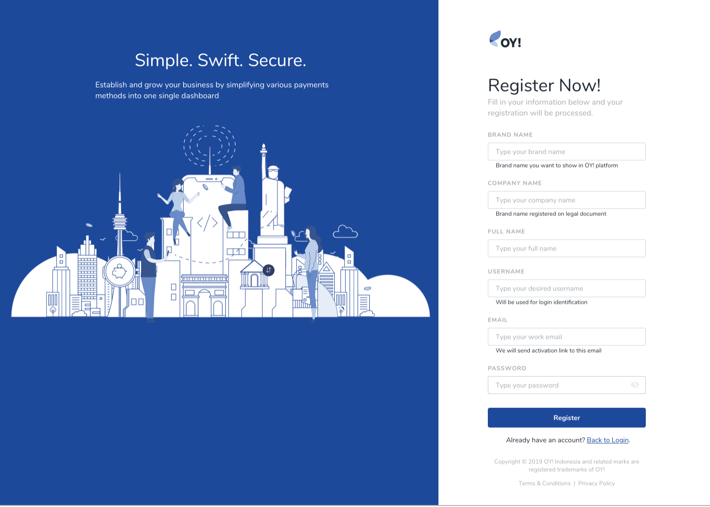
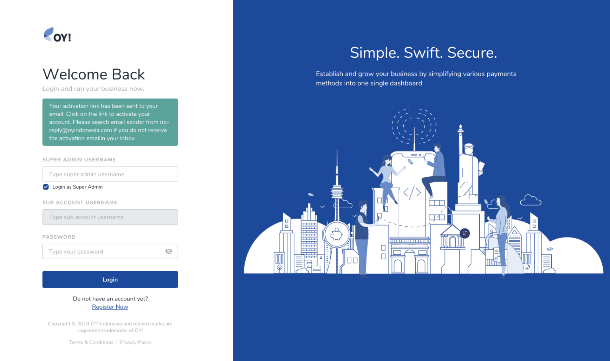
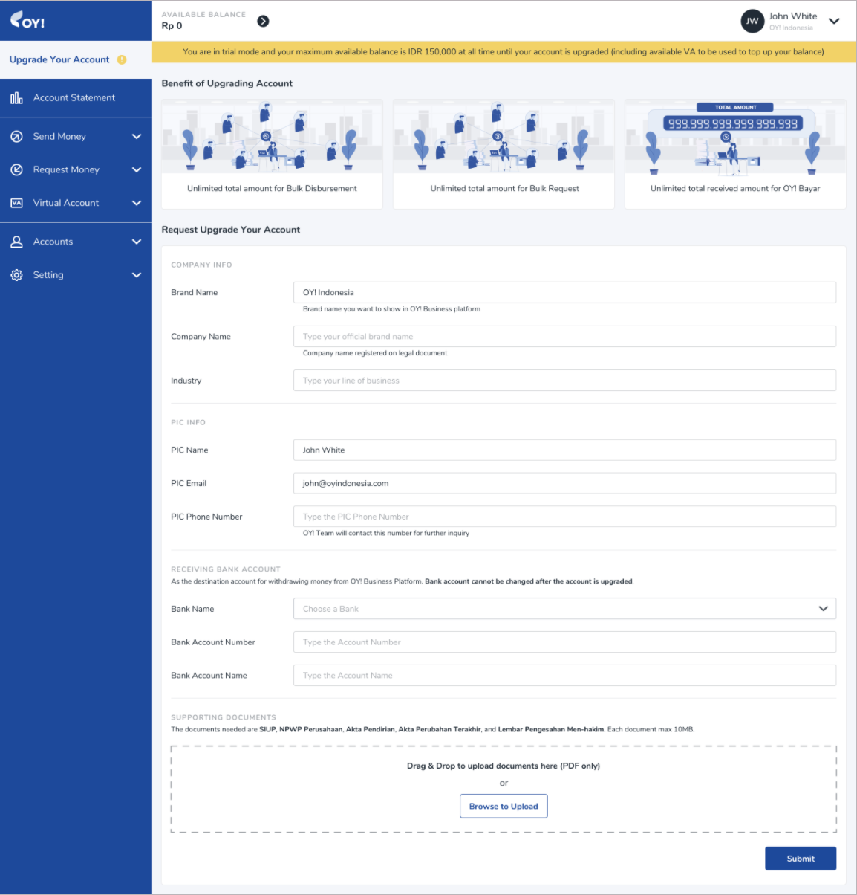
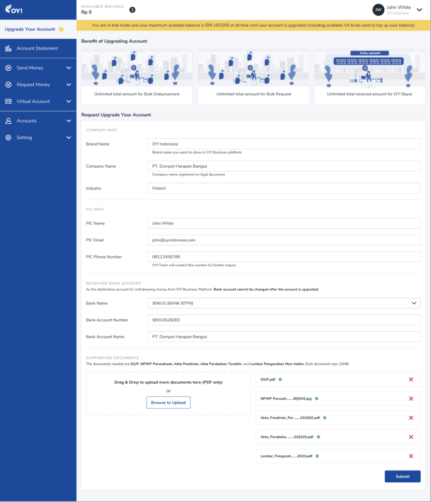
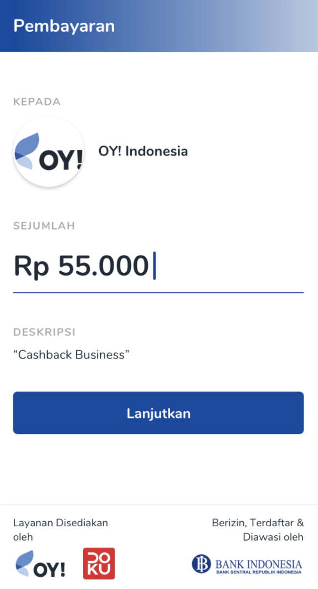
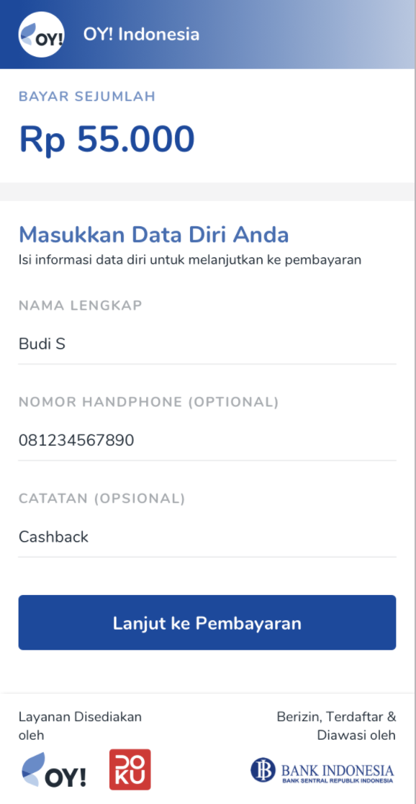
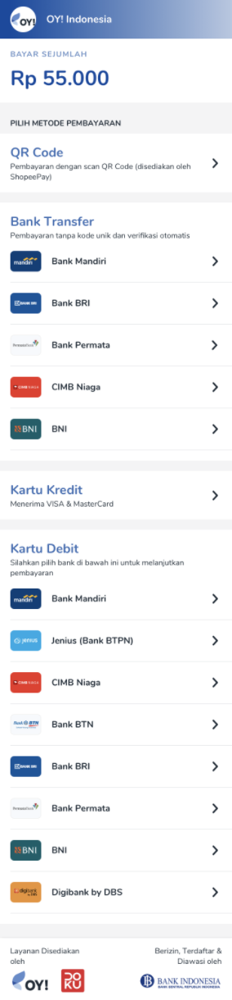
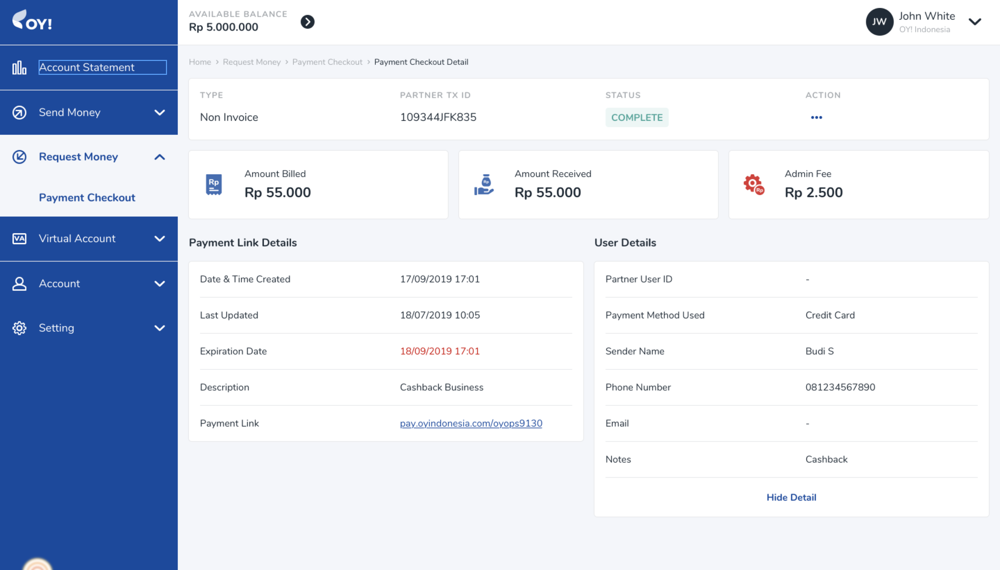

# Home

Welcome to OY! We aim to be among the world class financial services and always put our customers first in everything we do. We have a variety of products ranging from sending payments, accepting payments, and other financial related products that are all ready to meet your needs. We are ready to help you achieve greater success. 

### How to Register 
You can immediately create an account and enjoy some of our features in trial mode with limited functionalities until your account is upgraded to the full version. Our documentation will help you navigate through the entire registration process, including submitting requests for upgrading your account. For further inquiries, please contact us at [partner@oyindonesia.com](partner@oyindonesia.com) and our representative will get in touch. 

**1. Register on our Portal**: To create your account, please register [here](https://business.oyindonesia.com/register?), and complete the form with all the required information. 



**2. Activate your account**: Once the registration is submitted, an activation link will be sent to your email. 



Once you are able to login, you will be able to test some of our features in trial mode or request to upgrade your account to enjoy the full version! 

### Upgrading your Account 

**1. Request to Upgrade your Account**: to access the full version of our products and services, please select “Upgrade Your Account” on the menu at the left side of the dashboard and complete all the required information.

*Please note that the receiving bank account information cannot be changed via OY dashboard once your upgrade account request is approved for security reasons. Please contact us at [partner@oyindonesia.com](partner@oyindonesia.com) to change the receiving bank account information.*



**2. Upload the Required Supporting Documents**: Please upload the required supporting documents according to your business type. Documents are only accepted in PDF format and must be less than 10 MB in size each. 



**3. Submit your Request**: Click “Submit & Request to Upgrade”, and a new status of “Upgrade Account Requested” should appear on this page, indicating that your request has been submitted along with your supporting documents.


This process should take about 1 week. In the event that the status of your request is **Resubmit** or **Rejected**, please keep reading below. Otherwise, you are good to go! 

**Status: Resubmit** 

Upon reviewing the upgrade request, we might ask for additional documentations. Please follow the steps below: 

**1. Read our report**: A report will be sent to your email regarding the information and documents that will need to be revised or added. 

**2. Refill out the form**: When submitting another request to upgrade your account, please resubmit all your supporting documents. Documents are only accepted in PDF format and must be less than 10 MB in size.

**3. Submit your request**: Click “Submit & Request to Upgrade”, and a new status of “Upgrade Account Requested” should appear on this page, indicating that your request has been submitted along with your supporting documents.

For further inquiries, please contact us at [partner@oyindonesia.com](partner@oyindonesia.com) and our representative will get in touch. 

**Status: Rejected** 

For further inquiries regarding this review, please contact us at [partner@oyindonesia.com](partner@oyindonesia.com) and our representative will get in touch. 

### Required Supporting Documents 
Below is the list of documentation to be submitted for an upgrade request:

1. SIUP/Izin Usaha lainnya

2. NPWP Perusahaan

3. Akta Pendirian Perusahaan

4. Akta Perubahan Terakhir

5. Lembar Pengesahan Men-hakim

6. Kartu Identitas Direksi atau yang dikuasakan

7. Surat Kuasa Direksi apabila dikuasakan

8. NIB/TDP

### Completion Checklist 
This set up checklist is recommended to ensure you correctly set up your professional profile and fully maximize the capabilities of our platform: 

1. Create an account

2. Fill out the upgrade requirement

3. Ensure the receiving bank account information is accurate

4. Upload the required documentations

5. *Optional* - create additional sub-account users under User Management

# API Disburse

API disbursement product provides the capability for you to disburse to 100+ banks in Indonesia via OY! at any time. The integration process to use the API disbursement product is straight forward and the details can be checked [here](https://api-docs.oyindonesia.com/#fund-disbursement).  

## Key Features 
**Overdraft**

OY! has established partnerships with third party lenders to credit a specific amount of funds that can be used for your disbursement needs. With this feature, you don’t need to top up the OY! balance to execute disbursements. Please contact our business representative for further details about this feature.

**Overbooking** 

OY! can use the funds directly from your Mandiri and CIMB bank accounts for your disbursement needs. You will only need to top up the admin fee needed to execute the disbursements instead of the full amount of your disbursement. Please contact our business representative for further details about this feature.

**Check Transaction Status and Callback**

For all disbursements executed, you will receive notifications regarding your transaction whether it’s successful, failed or pending. We also provide an API for you to check the transaction status manually. IP proxy is also available upon request to enhance the security and integrity of the callback you will receive. 

**Check Balance**

You can check your available balance at anytime to ensure  that you have sufficient balance to execute a disbursement.

## Registration and Set Up 
**Prerequisites** 

* Register an account on the [OY! dashboard](https://business.oyindonesia.com/login)

* Upgrade your account 

* Upgrade request is approved

* Provide IP to be whitelisted and callback link to our business team

* Receive an API Key from us

* Integrate with our [API](https://api-docs.oyindonesia.com/#fund-disbursement)

## Testing (Testing environment coming soon)

## How to Use 

Before you execute a disbursement, you can verify the beneficiary account information from our [inquiry endpoint](https://api-docs.oyindonesia.com/#bank-account-inquiry). 

> Below is an example of the request body for inquiry:

```shell 
curl -X POST https://partner.oyindonesia.com/api/inquiry 
-H 'content-type: application/json, accept: application/json, x-oy-username:myuser, x-api-key:987654' 
-d '{"recipient_bank": "022", 
    "recipient_account": "7823023345"}'
```

> It will return an error message if the request is not valid based on the [error response codes]((https://api-docs.oyindonesia.com/#fund-disbursement-response-codes)) documentation. Otherwise, below is the sample of response parameters that will be returned:

```json
{
    "status":{
        "code":"000",
        "message":"Success"
    },
    "recipient_bank":"022",
    "recipient_account":"7823023345",
    "recipient_name":"Budi Soemitra Nasution",
    "timestamp":"16-10-2019 09:55:31"
}
```

Next, send a request body to execute a disbursement request to be sent to our [disbursement endpoint](https://api-docs.oyindonesia.com/#disbursement). 

> Below is an example of the request body for the inquiry: 
```shell
curl -X POST https://partner.oyindonesia.com/api/remit 
-H 'content-type: application/json, accept: application/json, x-oy-username:myuser, x-api-key:7654321' 
-d '{"recipient_bank": "022", 
    "recipient_account": "7823023345", 
    "amount":100000, 
    "note":"Pembayaran Nov IV", 
    "partner_trx_id":"Tx15048563JKFJ",
    "email" :"budi.s@gmail.com"}'
```

> It will return an error message if the request is not valid based on the [error response codes](https://api-docs.oyindonesia.com/#fund-disbursement-response-codes) documentation. Otherwise, below is the sample of response parameters that will be returned:

```json 
{
    "status":{
        "code":"101",
        "message":"Request is Processed"
    },
    "amount":100000,
    "recipient_bank":"022",
    "recipient_account":"7823023345",
    "trx_id":"89718ca8-4db6-40a0-a138-a9e30d82c67d",
    "partner_trx_id":"Tx15048563JKFJ",
    "timestamp":"16-10-2019 10:23:42"
}
```

An enpoint to [check the transaction](https://api-docs.oyindonesia.com/#get-disbursement-status) is also available and can be accessed at anytime. 

> Below is an example of the callback you will receive: (coming soon) 

A callback with the following information will be sent to the callback endpoint that you can register with us. 

> Below is an example of the request body: 

```shell 
curl -X POST https://partner.oyindonesia.com/api/remit-status 
-H 'content-type: application/json, accept: application/json, x-oy-username:myuser, x-api-key:7654321' 
-d '{"partner_trx_id": "Tx15048563JKFJ"}'
```

> It will return an error message if the request is not valid based on the [error response codes](https://api-docs.oyindonesia.com/#fund-disbursement-response-codes) documentation. Otherwise, below is the sample of response parameters that will be returned:

```json
{
    "status":{
        "code":"000",
        "message":"Success"
    },
    "amount":100000,
    "recipient_name":"Budi Soemitra Nasution",
    "recipient_bank":"022",
    "recipient_account":"7823023345",
    "trx_id":"89718ca8-4db6-40a0-a138-a9e30d82c67d",
    "partner_trx_id":"Tx15048563JKFJ",
    "timestamp":"16-10-2019 10:40:23",
    "created_date": "16-10-2019 10:23:42",
    "last_updated_date": "16-10-2019 10:34:23"
}
```

You can also [check your balance](https://api-docs.oyindonesia.com/#get-balance) anytime to ensure you have sufficient balance from our endpoint.

> Below is an example of a request body to check the balance:

```shell
curl -X GET 'https://partner.oyindonesia.com/api/balance' 
-H 'Content-Type: application/json' -H 'Accept: application/json' 
-H 'X-OY-Username: janedoe' -H 'X-Api-Key: 7654321'
```

> It will return an error message if the request is not valid based on the [error response codes](https://api-docs.oyindonesia.com/#fund-disbursement-response-codes) documentation. Otherwise, below is the sample of response parameters that will be returned:

```json 
{
    "status":{
        "code":"000",
        "message":"Success"
    },
    "balance":100000000.0000,
    "overdraftBalance":500000.0000,
    "overbookingBalance":200000.0000,
    "pendingBalance":2000000.0000,
    "availableBalance":98500000.0000,
    "timestamp":"10-12-2019 12:15:37"
}
```

Lastly, all transactions can be monitored from the OY! dashboard which includes all the transaction details.


For further details on the parameters definition and proper usage, please refer to our [API Documentation](https://api-docs.oyindonesia.com/#fund-disbursement).


# Bulk Disburse 

Our Bulk disbursement product provides the capability to execute disbursements to multiple beneficiaries with a single xlsx or csv file upload (“Campaign”). Bulk disbursement is made through the OY! dashboard, where details regarding the disbursement campaign can be found. No technical integration is required to use this product. 

## Key Features 
**Overdraft**

OY! has established partnerships with third party lenders to credit a specific amount of funds that can be used for your disbursement needs. With this feature, you don’t need to top up the OY! balance to execute disbursements. Please contact our business representative for further details about this feature.

**Overbooking** 

OY! can use the funds directly from your Mandiri and CIMB bank accounts for your disbursement needs. You will only need to top up the admin fee needed to execute the disbursements instead of the full amount of your disbursement. Please contact our business representative for further details about this feature.

**Account Management** 

When you first create an account, your account will be assigned as a super admin role. As a super admin, you have the ability to create new sub-accounts and assign different roles to your team such as Maker and Approver that is applicable for bulk disbursement. The super admin and admin can also edit or delete created sub-accounts. 

*Note: it is not necessary to create new sub-accounts in order to use bulk disbursement. The Super Admin role allows you to directly create and approve bulk disbursements.*

For more detailed step-by-step instructions on setting up user management and the different role types, click here. 

**Overall Campaign Summary**

Keep track of all the details of the entire campaign such as the total amount of disbursement, total number of transactions, and the maker and approver related information of a campaign.

**Transaction Details**

Itemized details of each individual transaction, including their respective statuses: success, pending, or failed.

## Registration and Set Up 
**Prerequisites**

* Register an account on the [OY! dashboard](https://business.oyindonesia.com/login)

* Upgrade your account 

* Upgrade request is approved 

## Testing (Testing environment coming soon) 

## How to Use

In order to create disbursement campaigns, a sufficient available OY! balance is required in the account. If there is an insufficient available balance in the account, campaigns can still be created but not approved. 

Click here for more details and instructions about topping up to your OY! account. 

**1. Create Disbursement**: On the OY! dashboard, navigate to Send Payments > Bulk Disburse on your left menu bar. Click “Create Disbursement” on the far righthand side of that page to create a new bulk disbursement campaign.

**2. Create Campaign Details**: Fill in the campaign details and upload an xlsx or csv file. 

Please fill out a campaign name and campaign description in the provided spaces. These details are strictly used as your tracking information only and will not be shared to the transaction recipients. 

Please upload an xlsx or csv file with each individual transaction’s details of your bulk disbursement campaign. An example template for both file types are available for download on the OY! dashboard. The following list of items are required in your CSV file.

Column | Description | Example
------ | ----------- | -----------
Name | Recipient Name | Budy
Email | Recipient Email (can contain up to 5 emails with a total maximum of 255 characters, incoming transaction notifications will be sent to these emails) | Budi@email.com
Amount | Amount in IDR (only numbers) | 100000
Bank Code | [Destination Bank](https://docs.oyindonesia.com/#disbursement-bank-codes) | 014
Bank Account Number | Recipient Bank Account Number | 12341234
Phone Number | Recipient Phone Number | 62812341234
Notes (Optional) | Transaction Notes | 


**3. Re-verify all the Information and Submit**: Once your xlsx or csv file is uploaded, you can verify all of the information uploaded from the file from the table displayed. If there is any incorrect submission such as invalid entry due to special characters, a red box will appear to highlight the entry that should be corrected. Issues must be resolved before a campaign can be submitted.


If there is no issue with the details uploaded from the xlsx or csv file, a blue bar with “100%” will show up above the list of transactions, indicating that all information is valid. Click “Submit” to complete creating the bulk disbursement campaign. 


*Note: there is no limit to the amount of bulk disbursement campaigns that can be created at a given period of time.* 

**4. Approve/Cancel Campaign**: Once the bulk disbursement campaign is created, a new status of `waiting approval` will appear. Approve the campaign by clicking the “Approve” button. If you want to cancel a campaign, click the “...” button and select “Cancel”. 


Once the bulk disbursement campaign is approved, details regarding the campaign can no longer be changed. This includes changes made to individual transactions and their respective recipient information. 

When a campaign is approved, the balances should immediately reflect changes. For more information about the different types of balances, click here. You will also receive an email with the campaign information summary (“Outgoing Transfer Alert”) when transactions are executed.

*Note: Multiple campaigns can be approved at a time as long as there is sufficient available balance to complete campaigns that have already been approved but are still in queue to be processed.*

**5. Keep Track of Campaign Details**: To check the details of the bulk disbursement campaign, click on the campaign name to find the campaign summary and its recipient list. Keep track of the both the overall campaign status and the status of individual transactions through the page. 


**6. Status: In-Progress, Finish, and Cancel**: Congratulations! You just made your first bulk disbursement with OY! Below are a list of statuses you will find on your dashboard. 

_In-Progress_

As your individual disbursements are executed, the status of your bulk disbursement campaign will indicate an in-progress status. 


_Finish_

Once all the listed transactions are executed and reflect their respective statuses, the status of your bulk disbursement campaign will transition to Finish. The recipients should have all received an email detailing an “Incoming Transfer Alert.” You can also download a report of the campaign details directly through the portal. 


_Cancel_ 

If you choose to stop your disbursement campaign, the status of your bulk disbursement campaign will indicate a cancelled status. 


You can also double check each of your transactions by navigating to the account statement page on our portal. 

## FAQ (Bulk Disburse)

**What if the recipient name on the CSV file is different from the bank account name? What is the phone number used for?**

As long as the bank account number is valid and not dormant, the transaction will still be executed. 

The name and phone number are visible only to the partner and is used for the partner’s own documentation. The name and phone number listed are not used by OY or sent to the recipient. 

**How many recipient emails can I send the transaction notification to?**

You can send up to 5 emails per transactions with a limit of 255 characters total. For each transaction, simply list out the email recipients. 


# VA Aggregator 

**What is a VA?** 

Businesses are struggling to manage hundreds or even thousands of physical bank accounts that are used for different purposes. It causes significant overhead cost in terms of the amount of account maintainence and man hours needed for reporting and reconciliation purposes, combining different information from different accounts. Virtual Account (VA) is essentially a dummy account that is linked to a physical account and has all the physical account characteristics that enables a much easier reporting and reconciliation process by centralizing the money flow into the physical account. By issuing VAs, you can assign each VA for specific person and/or purposes.


From the example above, it shows how payments made through the VAs are merely pass-throughs for the physical accounts to receive money. Without VAs, the above example might require up to 8 physical accounts from 2 different banks rather than 2 physical accounts from 2 different banks.

**OY VA Aggregator**

Our VA Aggregator product provides you with the capabilities to create unique Virtual Account (VA) numbers as a bank transfer payment method for your customers while the fund movements take place through OY!'s physical account. It provides you with the capabilities to receive payments from your customers via bank transfer without having each respective bank account across multiple banks.  

Our virtual accounts are adjustable according to your needs. We offer options of static or dynamic accounts, single or mutli use accounts, opened or closed amounts, and determinable expiration dates. You can also track all created virtual accounts, incoming payments, and their respective details either through our API callback or OY portal. 


## Key Features

***Static VA vs Dynamic VA***

A static VA is an account that has a lifetime validity that will exist until it is manually deactivated. Therefore, a static VA is always active and configured to be used for multiple times.

A dynamic VA is an account that has a specific validity that will exist until it is expired or manually deactivated. 

**Closed vs Opened Amount**

A closed amount is a configuration so that a VA can only be paid if the actual declared amount is paid to the VA

An opened amount is a configuration so that a VA can be paid up to the declared amount (or any, if amount is not declared)

**Single Use vs Multi Use**

A single use configuration can only be setup for a dynamic VA where the VA is no longer usable once it receives a payment

A multi use configuration, by nature, is the characteristic of a static VA. For dynamic VA, it means it can be used for multiple times until the VA is expired or manually deactivated

**Update VA**

All VA characteristics mentioned above can be updated. Below are a few examples of what features can be updated on a VA: 

* A static VA with a closed amount can be updated with a new closed amount hence it can work as a bill to be paid for a particular customer

* A static VA can be updated to a single use so it will be the last payment received from a particular customer

* A dynamic VA with a closed amount is updated to an opened amount so that it can accept payments for any amount

All of the VA information, even after they are updated, is available on the OY! dashboard or via API. Once a VA is updated, the new set of configuration will apply for that VA and the previous configure is overridden and no longer applicable 

***Retrieve the VA details and incoming transactions***

All of the created VAs and incoming transactions can be monitored on the OY! dashboard and also from APIs ([https://api-docs.oyindonesia.com/#get-list-of-created-va](https://api-docs.oyindonesia.com/#get-list-of-created-va) and [https://api-docs.oyindonesia.com/#get-list-of-transaction-for-va](https://api-docs.oyindonesia.com/#get-list-of-transaction-for-va)). Notifications will be sent for all incoming transactions.

## Registration and Set Up

**Prerequisities:**

* Register an account on the [OY! dashboard](https://business.oyindonesia.com/login)

* Upgrade your account 

* Upgrade request is approved

* Provide an IP to be whitelisted and callback link to our business team 

* API Key to be shared

* Integrate with our [API](https://api-docs.oyindonesia.com/#fund-disbursement)

## How to Use

Send us instructions to generate a new VA number.

> Below is an example of a request body to execute your request:

```shell 
curl --location --request POST https://partner.oyindonesia.com/api/generate-static-va
--header 'content-type: application/json' \
--header 'accept: application/json' \
--header 'x-oy-username: username' \
--header 'x-api-key: apikey' \
-d '{"partner_user_id":"51200021","bank_code": "014","amount": 150000,"is_open" : false,"is_single_use" : false,"is_lifetime": false,"expiration_time": 5,"username_display" : "va name","email": "email@mail.com"}'
```

> It will return an error message if the request is not valid based on the [error response codes](https://api-docs.oyindonesia.com/#va-aggregator-response-codes) documentation. Otherwise, below is the sample of response parameters that will be returned:

```json
{
    "id": "12345b1-23be-45670-a123-5ca678f12b3e",
    "status": {
        "code": "000",
        "message": "Success"
    },
    "amount": 15000,
    "va_number": "700707760000000003",
    "bank_code": "014",
    "is_open": false,
    "is_single_use": false,
    "expiration_time": 1582783668175,
    "va_status": "WAITING_PAYMENT",
    "username_display": "va name",
    "trx_expiration_time" : 1582783668175,
    "partner_trx_id" : "TRX0001"
}
```

Once a VA is created, its details can be seen and monitored through the OY! dashboard. 


An endpoint to [check your VA information](https://api-docs.oyindonesia.com/#get-va-info) is also available and can be accessed at anytime.

> Below is an example of the request body:

```shell
curl --location --request GET https://partner.oyindonesia.com/api/static-virtual-account/12345b1-23be-45670-a123-5ca678f12b3e
--header 'content-type: application/json' \
--header 'accept: application/json' \
--header 'x-oy-username: username' \
--header 'x-api-key: apikey'
```

> Below is the sample of response parameters that will be returned:

```json 
{
    "id": "12345b1-23be-45670-a123-5ca678f12b3e",
    "status": {
        "code": "000",
        "message": "Success"
    },
    "amount": 150000.0000,
    "va_number": "700707760000000003",
    "bank_code": "014",
    "is_open": false,
    "is_single_use": false,
    "expiration_time": 1582783668175,
    "va_status": "WAITING_PAYMENT",
    "username_display": "va name",
    "amount_detected": 0,
    "partner_user_id": "123456",
    "trx_expiration_time": 1582783668175,
    "partner_trx_id": "TRX0001"
}
```

If you wish to change the details of your VA, you can do so by [updating your VA](https://api-docs.oyindonesia.com/#update-va) at any time.

> Below is an example of the request body:

```shell
curl --location --request PUT https://partner.oyindonesia.com/api/static-virtual-account/12345b1-23be-45670-a123-5ca678f12b3e
--header 'content-type: application/json' \
--header 'accept: application/json' \
--header 'x-oy-username: username' \
--header 'x-api-key: apikey' \
-d '{"is_open" : true,"amount": 50000,"is_single_use" : false,"expiration_time": 30,"username_display" : "va name","bank_code": "014","trx_expiration_time":5,"partner_trx_id":"TRX0001"}'
```

> Below is the sample of response parameters that will be returned:

```json 
{
    "id": "12345b1-23be-45670-a123-5ca678f12b3e",
    "status": {
        "code": "000",
        "message": "Success"
    },
    "amount": 50000,
    "va_number": "700707760000000003",
    "bank_code": "014",
    "is_open": true,
    "is_single_use": false,
    "expiration_time": 1582802205412,
    "va_status": "WAITING_PAYMENT",
    "username_display": "va name",
    "partner_user_id": "123456",
    "trx_expiration_time": 1582802205412,
    "partner_trx_id": "TRX0001"
}
```

All details regarding your [created VA](https://api-docs.oyindonesia.com/#get-list-of-created-va) and its payments can be retrieved via our API endpoint or can be monitored directly from the OY! dashboard.


Similarly, all the details regarding [incoming transactions](https://api-docs.oyindonesia.com/#get-list-of-transaction-for-va) for specific va numbers can be retrived via our API endpoint or can be monitored directly the from OY! dashboard.


For further details regarding OY!'s extensive VA Aggregator capabilities and endpoints, please refer to the [OY! API Documentation](https://api-docs.oyindonesia.com/#va-aggregator).

## FAQ (Virtual Account) (coming soon)

# Payment Checkouts/Invoice 

Our Payment Checkout/Invoice product allows you to create and send URLs to accept payments from your users. You can either send your users a pre-generated URL for your account ("Payment Checkout/Invoice via Link") or a unique encapsulated URL generated through an API ("Payment Checkout/Invoice via API") or our OY! Dashboard ("Payment Checkout/Invoice via Dashboard"). 

## Key Features 
### Payment Checkout/Invoice via Link

**_1. No Integration Needed_** 

Access and declare all parameters needed from the URL with easy and simple declaration. 

**_2. Reusable Link_** 

One link can be used many times without repeating declaration. 

**_3. Amount and Payment Method Customization_** 

You can customize the amount to be billed to your user whether they have to pay a fix amount (closed amount) or any amount (open amount). We provide Bank Transfers, Credit Card, Debit Card, and QR code payment methods that you can also enable/disable at any time.

**_4. Check Incoming Transactions Status and Callback_** 

For all incoming payments, you will receive notifications regarding your transactions. We also provide an API for you to check the transaction status manually. IP proxy is also available upon request to enhance the security and integrity of the callback you will receive. 

### Payment Checkout/Invoice via API

**_1. Complete Customization_**

* Open vs. closed amount

* Admin fee to be paid by your customers

* Amount and payment method customization

* Choose the bank(s) to be enabled for your Bank Transfer

* Set an expiry time for your payment link


**_2. Static VA for Invoice Payment_**

You can enable a static VA option when using the API specifically assigned to your customer.


**_3. Upload or Create a PDF for your Invoice Billing_**

You can upload an invoice attachment or create an attachment using the OY! PDF templates via our API so you do not need to send a separate email to your customer.


**_4. Payment Link Delivery by Email_**

Payment link created can be sent to your customer’s email directly instead of sharing the payment link separately.


**_5. Check Incoming Transaction Status and Callback_**

For all incoming payments, you will receive notifications regarding your transactions. We also provide an API for you to check the transaction status. IP proxy is also available upon request to enhance the security and integrity of the callback you will receive. 

### Payment Checkout/Invoice via Dashboard (Coming Soon) 

### Enjoy the quality services of our product!

Whether you send your user a pre-generated link or an API-generated encapsulated link, each of your distributed payment checkout links can be monitored through our OY! Dashboard. You will be able to see the details of the payment checkout including, but not limited to, the payment status, creation and expiration dates and times, amount, description, payment details, and payer details. For further convenience, you can also find and filter through your payment link list by creation date, partner transaction ID, or status. 


## Registration and Set Up

**Prerequisites** 

* Register an account on the [OY! dashboard](https://business.oyindonesia.com/login)

* Upgrade your account 

* Upgrade request is approved

* Provide an IP to be whitelisted (for API Payment Checkout/Invoice) and callback link to our business team 

* For link: once your account is approved, you can access it via [https://pay.oyindonesia.com/v2?username=yourusername](https://pay.oyindonesia.com/v2?username=yourusername). Please refer to the [how to use](https://docs.oyindonesia.com/#how-to-use-payment-checkout-via-link) section for further information. 


* For API: 

1. Complete IP whitelisting process

2. Retrieve API Key 

3. Integrate with our [API](https://api-docs.oyindonesia.com/#api-create-payment-checkout)

## How to Use Payment Checkout via Link

**1. Access your payment link and input amount**: Access our pre-generated link unique to your account by simply replacing yourusername with your username approved with OY at [https://pay.oyindonesia.com/v2?username=yourusername](https://pay.oyindonesia.com/v2?username=yourusername). Our payment link includes parameters that are easily adjustable according to your needs. You can send the link to your customer at any point within this process. 

By default, payment checkout via link declaration will be expired within 24 hours.



If you do not want to specify the amount, you can immediately send the link at this step to your customers, allowing them to input their desired amount. 

If you would like to charge your customers for a specific amount, input the number and click “lanjutkan”.

**2. (Optional) Lock amount**: You might notice that you can easily change the checkout details by simply editing the parameters within the link. For example, `amount=100000` can be changed to a different number and the payment details will readjust accordingly. The same is true when you edit the `username`, `step`, and `sender_name`.

`https://pay.oyindonesia.com/v2?username=yourusername&amount=100000&partner_tx_id=OY2020ABCD123&step=input_personal_info`

In order to lock editing the amount for your customers, add `is_open=false` to the payment link and the `partner_tx_id` and `amount` becomes mandatory to be filled out. This will permanently attach the amount to the unique transaction ID. In the example above, the `amount=100000` is locked to this specific `partner_tx_id`.

`https://pay.oyindonesia.com/v2?username=yourusername&amount=100000&partner_tx_id=OY2020ABCD123&step=input_personal_info&is_open=false`

When this is done, deleting `is_open=false` from the link or changing it back to `is_open=true` will not revert the amount back to an unlocked value. Once `is_open=false` is declared, the amount is permanently frozen for this particular `partner_tx_id`.

Test your link to ensure that the amount is locked by changing the `amount` parameter within your link. If done correctly, the amount displayed on the payment checkout page should reflect what you have previously locked regardless of what is altered within the link.

**3. Input the customer's information**: After inputting the amount, you will be required to enter the customer’s information. Either you or your customer can fill out this information. 



**4. Select Payment Method**: We support payments either through bank transfer, credit card, debit card, or QR code. You can choose specific payment methods to be enabled via parameter declaration by specifying `enable_payment_va`, `enable_payment_cc` or `enable_payment_debit` as `true` or `false`.



**5. Access payment checkout link details**:

You can look at your payment checkout link details through the OY! dashboard. It notes each created payment checkout link including the URL, status, payment link details, and user details. 



**6. Monitor all your payment checkout links**: Our portal also provides you with the capabilities to monitor all your created payment links and their statuses. This allows you to track the statuses of each created link, including those that have expired. This report will include all payment checkout links generated both via Link and API.


## How to Use Payment Checkout via API 

We provide 3 different payment checkout endpoints depending on your requirements and needs. We provide payment checkout, invoicing, and recurring invoice.  

Send us instructions to generate a [payment checkout link](https://api-docs.oyindonesia.com/#api-create-payment-checkout). 

> Below is an example of a request body to execute your request:

```shell
curl -X POST \
  https://partner.oyindonesia.com/api/payment-checkout/create-v2 \-H 'cache-control: no-cache' -H 'content-type: application/json' \-H 'X-Api-Key: apikeymu' -H 'X-Oy-Username: yourusername' \-d '{
        "partner_tx_id":"partnerTxId",
        "description":"description",
        "notes":"notes",
        "sender_name":"Sender name",
        "amount":50000,
        "email":"",
        "phone_number":"",
        "is_open":false,
        "step":"input-amount",
        "include_admin_fee":false,
        "list_disabled_payment_methods":"",
        "list_enabled_banks":"",
        "expiration":"2020-08-08 08:09:12"
    }'
```

> It will return an error message if the request is not valid based on the error response codes in the documentation. Otherwise, below is the sample of response parameters that will be returned:

```json
    "success": true,
    "url": "https://pay.oyindonesia.com/id",
    "message": "success",
    "email_status": "PROCESSED",
    "payment_link_id": "id"
}
```

Send us instructions to generate a [payment checkout invoice link](https://api-docs.oyindonesia.com/#api-create-invoicing). 

> Below is an example of a request body to execute your request:

```shell
url -X POST \
  https://partner.oyindonesia.com/api/payment-checkout/create-invoice\-H 'cache-control: no-cache' -H 'content-type: application/json' \-H 'X-Api-key: apikeymu' -H 'X-Oy-Username: yourusername' \-d '{
        "partner_tx_id":"partner tx id",
        "description":"desc invoice",
        "notes":"notes satu",
        "sender_name":"Sender Name API",
        "amount":"30000",
        "email":"",
        "phone_number":"",
        "is_open":"true",
        "step":"input-amount",
        "include_admin_fee":false,
        "list_disabled_payment_methods":"",
        "list_enabled_banks":"013",
        "expiration":"2020-07-28 19:15:13",
        "partner_user_id":"partner user id", 
          "full_name" : "Raymond",
          "is_va_lifetime": false,
        "attachment": "JVBERi0xLjQKJeLjz9MKMyAwIG9iago8PC9GaWx0ZXIvRmxhdGVEZWNvZGUvTGVuZ3RoIDQ5Nj4+c3RyZWFtCnicrZVdb9MwFIbv/SsOd51EwrHjz0tKhxQk2IciJMS4CG46lbVNyYcE/HqcbNloh5xO8U3OUXJ8Hr/2aweBQkQBQRjhnnZLfpJ5RhIJQhjIluQ8I1eEwYfubVeHMFRnW/LmPQWKkK3I7Cz70dU+lfTN/hnE3ChJY9SPA0U3EPvP1S2ZXXx5Bemnzxfpu/OuGcLtfxp+/ebisp+QH8VkrNjhHJ9QaV23xRKyciKIGuCGjYPmv6cq0idKWuRNEYDlV7VoixAgwcdEXeZVsysqyH5BughA88t6uy3bXQNO3XRbCEq9pKr8sw5gPuXT8zGv7/JNCOeh9mAYMoxQRcyEMJ5KRlEmokkI63lVrSgqi8JEWlsV8ZURkRFMR1pILkVuZcJYCEd69V7vY3eZxYj4GvEkGsaMK5SAMTcauYsKje6aObskUsGWaKr7bPOYHUd7/8XIocZlx9H2DfuSh+Qw2AG4GZLDYMlqmLfHEQIS/XyBaOf++5uoqG213jfrcjfVfAYdi/tY0288noxBrpqpvwoh1AjjslrbqUo6j/kpWdnkG7iZpYvrm7MQmyOe045vBhkhDbFFI6gTz6Jvj9zqCd+frz/5MRMvOvyeBUxGRM3bvIHvRZXvmryGu7Jq901ZhTDJqEweC+xlvkTqX6+ILeYKZW5kc3RyZWFtCmVuZG9iagoxIDAgb2JqCjw8L1RhYnMvUy9Hcm91cDw8L1MvVHJhbnNwYXJlbmN5L1R5cGUvR3JvdXAvQ1MvRGV2aWNlUkdCPj4vQ29udGVudHMgMyAwIFIvVHlwZS9QYWdlL1Jlc291cmNlczw8L0NvbG9yU3BhY2U8PC9DUy9EZXZpY2VSR0I+Pi9Qcm9jU2V0IFsvUERGIC9UZXh0IC9JbWFnZUIgL0ltYWdlQyAvSW1hZ2VJXS9Gb250PDwvRjEgMiAwIFI+Pj4+L1BhcmVudCA0IDAgUi9Sb3RhdGUgOTAvTWVkaWFCb3hbMCAwIDU5NSA4NDJdPj4KZW5kb2JqCjUgMCBvYmoKWzEgMCBSL1hZWiAwIDYwNSAwXQplbmRvYmoKMiAwIG9iago8PC9TdWJ0eXBlL1R5cGUxL1R5cGUvRm9udC9CYXNlRm9udC9IZWx2ZXRpY2EvRW5jb2RpbmcvV2luQW5zaUVuY29kaW5nPj4KZW5kb2JqCjQgMCBvYmoKPDwvS2lkc1sxIDAgUl0vVHlwZS9QYWdlcy9Db3VudCAxL0lUWFQoMi4xLjcpPj4KZW5kb2JqCjYgMCBvYmoKPDwvTmFtZXNbKEpSX1BBR0VfQU5DSE9SXzBfMSkgNSAwIFJdPj4KZW5kb2JqCjcgMCBvYmoKPDwvRGVzdHMgNiAwIFI+PgplbmRvYmoKOCAwIG9iago8PC9OYW1lcyA3IDAgUi9UeXBlL0NhdGFsb2cvUGFnZXMgNCAwIFIvVmlld2VyUHJlZmVyZW5jZXM8PC9QcmludFNjYWxpbmcvQXBwRGVmYXVsdD4+Pj4KZW5kb2JqCjkgMCBvYmoKPDwvTW9kRGF0ZShEOjIwMjAwNzI5MTE1MzE1WikvQ3JlYXRvcihKYXNwZXJSZXBvcnRzIExpYnJhcnkgdmVyc2lvbiBudWxsKS9DcmVhdGlvbkRhdGUoRDoyMDIwMDcyOTExNTMxNVopL1Byb2R1Y2VyKGlUZXh0IDIuMS43IGJ5IDFUM1hUKT4+CmVuZG9iagp4cmVmCjAgMTAKMDAwMDAwMDAwMCA2NTUzNSBmIAowMDAwMDAwNTc4IDAwMDAwIG4gCjAwMDAwMDA4NjQgMDAwMDAgbiAKMDAwMDAwMDAxNSAwMDAwMCBuIAowMDAwMDAwOTUyIDAwMDAwIG4gCjAwMDAwMDA4MjkgMDAwMDAgbiAKMDAwMDAwMTAxNSAwMDAwMCBuIAowMDAwMDAxMDY5IDAwMDAwIG4gCjAwMDAwMDExMDEgMDAwMDAgbiAKMDAwMDAwMTIwNCAwMDAwMCBuIAp0cmFpbGVyCjw8L0luZm8gOSAwIFIvSUQgWzwzZWMyMWUyNjkwNjcxYzViYTliNjUxODNhY2IxOTM3ND48NzZhNzM1MWE1YmY4ZmMxNDNmY2NlZmUwYjRjMzA4MWI+XS9Sb290IDggMCBSL1NpemUgMTA+PgpzdGFydHhyZWYKMTM1OAolJUVPRgo=",
          "invoice_items": [
          {
            "item":"item name", 
            "description":"description", 
            "quantity": 10, 
            "date_of_purchase":"2020-09-20", 
            "price_per_item": 33000  
          }
        ],
          "attachment": "string base 64 pdf"
    }'
```

> Below is the sample of response parameters that will be returned:

```json
{
    "success": true,
    "url": "https://pay.oyindonesia.com/invoice/id",
    "message": "success",
    "email_status": "PROCESSED",
    "payment_link_id": "id"
}
```

Send us instructions to generate a [recurring payment checkout invoice link](https://api-docs.oyindonesia.com/#api-create-recurring-invoice-coming-soon). 

> Below is an example of a request body to execute your request: tbd

An endpoint to retrieve and/or re-send the latest [callback status](https://api-docs.oyindonesia.com/#api-payment-status) of a transaction is also available and can be accessed at anytime.

> Below is an example of a request body to execute your request: 

```shell
curl -X GET 'https://partner.oyindonesia.com/api/payment-checkout/status?partner_tx_id=OY123456&send_callback=false' -H 'x-oy-username:yourusername' -H ' x-api-key:yourapikey'
```

> It will return an error message if the request is not valid based on the error response codes in the documentation. Otherwise, below is the sample of response parameters that will be returned:

```json
{
    "partner_tx_id": "partner000001",
    "tx_ref_number": "1234567",
    "amount": 15000,
    "sender_name": "Joko Widodo",
    "sender_phone": "+6281111111",
    "sender_note": "Mohon dikirim segera",
    "status": "success",
    "settlement_type": "realtime",
    "sender_bank": "008",
    "payment_method": "DC",
    "va_number" : ""
}
```

An endpoint to check your [payment or invoice data](https://api-docs.oyindonesia.com/#api-get) is also available and can be accessed at anytime.

> Below is an example of a request body to execute your request: 

```shell
curl -X GET \
  https://partner.oyindonesia.com/api/payment-checkout/{payment_link_id_or_partner_tx_id}\
  -H 'cache-control: no-cache' -H 'content-type: application/json' \
  -H 'X-Api-key: apikeymu' -H 'X-Oy-Username: yourusername'
```

> It will return an error message if the request is not valid based on the error response codes in the documentation. Otherwise, below is the sample of response parameters that will be returned:

```json 
{
    "data": {
        "partnerTxId": "abc10",
        "paymentLinkId": "703e05c0-48e3-47bd-9c22-670941d4d5fe",
        "amount": 15000,
        "username": "justkhals",
        "senderName": "John Doe",
        "senderPhoneNumber": null,
        "senderNotes": null,
        "status": "CREATED",
        "txRefNumber": null,
        "description": "testdesc",
        "isOpen": true,
        "step": "input-amount",
        "notes": "testnote",
        "phoneNumber": "085248395555",
        "email": "maskalgrr@gmail.com",
        "includeAdminFee": false,
        "listDisabledPaymentMethods": "",
        "listEnabledBanks": "008",
        "expirationTime": "2020-08-12 00:00:00",
        "invoiceData": {
            "fullName": "John Dooe",
            "isVaLifetime": false,
            "isScheduled": false,
            "recurringStartDate": null,
            "recurringEndDate": null,
            "recurringFrequency": null,
            "invoiceItems": "[{\"item\": \"AK 47\", \"quantity\": 2000, \"description\": \"Untuk Kemanan Negara\", \"price_per_item\": 2250000, \"date_of_purchase\": 1590969600000}]"
        }
    },
   "message": "return payment checkout data",
   "status": true
}
```

Lastly, we provide an endpoint to [delete your payment or invoice link](https://api-docs.oyindonesia.com/#api-delete) based on `payment_link_id` or `partner_tx_id`. The payment or invoice link must still be active and a payment method must not have been selected.

> Below is an example of a request body to execute your request: 

```shell
curl -X DELETE \
  https://partner.oyindonesia.com/api/payment-checkout/{payment_link_id_or_partner_tx_id}\
  -H 'cache-control: no-cache' -H 'content-type: application/json' \
  -H 'X-Api-key: apikeymu' -H 'X-Oy-Username: yourusername' 
```

> Below is the sample of response parameters that will be returned:

```json
{
    "status" : true,
    "message" : "success delete payment checkout data"
}
```

Just like the Payment Checkout via Link, you can access all your payment checkout links and its details from the OY! dashboard. This report will include all payment checkout links generated both via Link and API.


## How to Use Payment Checkout via Dashboard (comming soon)

# FAQs

## Disbursement Bank Codes 

We support transactions to 100+ banks in Indonesia. Please refer to the bank codes [here](https://api-docs.oyindonesia.com/#disbursement-bank-codes) when using our disbursement products. (Please note that we currently do not support disbursements to Virtual Accounts.)

## Disbursement Products

**Bank Maintenance Schedule**

Banks often have regular maintenance schedules which differ from one bank to another. These regular maintenance schedules prevent the execution of transactions to the respective recipient bank during the set period of time. In the event that an unplanned maintenance or maintenance schedules run for an extended period of time, we will notify our users.

**Disbursement Amount Limits**

_e-wallet:_ Since each e-wallet provide limits to the amount each user can hold at a time, disbursements made to e-wallet accounts have their respective limits. 

Wallet | Account Type | Maximum Amount
------ | ------------ | --------------
OVO | OVO Club | Rp 2.000.000
OVO | OVO Premier | Rp 10.000.000
DANA | DANA Verified | Rp 1.000.000
DANA | DANA Premium | Rp 10.000.000
GoPay | Unverified | Rp 2.000.000
GoPay | Verified | Rp 10.000.000

**Is there a cut-off time?**

No, we are available 24/7 including holidays. 

**Is there a maximum transaction volume and transaction amount in a day?**

There are no daily limits of how many bulk campaigns can be created and executed. There is also no limit to the number of total transactions per disbursement campaign. 
