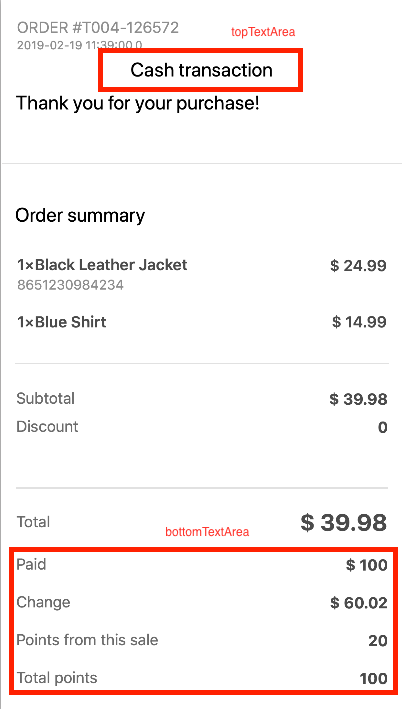

# Introduction

Welcome to the Receet developer docs! You can use our websocket to create new orders to send rich digital receipts to customers' smartphones.

Receet Platfrom contains a WebSocket API. This API can be used to exchange messages between POS System and Receet Platform.  You can register and get an API key at our developer portal - COMING SOON - for the time being, please reach out to your account manager or email us at [hello@getreceet.com](mailto:hello@getreceet.com) for assistance on getting an API key.


# Connection 

Connect your websocket implementation to <code>wss://receet.app/order-service/websocket</code> You will need a valid access token.

# Server States

1 - POS System connects.

2 - **Authentication phase** starts.

* Server sends <code>auth_required</code> message.
* POS System sends auth message.
* If auth message correct: go to 3.
* Server sends <code>auth_invalid</code>. Go to 6.

3 - Server sends <code>auth_ok</code> message.

4 - **Authentication phase** ends.

5 - **Command phase** starts.

* POS System can send commands.
* Server can send results of previous commands.

6 - **Closing phase** POS System or server disconnects session by sending a <code>close</code> message. 

<pre class="center-column">
{
  "close": "Close Current Session"
}
</pre>

# Message format

Example of an auth message:

<pre class="center-column">
{
  "action": 4020,
  "access_token": "ABCDEFGHIJKLMNOPQ"
}
</pre>


# Authentication phase

When a client connects to the server, the server will test if the client is authenticated. Authentication will not be necessary if no api_password is set or if the user fulfills one of the other criteria for authentication (trusted network, password in url/header).

If no authentication is needed, the authentication phase will complete and the server will send an <code>auth_ok</code> message.


<pre class="center-column">
{
  "posId": 5,
  "action": 4023,
  "type": "auth_ok",
  "beaconIdentifier": "htVhMU"
}
</pre>


If authentication is necessary, the server sends out <code>auth_required</code>.

<pre class="center-column">
{
  "action": 4021,
  "type": "auth_required"
}
</pre>


This means that the next message from the client should be an auth message. You can authorize with an access token.

<pre class="center-column">
{
  "action": 4020,
  "access_token": "ABCDEFGHIJKLMNOPQ"
}
</pre>

<aside class="notice">
Obtain your access_token from your account manager at Receet or email us at hello@getreceet.com
</aside>

If the client supplies valid authentication, the authentication phase will complete by the server sending the auth_ok message:

<pre class="center-column">
{
  "posId": 5,
  "action": 4023,
  "type": "auth_ok",
  "beaconIdentifier": "htVhMU"
}
</pre>

If the data is incorrect, the server will reply with auth_invalid message and disconnect the session.

<pre class="center-column">
{
  "action": 4022,
  "type": "auth_invalid"
}
</pre>


# Command phase

During this phase the client can give commands to the server. The server will respond to each command with a specific message for each command indicating when the command is done and if it was successful.

# Messages

## Create Order

> Expected JSON format:

```json
{
 "media": "digital",
 "languageId": 1,
 "action":4028,
 "order": {
   "externalId" : "T004-126572",
   "posId" :5,
   "totalProduct" : 39.98,
   "subTotalProduct" : 39.98,
   "totalTax" : 0.00,
   "totalShipping" : 0.00,
   "totalTaxShipping" : 0.00,
   "totalAdjustment" : 0.00,
   "description" : "Test",
   "currency" : "USD",
   "timePlaced": "2019-02-19 11:39:00",
   "topTextArea" : "Cash transaction",
   "bottomTextArea": "Paid: $ 100 | Change: $ 60.02 | Points from this sale: 20 | Total points: 100"
 },
 "billing_address" : {
    "isPrimary": 2,
    "address1": "Nablus",
    "address2": "Rafidia",
    "address3": "-",
    "city": "Nablus",
    "state": "Palestine",
    "country": "Palestine",
    "zipCode": "0",
    "phone1": "599999999",
    "phone2": "09-2599999",
    "fax": "09-25999999",
    "email": "hello@getreceet.com"
  },
 "order_items" : [
 {
   "price" : 24.99,
   "description": "Black Leather Jacket",
   "quantity" : 1,
   "totalProduct" : 10.3,
   "taxAmount" : 5.00,
   "shipCharg" : 1.00,
   "shipTaxAmount" : 1.00,
   "totalAdjustment" : 1.00,
   "itemNumber":"8651230984234"

 },
 {
   "price" : 14.99,
   "description": "Blue Shirt",
   "quantity" : 1,
   "totalProduct" : 10.3,
   "taxAmount" : 5.00,
   "shipCharg" : 1.00,
   "shipTaxAmount" : 1.00,
   "totalAdjustment" : 1.00

 }]
}
```


Create a new order containing the data to be sent to the customer in front of the POS temrinal.

Workflow after a successful authentication:

Case 1 - Success scenario:

* POS sends a <code>create_order</code> message in the JSON format in the right column.
* Server responds with <code>success</code> message.
* If the customer (end-user) receives his receipt in the specified timeout (30 seconds by default), a <cdoe>close</cdoe> message should be sent to the server.


Case 2 - Timeout scenario:

* POS sends a <code>create_order</code> message in the JSON format in the right column.
* Server responds with <code>success</code> message.
* If the transaction times out the POS should send a <code>close</code> message to the server and a paper receipt should be printed out. 

> Success message format:

```json
{
  "orderId": 21161,
  "action": 4027,
  "receiptId": 1805
}
```

Case 3 - Failure scenario:

* POS sends a <code>create_order</code> message in the JSON format in the right column.
* An <code>error</code> message is received from the server.
* POS sends a <code>close</code> message to the server and a paper receipt should be printed out. 

**Create Order JSON**

Parameters | Short Description | Required 
---- | ----------- | -----------
media | The type of the receipt media. Values: Digital, DigitalAndPaper, Paper  | Yes
languageId | Language used. 1: English 2: Arabic | Yes
order object (details below) | JSON Object that contains order details | Yes
billing_address ojbect (details below) | Customer Address Information, will be shown in Billed To section on the receipt | No 
order_items object (details below) | Array of order items | Yes


**Order Ojbect**

Parameters | Short Description | Required 
---- | ----------- | -----------
externalId | POS Generated Order ID | Yes
posId | POS ID from Receet Dashboard | Yes 
totalProduct | Order Total amount | Yes 
totalTax | Order Tax amount | No
totalShipping | Total shipping amount | No 
totalTaxShipping | Shipping tax amount | No 
subTotalProduct | Sub-total amount (before tax and discount) | Yes
totalAdjustment | Total amount of discounts applied on order | No 
adjustmentDescription | Order Level Discout description (e.g. 10% Discount) | No
description | Short description of order, if needed| No 
currency | Currency used (USD, ILS, etc....) | Yes 
timePlaced | Time and date of when the order was placed, Date format:  | Yes 
createdBy | (STRING) - Identifier for the cashier (name or ID) | No
topTextArea | (STRING) Free text area shows at the top of the receipt. Can take multiple values (pipe separated, example below). Each value show on a new line | No
bottomTextArea | (STRING) Key, value pair will show at the bottom of the receipt. Can take multiple values (pipe separated, example below). Each value show on a new line | No

**Billing Address Object**

Parameters | Short Description | Required 
---- | ----------- | -----------
addressType | U: User | Yes
memberId | Loyalty Customer Member ID | No
status | Status of address. Value: A | Yes
isPrimary | Value: 1 | Yes
address1 | Address line 1 | Yes
address2 | Address line 2 | No
address3 | Address line 3 | No
city | City | Yes
state | State | Yes 
country | Country | Yes
zipCode | Zip Code | Yes
phone1 | Phone number 1 | Yes
phone2 | Phone number 2 | No
fax | Fax Number | No 
email | Email | No

**Order Items Object**

Parameters | Short Description | Required 
---- | ----------- | -----------
price | List item price | Yes
description | List item product description, will be shown on digital receipt | Yes
quantity | Quantity of list item | Yes 
totalProduct | Total product price (Price X Qty) | Yes 
taxAmount | Tax Amount | No 
shipCharge | Amount of shipping, if any | No
shipTaxAmount | Tax Amount of shipping, if any | No
totalAdjustment | Discount amount of list item | No
adjustmentDescription | Item Level Discout description (e.g. 10% Discount) | No
itemNumber | (STRING) Item Number, barcode, etc.. | No 


<aside class="notice">
taxAmount, shipCharge, shipTaxAmount, totalAdjustment are not required and are considered 0 if not sent.
</aside>

## Close

Either the server or the POS system can send out a <code>close</code> message to close the connection. Message format can be found on the right column.

> Close message format:

```json
{
  "action": 4019
}
```

# Custom Text

topTextArea show on the top of the receipt. Example:

<pre class="center-column">
"topTextArea" : "Cash transaction"
</pre>

bottomTextArea show at the bottom of the receipt, below Total. Example:

<pre class="center-column">
"bottomTextArea": "Paid: $ 100 | Change: $ 60.02 | Points from this sale: 20 | Total points: 100"
</pre>



# Need Help?
If you have trouble with any of the information above, or if it's confusing, Please email us at [hello@getreceet.com](mailto:hello@getreceet.com) Thanks!
