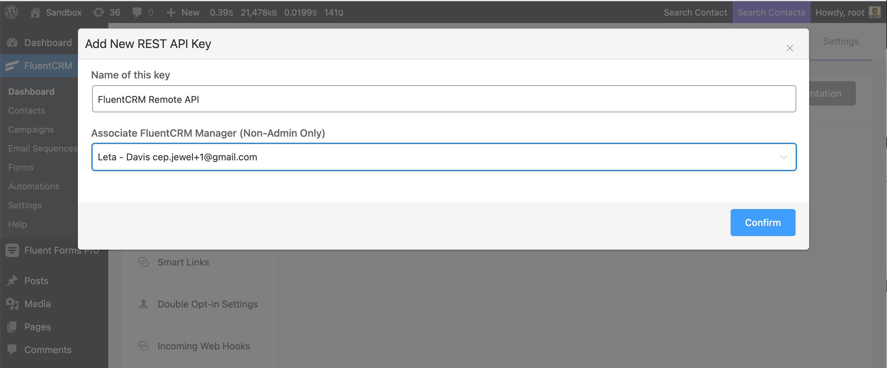

# Introduction

Welcome to FluentCRM API doc. This doc will describe the REST API Endpoints of FluentCRM.

This example API documentation page was created with [Slate](https://github.com/slatedocs/slate). If you find any typo or would like contribute please send a pull request with improvements. Please note that, All endpoints are not added to this doc (Work in progreess). 

# Authentication

FluentCRM uses WordPress REST API. So you can use any authorization method that supports WordPress.

Once you create your Application Password in WordPress, Add Authorization Header to every request.

> Example API Call for contacts

```shell
# With shell, you can just pass the correct header with each request
curl "https://yourdomain.com/wp-json/fluent-crm/v2/subscribers" \
  -H "Authorization: BASIC API_USERNAME:API_PASSWORD"
```

**API Base URL:** `https://yourdomain.com/wp-json/fluent-crm/v2`

### Creating API Key
You can either create Application Password using WordPress's user editing Page. Please make sure, the user have access to FluentCRM.
We recommend creating Application Password from inside FluentCRM. Navigate to `FluentCRM -> Settings -> Managers` and then create a Manager First. Please make sure the manager is not "Administrator" user role. Select the permissions you want to give to that user for FluentCRM.


Then Go to `FluentCRM -> Settings > Rest API` and Create the new key corresponding to manager.



Once you confirm, It will give you the username and application password. Please note that, You can not retrive the Application password later. So save that for the future use.


In the background, FluentCRM create REST API in WordPress user.


> Make sure to replace `API_USERNAME` & `API_PASSWORD` with your UserName & API Password.


# Contacts

## Get All Contacts

```shell
curl "https://yourdomain.com/wp-json/fluent-crm/v2/subscribers" \
  -H "Authorization: BASIC API_USERNAME:API_PASSWORD"
```
> The above command returns JSON structured like this:

```json
{
  "current_page": 1,
  "per_page": 10,
  "from": 1,
  "to": 10,
  "last_page": 493,
  "total": 9860,
  "data": [
    {
      "id": "9860",
      "user_id": "5984",
      "hash": "4a6f1ed89704814c100a954ec403cd2f",
      "contact_owner": "string",
      "company_id": "string",
      "prefix": "string",
      "first_name": "Kelli",
      "last_name": "Hand",
      "email": "sonny.pacocha@example.net",
      "timezone": "string",
      "address_line_1": "string",
      "address_line_2": "string",
      "postal_code": "string",
      "city": "string",
      "state": "string",
      "country": "string",
      "ip": "string",
      "latitude": "string",
      "longitude": "string",
      "total_points": "0",
      "life_time_value": "0",
      "phone": "string",
      "status": "subscribed",
      "contact_type": "lead",
      "source": "wp_users",
      "avatar": "string",
      "date_of_birth": "string",
      "created_at": {},
      "last_activity": "string",
      "updated_at": "string",
      "photo": "https://www.gravatar.com/avatar/4a6f1ed89704814c100a954ec403cd2f?s=128",
      "full_name": "Kelli Hand",
      "tags": [
        {
          "id": "2",
          "title": "Fluent Forms Users",
          "slug": "fluent-forms-users",
          "description": "string",
          "created_at": {},
          "updated_at": {},
          "pivot": {
            "subscriber_id": "9860",
            "object_id": "2",
            "object_type": "FluentCrm\\App\\Models\\Tag",
            "created_at": {},
            "updated_at": {}
          }
        }
      ],
      "lists": [
        {
          "id": "1",
          "title": "List Item 1",
          "slug": "list-item-1",
          "description": "string",
          "is_public": "0",
          "created_at": {},
          "updated_at": {},
          "pivot": {
            "subscriber_id": "9860",
            "object_id": "1",
            "object_type": "FluentCrm\\App\\Models\\Lists",
            "created_at": {},
            "updated_at": {}
          }
        }
      ]
    }
  ]
}
```

This endpoint retrieves all Contact.

### HTTP Request

`GET https://yourdomain.com/wp-json/fluent-crm/v2/subscribers`

### URL Parameters

Parameter | Type | Description | Default
--------- | ------- | ----------- | -------
| per_page |  int | Records per page | 10 |
| page |    int   | Page Number for Pagination | 1 |
| search | string | Search Parameter for filtering contacts | |
| tags | array | Tag Ids to filter contacts | |
| lists | array | List Ids to filter contacts | |
| statuses | array | Status slugs to filter contacts | |
| order_by | string | Order By contact column Value to sort contacts | id |
| order_type | string | Order Type contact column Value to sort contacts | DESC |
| custom_fields | boolean | Flag to get custom contact field values too| false

***Possible statuses values:***

- subscribed
- unsubscribed
- pending
- bounced
- complained

<aside class="success">
Remember — Use authentication Headers
</aside>

## Get a Specific Contact


```shell
curl "https://yourdomain.com/wp-json/fluent-crm/v2/subscribers/<ID>" \
  -H "Authorization: BASIC API_USERNAME:API_PASSWORD"
```

> The above command returns JSON structured like this:

```json
{
   "subscriber":{
      "id":"7743",
      "user_id":"1",
      "hash":"5acfbfb0e8135fe5a1e36bb40d90ad69",
      "contact_owner":null,
      "company_id":null,
      "prefix":null,
      "first_name":"JeweldddXXX",
      "last_name":"JewelZZZ",
      "email":"cep.jewel@gmail.com",
      "timezone":null,
      "address_line_1":"283ddd",
      "address_line_2":"sda",
      "postal_code":"34521",
      "city":"New",
      "state":"ME",
      "country":"US",
      "ip":"127.0.0.1",
      "latitude":null,
      "longitude":null,
      "total_points":"0",
      "life_time_value":"0",
      "phone":"01723371621",
      "status":"subscribed",
      "contact_type":"lead",
      "source":"woocommerce",
      "avatar":null,
      "date_of_birth":null,
      "created_at":"2021-07-17 21:08:30",
      "last_activity":"2021-07-18 13:45:42",
      "updated_at":"2021-07-18 20:22:48",
      "user_edit_url":"https:\/\/wp.lab\/wp-admin\/profile.php",
      "stats":{
         "emails":0,
         "opens":0,
         "clicks":0
      },
      "custom_values":{
         "some_number_field":"10",
         "checkbox":[
            "Value Option 1"
         ]
      },
      "photo":"https:\/\/www.gravatar.com\/avatar\/5acfbfb0e8135fe5a1e36bb40d90ad69?s=128",
      "full_name":"JeweldddXXX JewelZZZ",
      "tags":[
         {
            "id":"1",
            "title":"FluentCRM Users",
            "slug":"fluentcrm-users",
            "description":null,
            "created_at":"2021-07-17 21:06:25",
            "updated_at":"2021-07-17 21:06:25",
            "pivot":{
               "subscriber_id":"7743",
               "object_id":"1",
               "object_type":"FluentCrm\\App\\Models\\Tag",
               "created_at":"2021-07-19 17:30:52",
               "updated_at":"2021-07-19 17:30:52"
            }
         }
      ],
      "lists":[
         {
            "id":"1",
            "title":"List Item 1",
            "slug":"list-item-1",
            "description":null,
            "is_public":"0",
            "created_at":"2021-07-17 21:01:59",
            "updated_at":"2021-07-17 21:01:59",
            "pivot":{
               "subscriber_id":"7743",
               "object_id":"1",
               "object_type":"FluentCrm\\App\\Models\\Lists",
               "created_at":"2021-07-17 21:08:30",
               "updated_at":"2021-07-17 21:08:30"
            }
         }
      ]
   }
}
```

This endpoint retrieves a specific contact.

### HTTP Request

`GET https://yourdomain.com/wp-json/fluent-crm/v2/subscribers/<ID>`

### URL Parameters

Parameter | Type | Description 
--------- | ----------- | -----
with[] | array | Get Additional Contact Meta Properties

***Possible with parameters:***

- stats
- custom_fields
- subscriber.custom_values

## Create a new contact

```shell

curl 'https://fcrm.test/wp-json/fluent-crm/v2/subscribers' \
  -H "Authorization: BASIC API_USERNAME:API_PASSWORD" \
  --data-raw 'first_name=Rafi&last_name=Ahmed&email=rafi%40authlab.io&phone=44+078+1961+0398&date_of_birth=2000-03-04&status=subscribed&address_line_1=1+Union+Street&address_line_2=64+Cunnery+Rd&city=Swansea&state=Swansea&postal_code=SA1+3EE&country=GB&tags%5B%5D=1&tags%5B%5D=2&lists%5B%5D=1&lists%5B%5D=2&custom_values%5Bcustom_field%5D=Custom+Field+Value&prefix=Mr&query_timestamp=1626770805540' \
	 
```
> The above command creates a new contact in Fluent CRM and returns the data in JSON.
 
```json 
{
    "message": "Successfully added the subscriber.",
    "contact": {
        "prefix": "Mr",
        "first_name": "Rafi",
        "last_name": "Ahmed",
        "email": "rafi@authlab.io",
        "phone": " 44 078 1961 0398",
        "date_of_birth": "2000-03-04",
        "address_line_1": "1 Union Street",
        "address_line_2": "64 Cunnery Rd",
        "city": "Swansea",
        "state": "Swansea",
        "country": "United Kingdom (UK)",
        "postal_code": "SA1 3EE",
        "status": "subscribed",
        "hash": "3f6e19a6d1fcf98c73e031882796091f",
        "updated_at": "2021-07-19 22:11:48",
        "created_at": "2021-07-19 22:11:48",
        "id": 17,
        "photo": "https://www.gravatar.com/avatar/3f6e19a6d1fcf98c73e031882796091f?s=128",
        "full_name": "Rafi Ahmed",
        "tags": [
            {
                "id": "1",
                "title": "User One",
                "slug": "user-one",
                "description": null,
                "created_at": "2021-07-19 08:25:34",
                "updated_at": "2021-07-19 08:25:34",
                "pivot": {
                    "subscriber_id": "17",
                    "object_id": "1",
                    "object_type": "FluentCrm\\App\\Models\\Tag",
                    "created_at": "2021-07-19 22:11:48",
                    "updated_at": "2021-07-19 22:11:48"
                }
            },
            {
                "id": "2",
                "title": "User Two",
                "slug": "user-two",
                "description": null,
                "created_at": "2021-07-19 08:25:34",
                "updated_at": "2021-07-19 08:25:34",
                "pivot": {
                    "subscriber_id": "17",
                    "object_id": "2",
                    "object_type": "FluentCrm\\App\\Models\\Tag",
                    "created_at": "2021-07-19 22:11:48",
                    "updated_at": "2021-07-19 22:11:48"
                }
            }
        ],
        "lists": [
            {
                "id": "1",
                "title": "User One",
                "slug": "user-one",
                "description": null,
                "is_public": "0",
                "created_at": "2021-07-19 08:25:22",
                "updated_at": "2021-07-19 08:25:22",
                "pivot": {
                    "subscriber_id": "17",
                    "object_id": "1",
                    "object_type": "FluentCrm\\App\\Models\\Lists",
                    "created_at": "2021-07-19 22:11:48",
                    "updated_at": "2021-07-19 22:11:48"
                }
            },
            {
                "id": "2",
                "title": "User Two",
                "slug": "user-two",
                "description": null,
                "is_public": "0",
                "created_at": "2021-07-19 08:25:22",
                "updated_at": "2021-07-19 08:25:22",
                "pivot": {
                    "subscriber_id": "17",
                    "object_id": "2",
                    "object_type": "FluentCrm\\App\\Models\\Lists",
                    "created_at": "2021-07-19 22:11:48",
                    "updated_at": "2021-07-19 22:11:48"
                }
            }
        ]
    },
    "action_type": "created"
}
```

This endpoint creates a new contact.

### HTTP Request

`POST https://yourdomain.com/wp-json/fluent-crm/v2/subscribers`

### URL Parameters

Parameter | Type | Required| Description
--------- | ---- | ------- | -----------
prefix | string | no | Add Name Prefix of a Contact
first_name | string | no | Add Contact's First Name
last_name | string | no | Add Contact's Last Name
email | email | yes | Add Contact's Email
phone | string | no | Add Contact's Phone Number
date_of_birth | string | no | Add Contact's Date Of Birth ( Format: YYYY-MM-DD )
address_line_1 | string | no | Add Contact's Address Line 1
address_line_2 | string | no | Add Contact's Address Line 2
city | string | no | Add Contact's City
state | string | no | Add Contact's State
country | string | no | Add Contact's Country
postal_code | string | no | Add Contact's ZIP Code
photo | string | no | Add Contact's Profile Picture
tags | array | no | Add Contact To One or Multiple Tags ( Tags data type is array & only takes the ID of a tag, e.g. https://yourdomain.com/wp-json/fluent-crm/v2/subscribers/tags[]=1&tags[]=2 )
lists | array | no | Add Contact To One or Multiple Lists ( List data type is array & only takes the ID of a list e.g. https://yourdomain.com/wp-json/fluent-crm/v2/subscribers/lists[]=1&lists[]=2)
custom_values | array | no | Add Custom Value To a Contact ( Custom Field data type is array, To add data to custom field you have to define the key & value, key is custom field slug name, e.g. https://yourdomain.com/wp-json/fluent-crm/v2/subscribers/custom_values[custom_field_slug]= Custom Field Value)
__force_update | boolean | no | If you add this flag as true then contact will be updated if exist
status | string | yes | Add Contact's Status


## Update any user data

```shell

```

>The above command JSON structured like this:

```json
{
  "message": "Subscriber successfully updated",
  "contact": {
    "id": "22",
    "user_id": null,
    "hash": "d76b4b3ba7daf871cc03a6037fbaa019",
    "contact_owner": null,
    "company_id": null,
    "prefix": "Mr",
    "first_name": "Andres",
    "last_name": "Alexser",
    "email": "alex@mail.com",
    "timezone": null,
    "address_line_1": "3 Union Street",
    "address_line_2": "1 Union Street",
    "postal_code": "SA1 3EE",
    "city": "Swansea",
    "state": "Swansea",
    "country": "GB",
    "ip": null,
    "latitude": null,
    "longitude": null,
    "total_points": "0",
    "life_time_value": "0",
    "phone": "44 098 6726 635",
    "status": "subscribed",
    "contact_type": "lead",
    "source": null,
    "avatar": null,
    "date_of_birth": "1995-07-14",
    "created_at": "2021-07-20 10:39:06",
    "last_activity": null,
    "updated_at": "2021-07-20 11:32:43",
    "photo": "https://www.gravatar.com/avatar/d76b4b3ba7daf871cc03a6037fbaa019?s=128",
    "full_name": "Andres Alexser"
  },
  "isDirty": true
}
```
This endpoint update a specific contact. Make sure you are passing the data in body as raw JSON format. Below there's an example added.<br>
```
{
  "subscriber":{
    "email": "alex@mail.com",
    "first_name": "Andres",
    "last_name": "Alexser"
  }
}
```


### HTTP Request

`PUT https://fcrm.test/wp-json/fluent-crm/v2/subscribers/<ID>`

### URL Parameters

Parameter | Type | Required| Description
--------- | ---- | ------- | -----------
prefix | string | no | Add Name Prefix of a Contact
first_name | string | no | Add Contact's First Name
last_name | string | no | Add Contact's Last Name
email | email | yes | Add Contact's Email
phone | string | no | Add Contact's Phone Number
date_of_birth | string | no | Add Contact's Date Of Birth ( Format: YYYY-MM-DD )
address_line_1 | string | no | Add Contact's Address Line 1
address_line_2 | string | no | Add Contact's Address Line 2
city | string | no | Add Contact's City
state | string | no | Add Contact's State
country | string | no | Add Contact's Country
postal_code | string | no | Add Contact's ZIP Code
photo | string | no | Add Contact's Profile Picture
tags | array | no | Add Contact To One or Multiple Tags ( Tags data type is array & only takes the ID of a tag, e.g. https://yourdomain.com/wp-json/fluent-crm/v2/subscribers/tags[]=1&tags[]=2 )
lists | array | no | Add Contact To One or Multiple Lists ( List data type is array & only takes the ID of a list e.g. https://yourdomain.com/wp-json/fluent-crm/v2/subscribers/lists[]=1&lists[]=2)
custom_values | array | no | Add Custom Value To a Contact ( Custom Field data type is array, To add data to custom field you have to define the key & value, key is custom field slug name, e.g. https://yourdomain.com/wp-json/fluent-crm/v2/subscribers/custom_values[custom_field_slug]= Custom Field Value)
status | string | yes | Add Contact's Status

## Delete a Specific Contact

```shell

```

> The above command returns JSON structured like this:

```json
{
  "message": "Selected Subscribers has been deleted"
}
```

This endpoint deletes a specific contact.

### HTTP Request

`DELETE https://yourdomain.com/wp-json/fluent-crm/v2/subscribers/<ID>`

### URL Parameters

Parameter | Description
--------- | -----------
subscribers[] | The ID of the contact to delete

# Lists

## Get All Lists

```shell
curl --location --request GET 'https://yourdomain.com/wp-json/fluent-crm/v2/lists' \
-H 'Authorization: Basic API_USERNAME:API_PASSWORD'
```

> The above command returns JSON structured like this:

```json
{
    "lists": [
        {
            "id": "2",
            "title": "User Two",
            "slug": "user-two",
            "description": null,
            "is_public": "0",
            "created_at": "2021-07-19 08:25:22",
            "updated_at": "2021-07-19 08:25:22",
            "totalCount": 1,
            "subscribersCount": 1
        },
        {
            "id": "1",
            "title": "User One",
            "slug": "user-one",
            "description": null,
            "is_public": "0",
            "created_at": "2021-07-19 08:25:22",
            "updated_at": "2021-07-19 08:25:22",
            "totalCount": 1,
            "subscribersCount": 1
        }
    ]
}
```

This endpoint returns all available lists.

### HTTP Request
`GET https://yourdomain.com/wp-json/fluent-crm/v2/lists`

### URL Parameters

Parameter | Description
--------- | -----------
sort_by | Sort your list by id, title, subscribers
sort_order | Give a sorting order of the list DESC or ASC
search | Search by any value
with[] | Get other additional data

***Possible with parameters:***

- subscribersCount

## Create a new list

```shell
curl --location --request POST 'https://yourdomai.com/wp-json/fluent-crm/v2/lists?title=New List&slug=new-data' \
-H 'Authorization: Basic API_USERNAME:API_PASSWORD'
```

> The above command returns JSON structured like this:

```json
{
    "lists": {
        "title": "User List",
        "slug": "user-list",
        "description": "",
        "updated_at": "2021-07-20 13:18:19",
        "created_at": "2021-07-20 13:18:19",
        "id": 4
    },
    "message": "Successfully saved the list."
}
```

### HTTP Request
`POST https://yourdomain.com/wp-json/fluent-crm/v2/lists/`

### URL Parameters

Parameter | Description
--------- | -----------
title | Add name to your list.
slug | Add slug name to your list.
description | Add Internal Subtitle.

This endpoint will create a new list.

## Update any list

```shell
curl --location --request PUT 'https://yourdomain.com/wp-json/fluent-crm/v2/lists/1?title=New Title' \
-H 'Authorization: Basic API_USERNAME:API_PASSWORD'
```

> The above command returns JSON structured like this:

```json
{
  "lists": "1",
  "message": "Successfully saved the list."
}
```

### HTTP Request
`PUT https://yourdomain.com/wp-json/fluent-crm/v2/lists/<ID>`

### URL Parameters

Parameter | Description
--------- | -----------
id | List id
title | Add name to your list.
slug | Add slug name to your list.
description | Add Internal Subtitle.

This endpoint will update a specific list.


## Delete a specific list

```shell
curl --location --request DELETE 'https://yourdomain.com/wp-json/fluent-crm/v2/lists/<ID>' \
-H 'Authorization: Basic API_USERNAME:API_PASSWORD'
```

> The above command returns JSON structured like this:

```json
{
    "message": "Successfully removed the list."
}
```

### HTTP Request
`DELETE https://yourdomain.com/wp-json/fluent-crm/v2/lists/<ID>`

This endpoint will delete a specific list.

# Tags

## Get All Tags

```shell
curl --location --request GET 'https://yourdomain.com/wp-json/fluent-crm/v2/tags' \
-H 'Authorization: Basic API_USERNAME:API_PASSWORD'
```

> The above command returns JSON structured like this:

```json
{
    "tags": [
        {
            "id": "2",
            "title": "User Two",
            "slug": "user-two",
            "description": null,
            "is_public": "0",
            "created_at": "2021-07-19 08:25:22",
            "updated_at": "2021-07-19 08:25:22",
            "totalCount": 1,
            "subscribersCount": 1
        },
        {
            "id": "1",
            "title": "User One",
            "slug": "user-one",
            "description": null,
            "is_public": "0",
            "created_at": "2021-07-19 08:25:22",
            "updated_at": "2021-07-19 08:25:22",
            "totalCount": 1,
            "subscribersCount": 1
        }
    ]
}
```

This endpoint returns all available tags.

### HTTP Request
`GET https://yourdomain.com/wp-json/fluent-crm/v2/tags`

### URL Parameters

Parameter | Description
--------- | -----------
sort_by | Sort your list by id, title, subscribers
sort_order | Give a sorting order of the list DESC or ASC
search | Search by any value
page | Page number Default is 1

## Create a new Tag

```shell
curl --location --request POST 'https://yourdomain.com/wp-json/fluent-crm/v2/tags?title=New List&slug=new-data' \
-H 'Authorization: Basic API_USERNAME:API_PASSWORD'
```

> The above command returns JSON structured like this:

```json
{
    "lists": {
        "title": "User Tags",
        "slug": "user-tags",
        "description": "",
        "updated_at": "2021-07-20 13:18:19",
        "created_at": "2021-07-20 13:18:19",
        "id": 4
    },
    "message": "Successfully saved the tag."
}
```

### HTTP Request
`POST https://yourdomain.com/wp-json/fluent-crm/v2/tags/`

### URL Parameters

Parameter | Description
--------- | -----------
title | Add name to your list.
slug | Add slug name to your list.
description | Add Internal Subtitle.

This endpoint will create a new tag.

## Update any Tag

```shell
curl --location --request PUT 'https://yourdomain.com/wp-json/fluent-crm/v2/tags/1?title=New Title' \
-H 'Authorization: Basic API_USERNAME:API_PASSWORD'
```

> The above command returns JSON structured like this:

```json
{
  "lists": "1",
  "message": "Successfully saved the tag."
}
```

### HTTP Request
`PUT https://yourdomain.com/wp-json/fluent-crm/v2/tags/<ID>`

### URL Parameters

Parameter | Description
--------- | -----------
id | List id
title | Add name to your list.
slug | Add slug name to your list.
description | Add Internal Subtitle.

This endpoint will update a specific tag.


## Delete a specific Tag

```shell
curl --location --request DELETE 'https://yourdomain.com/wp-json/fluent-crm/v2/tags/<ID>' \
-H 'Authorization: Basic API_USERNAME:API_PASSWORD'
```

> The above command returns JSON structured like this:

```json
{
    "message": "Successfully removed the tag."
}
```

### HTTP Request
`DELETE https://yourdomain.com/wp-json/fluent-crm/v2/tags/<ID>`

This endpoint will delete a specific tag.

# Reports

## Get Dashboard Stats

```shell
curl --location --request GET 'https://yourdomain.com/wp-json/fluent-crm/v2/reports/dashboard-stats' \
--header 'Authorization: Basic API_USERNAME:API_PASSWORD'
```

> The above command returns JSON structured like this:

```json
{
    "stats": {
        "total_subscribers": {
            "title": "Total Contacts",
            "count": 114,
            "route": {
                "name": "subscribers"
            }
        },
        "total_campaigns": {
            "title": "Campaigns",
            "count": 18,
            "route": {
                "name": "campaigns"
            }
        },
        "email_sent": {
            "title": "Emails Sent",
            "count": 79,
            "route": {
                "name": "all_emails"
            }
        },
        "tags": {
            "title": "Tags",
            "count": 5,
            "route": {
                "name": "tags"
            }
        },
        "total_templates": {
            "title": "Email Templates",
            "count": ,
            "route": {
                "name": "templates"
            }
        }
    },
    "sales": [
      {
         "title":"Earnings (Today)",
         "content":"&#36;0.00"
      },
      {
         "title":"Earnings (Current Month)",
         "content":"&#36;0.00"
      },
      {
         "title":"Earnings (All Time)",
         "content":"&#36;0.00"
      }
    ],
    "onboarding": {
        "total": 5,
        "completed": 3,
        "steps": [
            {
                "label": "Create a Tag",
                "completed": true,
                "route": {
                    "name": "tags"
                }
            },
            {
                "label": "Import Contacts",
                "completed": true,
                "route": {
                    "name": "subscribers"
                }
            },
            {
                "label": "Create a Campaign",
                "completed": false,
                "route": {
                    "name": "campaigns"
                }
            },
            {
                "label": "Create an Automation",
                "completed": true,
                "route": {
                    "name": "funnels"
                }
            },
            {
                "label": "Create a Form",
                "completed": false,
                "route": {
                    "name": "forms"
                }
            }
        ]
    },
    "quick_links": [
        {
            "title": "View Contacts",
            "url": "https://yourdomain.com/wp-admin/admin.php?page=fluentcrm-admin#/subscribers",
            "icon": "el-icon-user"
        },
        {
            "title": "Contact Segments",
            "url": "https://yourdomain.com/wp-admin/admin.php?page=fluentcrm-admin#/contact-groups/lists",
            "icon": "el-icon-folder"
        },
        {
            "title": "Email Campaigns",
            "url": "https://yourdomain.com/wp-admin/admin.php?page=fluentcrm-admin#/email/campaigns",
            "icon": "el-icon-message"
        },
        {
            "title": "Email Sequences",
            "url": "https://yourdomain.com/wp-admin/admin.php?page=fluentcrm-admin#/email/sequences",
            "icon": "el-icon-alarm-clock"
        },
        {
            "title": "Forms",
            "url": "https://yourdomain.com/wp-admin/admin.php?page=fluentcrm-admin#/forms",
            "icon": "el-icon-document-checked"
        },
        {
            "title": "Automations",
            "url": "https://yourdomain.com/wp-admin/admin.php?page=fluentcrm-admin#/funnels",
            "icon": "el-icon-cold-drink"
        },
        {
            "title": "Settings",
            "url": "https://yourdomain.com/wp-admin/admin.php?page=fluentcrm-admin#/settings",
            "icon": "el-icon-setting"
        },
        {
            "title": "Documentations",
            "url": "https://yourdomain.com/wp-admin/admin.php?page=fluentcrm-admin#/documentation",
            "icon": "el-icon-document"
        }
    ],
    "ff_config": {
        "is_installed": true,
        "create_form_link": "https://yourdomain.com/wp-admin/admin.php?page=fluent_forms#add=1"
    }
}
```

This endpoint returns numbers of total contact, total campaings, total email sent, total tags & total emails templates.

### HTTP Request
`GET https://yourdomain.com/wp-json/fluent-crm/v2/reports/dashboard-stats`

## Get Subscribers Growth Rate

```shell
curl --location --request GET 'https://yourdomain.com/wp-json/fluent-crm/v2/reports/subscribers?date_range[]=2020-02-01&date_range[]=2022-02-10' \
--header 'Authorization: Basic API_USERNAME:API_PASSWORD'
```
> The above command returns JSON structured like this:

```json
{
    "stats": {
        "Feb 2020": 90,
        "Mar 2020": 60,
        "Apr 2020": 34,
        "May 2020": 76,
        "Jun 2020": 98,
        "Jul 2020": 96,
        "Aug 2020": 76,
        "Sep 2020": 87,
        "Oct 2020": 78,
        "Nov 2020": 87,
        "Dec 2020": 65,
        "Jan 2021": 88,
        "Feb 2021": 45,
        "Mar 2021": 56,
        "Apr 2021": 87,
        "May 2021": 105,
        "Jun 2021": 65,
        "Jul 2021": 109,
        "Aug 2021": 67,
        "Sep 2021": 54,
        "Oct 2021": 34,
        "Nov 2021": 79,
        "Dec 2021": 87,
        "Jan 2022": 56,
        "Feb 2022": 88
    }
}
```

This endpoint returns subscribers growth rate.

### HTTP Request

`GET https://yourdomain.com/wp-json/fluent-crm/v2/reports/reports/subscribers`

### URL Parameters

Parameter | Type | Description
--------- | ------|-----------
date_range[] | Date | Accept from date & to date. And date format should be " YYYY-MM-DD ".

***How To Input The Date Range In URL?***

date_range[]=2020-02-01 ``1st date will work for from date.`` <br>
date_range[]=2022-02-10 ``2nd date will work for to date.`` <br>
date_range[]=2020-02-01&date_range[]=2022-02-10 ``Use like this one in the URL``

## Get Email Sending Stats

```shell
curl --location --request GET 'https://yourdomain.com/wp-json/fluent-crm/v2/reports/email-sents?date_range[]=2020-02-01&date_range[]=2022-02-10' \
--header 'Authorization: Basic API_USERNAME:API_PASSWORD'
```
> The above command returns JSON structured like this:

```json
{
    "stats": {
        "2020-03-03": 37,
        "2020-03-04": 54,
        "2020-03-05": 31,
        "2020-03-06": 35,
        "2020-03-07": 21,
        "2020-03-08": 31,
        "2020-03-09": 35,
        "2020-03-10": 43,
        "2020-03-11": 34,
        "2020-03-12": 50,
        "2020-03-13": 30,
        "2020-03-14": 32,
        "2020-03-15": 42,
        "2020-03-16": 32,
        "2020-03-17": 43,
        "2020-03-18": 44,
        "2020-03-19": 49,
        "2020-03-20": 53,
        "2020-03-21": 57,
        "2020-03-22": 49,
        "2020-03-23": 50,
        "2020-03-24": 50,
        "2020-03-25": 43,
        "2020-03-26": 32,
        "2020-03-27": 45,
        "2020-03-28": 53,
        "2020-03-29": 32,
        "2020-03-30": 43,
        "2020-03-31": 44,
        "2020-04-01": 54,
        "2020-04-02": 56,
        "2020-04-03": 32,
        "2020-04-04": 65,
        "2020-04-05": 43,
        "2020-04-06": 54,
        "2020-04-07": 34,
        "2020-04-08": 56,
        "2020-04-09": 54,
        "2020-04-10": 54,
        "2020-04-11": 66,
        "2020-04-12": 54,
        "2020-04-13": 43,
        "2020-04-14": 67,
        "2020-04-15": 54,
        "2020-04-16": 65,
        "2020-04-17": 65,
        "2020-04-18": 54,
        "2020-04-19": 34,
        "2020-04-20": 65,
        "2020-04-21": 68,
        "2020-04-22": 63,
        "2020-04-23": 53,
        "2020-04-24": 38,
        "2020-04-25": 53,
        "2020-04-26": 48,
        "2020-04-27": 64,
        "2020-04-28": 43,
        "2020-04-29": 64
    }
}
```

This endpoint returns email sending rate.

### HTTP Request

`GET https://yourdomain.com/wp-json/fluent-crm/v2/reports/reports/email-sents`

### URL Parameters

Parameter | Type | Description
--------- | ------|-----------
date_range[] | Date | Accept from date & to date. And date format should be " YYYY-MM-DD ".

***How To Input The Date Range In URL?***

date_range[]=2020-02-01 ``1st date will work for from date.`` <br>
date_range[]=2022-02-10 ``2nd date will work for to date.`` <br>
date_range[]=2020-02-01&date_range[]=2022-02-10 ``Use like this one in the URL``

## Get Email Open Stats

```shell
curl --location --request GET 'https://yourdomain.com/wp-json/fluent-crm/v2/reports/email-opens?date_range[]=2020-02-01&date_range[]=2022-02-10' \
--header 'Authorization: Basic API_USERNAME:API_PASSWORD'
```
> The above command returns JSON structured like this:

```json
{
    "stats": {
        "2020-03-03": 37,
        "2020-03-04": 54,
        "2020-03-05": 31,
        "2020-03-06": 35,
        "2020-03-07": 21,
        "2020-03-08": 31,
        "2020-03-09": 35,
        "2020-03-10": 43,
        "2020-03-11": 34,
        "2020-03-12": 50,
        "2020-03-13": 30,
        "2020-03-14": 32,
        "2020-03-15": 42,
        "2020-03-16": 32,
        "2020-03-17": 43,
        "2020-03-18": 44,
        "2020-03-19": 49,
        "2020-03-20": 53,
        "2020-03-21": 57,
        "2020-03-22": 49,
        "2020-03-23": 50,
        "2020-03-24": 50,
        "2020-03-25": 43,
        "2020-03-26": 32,
        "2020-03-27": 45,
        "2020-03-28": 53,
        "2020-03-29": 32,
        "2020-03-30": 43,
        "2020-03-31": 44,
        "2020-04-01": 54,
        "2020-04-02": 56,
        "2020-04-03": 32,
        "2020-04-04": 65,
        "2020-04-05": 43,
        "2020-04-06": 54,
        "2020-04-07": 34,
        "2020-04-08": 56,
        "2020-04-09": 54,
        "2020-04-10": 54,
        "2020-04-11": 66,
        "2020-04-12": 54,
        "2020-04-13": 43,
        "2020-04-14": 67,
        "2020-04-15": 54,
        "2020-04-16": 65,
        "2020-04-17": 65,
        "2020-04-18": 54,
        "2020-04-19": 34,
        "2020-04-20": 65,
        "2020-04-21": 68,
        "2020-04-22": 63,
        "2020-04-23": 53,
        "2020-04-24": 38,
        "2020-04-25": 53,
        "2020-04-26": 48,
        "2020-04-27": 64,
        "2020-04-28": 43,
        "2020-04-29": 64
    }
}
```

This endpoint returns email sending rate.

### HTTP Request

`GET https://yourdomain.com/wp-json/fluent-crm/v2/reports/reports/email-opens`

### URL Parameters

Parameter | Type | Description
--------- | ------|-----------
date_range[] | Date | Accept from date & to date. And date format should be " YYYY-MM-DD ".

***How To Input The Date Range In URL?***

date_range[]=2020-02-01 ``1st date will work for from date.`` <br>
date_range[]=2022-02-10 ``2nd date will work for to date.`` <br>
date_range[]=2020-02-01&date_range[]=2022-02-10 ``Use like this one in the URL``

## Get Email Link Click Stats

```shell
curl --location --request GET 'https://yourdomain.com/wp-json/fluent-crm/v2/reports/email-clicks?date_range[]=2020-02-01&date_range[]=2022-02-10' \
--header 'Authorization: Basic API_USERNAME:API_PASSWORD'
```
> The above command returns JSON structured like this:

```json
{
    "stats": {
        "2020-03-03": 37,
        "2020-03-04": 54,
        "2020-03-05": 31,
        "2020-03-06": 35,
        "2020-03-07": 21,
        "2020-03-08": 31,
        "2020-03-09": 35,
        "2020-03-10": 43,
        "2020-03-11": 34,
        "2020-03-12": 50,
        "2020-03-13": 30,
        "2020-03-14": 32,
        "2020-03-15": 42,
        "2020-03-16": 32,
        "2020-03-17": 43,
        "2020-03-18": 44,
        "2020-03-19": 49,
        "2020-03-20": 53,
        "2020-03-21": 57,
        "2020-03-22": 49,
        "2020-03-23": 50,
        "2020-03-24": 50,
        "2020-03-25": 43,
        "2020-03-26": 32,
        "2020-03-27": 45,
        "2020-03-28": 53,
        "2020-03-29": 32,
        "2020-03-30": 43,
        "2020-03-31": 44,
        "2020-04-01": 54,
        "2020-04-02": 56,
        "2020-04-03": 32,
        "2020-04-04": 65,
        "2020-04-05": 43,
        "2020-04-06": 54,
        "2020-04-07": 34,
        "2020-04-08": 56,
        "2020-04-09": 54,
        "2020-04-10": 54,
        "2020-04-11": 66,
        "2020-04-12": 54,
        "2020-04-13": 43,
        "2020-04-14": 67,
        "2020-04-15": 54,
        "2020-04-16": 65,
        "2020-04-17": 65,
        "2020-04-18": 54,
        "2020-04-19": 34,
        "2020-04-20": 65,
        "2020-04-21": 68,
        "2020-04-22": 63,
        "2020-04-23": 53,
        "2020-04-24": 38,
        "2020-04-25": 53,
        "2020-04-26": 48,
        "2020-04-27": 64,
        "2020-04-28": 43,
        "2020-04-29": 64
    }
}
```

This endpoint returns email sending rate.

### HTTP Request

`GET https://yourdomain.com/wp-json/fluent-crm/v2/reports/reports/email-clicks`

### URL Parameters

Parameter | Type | Description
--------- | ------|-----------
date_range[] | Date | Accept from date & to date. And date format should be " YYYY-MM-DD ".

***How To Input The Date Range In URL?***

date_range[]=2020-02-01 ``1st date will work for from date.`` <br>
date_range[]=2022-02-10 ``2nd date will work for to date.`` <br>
date_range[]=2020-02-01&date_range[]=2022-02-10 ``Use like this one in the URL``