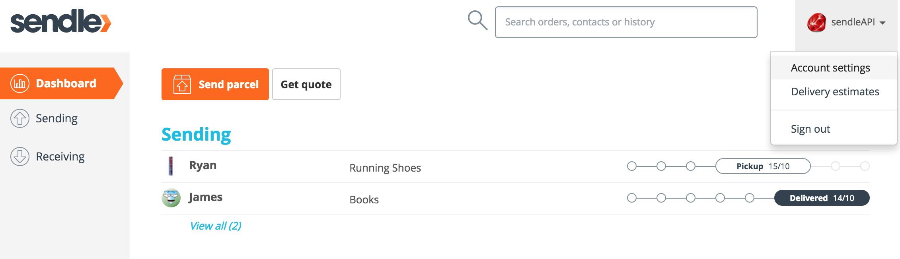
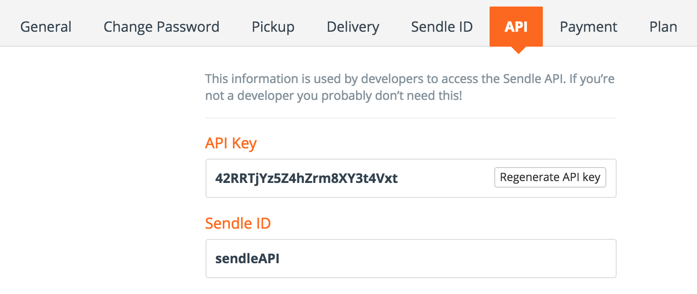
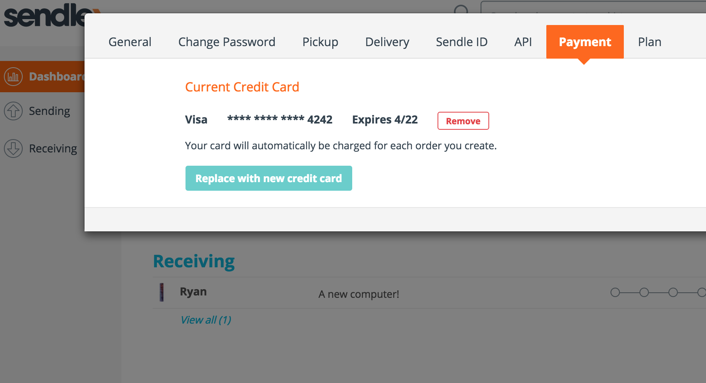

# Introduction

Welcome to the Sendle API! You can use our API to access Sendle Booking endpoints, which will allow you to book Sendle pickups, manage shipping, and oversee past and present orders any way you like!

Sendle API uses only JSON. You can view code examples in the dark area to the right.

# Getting Started

> Requests should be made with the following headers:

```
  Content-Type: application/json
  Accept: application/json
```

Before anything else, you will need to have a [Sendle Account](https://www.sendle.com/#signup-form) authorised with an API.

For API access, please contact support@sendle.com.



When Access is granted, visit `Account Settings` (top right) on your Sendle Dashboard.



Once you have been granted API access, visit your API tab to get your `api key`.

<aside class="warning">Be sure to keep your API Key secret!</aside>

## Set Up Payments

> Without Payment Details

```
{"error":"payment_required","error_description":"The account associated with this API key has no method of payment. Please go to your Account Settings in your Sendle Dashboard and add a payment method."}  
```

<aside class="notice">To use Sendle API, you will need a valid payment option attached to the Sendle Account.</aside>



To use the API, be sure to have a credit card on file.

For payments, Sendle uses [Stripe](https://stripe.com). If you want to use a dummy credit card for sandbox testing, [visit stripes testing docs](https://stripe.com/docs/testing) for credit examples.


# Ping Server

> All API interactions will require your Sendle ID and your API Key (Make sure to replace **sendleAPI** and **42RRTjYz5Z4hZrm8XY3t4Vxt** with your Sendle ID & API key.)

```shell
  curl 'https://sendle.com/api/ping'
  -u sendleAPI:42RRTjYz5Z4hZrm8XY3t4Vxt
```

Sendle uses your **Sendle ID** together with your own **API Key** to grant access to the server. Together this allows you access through the API so that you may book and follow up with orders, as well as view passed orders you have sent or received.

For this initial example, we'll simply ping the server.

You must include your credentials in the request, or you will be denied. However, if you include your `Sendle ID`, you will be prompted to enter your API key (password).

## OK Response

> Status 200:

```json
  {"ping":"pong"}% 
```

When the api receives a request with a `Sendle ID` and an `API Key` the server responds with a `JSON` string containing the relevant details.

## Without Credentials
> No Sendle ID AND No API Key

```shell
  curl 'https://sendle.com/api/ping'
```

> Response:

```
  HTTP Basic: Access denied.
```

> Response With incorrect Credentials:

```
  {"error":"unauthorised","error_description":"The authorisation details are not valid. Either the Sendle ID or API key are incorrect."}
```

Depending on what information is left out determines the response. *If* you include your `Sendle ID` the response will ask for your `API Key` (as **password** on the command line). If you reply with your key, the server will respond with the request **but** due to the length of API keys, this isn't suggested practice.

# Getting Quotes

# Creating Orders

## Getting Labels

## Create Order & Get Label

# Check for Status Updates

## Statuses & States

# Cancelling Orders

# Errors

# Kitten

## Get All Kittens

```ruby
require 'kittn'

api = Kittn::APIClient.authorize!('meowmeowmeow')
api.kittens.get
```

```python
import kittn

api = kittn.authorize('meowmeowmeow')
api.kittens.get()
```

```shell
curl "http://example.com/api/kittens"
  -H "Authorization: meowmeowmeow"
```

> The above command returns JSON structured like this:

```json
[
  {
    "id": 1,
    "name": "Fluffums",
    "breed": "calico",
    "fluffiness": 6,
    "cuteness": 7
  },
  {
    "id": 2,
    "name": "Isis",
    "breed": "unknown",
    "fluffiness": 5,
    "cuteness": 10
  }
]
```

This endpoint retrieves all kittens.

### HTTP Request

`GET http://example.com/api/kittens`

### Query Parameters

Parameter | Default | Description
--------- | ------- | -----------
include_cats | false | If set to true, the result will also include cats.
available | true | If set to false, the result will include kittens that have already been adopted.

<aside class="success">
Remember — a happy kitten is an authenticated kitten!
</aside>

## Get a Specific Kitten

```ruby
require 'kittn'

api = Kittn::APIClient.authorize!('meowmeowmeow')
api.kittens.get(2)
```

```python
import kittn

api = kittn.authorize('meowmeowmeow')
api.kittens.get(2)
```

```shell
curl "http://example.com/api/kittens/2"
  -H "Authorization: meowmeowmeow"
```

> The above command returns JSON structured like this:

```json
{
  "id": 2,
  "name": "Isis",
  "breed": "unknown",
  "fluffiness": 5,
  "cuteness": 10
}
```

This endpoint retrieves a specific kitten.

<aside class="warning">If you're not using an administrator API key, note that some kittens will return 403 Forbidden if they are hidden for admins only.</aside>

### HTTP Request

`GET http://example.com/kittens/<ID>`

### URL Parameters

Parameter | Description
--------- | -----------
ID | The ID of the kitten to retrieve

# Credits

This example API documentation page was created with [Slate](http://github.com/tripit/slate). 