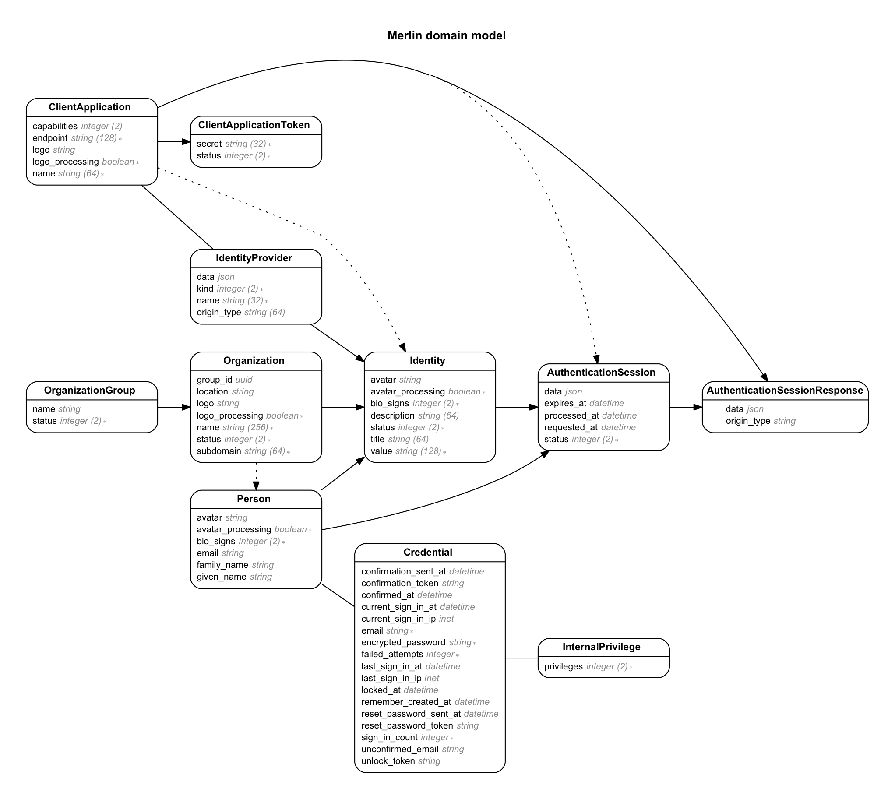

<h1 id="sso">
  Single-Sign-On
  
</h1>


To learn more about LaunchPad capabilities we offer to integration partners, please select one of the documents below. If you wish to become a single sign-on partner with us, please let us know at [api@faria.co](mailto:api@faria.co).

# LaunchPad Primer

You can integrate your product with the Faria LaunchPad Portal so users only need to sign in once. This document discusses capabilities currently in development and ways to start integrating them, so your product is ready on day one.

## Overview

There are two parts of client-facing capabilities you might be interested about — Forward Authentication and Identity Launchpad.

**Forward Authentication** allows an user with a master Faria ID to sign into the Faria SSO Portal and have the session forwarded onwards to other applications. For example, an user with Faria ID only needs to sign in once and can then access their ManageBac or OpenApply account without signing in separately.

**Identity Launchpad** is a separate feature that embeds a series of quick-access shortcuts in your application. Think of this as a series of quick-dial button. Your application can request the Faria LaunchPad Portal to provide you with a series of identities the current user holds elsewhere. If the user is signed into the Faria LaunchPad Portal, they can initiate Forward Authentication to other applications without leaving your application.

## Conceptual Model and Terminology

The following section discusses data models used internally by, and/or exposed externally from the Faria LaunchPad Portal.



* **Credential:** With a canonical master e-mail address this represents the Master Identity, which is linked to a Person at all times. Using the Master Identity, an user can sign into the Faria LaunchPad Portal directly, and place forward authentication requests against all linked Client Applications using Identities available to their linked Person.

* **Person:** Represents a discrete person managed by the Faria LaunchPad Portal. Ideally, each natural person is only represented once.

* **Identity:** Stores a personally identifiable value that can be recognized by the Identity Provider. Conventionally this is a value that makes sense only to the client application. It must be unique among identities provided by the same Identity Provider. It is not supposed to hold passwords or authentication tokens.

* **Identity Provider:** An intermediate provider, either Internal or External, that is able to present, manage and verify Identities. It is further enhanced with the Identity Provider Origin, which is currently linked to a Client Application, or in the future linked to other providers like Google or Azure Active Directory.

* **Client Application:** An internal application that supports Forward Authentication via Faria LaunchPad Portal. In addition, Client Applications can acts as origins of Identity Providers.

* **Client Application Token:** Represents access tokens that Client Applications must use to access Faria LaunchPad Portal.

* **Organization:** An optional model representing groups in a human or computer society, for example a School or Corporation. Each Identity is optionally linked with an Organization, because a Person may participate in activities on behalf of different Organizations using different Identities.

* **Organization Group:** Used to represent conglomerates or school groups.

* **Authentication Session:** Stores authentication requests placed by Faria LaunchPad Portal on behalf of People for a given Identity. Note that a Person may not ‘own’ the Identity but still elect to request authentication, so the Authentication Session is separately linked to the Requesting Person and the Intended Identity. It is for each participating client application to decide whether to allow each authentication session.

## Forward Authentication

With **Forward Authentication** an user only needs to sign into the Faria LaunchPad Portal and their authentication session is forwarded onwards to other applications.

There are a few requirements:

1.  Your application must implement the [Forward Authentication API](/sso-forward-authentication-api).
2.  Your application must be registered with the Faria LaunchPad Portal as a Client Application; you must hold at least one active Client Application Token.
3.  You must have already published all identities from your application into the Faria LaunchPad Portal.
4.  To facilitate single sign-on for users who enjoy use of both Faria Systems applications and your applications, entity resolution must also have taken place within the Faria LaunchPad Portal.

A typical authentication session looks like this:

1.  **User** signs into the Faria LaunchPad Portal.
2.  **User** browses a series of eligible Identities they hold with different Identity Providers, including yours.
3.  **User** selects an Identity to authenticate as.
4.  **Faria LaunchPad Portal** generates a Forward Authentication Request and sends the unique identifier back to the User’s browser (HTTP 301).
5.  **User’s Browser** sends the unique identifier of the Forward Authentication Request to your application (using the Forward Authentication API).
6.  **Your Application** considers the request. At this point your application must take exactly one of these actions:

  * Ignore the Authentication Request and send the user somewhere else. The Authentication Request will time out automatically.
  * Accept the Authentication Request and let the user in.
  * Reject the Authentication Request and send the user back to the Faria LaunchPad Portal

For more information on Forward Authentication, please review our documentation on the [Forward Authentication API](/sso-forward-authentication-api) and our [Integration Notes](/sso-integration-notes).

# Client Application API

This document covers the LaunchPad Client Application API. To gain access to the LaunchPad API family and participate in LaunchPad, please contact us at [api@faria.co](mailto:api@faria.co).

## Overview

Integrating the Faria LaunchPad API family allows your application to inter-operate with other applications built for Faria LaunchPad, including but not limited to ManageBac, OpenApply and InterSIS. All applications that participate within the LaunchPad scheme are available to users possessing relevant credentials.

Your application will use the Client Application API primarily to:

1.  Retrieve Authentication Sessions and provide confirmations or denials.
2.  Retrieve all identities relevant to a given person, in order to render an in-app SSO Launchpad.
2.  Publish newly created or updated identities to the SSO Portal, in order to maintain data consistency.

Before continuing, please take time to review the [LaunchPad Primer](/sso-primer).

## Authentication

The LaunchPad Client Application API authenticates using HTTP tokens exclusively. Here is a sample request made to an development endpoint:

 ```shell
    $ curl http://ml.dev/api/v1/organizations \
        -H 'Authorization: Token token="d6b8d8500cb687c9283d9c78080705ec"'
```        

All other methods outlined in this document requires authentication.

## Interacting with Organizations

If your client application token is sufficiently authorized, you may be able to query some or all organizations currently participating in LaunchPad.

     GET /organizations
     GET /organizations/:id

You may assume that only organizations you can view and/or access will be returned in these calls, and that all organizations will be returned at once.

The Organization representation contains the following attributes:

*   `id`: internal identifier (can not be updated).
*   `subdomain`: the subdomain used on SSO portal.
*   `name`: the display name of the organization.

If your Client Application token is sufficiently authenticated, you may be able to update an existing Organization:

    PATCH /organizations/:id

or create a new Organization:

    POST /organizations # must provide name; subdomain must be unique if provided

Please see the Integration Notes for an example.

## Interacting with People and Identities

The following methods allows you to interact with people and identities.

### Create new Person entries

    POST /organizations/:id/people

If your client application token is sufficiently authenticated, you may be able to create Person entries within organizations you have formed or can control.

You may provide the following information:

*   `given_name`
*   `family_name`
*   `email`

None of the information listed above is mandatory, but creating duplicate Person entries within any organization is not recommended.

You may create identities separately, or together with the creation call by passing them under `identities_attributes`. Please see the Integration Notes for an example.

### Update Person entries

    PATCH /organizations/:organization_id/people/:person_id

You may pass the same payload you pass to `/organizations/:id/people` in order to update Person entries, but you can not delete identities this way.

### Delete Person entries

This feature is currently unavailable.

### Retrieve information relevant to a given person

    GET /organizations/:organization_id/people/:person_id
    GET /people/:person_id # if you have sufficient privileges
    
Returns a Person entity, which looks like:

    {
        "email": "cortiz@linktype.com",
        "family_name": "Green",
        "given_name": "Theresa",
        "id": "5cf92397-e69c-4029-a4b7-3203360ba44f",
        "identities": [
            {
                "id": "9d50bce0-7e19-45df-9567-4a7465e710be",
                "provider": {
                    "id": "321984ea-e6fe-4746-acdf-b431135df3bb",
                    "origin": {
                        "endpoint": "managebac.com",
                        "id": "c0148089-25c4-47c9-8a6e-f031e00da07b",
                        "name": "ManageBac"
                    },
                    "type": "client_application"
                },
                "status": "loginable",
                "value": "16dc797aa9dabac9ec649dc07dddf210"
            }
        ]
    }

### Retrieve all identities relevant to a given person

    GET /people/:person_id/identities

Returns a list of all identities and their providers. You can use this information to render an in-app LaunchPad Springboard.

The response looks like:

    [
        {
            "id": "439d8dc0-5dce-43ab-bef5-93f4df7ac21c",
            "provider": {
                "id": "f8f0aa9e-2bf6-473f-bec0-5d850a346600",
                "origin": {
                    "endpoint": "keyb.com",
                    "id": "0de62dbb-0930-4894-9828-199e08c15047",
                    "name": "Keybridge"
                },
                "type": "client_application"
            },
            "status": "loginable",
            "value": "Di7FcQ"
        },
        …
    ]


## Interacting with Authentication Sessions

You will be asked by the Faria LaunchPad Portal to evaluate Authentication Sessions thru the Forward Authentication API. As a Client Application, you can only approve and decline those linked to your own client application.

Each Authentication Session is linked to an Identity (requested identity) and a Person (requesting party). Only the Client Application owning the requested identity may respond to the authentication session.

#### Retrieve an Authentication Session

    GET /authentication_sessions/:session_id

You must have corresponding privileges. The Faria SSO Portal will return with the Authentication Session alongside the detailed representation of the requesting person. The response looks like:

    {
        "data": null,
        "expires_at": null,
        "id": "78dab300-bb45-447d-8848-e4904acdc8b0",
        "identity": {
            "id": "97c775fc-a7da-451d-b2e5-f7067ea250c5",
            "provider": {
                "id": "c2efd8ee-9918-428f-b410-abd6457ae8db",
                "origin": {
                    "endpoint": "managebac.com",
                    "id": "dc9f0796-bd29-486e-bf93-f279ea59aad8",
                    "name": "ManageBac"
                },
                "type": "client_application"
            },
            "status": "loginable",
            "value": "Tv2FoeVkVLv"
        },
        "person": {
            "family_name": "Stone",
            "given_name": "Doris",
            "id": "ea2c03cb-762c-48c6-801f-3df640f537e2",
            "identities": [
                …
            ]
        },
        "processed_at": null,
        "requested_at": "2014-09-05T16:48:13.414Z",
        "status": "requested"
    }

In the future, the `data` field will carry end-user-specific information, like the original IP address where requests occurred.

#### Approve an Authentication Session

    POST /authentication_sessions/:session_id/approve

You should call this method once you have recognized the session and have approved of it, so relevant information is captured by the LaunchPad Portal for future auditing use. You may call this endpoint asynchronously, outside of a Forward Authentication session.

You can emit anything that is relevant to your application under `data`.

#### Decline an Authentication Session

    POST /authentication_sessions/:session_id/decline

You should call this method if something is wrong with the person’s claim. The LaunchPad Portal will be alerted of repeated authentication failures this way. You may call this endpoint asynchronously, outside of a Forward Authentication session.

You can emit anything that is relevant to your application under `data`.

## Requesting Authentication Sessions

You will need to implement this if you wish to build an Identity Launchpad within your application.

    POST /authentication_sessions
    
Besides a valid client application token in your signed request, the following information is required:

*   `requester_identity_id`: the identity reference of the requesting user.
*   `wanted_identity_id`: the identity reference of the desired authentication target.

There are a few preconditions:

1.  The identity referred by `requester_identity_id` (‘Requester Identity’) must be owned by the calling Client Application. In other words, you can only request authentication on behalf of one of your users.
2.  The identity referred by `wanted_identity_id` (‘Requested Identity’) will implicitly reference the target application, and it is up to the target Client Application to determine whether it will grant access. Conventionally, the target Client Application will only recognize identities associated with a person who also holds the Requester Identity.

Generally, you will send this request synchronously after your user has requested authentication from your in-app identity launchpad.

If your request is successfully recognized (but not yet processed), you will receive the representation of the newly created Authentication Session with "context.client_application_url", and you should then redirect the user. The target Client Application, which implements the Forward Authentication API, will handle everything from there.

    {
        "context": {
            "client_application_url": "https://target.example.com/handle_forward_authentication?session_id=:session_id"
        },
        "data": null,
        "expires_at": null,
        "id": "78dab300-bb45-447d-8848-e4904acdc8b0",
        "identity": {
            //  …
        },
        "person": {
            "family_name": "Stone",
            "given_name": "Doris",
            "id": "ea2c03cb-762c-48c6-801f-3df640f537e2",
            "identities": [
                //  …
            ]
        },
        "processed_at": null,
        "requested_at": "2014-09-05T16:48:13.414Z",
        "status": "requested"
    }

# Forward Authentication API

This document covers an endpoint you must implement and make available to the Faria LaunchPad Portal in order to accept Forward Authentication requests.

## Handling Forward Authentication

You must accept requests to this endpoint:

    POST /handle_forward_authentication?session_id=:session_id

This request may be made by the user’s browser as a result of a redirection (GET) or an automated form submission (POST).

Upon receiving this request, the Client Application should call back to the LaunchPad Portal using the [Client Application API](/sso-client-application-api), and retrieve information relevant to the given Authentication Session.

You are expected to make your decision and then let the user in during the same request window.

# Integration Notes

This document outlines a few items to take care of on the technical side when you start integrating LaunchPad with us.

## Major Integration Steps

The following major steps must be taken.

1. **Faria:** Provision Client Application accounts and access tokens, one for each of your applications.
2. **Vendor:** Using the Client Application token, publish all identities to the Faria LaunchPad Portal.
3. **Faria:** Link the new identities against existing users, and create new users if necessary.
4. **Faria:** Provision Faria IDs for new users.
5. **Vendor:** Implement the Faria Forward Authentication protocol. (Alternatively, work with Faria Systems engineering to implement a substitute.)
6. **Vendor:** Using the same Client Application token, periodically update identities stored in the Faria LaunchPad Portal.

## Technical Components To Be Completed

We will now discuss technical components must either be jointly implemented or implemented by you to facilitate successful introduction of LaunchPad inter-operation between our applications and yours.

### Synchronizing Your Identities with Faria LaunchPad Portal

Conventionally, each user of your application is identified by one or more unique identifiers (e.g. email or username) and authorized by one or more pieces of secret information (e.g. password, 2-factor tokens). Each of such tuple is considered one Identity in Faria LaunchPad parlance, and all of the public information (all of your unique identifiers) must be published from your application to our LaunchPad Portal and must be continuously maintained.

You can do so via the Client Application API.

### Accepting Forward Authentication Requests

Your applications must be able to process and respond to the Forward Authentication Requests sent by the Faria LaunchPad Portal. Please review our documentation on the [Forward Authentication API](/sso-forward-authentication-api).

Certain applications already implement such an interface in another way. However, such implementation usually does not provide the LaunchPad Portal with detailed information for each access attempt (when, where, whom, what).

You can also accomplish this via the Client Application API.

### Initiating Forward Authentication from Your Application

Specific code can be written to realize ‘Outgoing SSO’, allowing the Faria LaunchPad Portal to authenticate the given user with other applications on behalf of your application.

From an user interaction point of view, there are two variants of Forward Authentication from your application:

1.  User is redirected from your application back to the Faria LaunchPad Portal, then will continue from there on their free will.
2.  User is redirected from your application directly to the desired Client Application and signed in there.

The former is a simple matter of redirection while the latter is more convenient. In order to realise the latter, you must make use of the Client Application API to pull down a list of identities of the current Person. You can then build a LaunchPad Launchpad based on information provided by us.

## Sample Implementation

The following four code snippets cover Identity Provisioning (the first step as discussed under Synchronizing Your Identities with Faria LaunchPad Portal), Forward Authentication (as discussed under Accepting Forward Authentication Requests), caching, and sending Authentication Requests.

It is our hope that the following code snippets are helpful to you. Please feel free to contact us at [api@faria.co](mailto:api@faria.co) if there is anything else we can do.

### Provisioner

The Provisioner allows you to push identities from your application to Faria LaunchPad for the initial setup. Identities can be updated from your application using the Client Application API, or by the LaunchPad Portal after querying your application periodically.



### Rails Routes

The following snippet demonstrates appropriate routing you must set up for your application in order to:

1.  Accept Forward Authentication requests from users wishing to enter your application via the LaunchPad Portal. 
2.  Accept Authentication Session requests from users currently using your application and wishing to enter other applications thru your in-app Identity Launchpad.



### Rails Controller

The following snippet demonstrates how Forward Authentication requests may be handled from your application, and shows a way to issue Authentication Session requests from your application to the LaunchPad Portal.



### Forward Authentication Response Service

The following snippet contains a Service Object you can use to authenticate incoming LaunchPad Authentication Sessions. In this particular example, the following criteria are applied:

1.  The requested identity must exist within the application.
2.  The requesting party must own the identity.

(Further security measures may be carried out by the LaunchPad Portal directly.)



### Forward Authentication Request Service

The following snippet contains another Service Object you can use to create outgoing Authentication Session requests for the LaunchPad Portal. You may construct any kind of Authentication Session requests, but in general, the following criteria are applied:

1.  You must be requesting authentication on behalf of one of your users.
2.  The target identity must — according to the LaunchPad Portal — also belong to the same user.



### Transaction Response Worker

The following snippet demonstrates a way you can respond to authentication sessions asynchronously in order to ultimately log your approval or denial of an attempt to access your systems.



### Identity Caching Service

The following snippet demonstrates a way to store known LaunchPad identities of an user temporarily, so you can avoid querying the LaunchPad Portal every time you need to render an in-app Identity Launchpad.



### API Client

The API Client allows your application to interact with the LaunchPad Portal properly.


